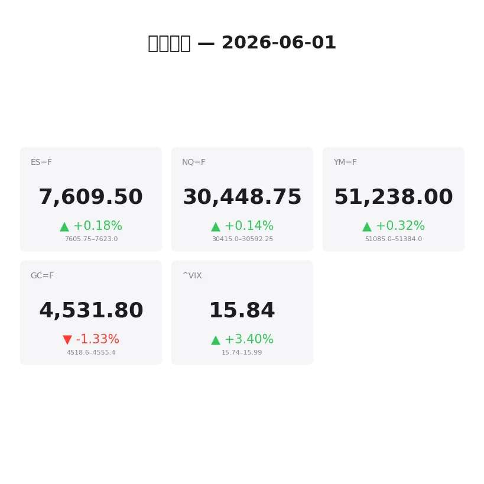
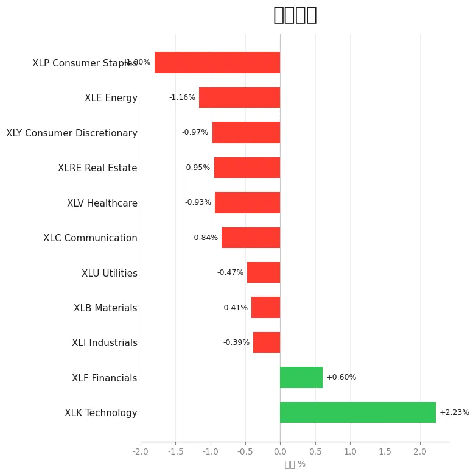
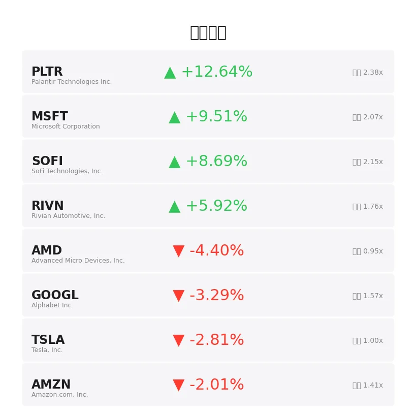
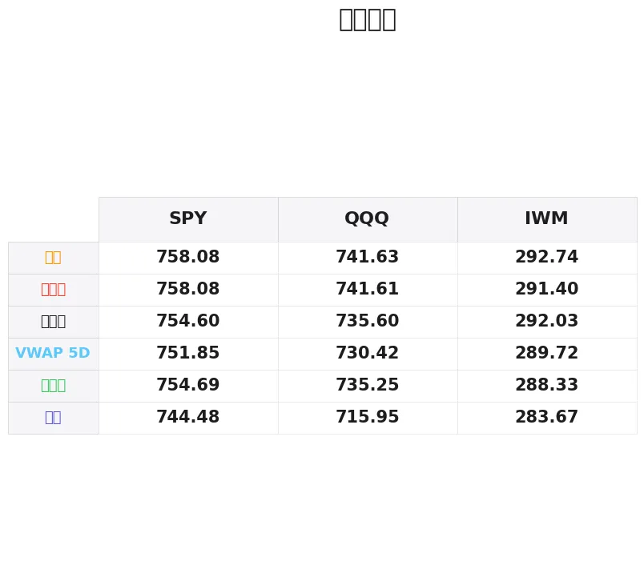

# 盘前分析报告 — 2026-06-01
*生成时间: 12:35:30 UTC*

---
## 数据速览

---
## 一、宏观环境

> [!info]- 详细数据：指数期货 & VIX
> ### 1.1 指数期货 & VIX
> | 品种 | 现价 | 涨跌幅 | 前收 | 日高 | 日低 |
> |------|------|--------|------|------|------|
> | ES=F | 7609.5 | +0.18% | 7595.75 | 7622.0 | 7585.25 |
> | NQ=F | 30448.75 | +0.14% | 30405.25 | 30595.25 | 30361.25 |
> | YM=F | 51238.0 | +0.32% | 51077.0 | 51384.0 | 50999.0 |
> | GC=F | 4531.8 | -1.33% | 4593.0 | 4577.3 | 4518.7 |
> | ^VIX | 15.84 | +3.40% | 15.32 | 15.99 | 15.74 |

> [!info]- 详细数据：隔夜走势
> ### 1.2 隔夜走势（Globex）
> | 品种 | 隔夜高 | 隔夜低 | 区间 | 亚洲高 | 亚洲低 | 欧洲高 | 欧洲低 |
> |------|--------|--------|------|--------|--------|--------|--------|
> | ES=F | 7623.0 | 7605.75 | 17.25 | 7619.0 | 7612.25 | 7623.0 | 7605.75 |
> | NQ=F | 30592.25 | 30415.0 | 177.25 | 30592.25 | 30543.75 | 30591.75 | 30443.75 |
> | YM=F | 51384.0 | 51085.0 | 299.0 | 51137.0 | 51110.0 | 51384.0 | 51085.0 |
> | GC=F | 4555.4 | 4518.6 | 36.8 | 4555.4 | 4537.6 | 4548.6 | 4518.6 |
> | ^VIX | 15.99 | 15.74 | 0.25 | — | — | 15.99 | 15.74 |

> [!info]- 详细数据：板块强弱
> ### 1.3 板块强弱
> | ETF | 板块 | 涨跌幅 |
> |-----|------|--------|
> | XLK | Technology | +2.23% |
> | XLF | Financials | +0.60% |
> | XLI | Industrials | -0.39% |
> | XLB | Materials | -0.41% |
> | XLU | Utilities | -0.47% |
> | XLC | Communication | -0.84% |
> | XLV | Healthcare | -0.93% |
> | XLRE | Real Estate | -0.95% |
> | XLY | Consumer Discretionary | -0.97% |
> | XLE | Energy | -1.16% |
> | XLP | Consumer Staples | -1.80% |

---
## 二、消息面

- **今日股市：美伊协议希望延续推动道指上涨；英伟达因新芯片大涨（实时报道）** — *Investor’s Business Daily*
  > Stock Market Today: Dow Rises Amid Continued U.S.-Iran Deal Hopes; Nvidia Rallies On New Chip (Live Coverage)
- **纳指、标普500期货六月开门强势：为何NVDA、DELL、HPE、TSM、TSLA、SPCE、RVMD成为焦点** — *Stocktwits*
  > Nasdaq, S&P 500 Futures Open June On Strong Footing: Why NVDA, DELL, HPE, TSM, TSLA, SPCE, RVMD Are In Focus
- **纳指、标普500、道指期货小幅走高，尽管特朗普将伊朗协议悬而未决：BBAI、SPCE、SOFI、IBM受关注** — *Stocktwits*
  > Nasdaq, S&P 500, Dow Futures Edge Higher Even As Trump Keeps Iran Deal In Limbo: BBAI, SPCE, SOFI, IBM In Focus
- **我53岁有150万美元，想在卡梅尔开跑车退休——这是真实的数学** — *24/7 Wall St.*
  > I’m 53 With $1.5 Million and Want to Retire in Carmel With a Sports Car. Here’s the Real Math.
- **标普500股息率跌至1.08%——自1800年代以来最低派息率是退休警示信号** — *24/7 Wall St.*
  > S&P 500 Dividend Yield Hits 1.08%. The Lowest Payout Rate Since the 1800s Is a Retirement Red Flag.
- **通胀忧虑下这笔800万美元商品ETF买单需要了解什么** — *Motley Fool*
  > What to Know About This $8 Million Commodity ETF Buy Amid Inflation Concerns
- **无人持有的半导体标的刚刚跑赢华尔街最大巨头** — *24/7 Wall St.*
  > The Semiconductor Play Nobody Owns Just Lapped Wall Street’s Biggest Names
- **QQQ的隐性风险：为何基金前五大持仓同步波动** — *24/7 Wall St.*
  > QQQ’s Hidden Risk: Why the Fund’s Top 5 Holdings Move Together
- **VIX为何如此低迷？** — *Barchart*
  > Why is the VIX So Low?
- **恐慌指数显示市场平静，对伊朗紧张局势不以为然** — *Barrons.com*
  > Fear Index Signals Calm as Markets Shrug Off Iran Tensions
- **科技股抛售和通胀担忧施压，市场恐慌指数上升** — *Barrons.com*
  > Market Fear Index Rises as Tech Selloff and Inflation Fears Weigh
- **期权市场对英伟达即将公布的财报发出不祥信号** — *MarketWatch*
  > The options market is flashing an ominous sign about Nvidia’s looming earnings
- **波动市场中寻求安全的投资者可关注防御型ETF** — *Zacks*
  > Defensive ETFs for Investors Seeking Safety in Volatile Markets
- **今日金价（6月1日周一）：今晨金价走低** — *Yahoo Personal Finance*
  > Gold prices today, Monday, June 1: Gold prices moving lower this morning
- **野村证券：加拿大一季度GDP疲软、内需走弱凸显增长风险** — *MT Newswires*
  > Canada’s Weak Q1 GDP, Softer Domestic Demand Put Growth Risks in Focus, Says Nomura
- **中东紧张局势重燃通胀担忧，金价下跌** — *Reuters*
  > Gold falls as renewed Middle East tensions fuel inflation fears
- **美伊冲突重燃推升通胀及加息担忧，黄金回落** — *InvestorsHub*
  > Gold Retreats as Renewed U.S.-Iran Conflict Boosts Inflation and Rate Concerns
- **美元走强叠加美伊协议不确定性，黄金下跌** — *The Wall Street Journal*
  > Gold Falls on Firmer Dollar, U.S.-Iran Deal Uncertainty
- **今日股市：国债收益率上升，道指、标普500、纳指下跌** — *Yahoo Finance*
  > Stock market today: Dow, S&P 500, Nasdaq drop amid rising bond yields
- **伊朗战争忧虑下富时100和美股跳水、油价剧烈波动** — *Yahoo Finance UK*
  > FTSE 100 and US stocks dive and oil swings amid Iran war jitters

---
## 三、盘前异动

> [!info]- 详细数据：盘前异动
> | 代码 | 名称 | 现价 | 缺口 | 量比 |
> |------|------|------|------|------|
> | PLTR | Palantir Technologies Inc. | 161.46 | +12.64% | 2.38x |
> | MSFT | Microsoft Corporation | 467.58 | +9.51% | 2.07x |
> | SOFI | SoFi Technologies, Inc. | 18.45 | +8.69% | 2.15x |
> | RIVN | Rivian Automotive, Inc. | 16.1 | +5.92% | 1.76x |
> | AMD | Advanced Micro Devices, Inc. | 495.28 | -4.40% | 0.95x |
> | GOOGL | Alphabet Inc. | 377.29 | -3.29% | 1.57x |
> | TSLA | Tesla, Inc. | 429.69 | -2.81% | 1.0x |
> | AMZN | Amazon.com, Inc. | 268.5 | -2.01% | 1.41x |
> | NVDA | NVIDIA Corporation | 215.8 | +0.72% | 1.6x |

---
## 四、关键价位

> [!info]- 详细数据：SPY 关键价位
> ### SPY
> | 价位类型 | 价格 |
> |----------|------|
> | Prior Day High | 758.075 |
> | Prior Day Low | 754.69 |
> | Prior Day Close | 754.6 |
> | Premarket Price | 757.862 |
> | Approx Vwap 5D | 751.85 |
> | Weekly High | 758.08 |
> | Weekly Low | 744.48 |

> [!info]- 详细数据：QQQ 关键价位
> ### QQQ
> | 价位类型 | 价格 |
> |----------|------|
> | Prior Day High | 741.61 |
> | Prior Day Low | 735.25 |
> | Prior Day Close | 735.6 |
> | Premarket Price | 739.66 |
> | Approx Vwap 5D | 730.42 |
> | Weekly High | 741.63 |
> | Weekly Low | 715.95 |

> [!info]- 详细数据：IWM 关键价位
> ### IWM
> | 价位类型 | 价格 |
> |----------|------|
> | Prior Day High | 291.4 |
> | Prior Day Low | 288.33 |
> | Prior Day Close | 292.03 |
> | Premarket Price | 289.68 |
> | Approx Vwap 5D | 289.72 |
> | Weekly High | 292.74 |
> | Weekly Low | 283.67 |

---
## 五、AI 技术分析 & 操盘建议

## 第一部分：隔夜市场回顾

### 亚洲时段（18:00–02:00 ET）

亚洲时段整体交投清淡，窄幅震荡。ES在7612–7619区间内运行，波幅仅约7点，显示亚洲资金观望情绪浓厚。NQ表现相对活跃，亚洲高点触及30592.25，低点30543.75，约50点区间，科技权重股盘后走势分化（MSFT +9.51%大涨 vs AMD -4.40%回落）对纳指形成拉锯。黄金在亚洲时段走弱，从4555.4高点滑落至4537.6，反映美元走强及风险偏好有所回暖。

### 欧洲时段（02:00–09:30 ET）

欧洲时段波动明显放大。ES区间扩展至7605.75–7623.0，多头尝试上攻但遇阻于7623附近。NQ在欧洲时段出现较大幅度回撤，从30591.75高点跌至30443.75，回撤近150点，暗示欧洲资金对科技股估值存在分歧。黄金在欧洲时段加速下跌，触及4518.6日内低点（-1.33%），多条消息面指向美伊冲突重燃推升通胀预期，但美元走强压制了黄金买盘。VIX盘中触及15.99，较前收15.32上涨3.4%，隐含波动率有所抬升但绝对水平仍处低位。

### 对美盘的影响

隔夜整体格局为"科技独强、防御走弱"。XLK +2.23%遥遥领先，而XLP -1.80%、XLE -1.16%、XLRE -0.95%等防御/周期板块全线走弱，显示资金极度集中于科技成长主线。PLTR +12.64%和MSFT +9.51%的巨幅跳空将对开盘初期的价格发现产生重大影响。VIX虽有上升但仍在16以下，期权隐含波动率尚未发出系统性风险信号。需警惕的是，国债收益率上升（消息面已确认）叠加伊朗局势不确定性，可能在盘中引发风格轮动。

## 第二部分：期货品种分析

### ES（E-mini S&P 500 期货）

**多时间框架分析：**
- **日线**：上行趋势延续，前收7595.75，盘前已站上7609.5。上周高点7622附近形成短期阻力，上周低点对应区域在7545附近。
- **4H**：隔夜在7605–7623窄幅整理，形成小旗形结构，等待方向选择。VWAP 5日约位于SPY 751.85对应ES ~7530附近（偏下方支撑）。
- **1H/15min**：亚洲时段极窄幅（7612–7619），欧洲时段拓宽至7605–7623。微观结构偏多但动能减弱。

**关键价位：**
| 类型 | 价格 |
|------|------|
| 隔夜高（阻力R1） | 7623.0 |
| 日高（阻力R2） | 7622.0 |
| 隔夜低/欧洲低（支撑S1） | 7605.75 |
| 前收（支撑S2） | 7595.75 |
| 日低（支撑S3） | 7585.25 |

**方向偏见：** 偏多 | 置信度：65%
- 开盘站稳7610以上则看多至7625–7635
- 回踩7600–7605不破可做多

**交易计划：**
- **多头入场区间：** 7600–7607（隔夜低支撑回踩）
- **止损：** 7593（前收下方2点）
- **目标T1：** 7623（隔夜高/日高重合）
- **目标T2：** 7640（日高突破后的测量目标）
- **失效条件：** 跌破7585（日低），转为空头思路

---

### NQ（E-mini Nasdaq 100 期货）

**多时间框架分析：**
- **日线**：NQ近期处于高位震荡格局，前收30405.25，盘前30448.75。隔夜高点30592.25为近期关键阻力。MSFT +9.51%和NVDA +0.72%形成支撑，但AMD -4.40%和GOOGL -3.29%形成拖累，内部分化剧烈。
- **4H**：隔夜区间30415–30592，约177点幅度，在区间中部运行。价格当前位于隔夜区间的中下方（30448 vs 中位30503）。
- **1H/15min**：欧洲时段从30591高点回落至30443.75，形成一个明确的短期下行波段。反弹力度需观察。

**关键价位：**
| 类型 | 价格 |
|------|------|
| 隔夜高/日高（强阻力） | 30592–30595 |
| 亚洲高（阻力R1） | 30592.25 |
| 隔夜中位（枢轴） | 30503 |
| 欧洲低/隔夜低（支撑S1） | 30415–30443 |
| 日低（支撑S2） | 30361.25 |

**方向偏见：** 中性偏多 | 置信度：55%
- 科技内部分化严重，MSFT大涨但AMD/GOOGL走弱
- 30500是多空分水岭

**交易计划：**
- **多头入场区间：** 30400–30430（隔夜低回踩确认）
- **止损：** 30345（日低下方15点）
- **目标T1：** 30500（隔夜中位/心理关口）
- **目标T2：** 30590（隔夜高重测）
- **失效条件：** 跌破30360（日低），下方看30200

---

### GC（黄金期货）

**多时间框架分析：**
- **日线**：GC处于回调阶段，前收4593.0大幅跌至4531.8（-1.33%）。日线级别出现明显的抛压，上方4577为日高、下方4518为日低。消息面上多条黄金利空新闻（美元走强、美伊协议预期）压制金价。
- **4H**：从前收4593到日低4518，跌幅约75点，跌势流畅。隔夜区间4518.6–4555.4，当前价格4531.8位于隔夜区间偏低位置。
- **1H/15min**：欧洲时段下破亚洲低4537.6后加速至4518.6日低，随后小幅反弹至4531.8。短期结构偏空，反弹为做空机会。

**关键价位：**
| 类型 | 价格 |
|------|------|
| 前收（强阻力） | 4593.0 |
| 日高（阻力R1） | 4577.3 |
| 亚洲高/隔夜高（阻力R2） | 4555.4 |
| 亚洲低（枢轴） | 4537.6 |
| 日低/隔夜低（支撑S1） | 4518.6–4518.7 |

**方向偏见：** 偏空 | 置信度：70%
- 消息面利空密集，美元走强叠加通胀预期压制金价
- 日线大阴线形态明确

**交易计划：**
- **空头入场区间：** 4545–4555（亚洲高/隔夜高附近反弹做空）
- **止损：** 4562（隔夜高上方7点）
- **目标T1：** 4520（日低重测）
- **目标T2：** 4500（心理关口/延伸目标）
- **失效条件：** 站稳4577（日高）以上，空头逻辑失效

## 第三部分：ETF品种分析

### SPY（SPDR S&P 500 ETF）

**关键价位：**
| 类型 | 价格 |
|------|------|
| 周高（阻力R1） | 758.08 |
| 前日高（阻力R2） | 758.075 |
| 盘前价（当前） | 757.86 |
| 前日收/前日低（支撑S1） | 754.60–754.69 |
| 5日VWAP（支撑S2） | 751.85 |
| 周低（支撑S3） | 744.48 |

**交易计划：**

SPY盘前757.86紧贴前日高/周高758.08阻力位。这是一个关键突破/受阻位置。

- **突破做多：** 突破758.10确认（放量），止损756.80，目标T1 760.00，T2 762.50
- **受阻做空：** 在758.00–758.10附近出现反转信号（影线/吞没），止损758.60，目标T1 755.50，T2 754.60（前收）
- **回踩做多：** 回落至754.60–755.00区间企稳（前收支撑），止损753.80，目标T1 757.00，T2 758.00

**核心逻辑：** 盘前跳空至阻力位开盘，若直接突破则为强势信号（跳空不回补），但若开盘回落则高位跳空可能演变为"缺口陷阱"（gap and trap）。开盘前5分钟的成交量和价格行为是关键判断窗口。

---

### QQQ（Invesco QQQ Trust）

**关键价位：**
| 类型 | 价格 |
|------|------|
| 周高（强阻力） | 741.63 |
| 前日高（阻力R1） | 741.61 |
| 盘前价（当前） | 739.66 |
| 前日收（枢轴） | 735.60 |
| 前日低（支撑S1） | 735.25 |
| 5日VWAP（支撑S2） | 730.42 |
| 周低（支撑S3） | 715.95 |

**交易计划：**

QQQ盘前739.66距周高741.63约2点，尚未触及阻力但已接近。MSFT +9.51%（权重约8%）对QQQ有强劲拉动，但AMD -4.40%、GOOGL -3.29%形成对冲。

- **突破做多：** 突破741.65确认（需NVDA/MSFT配合上攻），止损740.20，目标T1 744.00，T2 747.00
- **阻力做空：** 在741.50–741.65区域出现多次上攻失败，止损742.20，目标T1 738.00，T2 736.00
- **回踩做多：** 回落至735.50–736.00（前收/前日低支撑），止损734.50，目标T1 739.00，T2 741.00

**核心逻辑：** QQQ内部成分股极度分化，MSFT大涨拉动指数，但AMD/GOOGL/TSLA三大权重走弱形成拖累。这种分化环境下QQQ可能出现"假突破"——指数创新高但breadth不确认。关注开盘后NVDA（+0.72%盘前）的方向选择，作为NQ/QQQ方向的确认信号。

## 第四部分：今日市场总览

### 整体市场情绪

**情绪评级：谨慎偏多（6/10）**

6月首个交易日，市场呈现"科技独秀、全面分化"格局。ES/NQ/YM期货均小幅收涨，但涨幅有限（+0.14%至+0.32%），显示多头虽有优势但信心不足。VIX从15.32升至15.84（+3.4%），隐含波动率小幅上行但仍处于低位区间（<16），期权市场尚未定价系统性风险。但需注意，多条消息面指向国债收益率上升和伊朗局势不确定性，这是潜在的尾部风险催化剂。

### VIX 分析

- **当前：** 15.84（+3.40%）
- **隔夜区间：** 15.74–15.99
- **解读：** VIX处于15–16区间，属于"低波动舒适区"。多篇新闻标题提问"VIX为何如此低"，这种市场共识的低波动预期本身就是一个风险信号——当所有人都不恐慌时，恐慌来临的冲击更大。短期来看，VIX维持在16以下支持做多权益，但若盘中突破16.5则警惕波动率扩张。

### 需回避的时间窗口

| 时间（ET） | 事件/原因 |
|------------|-----------|
| 09:30–09:45 | 开盘15分钟，跳空消化+高波动区间，等待方向确立 |
| 10:00 | ISM制造业PMI等经济数据发布窗口（如有），可能引发急剧波动 |
| 12:00–13:00 | 午间流动性低谷，假突破频发 |
| 15:45–16:00 | 收盘前MOC订单冲击，方向不可预测 |

### 板块轮动观察

今日板块分化极为显著：
- **强势：** XLK（科技 +2.23%）一枝独秀，MSFT/PLTR/SOFI等个股大涨驱动
- **弱势：** XLP（必选消费 -1.80%）、XLE（能源 -1.16%）、XLRE（地产 -0.95%）
- **中性：** XLF（金融 +0.60%）小幅跟涨但力度不足

轮动含义：资金从防御/周期向成长/科技集中迁移，典型的"risk-on but narrow"格局。这种极端分化不可持续——要么扩散（更多板块跟涨确认趋势），要么回撤（领涨板块获利了结）。今日重点观察XLF和XLI能否由负转正，作为行情扩散的确认信号。

### 盘前异动提示

- **PLTR +12.64%** — 巨幅跳空，开盘首15分钟大概率出现剧烈波动，不建议追高，等待回踩VWAP或首个5分钟区间突破
- **MSFT +9.51%** — 超大市值股如此跳空罕见，对SPY/QQQ权重影响显著，关注是否能维持涨幅
- **AMD -4.40%** — 与NVDA形成半导体板块内部分化，若AMD继续走弱可能拖累整个芯片板块
- **GOOGL -3.29%, TSLA -2.81%** — 大权重走弱但被MSFT对冲，形成指数层面的"隐性风险"

---

> **今日核心交易论点：科技板块极度分化驱动指数至阻力位，做多需确认breadth扩散，做空等待科技领涨股（MSFT/PLTR）涨势衰竭信号。黄金空头趋势明确，反弹做空为首选策略。**
