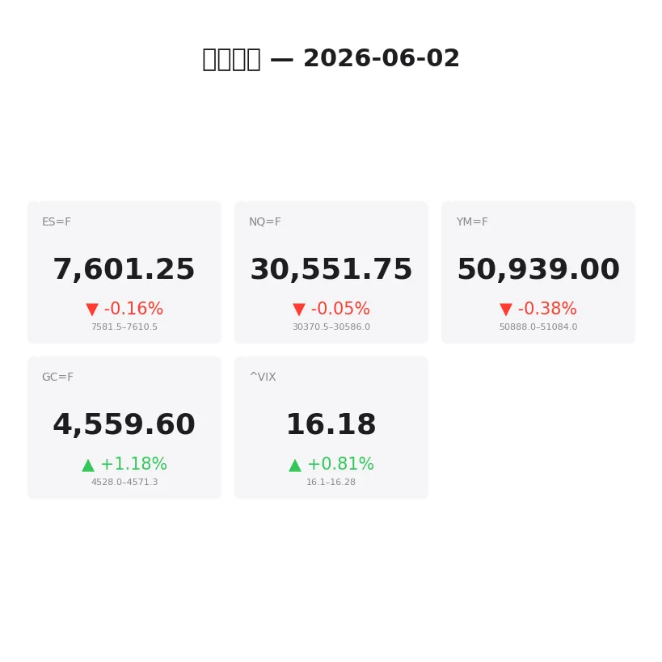
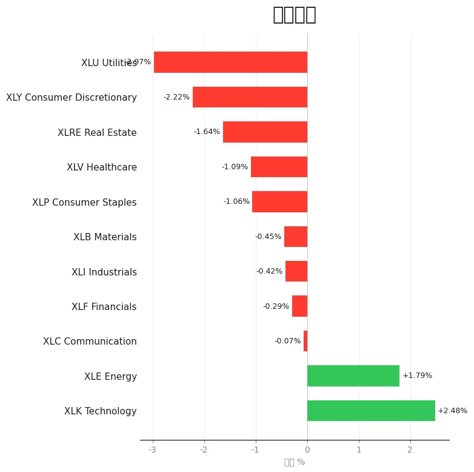
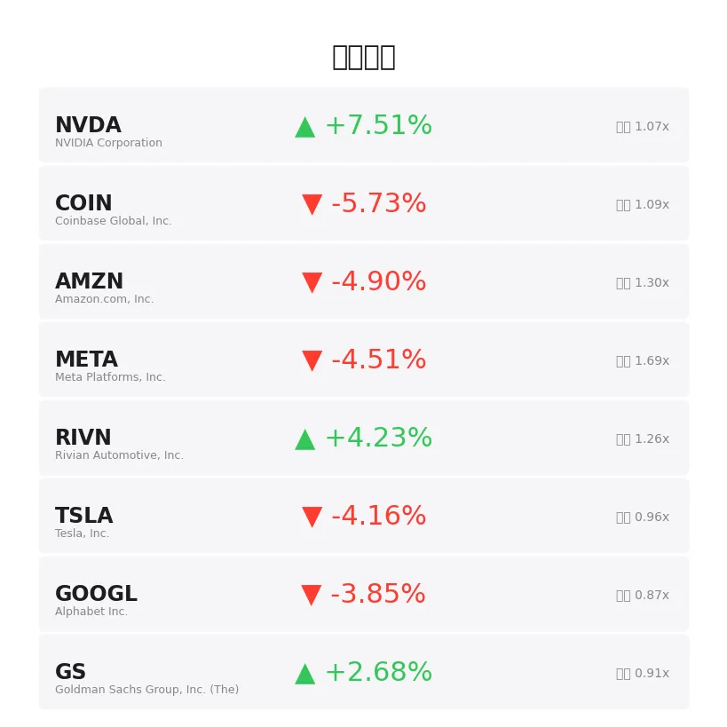
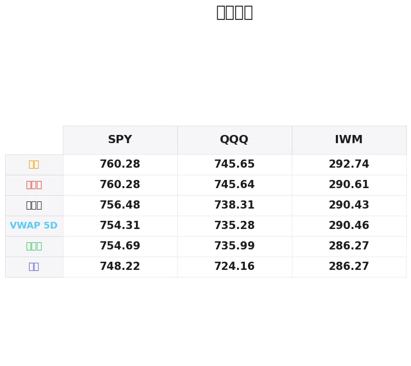

# 盘前分析报告 — 2026-06-02
*生成时间: 12:34:38 UTC*

---
## 数据速览

---
## 一、宏观环境

> [!info]- 详细数据：指数期货 & VIX
> ### 1.1 指数期货 & VIX
> | 品种 | 现价 | 涨跌幅 | 前收 | 日高 | 日低 |
> |------|------|--------|------|------|------|
> | ES=F | 7601.25 | -0.16% | 7613.25 | 7612.0 | 7576.75 |
> | NQ=F | 30551.75 | -0.05% | 30566.25 | 30585.75 | 30317.75 |
> | YM=F | 50939.0 | -0.38% | 51134.0 | 51084.0 | 50871.0 |
> | GC=F | 4559.6 | +1.18% | 4506.3 | 4571.3 | 4492.3 |
> | ^VIX | 16.18 | +0.81% | 16.05 | 16.28 | 16.1 |

> [!info]- 详细数据：隔夜走势
> ### 1.2 隔夜走势（Globex）
> | 品种 | 隔夜高 | 隔夜低 | 区间 | 亚洲高 | 亚洲低 | 欧洲高 | 欧洲低 |
> |------|--------|--------|------|--------|--------|--------|--------|
> | ES=F | 7610.5 | 7581.5 | 29.0 | 7596.75 | 7581.5 | 7610.5 | 7593.75 |
> | NQ=F | 30586.0 | 30370.5 | 215.5 | 30495.0 | 30370.5 | 30586.0 | 30469.0 |
> | YM=F | 51084.0 | 50888.0 | 196.0 | 50977.0 | 50915.0 | 51084.0 | 50891.0 |
> | GC=F | 4571.3 | 4528.0 | 43.3 | 4558.8 | 4528.0 | 4571.3 | 4546.9 |
> | ^VIX | 16.28 | 16.1 | 0.18 | — | — | 16.28 | 16.1 |

> [!info]- 详细数据：板块强弱
> ### 1.3 板块强弱
> | ETF | 板块 | 涨跌幅 |
> |-----|------|--------|
> | XLK | Technology | +2.48% |
> | XLE | Energy | +1.79% |
> | XLC | Communication | -0.07% |
> | XLF | Financials | -0.29% |
> | XLI | Industrials | -0.42% |
> | XLB | Materials | -0.45% |
> | XLP | Consumer Staples | -1.06% |
> | XLV | Healthcare | -1.09% |
> | XLRE | Real Estate | -1.64% |
> | XLY | Consumer Discretionary | -2.22% |
> | XLU | Utilities | -2.97% |

---
## 二、消息面

- **今日股市：道指因美伊谈判"持续进行"而下跌；AI概念股Marvell科技飙涨19%（实时报道）** — *Investor’s Business Daily*
  > Stock Market Today: Dow Falls With U.S.-Iran Talks ‘Continuing’; AI Name Marvell Tech Soars By 19% (Live Coverage)
- **一只被忽视的收益型ETF在AMD历史性涨势中通过卖出备兑看涨期权实现翻倍** — *24/7 Wall St.*
  > An Overlooked Income ETF Minted a Double While Selling Covered Calls on AMD’s Historic Run
- **Yardeni称SpaceX、OpenAI和Anthropic的IPO不会"吸走市场氧气"——但SPY、QQQ基金可能争抢SPCX份额** — *Stocktwits*
  > SpaceX, OpenAI And Anthropic IPOs Won’t ‘Suck The Oxygen’ Out Of Markets, Yardeni Says — But SPY, QQQ Funds May Scramble For SPCX Shares
- **道指、标普500、纳指期货在创纪录涨势后回落，美伊战争不确定性盖过AI涨幅：TSLA、BB、META、HPE、NVDA受关注** — *Stocktwits*
  > Dow, S&P 500, Nasdaq Futures Slip After Record Rally As US-Iran War Confusion Eclipses AI Gains: TSLA, BB, META, HPE, NVDA Stocks In Focus
- **我年薪15万美元，但在遍地富人的世界里感觉自己只是中产阶级** — *24/7 Wall St.*
  > I Make $150,000 a Year, But It Feels Like I’m Just Middle Class in a World Full of Rich People
- **一位财富管理经理为何豪掷300万美元押注收益率6.4%的高级贷款ETF** — *Motley Fool*
  > Why a Wealth Manager Made a $3 Million Bet on a 6.4% Yielding Senior Loan ETF
- **标普500和纳指在NVDA新PC芯片推动下创历史新高，特朗普对美伊关系积极表态提振道指——NVDA、ARM、MGM、ZM、AMC受关注** — *Stocktwits*
  > S&P 500 And Nasdaq Rise To Record Highs, Powered By NVDA Gains Amid New PC Chip, While Trump’s Positive Commentary On US-Iran Supports Dow — NVDA, ARM, MGM, ZM, AMC In Focus
- **投资者大量涌入看涨期权——这是股市过热的又一信号** — *MarketWatch*
  > Investors are piling into bullish options bets — another sign that the stock market is getting overheated
- **2026年6月1日股市新闻综述** — *Zacks*
  > Stock Market News for Jun 1, 2026
- **为什么VIX如此之低？** — *Barchart*
  > Why is the VIX So Low?
- **恐慌指数显示市场平静，投资者无视伊朗紧张局势** — *Barrons.com*
  > Fear Index Signals Calm as Markets Shrug Off Iran Tensions
- **恐慌指数上升，科技股抛售和通胀担忧施压** — *Barrons.com*
  > Market Fear Index Rises as Tech Selloff and Inflation Fears Weigh
- **今日金价（6月2日周二）：价格继续在4500美元区间徘徊** — *Yahoo Personal Finance*
  > Gold prices today, Tuesday, June 2: Prices continue to hover in the $4,500 range
- **黄金下跌，原油反弹，美伊协议仍悬而未决** — *Yahoo Finance*
  > Gold tumbles as oil rebounds and US-Iran deal remains in limbo
- **Fury Gold Mines盘前上涨0.3%，公布Eau Claire项目最新钻探结果** — *MT Newswires*
  > Fury Gold Mines Up 0.3% In US Premarket AS Reports Latest Drill Results From Eau Claire Project
- **Kenorland开始在安大略省Western Wabigoon项目钻探** — *Mining Technology*
  > Kenorland starts drilling at Ontario’s Western Wabigoon project
- **黄金超越美国国债成为全球最受欢迎的投资品种** — *The Telegraph*
  > Gold overtakes US bonds as world’s favourite investment
- **今日股市：道指、标普500、纳指因国债收益率上升而下跌** — *Yahoo Finance*
  > Stock market today: Dow, S&P 500, Nasdaq drop amid rising bond yields
- **富时100和美股下跌，油价波动，伊朗战争担忧加剧** — *Yahoo Finance UK*
  > FTSE 100 and US stocks dive and oil swings amid Iran war jitters
- **富时100和美股反弹，市场关注美联储会议和伊朗冲突** — *Yahoo Finance UK*
  > FTSE 100 and US stocks rally with Fed meeting and Iran conflict in view

---
## 三、盘前异动

> [!info]- 详细数据：盘前异动
> | 代码 | 名称 | 现价 | 缺口 | 量比 |
> |------|------|------|------|------|
> | NVDA | NVIDIA Corporation | 227.0 | +7.51% | 1.07x |
> | COIN | Coinbase Global, Inc. | 178.2 | -5.73% | 1.09x |
> | AMZN | Amazon.com, Inc. | 257.39 | -4.90% | 1.3x |
> | META | Meta Platforms, Inc. | 604.0 | -4.51% | 1.69x |
> | RIVN | Rivian Automotive, Inc. | 16.99 | +4.23% | 1.26x |
> | TSLA | Tesla, Inc. | 417.67 | -4.16% | 0.96x |
> | GOOGL | Alphabet Inc. | 365.71 | -3.85% | 0.87x |
> | GS | Goldman Sachs Group, Inc. (The) | 1048.4 | +2.68% | 0.91x |
> | XOM | Exxon Mobil Corporation | 148.7 | +2.37% | 0.93x |
> | AMD | Advanced Micro Devices, Inc. | 505.0 | -2.15% | 1.01x |

---
## 四、关键价位

> [!info]- 详细数据：SPY 关键价位
> ### SPY
> | 价位类型 | 价格 |
> |----------|------|
> | Prior Day High | 760.28 |
> | Prior Day Low | 754.69 |
> | Prior Day Close | 756.48 |
> | Premarket Price | 757.1188 |
> | Approx Vwap 5D | 754.31 |
> | Weekly High | 760.28 |
> | Weekly Low | 748.22 |

> [!info]- 详细数据：QQQ 关键价位
> ### QQQ
> | 价位类型 | 价格 |
> |----------|------|
> | Prior Day High | 745.64 |
> | Prior Day Low | 735.99 |
> | Prior Day Close | 738.31 |
> | Premarket Price | 741.9387 |
> | Approx Vwap 5D | 735.28 |
> | Weekly High | 745.65 |
> | Weekly Low | 724.16 |

> [!info]- 详细数据：IWM 关键价位
> ### IWM
> | 价位类型 | 价格 |
> |----------|------|
> | Prior Day High | 290.605 |
> | Prior Day Low | 286.27 |
> | Prior Day Close | 290.43 |
> | Premarket Price | 289.31 |
> | Approx Vwap 5D | 290.46 |
> | Weekly High | 292.74 |
> | Weekly Low | 286.27 |

---
## 五、AI 技术分析 & 操盘建议

## 第一部分：隔夜市场回顾

### 亚洲时段（18:00–02:00 ET）

亚盘整体偏弱运行。ES在亚洲时段低点触及7581.5，高点仅7596.75，整个亚盘区间仅15点，呈现典型的窄幅低波动消化形态。NQ在亚洲时段同样走弱，低点30370.5是整个隔夜最低点，暗示科技股在盘后获利了结压力较大——尽管上周五NVDA单日暴涨7.5%带动纳指创新高，但亚盘即出现回吐迹象。黄金则相对强势，亚盘低点4528后稳步攀升，反映了美伊局势不确定性下的避险需求。

**亚盘要点：** 股指偏弱消化，黄金避险买盘活跃，风险偏好谨慎。

### 欧洲时段（02:00–09:30 ET）

欧盘进场后走势出现分化。ES从亚盘低位反弹至隔夜高点7610.5，回补了大部分亚盘跌幅，但未能突破上周五高点7612.0，形成一个微妙的双顶结构。NQ在欧盘表现更为积极，高点触及30586.0，基本回到前收盘上方，NVDA盘前继续获得买盘支撑。道指期货YM则明显偏弱，高点51084仍远低于前收51134，反映出周期股/价值股承压。

黄金在欧盘加速上行至4571.3的隔夜高点，整个Globex区间达到43点，Gold overtakes US bonds的叙事持续发酵。

**欧盘要点：** ES/NQ反弹但接近前高受阻，YM明显偏弱，黄金创日内新高。

### 对美盘的启示

1. **隔夜区间为今日提供关键参考框架：** ES 7581.5-7610.5是隔夜价值区，开盘若在此区间内，预期双向波动；突破7612则打开上行空间，跌破7581.5则可能测试7570-7575区域。
2. **科技vs价值分化加剧：** NVDA+7.5%独领风骚，但AMZN/META/TSLA/GOOGL均大幅下跌，"一超多弱"格局可能在美盘继续演绎。NQ因NVDA权重可能强于ES。
3. **地缘风险定价不充分：** VIX仅16.18，与美伊局势的不确定性不匹配。如果出现负面突发消息，波动率快速扩张的风险较高。
4. **黄金强势是风向标：** GC+1.18%且成交活跃，与"黄金超越美国国债成为全球最受欢迎投资品种"的叙事共振，今日做多黄金回调的胜率可能优于做空。

## 第二部分：期货品种分析

### ES（E-mini S&P 500）— 现价 7601.25

**多时间框架分析：**
- **日线：** 上周五录得小阴线（高7612，低7576.75），收于7613.25前高下方。日线MACD依然在零轴上方运行，但柱状图缩短，短期动能减弱。上周创历史新高后，日线呈现高位犹豫形态。
- **4H：** 从7576.75反弹至7610.5的欧盘走势形成短期上升结构，但7610-7613区域连续受阻，4H级别呈现潜在双顶。
- **1H/15min：** 隔夜区间仅29点（7581.5-7610.5），属于周一典型窄幅盘整。预期美盘开盘后波动率扩张。

**关键价位：**
| 级别 | 多头 | 空头 |
|------|------|------|
| 核心阻力 | 7612-7615（隔夜高+前高） | — |
| 次级阻力 | 7630-7635（上方真空区） | — |
| 枢纽位 | 7600-7605（整数关+VPOC估算） | 7600-7605 |
| 次级支撑 | — | 7581-7577（隔夜低+上周低） |
| 核心支撑 | — | 7565-7570（上周四低点区域） |

**方向偏见：** 中性偏多 | 信心度：55%
- 理由：日线趋势仍为上升，但短期动能衰减，隔夜双顶7610-7612需要突破确认。NVDA独强格局可能给NQ带来溢出效应，间接支撑ES。

**交易计划：**
- **做多方案A（突破追踪）：** ES站稳7613上方且1min收线确认 → 入场7614-7616，止损7605，T1: 7630，T2: 7645
- **做多方案B（回调接多）：** 回踩7581-7585区域出现order flow吸收（delta翻正+成交量萎缩后放量反弹）→ 入场7583-7586，止损7574，T1: 7600，T2: 7612
- **做空方案（双顶确认）：** 第三次测试7610-7613失败+1min出现aggressive selling → 入场7608-7610，止损7616，T1: 7590，T2: 7580
- **失效条件：** 若开盘直接跳空至7620上方，放弃做空思路，等待回踩7612-7615后做多。

---

### NQ（E-mini Nasdaq 100）— 现价 30551.75

**多时间框架分析：**
- **日线：** 上周五在NVDA带动下创历史新高30585.75后微幅回落，收于30566.25。日线大阳线实体完整，趋势强劲。但NVDA单票贡献了指数大部分涨幅，广度存疑。
- **4H：** 亚盘回踩30370.5（约-0.6%）后欧盘V型反弹至30586.0，接近前高。4H级别呈现高位震荡但每次回调买盘积极。
- **1H/15min：** 隔夜区间215.5点（30370.5-30586.0），远大于ES的29点比例，反映NVDA盘后波动的溢出效应。

**关键价位：**
| 级别 | 多头 | 空头 |
|------|------|------|
| 核心阻力 | 30585-30600（隔夜高+历史新高） | — |
| 次级阻力 | 30700-30750（心理整数位） | — |
| 枢纽位 | 30475-30500（隔夜VPOC估算） | 30475-30500 |
| 次级支撑 | — | 30370-30400（隔夜低+亚盘低） |
| 核心支撑 | — | 30200-30250（上周四低位） |

**方向偏见：** 偏多 | 信心度：60%
- 理由：NVDA盘前+7.5%是绝对主导力量，NQ权重中NVDA、MSFT、AAPL前三大占比超20%。只要NVDA不在盘中翻绿，NQ很难大幅走弱。但需警惕AMZN/META/TSLA等mega cap拖累形成"指数涨、个股跌"的扭曲格局。

**交易计划：**
- **做多方案A（新高突破）：** NQ突破30586且有明显增量 → 入场30590-30610，止损30540，T1: 30700，T2: 30800
- **做多方案B（回调接多）：** 回踩30400-30430区域出现买盘吸收 → 入场30410-30440，止损30360，T1: 30550，T2: 30600
- **做空方案（NVDA反转）：** 仅在NVDA盘中转负+NQ跌破30370时考虑 → 入场30360-30380，止损30420，T1: 30250，T2: 30150
- **失效条件：** 若NVDA盘前涨幅收窄至<3%，多头信心度下调至50%，需重新评估。

---

### GC（黄金期货）— 现价 4559.6

**多时间框架分析：**
- **日线：** 连续三日收阳，从4492低点反弹至4571高点，日线MACD金叉形成，短期均线（5/10日）开始走平后拐头向上。日线趋势由跌转震荡偏多。
- **4H：** 从亚盘低点4528稳步攀升至欧盘高点4571.3，几乎无回调的单边上行。4H级别形成明确的上升通道。
- **1H/15min：** 隔夜区间43.3点，属于黄金正常日内波动的中等偏上水平。注意欧盘高点4571.3附近可能存在短期获利了结。

**关键价位：**
| 级别 | 多头 | 空头 |
|------|------|------|
| 核心阻力 | 4571-4575（隔夜高） | — |
| 次级阻力 | 4590-4600（5月高点区域） | — |
| 枢纽位 | 4555-4560（当前价位区域） | 4555-4560 |
| 次级支撑 | — | 4540-4545（欧盘起涨点） |
| 核心支撑 | — | 4525-4530（隔夜低+亚盘低） |

**方向偏见：** 偏多 | 信心度：65%
- 理由：三重利好共振——(1)美伊局势不确定性驱动避险买盘，(2)"黄金超越美债"叙事吸引配置资金，(3)美元指数近期走弱。隔夜几乎单边上行，买方控制力强。唯一风险是美伊突然达成协议导致避险需求骤降。

**交易计划：**
- **做多方案A（突破追踪）：** GC突破4571.3且成交量配合 → 入场4572-4575，止损4560，T1: 4590，T2: 4600
- **做多方案B（回调接多）：** 回踩4540-4545出现delta翻正 → 入场4542-4548，止损4530，T1: 4565，T2: 4575
- **做空方案（不推荐，仅供参考）：** 4590-4600区域出现明显卖压+美伊传出积极进展 → 入场4588-4595，止损4605，T1: 4570，T2: 4555
- **失效条件：** 若GC跌破4525，日线上升结构被破坏，多头思路暂时搁置。

## 第三部分：ETF品种分析

### SPY — 盘前价 757.12 | 前收 756.48

**关键价位总览：**
| 价位 | 含义 | 重要性 |
|------|------|--------|
| 760.28 | 前日高 = 周高 = 历史新高 | ⭐⭐⭐ 核心阻力 |
| 757.12 | 盘前价 | 当前锚点 |
| 756.48 | 前收 | 开盘参考 |
| 754.69 | 前日低 | ⭐⭐ 支撑 |
| 754.31 | 5日VWAP | ⭐⭐⭐ 多空分水岭 |
| 748.22 | 周低 | ⭐⭐ 强支撑 |

**盘前定位分析：**
SPY盘前757.12，略高于前收756.48（+0.08%），但远低于前日高760.28。盘前温和gap up，说明市场对上周五的涨势持观望态度。5日VWAP在754.31，当前价在VWAP上方约2.8点，多头仍控制短期趋势。

**分歧点在哪里？**
- **760.28是今天最关键的价位。** 这是前日高、周高、也是历史新高区域。如果SPY能突破760.30并站稳，将打开新一轮上行空间，目标762-765。
- **754.31（5D VWAP）是多空分水岭。** 若回落至此位下方且无法快速收复，短期趋势将转为中性，可能回测748-750。

**交易计划：**
- **突破做多：** SPY突破760.30+放量确认 → 入场760.30-760.50，止损758.50，T1: 762.50，T2: 765.00
- **回调做多：** 回踩754.30-755.00（5D VWAP区域）出现支撑 → 入场754.50-755.00，止损753.00，T1: 757.50，T2: 760.00
- **做空（谨慎）：** 760.00-760.28三次受阻+量价背离 → 入场759.50-760.00，止损761.00，T1: 757.00，T2: 755.00

---

### QQQ — 盘前价 741.94 | 前收 738.31

**关键价位总览：**
| 价位 | 含义 | 重要性 |
|------|------|--------|
| 745.64-745.65 | 前日高 ≈ 周高 | ⭐⭐⭐ 核心阻力 |
| 741.94 | 盘前价 | 当前锚点 |
| 738.31 | 前收 | 开盘参考 |
| 735.99 | 前日低 | ⭐⭐ 支撑 |
| 735.28 | 5日VWAP | ⭐⭐⭐ 多空分水岭 |
| 724.16 | 周低 | ⭐⭐ 强支撑 |

**盘前定位分析：**
QQQ盘前741.94，较前收738.31高出+0.49%，gap up幅度明显大于SPY的+0.08%。这直接反映了NVDA+7.5%的溢出效应——NVDA是QQQ的第一大权重股。盘前价已突破前日成交量密集区的上沿，但距前日高745.64还有约3.7点的空间。

**核心矛盾：NVDA独强vs其余mega cap全线下跌**
- NVDA +7.51%、AMD -2.15%：芯片板块内部严重分化
- META -4.51%、AMZN -4.90%、GOOGL -3.85%、TSLA -4.16%：QQQ其余大权重全线下跌
- 这意味着QQQ的gap up完全依赖NVDA单票撑起，一旦NVDA日内回吐涨幅，QQQ可能快速回补缺口

**交易计划：**
- **做多方案（NVDA持续强势）：** QQQ站稳742上方+NVDA盘中保持>5%涨幅 → 入场742.00-742.50，止损740.00，T1: 745.00，T2: 747.00
- **做空方案（缺口回补）：** NVDA盘中涨幅收窄至<3%+QQQ跌破740 → 入场739.50-740.00，止损742.00，T1: 738.00（前收），T2: 736.00（5D VWAP）
- **关键观察：** 开盘前30分钟密切关注NVDA的order flow。如果NVDA出现大量aggressive selling（iceberg卖单、delta持续为负），立即切换至做空QQQ思路。

## 第四部分：今日市场总览

### 整体情绪评估

**市场状态：高位分化，暗流涌动**

表面上看，标普500和纳指上周五双双创历史新高，VIX维持在16.18的低位，市场似乎一片祥和。但细看内部结构，危险信号已在积聚：

1. **极端个股集中度：** NVDA单日+7.5%贡献了NQ几乎全部涨幅，而AMZN(-4.9%)、META(-4.5%)、TSLA(-4.2%)、GOOGL(-3.9%)集体暴跌。这是教科书级的"一超多弱"格局，历史上这种极端分化往往出现在趋势末端。
2. **看涨期权狂热：** MarketWatch报道投资者大量涌入看涨期权，这是市场过热的经典信号。当所有人都在同一侧时，反转的概率上升。
3. **地缘风险被低估：** 美伊局势消息面极度矛盾——一边是"谈判持续推进"，一边是"战争混乱"。VIX仅16.18完全没有定价这一尾部风险。

### VIX分析

VIX 16.18（+0.81%），处于历史低位区间。多家媒体发问"为什么VIX如此之低？"——当市场开始讨论波动率为什么低时，往往是波动率即将扩张的信号。

**实操含义：**
- 当前IV偏低，买入期权（尤其是protective put）成本较低，适合对冲
- 不要裸卖期权，万一美伊局势急转直下，VIX可能在数小时内飙升至25+
- 日内交易建议保持较小仓位，因为低VIX环境下的突发波动杀伤力最大

### 需要回避的时间窗口

| 时间（ET） | 事件 | 影响 |
|------------|------|------|
| 09:30-10:00 | 开盘轮动期 | 高波动、假突破概率大，建议观察不操作 |
| 10:00 | ISM制造业数据（如有） | 可能引发债券市场波动，间接影响股指 |
| 任何时刻 | 美伊突发消息 | 无法预测，需始终保持止损纪律 |

### 板块轮动解读

今日板块格局呈现鲜明的**"科技+能源 vs 其他一切"**的分化：
- **XLK（科技）+2.48%** 和 **XLE（能源）+1.79%** 是仅有的两个正收益板块
- **XLU（公用事业）-2.97%** 和 **XLY（消费可选）-2.22%** 垫底
- 科技强劲源于NVDA效应，能源强劲源于油价因美伊局势上涨
- 公用事业和房地产（XLRE -1.64%）大跌反映国债收益率上升的压力
- **解读：** 这不是健康的"risk-on"轮动，而是资金高度集中在叙事驱动的少数板块。如果NVDA和油价同时回落，将找不到"接力棒"。

### 今日核心交易论点

> **一句话总结：NVDA是今天的"全村的希望"——它涨，NQ/QQQ做多有底气；它翻绿，做空信号立刻亮起。所有交易决策的第一步都是看NVDA的order flow。地缘风险是黑天鹅，必须带好止损出门。**

---
*报告由 DayTrader AI 生成 | 仅供参考，不构成投资建议 | 2026-06-02*
