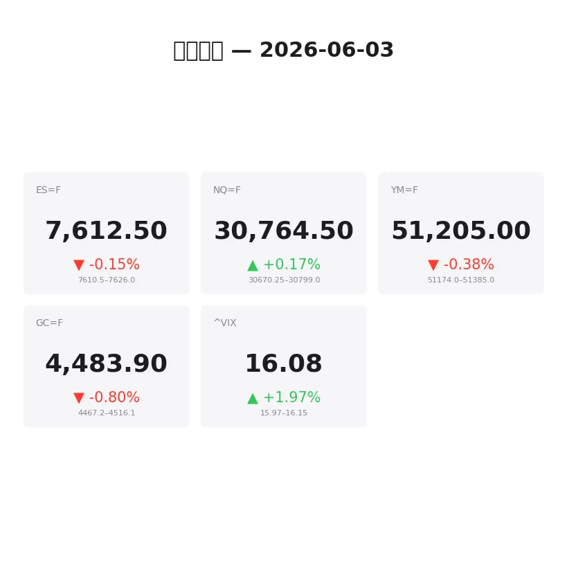
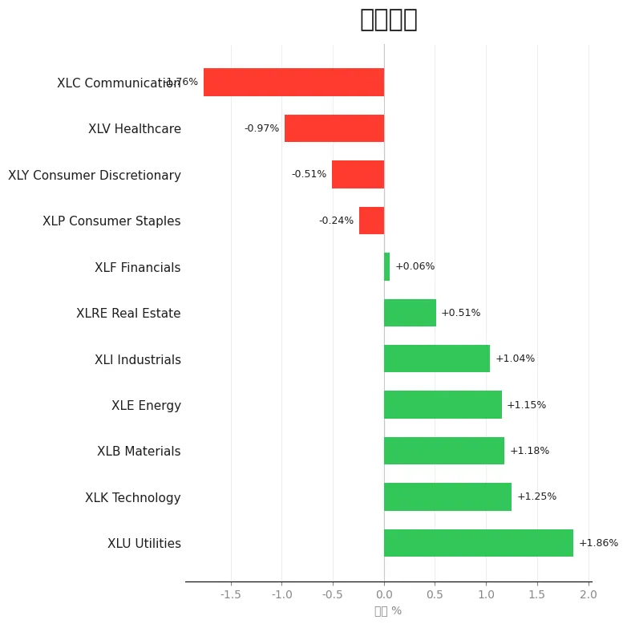
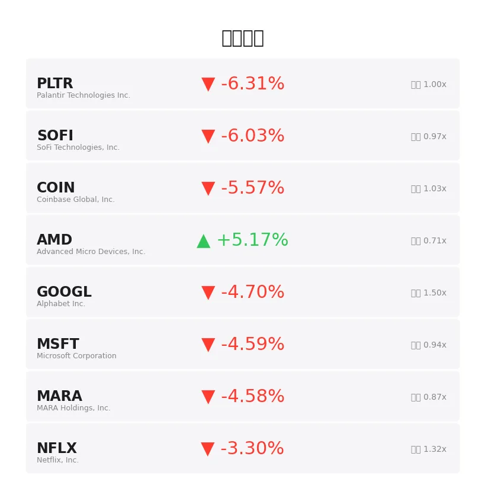
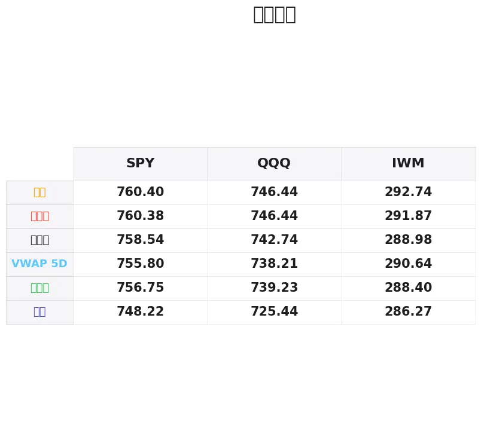

# 盘前分析报告 — 2026-06-03
*生成时间: 12:36:14 UTC*

---
## 数据速览

---
## 一、宏观环境

> [!info]- 详细数据：指数期货 & VIX
> ### 1.1 指数期货 & VIX
> | 品种 | 现价 | 涨跌幅 | 前收 | 日高 | 日低 |
> |------|------|--------|------|------|------|
> | ES=F | 7612.5 | -0.15% | 7623.75 | 7628.5 | 7602.0 |
> | NQ=F | 30764.5 | +0.17% | 30712.75 | 30798.0 | 30561.25 |
> | YM=F | 51205.0 | -0.38% | 51400.0 | 51418.0 | 51174.0 |
> | GC=F | 4483.9 | -0.80% | 4519.9 | 4525.1 | 4467.5 |
> | ^VIX | 16.08 | +1.97% | 15.77 | 16.15 | 15.97 |

> [!info]- 详细数据：隔夜走势
> ### 1.2 隔夜走势（Globex）
> | 品种 | 隔夜高 | 隔夜低 | 区间 | 亚洲高 | 亚洲低 | 欧洲高 | 欧洲低 |
> |------|--------|--------|------|--------|--------|--------|--------|
> | ES=F | 7626.0 | 7610.5 | 15.5 | 7626.0 | 7617.5 | 7623.5 | 7610.5 |
> | NQ=F | 30799.0 | 30670.25 | 128.75 | 30730.5 | 30675.0 | 30794.25 | 30670.25 |
> | YM=F | 51385.0 | 51174.0 | 211.0 | 51385.0 | 51338.0 | 51348.0 | 51174.0 |
> | GC=F | 4516.1 | 4467.2 | 48.9 | 4516.1 | 4484.8 | 4500.5 | 4467.2 |
> | ^VIX | 16.15 | 15.97 | 0.18 | — | — | 16.15 | 15.97 |

> [!info]- 详细数据：板块强弱
> ### 1.3 板块强弱
> | ETF | 板块 | 涨跌幅 |
> |-----|------|--------|
> | XLU | Utilities | +1.86% |
> | XLK | Technology | +1.25% |
> | XLB | Materials | +1.18% |
> | XLE | Energy | +1.15% |
> | XLI | Industrials | +1.04% |
> | XLRE | Real Estate | +0.51% |
> | XLF | Financials | +0.06% |
> | XLP | Consumer Staples | -0.24% |
> | XLY | Consumer Discretionary | -0.51% |
> | XLV | Healthcare | -0.97% |
> | XLC | Communication | -1.76% |

---
## 二、消息面

- **道指因特朗普对伊朗最新言论下跌；Palo Alto财报后下滑（实时报道）** — *Investor’s Business Daily*
  > Stock Market Today: Dow Falls Amid Latest Trump Comments On Iran; Palo Alto Slides On Earnings (Live Coverage)
- **太阳能最被看空的一年变成最好的五个月——解读120%涨幅背后的逻辑** — *24/7 Wall St.*
  > Solar’s Most Hated Year Became Its Best Five Months. The Setup That Explains the 120% Gain.
- **如何对冲市场下跌风险——还能从中获利** — *Barrons.com*
  > How to Hedge Against a Market Drop—and Get Paid for the Privilege
- **标普/纳指/道指期货在再创历史新高后回落，AI动能缓冲伊朗袭击扩大影响：MRVL、AVGO、MSFT、PANW受关注** — *Stocktwits*
  > S&P 500, Nasdaq, Dow Futures Ease After Another Record Close As AI Momentum Cushions Iran’s Expanding Strikes: MRVL, AVGO, MSFT, PANW In Focus
- **2026上半年最佳ETF：赢家、输家及关注要点** — *etf.com*
  > Best ETFs for H1 2026: Winners, Losers, and What to Watch
- **超900持仓但仍涨40%，这只Schwab ETF一石二鸟** — *24/7 Wall St.*
  > Over 900 Holdings, but Still up 40%. This Schwab ETF Kills Two Birds With One Stone.
- **互联网泡沫重演？"大空头"Michael Burry图表显示AI芯片涨势距2000年峰值仅7%** — *Stocktwits*
  > Dot-Com Bubble Deja Vu? 'Big Short' Michael Burry's Chart Shows AI Chip Rally Is Within 7% Of 2000 Peak
- **标普/纳指/道指齐创历史新高，科技股强势盖过美伊战争不确定性——MSFT、UBER、MRVL、HPE、MSTR受关注** — *Stocktwits*
  > S&P 500, Nasdaq, Dow Rise To Record Highs As Strong Tech Gains Outpower US-Iran War Uncertainty — MSFT, UBER, MRVL, HPE, MSTR Stocks In Focus
- **2026年6月2日股市新闻** — *Zacks*
  > Stock Market News for Jun 2, 2026
- **2026年6月1日股市新闻** — *Zacks*
  > Stock Market News for Jun 1, 2026
- **VIX为何如此之低？** — *Barchart*
  > Why is the VIX So Low?
- **恐慌指数显示市场平静，投资者忽视伊朗紧张局势** — *Barrons.com*
  > Fear Index Signals Calm as Markets Shrug Off Iran Tensions
- **恐慌指数上升，科技抛售和通胀担忧施压** — *Barrons.com*
  > Market Fear Index Rises as Tech Selloff and Inflation Fears Weigh
- **6月3日周三白银价格：冲突持续，银价早盘走低** — *Yahoo Personal Finance*
  > Silver prices today, Wednesday, June 3, 2026: Moving lower this morning as clashes continue
- **DPM Metals在Chelopech矿山附近发现高品位斑岩矿化** — *MT Newswires*
  > DPM Metals Discovers High-Grade Porphyry Mineralization Adjacent to Chelopech Mine
- **Legacy Minerals与Aurelia Metals签署Cobar项目协议** — *Mining Technology*
  > Legacy Minerals signs agreement with Aurelia Metals for Cobar Project
- **原油价格上涨和通胀担忧抑制避险需求，金价回落** — *InvestorsHub*
  > Gold Slips as Rising Oil Prices and Inflation Concerns Temper Safe-Haven Demand
- **黄金超越美国国债成为全球最大储备资产** — *Private Banker International*
  > Gold overtakes US Treasuries as top global reserve asset
- **道指、标普500、纳指因国债收益率上升而下跌** — *Yahoo Finance*
  > Stock market today: Dow, S&P 500, Nasdaq drop amid rising bond yields
- **FTSE 100及美股大幅下挫，油价在伊朗战争忧虑中剧烈波动** — *Yahoo Finance UK*
  > FTSE 100 and US stocks dive and oil swings amid Iran war jitters

---
## 三、盘前异动

> [!info]- 详细数据：盘前异动
> | 代码 | 名称 | 现价 | 缺口 | 量比 |
> |------|------|------|------|------|
> | PLTR | Palantir Technologies Inc. | 150.51 | -6.31% | 1.0x |
> | SOFI | SoFi Technologies, Inc. | 17.46 | -6.03% | 0.97x |
> | COIN | Coinbase Global, Inc. | 172.44 | -5.57% | 1.03x |
> | AMD | Advanced Micro Devices, Inc. | 536.5 | +5.17% | 0.71x |
> | GOOGL | Alphabet Inc. | 358.68 | -4.70% | 1.5x |
> | MSFT | Microsoft Corporation | 439.37 | -4.59% | 0.94x |
> | MARA | MARA Holdings, Inc. | 14.17 | -4.58% | 0.87x |
> | NFLX | Netflix, Inc. | 83.02 | -3.30% | 1.32x |
> | AAPL | Apple Inc. | 314.01 | +2.51% | 0.93x |
> | AMZN | Amazon.com, Inc. | 255.49 | -2.21% | 1.01x |

---
## 四、关键价位

> [!info]- 详细数据：SPY 关键价位
> ### SPY
> | 价位类型 | 价格 |
> |----------|------|
> | Prior Day High | 760.385 |
> | Prior Day Low | 756.75 |
> | Prior Day Close | 758.54 |
> | Premarket Price | 758.08 |
> | Approx Vwap 5D | 755.8 |
> | Weekly High | 760.4 |
> | Weekly Low | 748.22 |

> [!info]- 详细数据：QQQ 关键价位
> ### QQQ
> | 价位类型 | 价格 |
> |----------|------|
> | Prior Day High | 746.44 |
> | Prior Day Low | 739.23 |
> | Prior Day Close | 742.74 |
> | Premarket Price | 746.79 |
> | Approx Vwap 5D | 738.21 |
> | Weekly High | 746.44 |
> | Weekly Low | 725.44 |

> [!info]- 详细数据：IWM 关键价位
> ### IWM
> | 价位类型 | 价格 |
> |----------|------|
> | Prior Day High | 291.865 |
> | Prior Day Low | 288.4 |
> | Prior Day Close | 288.98 |
> | Premarket Price | 289.95 |
> | Approx Vwap 5D | 290.64 |
> | Weekly High | 292.74 |
> | Weekly Low | 286.27 |

---
## 五、AI 技术分析 & 操盘建议

### 第一部分：隔夜市场回顾

**亚洲时段（约 18:00–02:00 ET）**

亚洲盘整体偏强运行。ES在7617.5–7626.0的窄幅区间内震荡，区间仅8.5点，显示买方在前收盘价下方承接力度较好。NQ在亚洲盘表现相对偏弱，低点探至30675.0，但未出现恐慌性抛售。GC黄金在亚洲盘维持高位运行（4484.8–4516.1），地缘政治避险买盘持续。道琼斯（YM）亚洲盘相对坚挺，窄幅运行于51338–51385。

**欧洲时段（约 02:00–08:00 ET）**

欧洲盘出现明显分化。ES遭到抛压跌至隔夜低点7610.5，较亚洲低点下破7点，空头开始主导。NQ在欧洲盘波动加剧，区间扩大至124点（30670.25–30794.25），出现了探底回升的走势——先破亚洲低点后快速反弹至隔夜新高，多空博弈激烈。YM道指受创最重，欧洲盘低点51174直接打穿亚洲区间底部150+点。GC黄金从亚洲高位大幅回落至4467.2，跌幅近$50，多头获利了结叠加美元走强。

**对美盘的启示**

1. **ES多空分水岭在7620附近**：亚洲买在7617.5，欧洲卖在7610.5，开盘能否站稳7620决定短期方向
2. **NQ最强**：欧洲盘探底回升，科技股买盘坚定，AI主题延续
3. **YM最弱**：道指领跌，传统蓝筹承压，关注伊朗地缘风险对工业/金融板块的拖累
4. **GC大幅回调后关注承接**：$4467是关键支撑，跌破则本轮避险行情告一段落
5. **VIX 16.08微升但仍低位**：市场整体未恐慌，隐含波动率未大幅走高，适合方向性交易而非纯波动率策略

---
### 第二部分：期货品种分析

#### ES（E-mini S&P 500）— 现价 7612.5

**多时间框架分析：**
- **日线**：前一交易日收于7623.75附近，日内高低7628.5–7602.0，实体偏空但上影线不长。上方周高7628.5为近期天花板，连续两日未能突破。日线趋势仍为多头，但上攻动能减弱。
- **4H**：欧洲盘打出隔夜低7610.5后出现弱反弹，当前7612.5处于区间下半部。4H级别形成lower high结构（7628→7623），短期偏空。
- **1H/15min**：关注开盘后能否在前15分钟守住7610支撑，若跌破则打开向7602（日低）甚至7595的空间。

**关键价位：**
| 类型 | 价位 | 备注 |
|------|------|------|
| 隔夜高/阻力 | 7626.0 | 亚洲高点，突破确认多头 |
| 前收/枢轴 | 7623.75 | 多空分界线 |
| 当前价 | 7612.5 | — |
| 隔夜低/支撑1 | 7610.5 | 欧洲低点，首要支撑 |
| 日低/支撑2 | 7602.0 | 跌破意味着日内趋势翻空 |

**方向偏见：** 偏空 | 置信度：65%
**交易计划：**
- **空头入场区**：7620–7626（反弹至前收/隔夜高区域做空）
- **止损**：7630（日高上方4点）
- **目标1**：7602（日低测试，约+18–24点）
- **目标2**：7590（关键整数位下方，约+30–36点）
- **失效条件**：放量突破7630并在15min收盘站稳上方，转为观望或反手

---

#### NQ（E-mini Nasdaq 100）— 现价 30764.5

**多时间框架分析：**
- **日线**：NQ是三大指数中最强品种，前一日收于30712.75，今日盘前已高出52点（+0.17%）。日线趋势明确看多，AI/科技主题持续驱动。
- **4H**：欧洲盘探底回升结构完美，低点30670.25后快速反弹至30799（隔夜新高），买盘强劲。当前30764回踩不深，多头格局。
- **1H/15min**：关注开盘后能否突破30800，这是隔夜高点附近的关键阻力。

**关键价位：**
| 类型 | 价位 | 备注 |
|------|------|------|
| 隔夜高/阻力 | 30799.0 | 突破打开上行空间 |
| 当前价 | 30764.5 | — |
| 亚洲高 | 30730.5 | 回踩支撑1 |
| 前收/支撑2 | 30712.75 | 多头防守线 |
| 欧洲低/隔夜低 | 30670.25 | 极端支撑，跌破翻空 |

**方向偏见：** 偏多 | 置信度：70%
**交易计划：**
- **多头入场区**：30710–30740（回踩前收/亚洲高区域接多）
- **止损**：30660（隔夜低下方10点）
- **目标1**：30800（隔夜高突破，约+60–90点）
- **目标2**：30900（心理关口，约+160–190点）
- **失效条件**：跌破30670并在15min收盘站稳下方，多头逻辑失效

---

#### GC（黄金期货）— 现价 4483.9

**多时间框架分析：**
- **日线**：前收4519.9，今日盘前大幅低开36点（-0.80%）。日线收出实体阴线概率大。此前"黄金超越美债成为最大储备资产"叙事推动的上涨面临获利回吐。
- **4H**：从亚洲高4516.1一路下跌至4467.2（欧洲低），跌幅近$50。当前4483.9反弹至跌幅中段，属于弱势反弹。4H级别明确空头结构。
- **1H/15min**：关注4490–4500区域的阻力强度。若反弹无法突破4500，空头延续。

**关键价位：**
| 类型 | 价位 | 备注 |
|------|------|------|
| 前收/强阻力 | 4519.9 | 今日难以触及 |
| 亚洲高/阻力1 | 4516.1 | — |
| 欧洲高/阻力2 | 4500.5 | 反弹关键阻力 |
| 当前价 | 4483.9 | — |
| 欧洲低/支撑 | 4467.2 | 跌破看4450 |

**方向偏见：** 偏空 | 置信度：70%
**交易计划：**
- **空头入场区**：4495–4505（反弹至欧洲高附近做空）
- **止损**：4520（前收上方）
- **目标1**：4467（测试欧洲低，约-28–38）
- **目标2**：4445（扩展目标，约-50–60）
- **失效条件**：放量突破4520并站稳，空头逻辑失效，可能受突发地缘事件驱动

---
### 第三部分：ETF品种分析

#### SPY（SPDR S&P 500 ETF）— 盘前 758.08

**关键价位回顾：**
- 前日高：760.385 | 前日低：756.75 | 前日收：758.54
- 5日VWAP：755.8 | 周高：760.4 | 周低：748.22

**技术结构：**
盘前758.08略低于前收758.54，gap down幅度极小（-0.06%），属于平开偏弱。760.4为本周双顶阻力，两次触及未能突破。下方756.75（前日低）和755.8（5日VWAP）形成支撑带。日线级别维持高位震荡格局，波动区间正在收窄。

**交易计划：**
- **多头场景**：回踩756.5–757.0区域（前日低+VWAP汇合），带量企稳后做多，目标758.5→760.0→760.4，止损755.5
- **空头场景**：反弹至759.5–760.4受阻做空，尤其第三次触及760.4失败时，目标757.0→755.8→754.0，止损761.0
- **突破场景**：放量突破760.5并回踩确认不破，追多目标762–765。跌破755.5下看752→748

**注意**：SPY流动性极佳，适合日内scalp。今日关注760双顶能否突破，若再次失败则高位头部成型。

---

#### QQQ（Invesco QQQ Trust）— 盘前 746.79

**关键价位回顾：**
- 前日高：746.44 | 前日低：739.23 | 前日收：742.74
- 5日VWAP：738.21 | 周高：746.44 | 周低：725.44

**技术结构：**
盘前746.79已突破前日高746.44，gap up +0.54%。这是一个关键信号——NQ期货最强，QQQ反映了科技/AI板块的领涨。若开盘能守住746区域（前日高变支撑），则多头格局确认。5日VWAP 738.21远在下方，中期上升趋势健康。

**交易计划：**
- **多头场景（首选）**：开盘回踩746.0–746.5（前日高支撑翻转），企稳后做多，目标748.5→750→752，止损744.5
- **空头场景**：若开盘快速回补缺口，跌回745以下，做空目标742.7（前收）→740→739.2（前日低），止损746.8
- **关键观察**：QQQ盘前已站上前日高，AMD盘前+5.17%领涨半导体，AI主题持续。但GOOGL -4.70%和MSFT -4.59%的大幅下跌是重要风险因素——大型科技股内部严重分化。

**注意**：QQQ今日走势取决于AMD/AAPL多头能否抵消GOOGL/MSFT空头。若权重股分化持续，波动率会放大，适合快进快出。

---
### 第四部分：今日市场总览

#### 整体情绪评估

**市场情绪：谨慎偏多，但分化加剧**

多头因素：
- 标普/纳指/道指前一交易日均创历史新高，牛市结构完整
- AI主题持续发酵（AMD +5.17%领涨，MRVL、AVGO受关注）
- VIX仅16.08，隐含波动率低位运行，市场未恐慌
- QQQ盘前已突破前日高，科技板块领涨
- XLU（公用事业+1.86%）和XLK（科技+1.25%）强势

空头因素：
- 伊朗局势升级（Trump对伊朗最新言论+伊朗扩大袭击范围），地缘黑天鹅风险
- GOOGL -4.70%、MSFT -4.59%、PLTR -6.31%——大型科技股盘前重挫
- 道指期货（YM -0.38%）最弱，传统蓝筹/周期股承压
- 国债收益率上升压制股市估值
- XLC（通信-1.76%）、XLV（医疗-0.97%）防御性板块走弱
- Michael Burry"AI芯片距2000年泡沫峰值仅7%"的警告引发关注

#### VIX分析

VIX 16.08（+1.97%），隔夜区间15.97–16.15。尽管伊朗局势紧张，VIX仍处于历史偏低区域，说明：
1. 期权市场并未定价严重的尾部风险
2. 结构性卖波动策略持续压制VIX
3. 一旦出现超预期的地缘升级，VIX可能出现非线性跳升（当前低VIX=便宜的尾部保护）

**操盘建议**：VIX低于17时，可适当买入虚值Put作为尾部保护，成本低廉。

#### 需要回避的时间窗口

| 时间（ET） | 事件/原因 |
|------------|----------|
| 09:30–09:45 | 开盘15分钟：缺口消化+方向确认期，避免追涨杀跌 |
| 10:00 | 关注是否有ISM/工厂订单等经济数据发布 |
| 11:30–13:00 | 午间流动性枯竭期，假突破频繁 |
| 14:00 | FOMC纪要或财政部拍卖消息可能影响债市 |
| 15:45–16:00 | 尾盘MOC（收盘不平衡）流动可能导致大幅波动 |

#### 板块轮动观察

今日板块轮动呈现"科技+防御"双轨格局：
- **最强**：XLU（公用事业+1.86%）——避险资金流入，高股息防御
- **次强**：XLK（科技+1.25%）——AI主题驱动，但内部严重分化
- **最弱**：XLC（通信-1.76%）——GOOGL拖累严重
- **值得关注**：XLE（能源+1.15%）——伊朗冲突推升油价预期，但若局势缓和可能快速回撤

板块分化程度（最强最弱价差3.6%）偏大，意味着择"对"板块比择时更重要。

#### 🎯 核心交易论点

**"科技内部分化+地缘博弈日：做多NQ/QQQ对冲做空ES/SPY，黄金空头延续"**

今日最大alpha在NQ多头（AI/AMD驱动的科技强势）vs ES空头（道指拖累+权重股分化）的spread交易。黄金从4516回落至4467后弱势反弹，仍以空头思路对待。单边方向上NQ/QQQ做多胜率更高，但需警惕GOOGL/MSFT的权重拖累——若两者盘中继续恶化，NQ也会被拖下水。控制仓位，快进快出。

> ⚠️ **风险提示**：伊朗局势为今日最大不可预测变量。任何关于袭击升级/停火谈判的突发新闻都可能在分钟级别造成50+点ES的剧烈波动。建议每笔交易都带硬止损，不要死扛。
