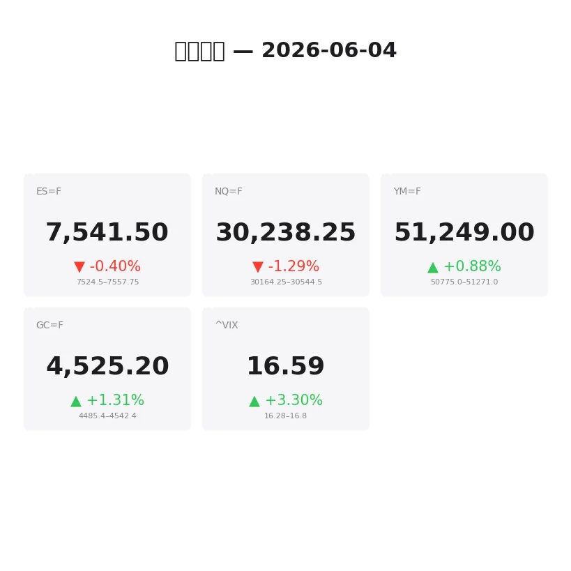
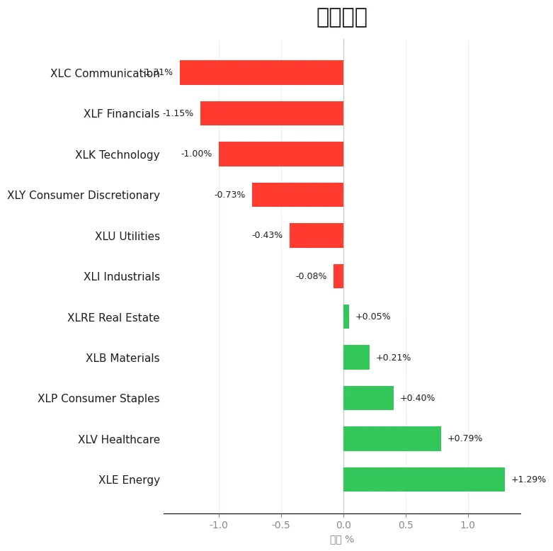
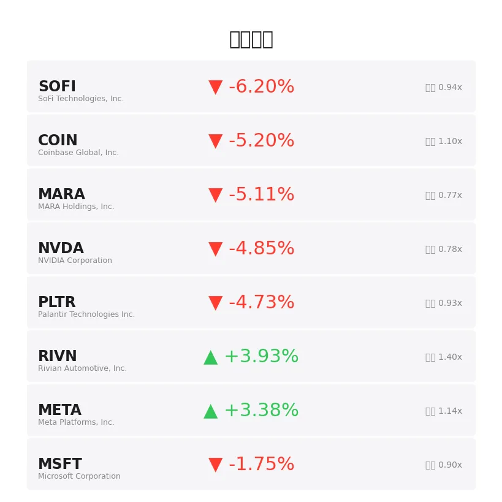
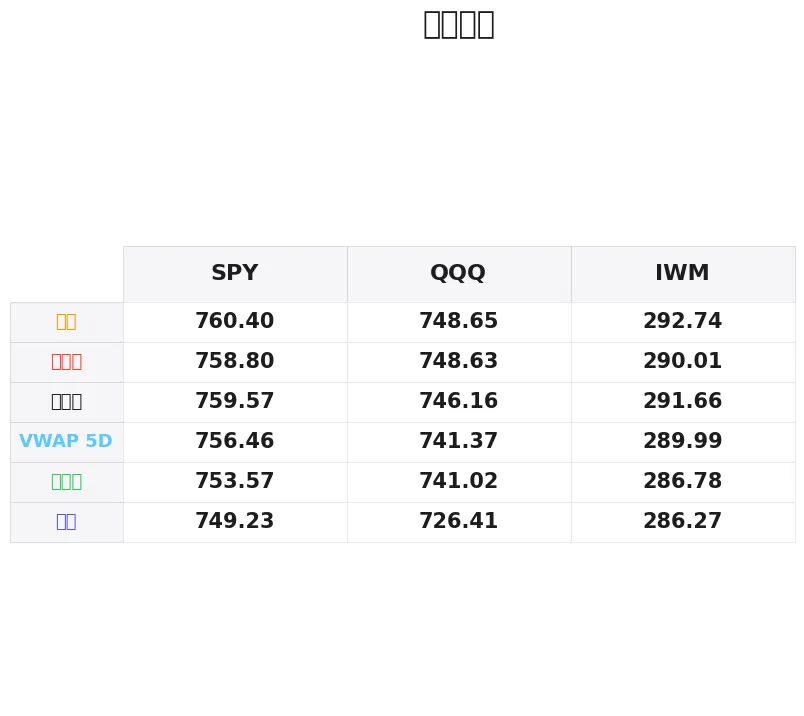

# 盘前分析报告 — 2026-06-04
*生成时间: 12:35:17 UTC*

---
## 数据速览

---
## 一、宏观环境

> [!info]- 详细数据：指数期货 & VIX
> ### 1.1 指数期货 & VIX
> | 品种 | 现价 | 涨跌幅 | 前收 | 日高 | 日低 |
> |------|------|--------|------|------|------|
> | ES=F | 7541.5 | -0.40% | 7571.75 | 7557.75 | 7524.5 |
> | NQ=F | 30238.25 | -1.29% | 30633.25 | 30544.5 | 30165.5 |
> | YM=F | 51249.0 | +0.88% | 50803.0 | 51264.0 | 50756.0 |
> | GC=F | 4525.2 | +1.31% | 4466.9 | 4542.4 | 4450.1 |
> | ^VIX | 16.59 | +3.30% | 16.06 | 16.8 | 16.28 |

> [!info]- 详细数据：隔夜走势
> ### 1.2 隔夜走势（Globex）
> | 品种 | 隔夜高 | 隔夜低 | 区间 | 亚洲高 | 亚洲低 | 欧洲高 | 欧洲低 |
> |------|--------|--------|------|--------|--------|--------|--------|
> | ES=F | 7557.75 | 7524.5 | 33.25 | 7548.0 | 7538.5 | 7557.75 | 7524.5 |
> | NQ=F | 30544.5 | 30164.25 | 380.25 | 30508.25 | 30450.0 | 30544.5 | 30164.25 |
> | YM=F | 51271.0 | 50775.0 | 496.0 | 50821.0 | 50775.0 | 51219.0 | 50797.0 |
> | GC=F | 4542.4 | 4485.4 | 57.0 | 4511.2 | 4489.1 | 4542.4 | 4485.4 |
> | ^VIX | 16.8 | 16.28 | 0.52 | — | — | 16.8 | 16.28 |

> [!info]- 详细数据：板块强弱
> ### 1.3 板块强弱
> | ETF | 板块 | 涨跌幅 |
> |-----|------|--------|
> | XLE | Energy | +1.29% |
> | XLV | Healthcare | +0.79% |
> | XLP | Consumer Staples | +0.40% |
> | XLB | Materials | +0.21% |
> | XLRE | Real Estate | +0.05% |
> | XLI | Industrials | -0.08% |
> | XLU | Utilities | -0.43% |
> | XLY | Consumer Discretionary | -0.73% |
> | XLK | Technology | -1.00% |
> | XLF | Financials | -1.15% |
> | XLC | Communication | -1.31% |

---
## 二、消息面

- **Vanguard VOO ETF资产规模突破1万亿美元，创行业先河** — *Quartz*
  > Vanguard VOO ETF hits $1 trillion in assets, an industry first
- **今日股市：失业数据公布在即，道指上涨纳指下跌；博通、CrowdStrike暴跌** — *Investor’s Business Daily*
  > Stock Market Today: Dow Rises, Nasdaq Falls With Jobless Data Due; Broadcom, CrowdStrike Plunge (Live Coverage)
- **油服板块蓄势再次启动，但霍尔木兹海峡交易存在不可忽视的隐患** — *24/7 Wall St.*
  > Oil Services Are Setting Up to Do It Again, But There’s a Catch the Strait of Hormuz Trade Can’t Ignore
- **VOO成为首只突破1万亿美元的ETF：原因在此** — *Zacks*
  > VOO Becomes First ETF to Reach $1 Trillion: Here’s Why
- **SpaceX IPO：哪些ETF将持有SPCX——以及时间节点** — *etf.com*
  > SpaceX IPO: Every ETF That Will Hold SPCX — and When
- **10万亿美元豪赌：为何内部人士认为SpaceX十年内可比肩苹果** — *24/7 Wall St.*
  > The $10 Trillion Bet: Why Insiders Think SpaceX Could Rival Apple by Decade’s End
- **市场近期大涨后，QQQ还值得买入吗？** — *Motley Fool*
  > Is QQQ Still Worth Buying After the Market’s Recent Surge?
- **股市仍在历史高位附近交易，投资者正忽视最大风险** — *Motley Fool*
  > The Stock Market Is Still Trading Near Record Highs. Here’s the Biggest Risk Investors Are Overlooking.
- **市场走向扩散可能对成长股构成威胁** — *Yahoo Finance Video*
  > Why a broader market could mean trouble for growth stocks
- **2026年6月3日股市新闻** — *Zacks*
  > Stock Market News for Jun 3, 2026
- **2026年6月2日股市新闻** — *Zacks*
  > Stock Market News for Jun 2, 2026
- **2026年6月1日股市新闻** — *Zacks*
  > Stock Market News for Jun 1, 2026
- **VIX为何如此之低？** — *Barchart*
  > Why is the VIX So Low?
- **比特币暴跌重燃"数字黄金"之争——分析师这样说** — *Stocktwits*
  > Bitcoin’s Rout Reignites The ‘Digital Gold’ Debate – Here’s What Analysts Are Saying
- **加拿大数据显示年初走软，但丰业银行称基本面动能正在企稳** — *MT Newswires*
  > Data in Canada Signals Early-Year Softness, But Underlying Momentum Is Stabilizing, Says Scotiabank
- **Solstice Gold在安大略省发现高品位金矿及多金属矿床** — *Mining Technology*
  > Solstice Gold finds high-grade gold and polymetallic deposits in Ontario
- **今日金价（2026年6月4日周四）：尽管和平进程无进展，今晨金价小幅上扬** — *Yahoo Personal Finance*
  > Gold prices today, Thursday, June 4, 2026: Some upward movement this morning, despite no progress on peace
- **近期股价走弱后Goldcom (GOLD)估值评估** — *Simply Wall St.*
  > Assessing Goldcom (GOLD) Valuation After Recent Share Price Weakness
- **今日股市：美债收益率攀升，道指、标普500、纳指集体下挫** — *Yahoo Finance*
  > Stock market today: Dow, S&P 500, Nasdaq drop amid rising bond yields
- **伊朗战争紧张情绪下FTSE 100及美股跳水，油价剧烈波动** — *Yahoo Finance UK*
  > FTSE 100 and US stocks dive and oil swings amid Iran war jitters

---
## 五、AI 技术分析 & 操盘建议

### 第一部分：隔夜市场回顾

**亚洲时段（约 18:00–02:00 ET）**

亚盘整体交投清淡，波动受限。ES在7538.5–7548.0仅10点窄幅区间内横盘，NQ在30450–30508区间震荡，显示亚洲资金观望情绪浓厚。YM最为疲软，触及隔夜低点50775后企稳于50821附近。GC黄金亚盘在4489–4511区间温和上行，反映亚洲时段避险情绪初步升温。

**关键信号：** 亚盘NQ与ES偏离度较小，尚未出现明显的科技股抛压分化。

**欧洲时段（约 02:00–08:00 ET）**

欧盘成为今日波动的主战场。伊朗/霍尔木兹海峡地缘紧张情绪升级，叠加英国FTSE 100跳水，触发全球风险偏好急剧转变：

- **ES** 先涨至隔夜高点7557.75后快速回落至隔夜低点7524.5，欧盘区间高达33点，形成典型的"冲高回落"结构
- **NQ** 遭遇最猛烈抛售，从30544.5重挫至30164.25，欧盘区间380点，显示科技股成为减仓首选
- **YM** 表现截然不同，从欧盘低点50797反弹至51219，道指权重股获得防御性资金流入
- **GC** 黄金欧盘爆发，从4485.4飙升至隔夜高点4542.4，避险情绪全面释放

**对美盘的启示：**

1. **NQ/ES 分化加剧** — NQ跌幅（-1.29%）是ES（-0.40%）的3倍以上，这种科技vs价值的分化在美盘开盘初期大概率延续
2. **YM逆势走强** — 道指+0.88%与纳指-1.29%形成罕见的200bp+分化，说明资金正从成长/科技向价值/工业轮换
3. **VIX温和上升但不恐慌** — VIX仅从16.06升至16.59（+3.30%），尚未触发系统性恐慌阈值（20+），说明这是有序的板块轮换而非恐慌性清仓
4. **地缘风险定价中** — 油价波动+黄金暴涨+FTSE跳水三重共振，伊朗相关风险已部分计入价格，但若美盘出现升级消息，下行风险仍存

### 第二部分：期货品种分析

---

#### ES（E-mini S&P 500）— 现价 7541.5

**多时间框架分析：**

- **日线：** 前收7571.75，盘前缺口下跌约-30点（-0.40%）。价格跌破前日低点7553.57区域，短期偏空。但YM逆势新高暗示SPX成分中价值端支撑尚在，空头不宜过度追击。
- **4H：** 欧盘"冲高7557回落7524"形成短期下降结构，当前7541处于区间中部。关键看美盘开盘能否回收7548（亚盘高点）还是跌穿7524（隔夜低点）。
- **1H/15min：** 欧盘后半段从7524.5低点反弹至7541.5，形成小级别V形反弹。短线多头有试探7548–7558的意愿，但需放量确认。

**关键价位：**

| 类型 | 价位 | 说明 |
|------|------|------|
| R3 | 7572 | 前收盘/缺口上沿 |
| R2 | 7558 | 隔夜高/欧盘高 |
| R1 | 7548 | 亚盘高点 |
| **现价** | **7541.5** | |
| S1 | 7524.5 | 隔夜低/欧盘低 |
| S2 | 7510 | 心理整数关口 |
| S3 | 7495 | 延伸目标（若break S1） |

**方向偏见：** 震荡偏空 | 置信度：65%

**交易计划A（首选 — 反弹做空）：**
- 入场区间：7548–7558（回测隔夜高点/亚盘高点区域）
- 触发条件：该区域出现明显order flow拒绝（delta翻负、大单吃货、absorption）
- 止损：7565（高于欧盘高5点）
- T1：7530（+18~28点） | T2：7510（+38~48点）
- 失效条件：价格站稳7560以上且放量突破，说明缺口回补动能强于预期

**交易计划B（备选 — 破位追空）：**
- 入场条件：跌破7524且放量（delta持续负值）
- 入场：7520–7524
- 止损：7535
- T1：7510 | T2：7495
- 失效条件：假突破后快速收回7530以上

---

#### NQ（E-mini Nasdaq 100）— 现价 30238.25

**多时间框架分析：**

- **日线：** 前收30633，盘前重挫-395点（-1.29%），这是近期最大幅度的盘前缺口之一。NVDA -4.85%、PLTR -4.73%拖累明显。板块数据中XLK -1.00%、XLC -1.31%确认科技全面承压。
- **4H：** 从30544到30164的欧盘抛售极为猛烈（380点区间），当前30238在低位区间偏上方。这种级别的卖压通常意味着美盘开盘会有二次测试低点的动作。
- **1H/15min：** 从30164.25反弹约74点至30238，反弹力度仅为跌幅的20%，极为疲软。短线看不到有力买盘介入的迹象。

**关键价位：**

| 类型 | 价位 | 说明 |
|------|------|------|
| R3 | 30633 | 前收盘/缺口上沿 |
| R2 | 30544 | 隔夜高/欧盘高 |
| R1 | 30450–30508 | 亚盘区间 |
| **现价** | **30238** | |
| S1 | 30165 | 隔夜低/欧盘低 |
| S2 | 30000 | 心理整数大关 |
| S3 | 29850 | 延伸目标 |

**方向偏见：** 明确偏空 | 置信度：75%

**交易计划A（首选 — 反弹做空）：**
- 入场区间：30350–30450（回测亚盘低点区域/VWAP附近）
- 触发条件：反弹至该区域后出现卖压加速（cumulative delta再次转负、大空单挂出）
- 止损：30520（高于亚盘高点）
- T1：30165（+100~285点） | T2：30000（+350~450点）
- 失效条件：放量突破30508且NQ/ES比值企稳

**交易计划B（备选 — 破位追空）：**
- 入场条件：跌破30165且伴随放量
- 入场：30140–30165
- 止损：30250
- T1：30000 | T2：29850
- 失效条件：快速V形反转回30200以上，说明30165形成短期双底

**风险提示：** NQ今日波动极大，单笔仓位应缩减至平时的60–70%。380点的隔夜区间意味着美盘首小时可能出现200+点的剧烈波动。

---

#### GC（黄金期货）— 现价 4525.2

**多时间框架分析：**

- **日线：** 前收4466.9，盘前大涨+58点（+1.31%）。地缘避险+美债收益率上升的矛盾环境中，黄金选择跟随避险逻辑走强，非常强势。
- **4H：** 从亚盘4489一路上攻至欧盘高点4542.4，几乎无回调。这种"阶梯式上涨"结构非常健康，多头控盘明显。
- **1H/15min：** 当前4525距高点4542仅17点，处于日内高位区间。从4542小幅回落至4525可能是短线获利回吐，关键看美盘能否突破4542创新高。

**关键价位：**

| 类型 | 价位 | 说明 |
|------|------|------|
| R2 | 4560 | 延伸目标（若破4542） |
| R1 | 4542.4 | 隔夜高/欧盘高 |
| **现价** | **4525.2** | |
| S1 | 4511 | 亚盘高点（回调支撑） |
| S2 | 4489 | 亚盘低点 |
| S3 | 4467 | 前收盘 |

**方向偏见：** 明确偏多 | 置信度：75%

**交易计划A（首选 — 回调做多）：**
- 入场区间：4505–4515（回测亚盘高点区域）
- 触发条件：回落至该区域后出现买盘承接（delta翻正、bid stack加厚）
- 止损：4488（低于亚盘低点）
- T1：4542（+27~37点） | T2：4560（+45~55点）
- 失效条件：跌破4489且放量，说明避险情绪消退

**交易计划B（备选 — 突破追多）：**
- 入场条件：放量突破4542.4
- 入场：4543–4548
- 止损：4530
- T1：4560 | T2：4580
- 失效条件：假突破后快速回落至4535以下

### 第三部分：ETF品种分析

---

#### SPY — 盘前 751.63

**关键价位：**

| 类型 | 价位 | 说明 |
|------|------|------|
| R3 | 760.40 | 周高/近期顶部 |
| R2 | 759.57 | 前收盘 |
| R1 | 758.80 | 前日高点 |
| 5D VWAP | 756.46 | 五日成交量加权均价 |
| **盘前** | **751.63** | |
| S1 | 753.57 | 前日低点 |
| S2 | 749.23 | 周低 |
| S3 | 745.00 | 延伸支撑 |

**分析：** SPY盘前751.63已跌穿前日低点753.57，形成缺口下跌结构。前收759.57与盘前相差约-8点（-1.04%），缺口较大。5D VWAP 756.46在上方形成压力。

注意SPY跌幅（-1.04%）大于ES（-0.40%），这部分反映了盘前ETF流动性溢价和期现基差变化。SPY的实际美盘开盘价需结合9:30后的order flow判断。

**交易计划（偏空）：**
- **反弹做空区间：** 753.5–756.5（回测前日低点/VWAP区域）
- 止损：758.0（前日高点下方）
- T1：750.0 | T2：749.2（周低）
- **支撑做多区间（逆势）：** 749.0–749.5（周低附近）
- 止损：747.5
- T1：752.0 | T2：754.0
- **失效条件：** 站稳757以上说明缺口回补强势，转为观望

---

#### QQQ — 盘前 735.30

**关键价位：**

| 类型 | 价位 | 说明 |
|------|------|------|
| R3 | 748.65 | 周高 |
| R2 | 746.16 | 前收盘 |
| R1 | 741.02–741.37 | 前日低/5D VWAP |
| **盘前** | **735.30** | |
| S1 | 730.00 | 心理关口 |
| S2 | 726.41 | 周低 |
| S3 | 720.00 | 延伸目标 |

**分析：** QQQ盘前735.30大幅跌穿前日低点741.02，距前收746.16下跌-10.86点（-1.45%），与NQ -1.29%跌幅一致。当前价格距周低726.41仅约9点，若美盘延续抛售，周低将是第一个重要测试位。

QQQ今日是做空主战场。NVDA -4.85%、PLTR -4.73%、COIN -5.20%等科技/成长龙头集体暴跌，板块数据XLK -1.00%、XLC -1.31%全面印证。唯一亮点META +3.38%（可能受益于广告业务韧性），但独木难支。

**交易计划（偏空）：**
- **反弹做空区间：** 738–741（回测前日低点/VWAP区域）
- 触发条件：反弹乏力、NVDA等权重股未见企稳
- 止损：743.0
- T1：732.0 | T2：726.4（周低）
- **破位追空：** 跌破730心理关口
- 入场：728–730
- 止损：733
- T1：726.4 | T2：720.0
- **失效条件：** 放量回收741以上且NVDA盘前跌幅收窄至-2%以内

### 第四部分：今日市场总览

---

#### 整体市场情绪：风险偏好显著降温，板块轮换加速

今日盘前呈现典型的 **"risk-off rotation"** 格局：

- **科技/成长全面承压：** NQ -1.29%领跌，XLK -1.00%、XLC -1.31%垫底，NVDA/PLTR/COIN等高beta标的跌幅5%+
- **价值/防御获青睐：** YM +0.88%逆势走强，XLE +1.29%（地缘溢价）、XLV +0.79%、XLP +0.40%领涨
- **避险资产走强：** GC +1.31%，黄金受伊朗地缘+避险双重驱动突破近期高位
- **加密资产遭重创：** SOFI -6.20%、COIN -5.20%、MARA -5.11%，比特币抛售溢出至相关股票

#### VIX 分析

VIX 16.59（+3.30%），隔夜区间16.28–16.80。虽然方向上升，但绝对水平仍处于"低波动"区间（<20）。这意味着：

- 市场定价的是 **有序轮换** 而非 **恐慌清仓**
- 期权市场尚未大幅加价保护，put skew可能温和上升但不会爆发
- **关注阈值：** 若VIX美盘突破18，说明卖压从板块轮换升级为系统性减仓，需立即收紧止损

#### 需要回避的时间窗口

| 时间（ET） | 事件 | 影响 |
|------------|------|------|
| 08:30 | 初请失业金数据 | 高影响 — 今日消息面核心数据。若数据差于预期（>230K），可能加剧抛售；若好于预期，可能触发空头回补 |
| 09:30–10:00 | 开盘首30分钟 | 极高波动 — NQ 380点隔夜区间意味着开盘前10分钟将极度混乱，等待initial balance形成 |
| 10:00 | 工厂订单数据 | 中等影响 |
| 15:00–16:00 | MOC（收盘集合竞价）流入 | 今日若出现大额买入MOC，说明机构逢低吸纳 |

#### 板块轮换解读

今日最清晰的交易主题是 **科技→能源/医疗/必选消费** 的轮换：

- **做空端：** XLK、XLC及其成分股（尤其半导体、社交媒体）
- **做多端：** XLE（伊朗地缘+原油波动利好）、XLV（防御属性+估值合理）
- **META是异常值：** +3.38%在科技全面下跌中逆势走强，可能与广告收入韧性有关，但不建议追多——在板块整体弱势中，个股逆势难持久

#### 风控提醒

1. **缩减仓位：** 今日隔夜波动已远超常态（NQ 380点 vs 正常150–200点），美盘波动大概率延续。单笔仓位建议为平时的60–70%
2. **不追缺口：** ES/NQ/SPY/QQQ均已形成较大盘前缺口，开盘直接追空风险极高。等待回测后的二次入场机会
3. **08:30数据是分水岭：** 失业金数据将决定今日是"缺口下跌→继续探底"还是"缺口下跌→空头回补反弹"，数据出炉前不宜重仓

---

> **🎯 核心交易论点：地缘风险+债券收益率攀升触发科技/成长板块有序减仓，NQ做空是今日最高置信度方向（75%），回调至30350–30450区域反弹做空为最优策略。GC多头作为避险对冲。等待08:30数据确认方向后再加仓。**

---
## 三、盘前异动

> [!info]- 详细数据：盘前异动
> | 代码 | 名称 | 现价 | 缺口 | 量比 |
> |------|------|------|------|------|
> | SOFI | SoFi Technologies, Inc. | 16.64 | -6.20% | 0.94x |
> | COIN | Coinbase Global, Inc. | 164.94 | -5.20% | 1.1x |
> | MARA | MARA Holdings, Inc. | 13.55 | -5.11% | 0.77x |
> | NVDA | NVIDIA Corporation | 212.01 | -4.85% | 0.78x |
> | PLTR | Palantir Technologies Inc. | 144.97 | -4.73% | 0.93x |
> | RIVN | Rivian Automotive, Inc. | 17.97 | +3.93% | 1.4x |
> | META | Meta Platforms, Inc. | 617.84 | +3.38% | 1.14x |
> | MSFT | Microsoft Corporation | 433.6 | -1.75% | 0.9x |
> | GS | Goldman Sachs Group, Inc. (The) | 1048.49 | -1.51% | 0.78x |
> | GOOGL | Alphabet Inc. | 359.0 | -0.79% | 1.59x |

---
## 四、关键价位

> [!info]- 详细数据：SPY 关键价位
> ### SPY
> | 价位类型 | 价格 |
> |----------|------|
> | Prior Day High | 758.8 |
> | Prior Day Low | 753.5701 |
> | Prior Day Close | 759.57 |
> | Premarket Price | 751.6285 |
> | Approx Vwap 5D | 756.46 |
> | Weekly High | 760.4 |
> | Weekly Low | 749.23 |

> [!info]- 详细数据：QQQ 关键价位
> ### QQQ
> | 价位类型 | 价格 |
> |----------|------|
> | Prior Day High | 748.63 |
> | Prior Day Low | 741.02 |
> | Prior Day Close | 746.16 |
> | Premarket Price | 735.2987 |
> | Approx Vwap 5D | 741.37 |
> | Weekly High | 748.65 |
> | Weekly Low | 726.41 |

> [!info]- 详细数据：IWM 关键价位
> ### IWM
> | 价位类型 | 价格 |
> |----------|------|
> | Prior Day High | 290.01 |
> | Prior Day Low | 286.78 |
> | Prior Day Close | 291.66 |
> | Premarket Price | 288.46 |
> | Approx Vwap 5D | 289.99 |
> | Weekly High | 292.74 |
> | Weekly Low | 286.27 |
