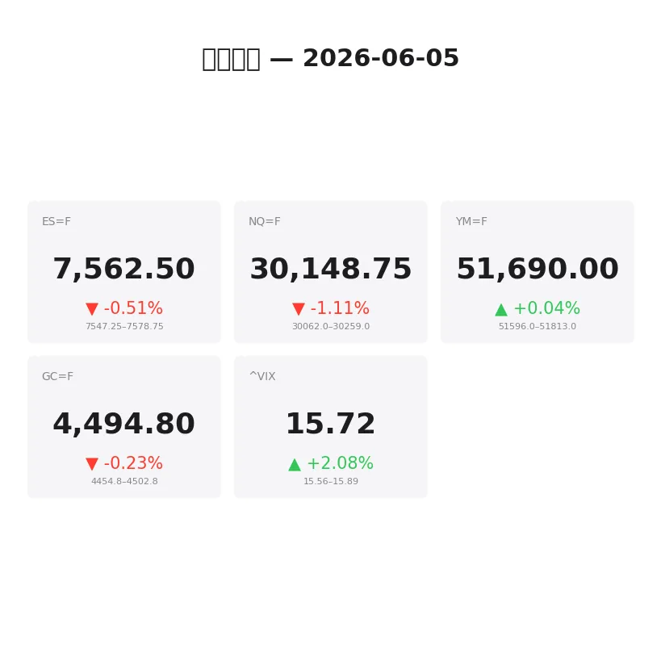
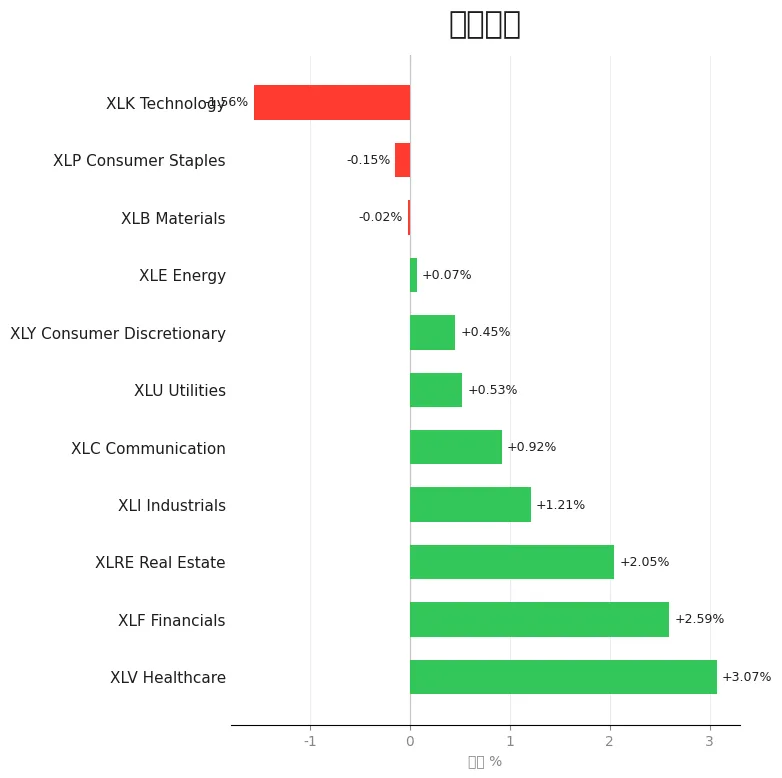
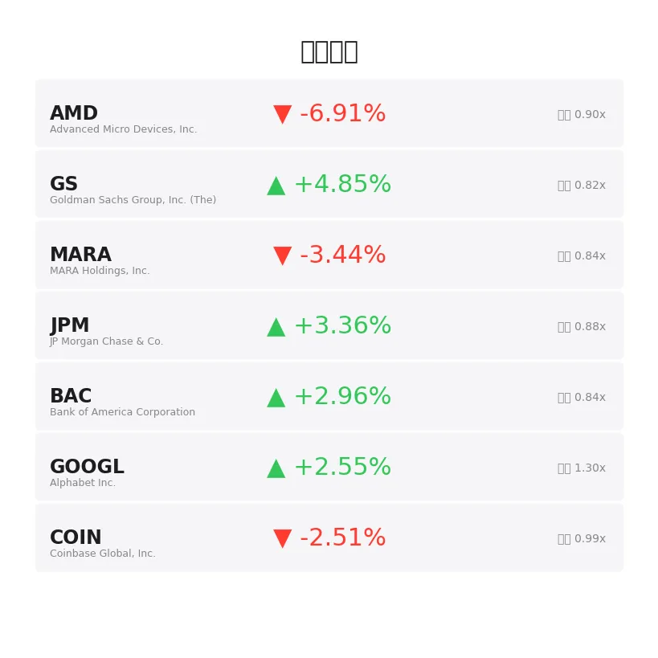
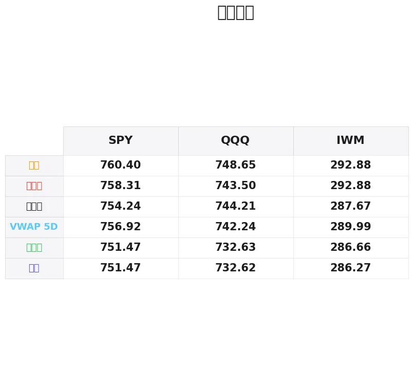

# 盘前分析报告 — 2026-06-05
*生成时间: 12:35:04 UTC*

---
## 数据速览

---
## 一、宏观环境

> [!info]- 详细数据：指数期货 & VIX
> ### 1.1 指数期货 & VIX
> | 品种 | 现价 | 涨跌幅 | 前收 | 日高 | 日低 |
> |------|------|--------|------|------|------|
> | ES=F | 7562.5 | -0.51% | 7601.0 | 7591.0 | 7546.75 |
> | NQ=F | 30148.75 | -1.11% | 30488.25 | 30422.0 | 30052.5 |
> | YM=F | 51690.0 | +0.04% | 51671.0 | 51813.0 | 51585.0 |
> | GC=F | 4494.8 | -0.23% | 4505.0 | 4508.7 | 4455.3 |
> | ^VIX | 15.72 | +2.08% | 16.06 | 15.89 | 15.56 |

> [!info]- 详细数据：隔夜走势
> ### 1.2 隔夜走势（Globex）
> | 品种 | 隔夜高 | 隔夜低 | 区间 | 亚洲高 | 亚洲低 | 欧洲高 | 欧洲低 |
> |------|--------|--------|------|--------|--------|--------|--------|
> | ES=F | 7578.75 | 7547.25 | 31.5 | 7565.5 | 7556.25 | 7578.75 | 7547.25 |
> | NQ=F | 30259.0 | 30062.0 | 197.0 | 30243.0 | 30163.0 | 30259.0 | 30062.0 |
> | YM=F | 51813.0 | 51596.0 | 217.0 | 51655.0 | 51596.0 | 51813.0 | 51632.0 |
> | GC=F | 4502.8 | 4454.8 | 48.0 | 4476.1 | 4463.8 | 4502.2 | 4454.8 |
> | ^VIX | 15.89 | 15.56 | 0.33 | — | — | 15.89 | 15.56 |

> [!info]- 详细数据：板块强弱
> ### 1.3 板块强弱
> | ETF | 板块 | 涨跌幅 |
> |-----|------|--------|
> | XLV | Healthcare | +3.07% |
> | XLF | Financials | +2.59% |
> | XLRE | Real Estate | +2.05% |
> | XLI | Industrials | +1.21% |
> | XLC | Communication | +0.92% |
> | XLU | Utilities | +0.53% |
> | XLY | Consumer Discretionary | +0.45% |
> | XLE | Energy | +0.07% |
> | XLB | Materials | -0.02% |
> | XLP | Consumer Staples | -0.15% |
> | XLK | Technology | -1.56% |

---
## 二、消息面

- **今日股市：非农报告前道指上涨；Lululemon因财报暴跌（实时报道）** — *Investor’s Business Daily*
  > Stock Market Today: Dow Rises Ahead Of Jobs Report; Lululemon Plunges On Earnings (Live Coverage)
- **Cem Karsan警告：标普500在14年间实际贬值40%——这可能再次发生** — *24/7 Wall St.*
  > Cem Karsan Warns The S&P 500 Lost 40% in Real Terms Over 14 Years – And It Could Happen Again
- **5只股票在5个月内将1万美元变成22万美元** — *Investor’s Business Daily*
  > 5 Stocks Turn $10,000 Into $220,749 In 5 Months
- **股市正在闪现与历次崩盘前相同的两个警告信号** — *24/7 Wall St.*
  > The Stock Market Is Flashing the Same Two Warning Signals It Did Before Past Crashes
- **AI乐观情绪推动股票基金五月大涨——接下来会怎样？** — *Investor’s Business Daily*
  > Stock Funds Surge In May On AI Optimism — What’s Next?
- **SpaceX上市对指数基金投资者意味着什么** — *Barrons.com*
  > What SpaceX’s IPO Means for Index Fund Investors
- **存储芯片股下跌：博通业绩预期打压AI情绪，散户逆势买入** — *Stocktwits*
  > MU, SNDK, WDC: Memory Stocks Dip As Broadcom’s Forecast Dampens AI Sentiment, Retail Turns Buyer
- **2026年6月4日股市新闻** — *Zacks*
  > Stock Market News for Jun 4, 2026
- **市场轮动为何可能对成长股构成威胁** — *Yahoo Finance Video*
  > Why a broader market could mean trouble for growth stocks
- **2026年6月3日股市新闻** — *Zacks*
  > Stock Market News for Jun 3, 2026
- **2026年6月2日股市新闻** — *Zacks*
  > Stock Market News for Jun 2, 2026
- **2026年6月1日股市新闻** — *Zacks*
  > Stock Market News for Jun 1, 2026
- **中东局势不确定性施压，TSX期货下滑；非农数据成焦点** — *Reuters*
  > TSX futures slip as Middle East uncertainty weighs; payrolls in focus
- **散户新热潮：把钱存进货币市场基金躺平** — *Bloomberg*
  > Chilling in Money-Market Funds is the Hot Retail Strategy Now
- **中东紧张局势提振美元需求，金价下滑面临周线下跌** — *InvestorsHub*
  > Gold Slips as Middle East Tensions Lift Dollar Demand, Weekly Decline Looms
- **加息担忧叠加中东不确定性持续施压金价** — *Barrons.com*
  > Gold Pressured by Rate-Hike Fears as Middle East Uncertainty Persists
- **伊朗呼吁黎巴嫩停火并获回应：市场如何反应** — *BeInCrypto*
  > Iran Called for Lebanon Ceasefire and Got It: How Markets Have Moved
- **今日股市：国债收益率上升，道指、标普500、纳指齐跌** — *Yahoo Finance*
  > Stock market today: Dow, S&P 500, Nasdaq drop amid rising bond yields
- **伊朗战争恐慌下富时100和美股跳水，油价剧烈波动** — *Yahoo Finance UK*
  > FTSE 100 and US stocks dive and oil swings amid Iran war jitters
- **美联储会议与伊朗冲突在即，富时100与美股反弹** — *Yahoo Finance UK*
  > FTSE 100 and US stocks rally with Fed meeting and Iran conflict in view

---
## 三、盘前异动

> [!info]- 详细数据：盘前异动
> | 代码 | 名称 | 现价 | 缺口 | 量比 |
> |------|------|------|------|------|
> | AMD | Advanced Micro Devices, Inc. | 505.01 | -6.91% | 0.9x |
> | GS | Goldman Sachs Group, Inc. (The) | 1091.5 | +4.85% | 0.82x |
> | MARA | MARA Holdings, Inc. | 13.48 | -3.44% | 0.84x |
> | JPM | JP Morgan Chase & Co. | 310.95 | +3.36% | 0.88x |
> | BAC | Bank of America Corporation | 53.95 | +2.96% | 0.84x |
> | GOOGL | Alphabet Inc. | 368.15 | +2.55% | 1.3x |
> | COIN | Coinbase Global, Inc. | 159.13 | -2.51% | 0.99x |

---
## 四、关键价位

> [!info]- 详细数据：SPY 关键价位
> ### SPY
> | 价位类型 | 价格 |
> |----------|------|
> | Prior Day High | 758.31 |
> | Prior Day Low | 751.47 |
> | Prior Day Close | 754.24 |
> | Premarket Price | 752.56 |
> | Approx Vwap 5D | 756.92 |
> | Weekly High | 760.4 |
> | Weekly Low | 751.47 |

> [!info]- 详细数据：QQQ 关键价位
> ### QQQ
> | 价位类型 | 价格 |
> |----------|------|
> | Prior Day High | 743.4988 |
> | Prior Day Low | 732.63 |
> | Prior Day Close | 744.21 |
> | Premarket Price | 730.6208 |
> | Approx Vwap 5D | 742.24 |
> | Weekly High | 748.65 |
> | Weekly Low | 732.62 |

> [!info]- 详细数据：IWM 关键价位
> ### IWM
> | 价位类型 | 价格 |
> |----------|------|
> | Prior Day High | 292.875 |
> | Prior Day Low | 286.66 |
> | Prior Day Close | 287.67 |
> | Premarket Price | 289.31 |
> | Approx Vwap 5D | 289.99 |
> | Weekly High | 292.88 |
> | Weekly Low | 286.27 |

---
## 五、AI 技术分析 & 操盘建议

## 第一部分：隔夜市场回顾

### 亚洲时段（18:00–02:00 ET）

亚洲时段整体交投清淡，走势偏弱。ES在7556.25–7565.5的窄幅区间内运行，仅9.25点的波动显示亚洲盘缺乏方向性。NQ略强于ES，在30163–30243区间运行，但同样缺乏突破动能。YM在亚洲盘表现最弱，触及隔夜低点51596后小幅回升。GC（黄金）在亚洲盘维持4463.8–4476.1区间震荡，受中东地缘紧张局势与美元走强的对冲影响，走势纠结。

**解读：** 亚洲盘的窄幅整理表明市场在等待今日美国非农就业数据，多空双方均不愿提前下注。

### 欧洲时段（02:00–09:30 ET）

欧洲开盘后波动明显放大。ES先冲高至隔夜高点7578.75后迅速回落，最低探至7547.25（隔夜低点），形成31.5点的完整隔夜区间。NQ波动更为剧烈——从30259高点急速下探至30062，197点的区间揭示科技股遭遇显著抛压。FTSE 100与欧洲主要指数同步承压，伊朗/中东局势升级是主要催化剂。

GC在欧洲盘冲高至4502.2后大幅回落至4454.8，48点区间。黄金的"冲高回落"形态值得警惕——地缘避险买盘被美元走强和加息预期对冲。

**解读：** 欧洲盘的放量下杀确认了市场的risk-off情绪。NQ/ES的隔夜高点在欧洲盘被精确测试后遭拒，形成明确的空头控制格局。VIX小幅上升至15.72（+2.08%），波动率虽不高但方向性偏空。

### 对美盘的启示

1. **非农日效应：** 今日是月度非农报告日，通常8:30 ET数据公布前市场维持窄幅震荡，数据公布后出现脉冲式波动，真正趋势需等到9:45–10:00后才能确认
2. **板块极端分化：** XLK(-1.56%) vs XLV(+3.07%)的5%级别分化异常显著，资金从科技向医疗/金融/地产的防御性轮动信号明确
3. **AMD-6.91%的缺口下跌** 叠加存储芯片股集体走弱（博通预期下调），科技股短期承压格局确立
4. **银行股集体大涨**（GS +4.85%, JPM +3.36%, BAC +2.96%）与科技股走弱形成鲜明对比，可能反映市场对利率维持高位的定价

## 第二部分：期货品种分析

### ES（E-mini S&P 500）— 现价 7562.5

**多时间框架分析：**
- **日线：** 前日收盘7601.0，今日缺口下开约38.5点。日线在连续新高后出现显著阴线，短期顶部信号。5日高点区域在7600+附近形成压力。
- **4H：** 从7591高点向下破位，当前位于隔夜区间中枢偏下方运行。7578.75（隔夜高）是短期关键阻力。
- **1H/15min：** 欧洲盘形成下降通道，7547.25（隔夜低点）经过两次测试后暂时支撑，但每次反弹力度递减。

**关键价位：**
| 类型 | 价位 | 说明 |
|------|------|------|
| R3 | 7601.0 | 前日收盘/缺口上沿 |
| R2 | 7591.0 | 日内高点 |
| R1 | 7578.75 | 隔夜高点/欧洲高点 |
| 中枢 | 7562.5 | 当前价 |
| S1 | 7547.25 | 隔夜低点（双底支撑） |
| S2 | 7546.75 | 日内低点 |
| S3 | 7520–7530 | 下方真空区/心理关口 |

**方向偏空 | 置信度：70%**

**交易计划：**
- **首选策略（做空）：** 反弹至7575–7580区域（隔夜高点附近），观察是否出现放量拒绝或delta翻转做空
  - 止损：7592（日高上方）
  - T1：7547（隔夜低）| T2：7530（扩展目标）
  - 失效条件：站稳7591上方且有持续买单流入
- **备选策略（做多）：** 7547–7550区域出现吸收/aggressive buying做多scalp
  - 止损：7540
  - T1：7565 | T2：7578
  - 失效条件：7546.75跌破伴随放量

**非农数据风险：** 8:30数据公布后建议观望至少5–10分钟，等待初始脉冲完成后再介入。强非农可能推动ES回补缺口至7601；弱非农将加速下行至7530以下。

---

### NQ（E-mini Nasdaq 100）— 现价 30148.75

**多时间框架分析：**
- **日线：** 前收30488.25，缺口下开约340点（-1.11%），跌幅显著大于ES。AMD-6.91%和存储芯片集体走弱是直接催化剂。日线形成大阴包阳，短期看空信号强烈。
- **4H：** 从30422高点暴跌至30052.5低点，近400点的跌幅。当前试图在30100–30200区间构筑短期底部。
- **1H：** 欧洲盘的下跌动能逐步减弱，30062形成暂时底部，但反弹力度极弱。

**关键价位：**
| 类型 | 价位 | 说明 |
|------|------|------|
| R3 | 30488.25 | 前日收盘 |
| R2 | 30422.0 | 日内高点 |
| R1 | 30259.0 | 隔夜高点 |
| 中枢 | 30148.75 | 当前价 |
| S1 | 30062.0 | 隔夜低点 |
| S2 | 30052.5 | 日内低点 |
| S3 | 29900–29950 | 下方关键心理支撑 |

**方向偏空 | 置信度：75%**

**交易计划：**
- **首选策略（做空）：** 反弹至30200–30260区域观察做空机会，尤其关注NQ/ES ratio走弱确认
  - 止损：30300
  - T1：30060（隔夜低）| T2：29950（扩展目标）
  - 失效条件：放量突破30260且AMD/半导体板块企稳
- **备选策略（做多）：** 30050–30065区域出现明确吸收形态，快速scalp反弹
  - 止损：29990
  - T1：30150 | T2：30250
  - 失效条件：跌破30050无反弹

**特别关注：** NQ今日是弱势品种，ES-NQ spread扩大说明科技股被选择性抛售。除非半导体板块出现明确企稳信号，否则NQ反弹做空优于做多。

---

### GC（黄金期货）— 现价 4494.8

**多时间框架分析：**
- **日线：** 前收4505.0，小幅低开。近期在4450–4510区间震荡，未能有效突破。中东地缘风险提供底部支撑，但美元走强和加息预期压制上行空间。
- **4H：** 欧洲盘冲高4502.2后回落，形成"假突破—回落"形态。当前回到区间中部运行。
- **1H：** 从4502.8高点下跌至4454.8后V型反弹，当前在4490–4500区间整理。隔夜区间48点，波动适中。

**关键价位：**
| 类型 | 价位 | 说明 |
|------|------|------|
| R2 | 4508.7 | 日内高点 |
| R1 | 4502.2–4502.8 | 隔夜/欧洲高点 |
| 中枢 | 4494.8 | 当前价 |
| S1 | 4476.1 | 亚洲高点（回踩支撑）|
| S2 | 4463.8 | 亚洲低点 |
| S3 | 4454.8–4455.3 | 隔夜低/日低 |

**方向中性偏空 | 置信度：55%**

**交易计划：**
- **首选策略（区间交易）：** 4500–4505附近做空（隔夜高点阻力区），4460–4465附近做多（隔夜低点支撑区）
  - 做空止损：4512 | T1：4476 | T2：4460
  - 做多止损：4450 | T1：4490 | T2：4502
- **突破策略：** 站稳4510上方追多至4530；跌破4454追空至4430
  - 失效条件：假突破后快速回归区间

**特别关注：** 黄金今日将同时受到非农数据和中东局势双重驱动。强非农=利空黄金（美元走强+加息预期），弱非农=利多黄金。中东局势若进一步升级将提供脉冲式买入机会。建议非农数据公布后再介入黄金交易。

## 第三部分：ETF品种分析

### SPY — 盘前价 752.56

**关键价位：**
| 类型 | 价位 | 说明 |
|------|------|------|
| R3 | 760.40 | 周高点 |
| R2 | 758.31 | 前日高点 |
| R1 | 756.92 | 5日VWAP |
| 当前 | 752.56 | 盘前价 |
| S1 | 751.47 | 前日低点/周低点区域 |
| S2 | 748–750 | 下方支撑区 |

**分析：** SPY盘前低开约1.7点（-0.22%），幅度温和。但板块结构分化严重——XLK拖累SPY，而XLV/XLF/XLRE的防御性买盘提供对冲。SPY今日的关键战场在751.47（前日低点）：

**交易计划：**
- **看空情景：** SPY开盘后跌破751.47且无法快速收回，确认看空。做空目标748–750区域。止损753。
- **看多情景：** 开盘后守住751.47并反弹至754上方（回补缺口），可做多至756.92（5日VWAP）。止损750.50。
- **非农脉冲：** 数据公布后等待初始波动平息。强非农→SPY可能回补缺口至754+；弱非农→加速下探748。

**注意：** SPY跌幅远小于QQQ，反映防御性板块（金融、医疗）对指数的支撑。如果做空指数，QQQ是更优选择；如果做多反弹，SPY更安全。

---

### QQQ — 盘前价 730.62

**关键价位：**
| 类型 | 价位 | 说明 |
|------|------|------|
| R3 | 748.65 | 周高点 |
| R2 | 744.21 | 前日收盘 |
| R1 | 743.50 | 前日高点 |
| 5D VWAP | 742.24 | 均值回归目标 |
| 当前 | 730.62 | 盘前价 |
| S1 | 732.63 | 前日低点 |
| S2 | 732.62 | 周低点 |
| S3 | 725–728 | 下方真空区 |

**分析：** QQQ盘前暴跌13.6点（-1.83%），大幅低开于前日低点732.63下方。AMD -6.91%、存储芯片集体走弱、博通预期下调构成科技股三重利空。缺口巨大（约14点），短线回补概率存在但阻力重重。

**交易计划：**
- **首选策略（做空反弹）：** QQQ反弹至732.50–733.00区域（前日低点压力转阻力），确认弱势后做空
  - 止损：735
  - T1：728 | T2：725
  - 失效条件：放量站稳733上方且半导体ETF（SMH）企稳
- **备选策略（缺口回补多）：** 仅当非农数据大幅低于预期（市场转向降息预期），QQQ出现V型反转信号时做多
  - 入场：730–731区域吸收确认
  - 止损：727
  - T1：733（前日低）| T2：738
- **回避情景：** QQQ直线下跌无反弹，不追空；等待日内结构形成后再介入

**特别关注：** QQQ今日是最弱大盘ETF。注意AMD（505.01 -6.91%）和GOOGL（368.15 +2.55%）的分化——如果GOOGL翻绿，QQQ将加速下跌。反之，GOOGL若维持强势，QQQ在730附近可能获得支撑。

## 第四部分：今日市场总览

### 整体市场情绪：谨慎偏空 🔴

今日市场面临**三重压力叠加**：
1. **非农数据悬念：** 月度非农就业报告8:30 ET公布，是本周最重要的宏观事件。市场已进入"数据等待模式"，盘前流动性极差。
2. **科技股抛售潮：** AMD -6.91%领衔半导体板块全线走弱，博通业绩预期下调重创AI概念。NQ跌幅为ES的两倍以上，科技独木难支。
3. **中东地缘风险：** 伊朗/黎巴嫩局势持续发酵，避险情绪推升美元、打压风险资产。黄金的"冲高回落"暗示市场对地缘风险的定价已部分完成。

### VIX分析

VIX 15.72（+2.08%）——仍处于相对低位，但方向向上。隔夜区间15.56–15.89。关注16.00整数关口：
- VIX站上16.00：波动率扩张确认，日内趋势交易机会增加
- VIX回落至15.50以下：波动收敛，适合区间策略

### ⏰ 关键时间窗口

| 时间 (ET) | 事件 | 建议 |
|-----------|------|------|
| 08:30 | **非农就业报告** | ⚠️ 数据公布前5分钟平仓所有头寸，数据后等待5–10分钟再介入 |
| 09:30 | 美股开盘 | 开盘头15分钟观察缺口是否回补，不急于交易 |
| 09:45–10:00 | 开盘情绪确认 | 第一个15min K线收盘后判断方向 |
| 10:00 | ISM数据（如有） | 关注是否形成二次脉冲 |
| 11:00–12:00 | 午盘平静期 | 流动性下降，收窄止损或暂停交易 |
| 14:00–15:00 | MOC/机构调仓 | 关注日线收盘形态，周末前可能有获利了结 |

### 板块轮动信号

今日板块轮动极为清晰：

**资金流入（防御/价值）：** XLV(+3.07%) > XLF(+2.59%) > XLRE(+2.05%) > XLI(+1.21%)
**资金流出（成长/科技）：** XLK(-1.56%) < XLP(-0.15%) < XLB(-0.02%)

这是典型的**"risk-off rotation"**——机构资金从高估值科技股撤出，流入金融（受益于高利率）和医疗（防御属性）。这种轮动在非农日尤为显著，因为市场正在为利率路径重新定价。

### 📌 核心交易论点

> **今日是"非农主导+科技抛售"的双重压制格局。NQ弱势确认前，不做指数多头。8:30非农数据是分水岭——强数据加剧科技抛售（利率走高），弱数据可能触发relief rally（降息预期回升）。操作上以NQ/QQQ做空反弹为主线，ES/SPY因防御板块支撑可作为对冲多头。黄金等非农后再介入。今日是周五，注意机构获利了结和周末持仓调整带来的午后波动。**
