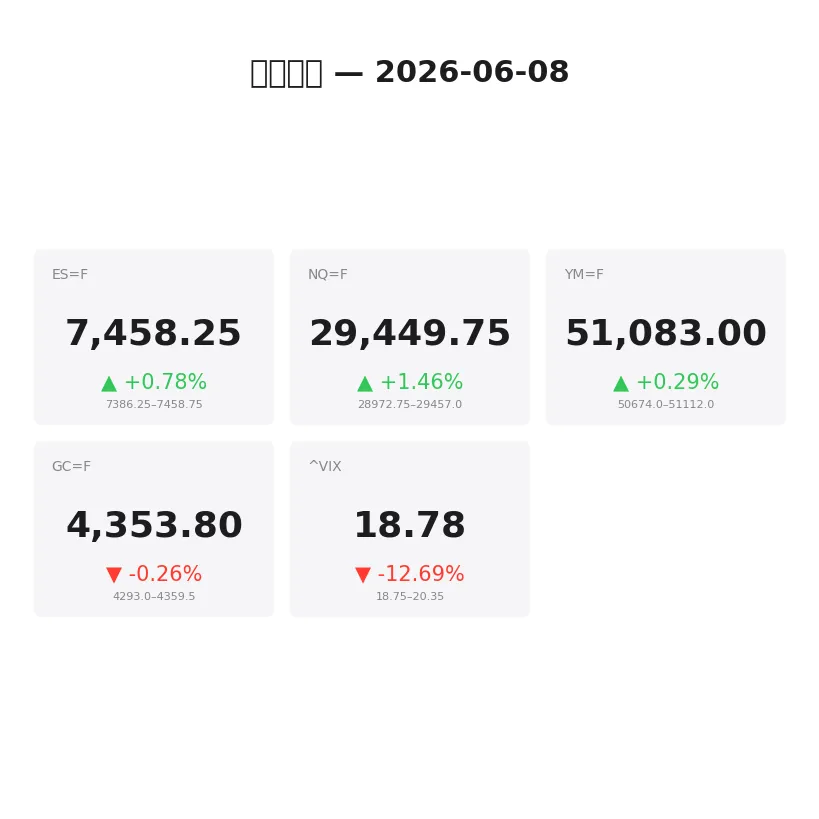
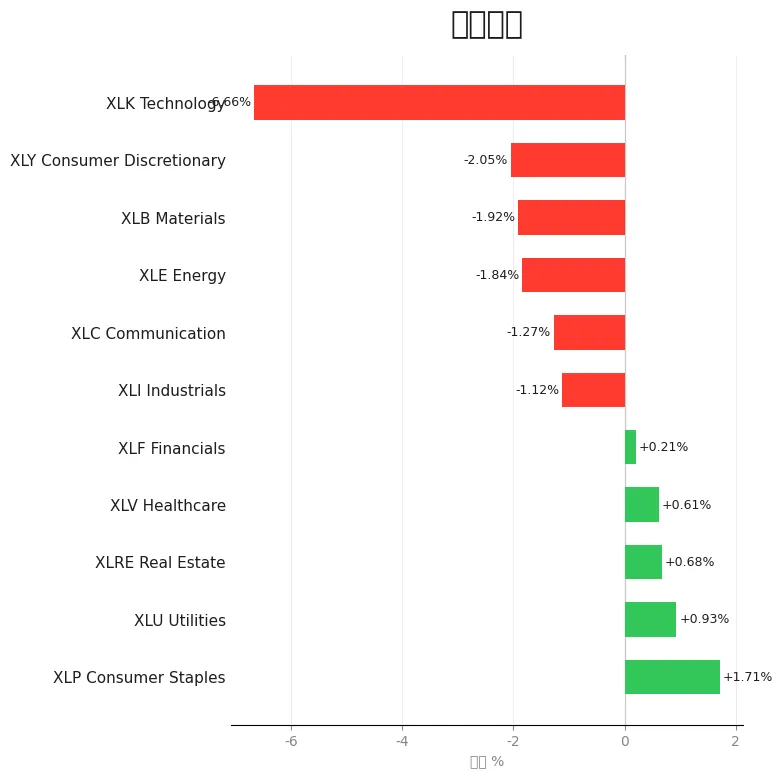
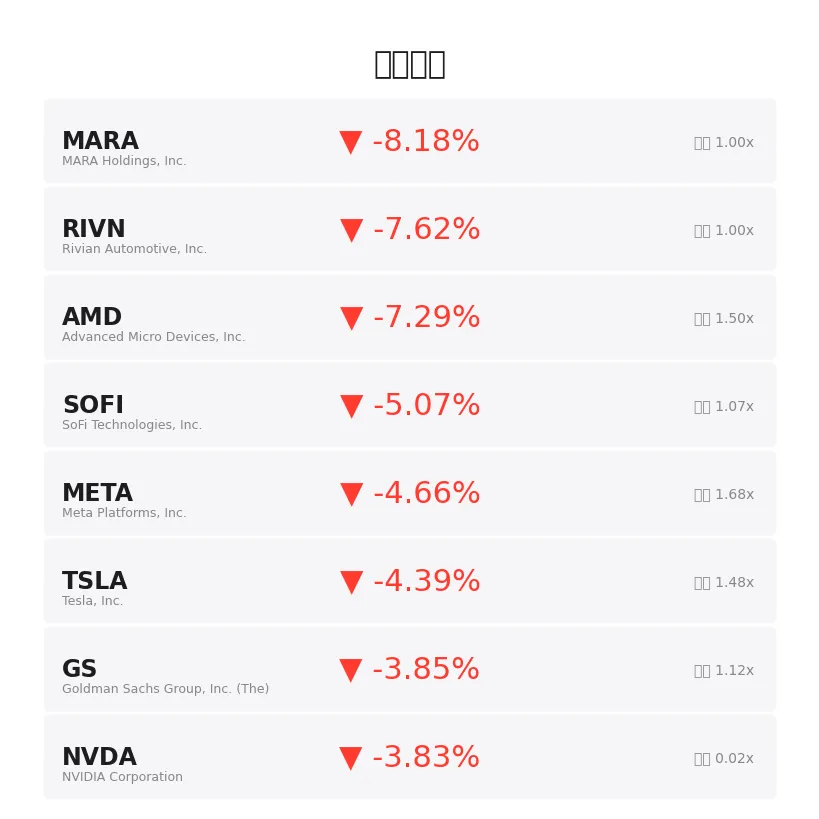
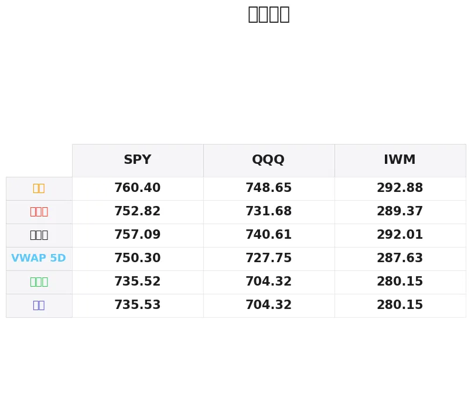

# 盘前分析报告 — 2026-06-08
*生成时间: 12:38:40 UTC*

---
## 数据速览

---
## 一、宏观环境

> [!info]- 详细数据：指数期货 & VIX
> ### 1.1 指数期货 & VIX
> | 品种 | 现价 | 涨跌幅 | 前收 | 日高 | 日低 |
> |------|------|--------|------|------|------|
> | ES=F | 7458.25 | +0.78% | 7400.5 | 7458.75 | 7355.5 |
> | NQ=F | 29449.75 | +1.46% | 29026.5 | 29455.25 | 28822.25 |
> | YM=F | 51083.0 | +0.29% | 50936.0 | 51112.0 | 50624.0 |
> | GC=F | 4353.8 | -0.26% | 4365.3 | 4377.5 | 4293.3 |
> | ^VIX | 18.78 | -12.69% | 21.51 | 20.35 | 18.75 |

> [!info]- 详细数据：隔夜走势
> ### 1.2 隔夜走势（Globex）
> | 品种 | 隔夜高 | 隔夜低 | 区间 | 亚洲高 | 亚洲低 | 欧洲高 | 欧洲低 |
> |------|--------|--------|------|--------|--------|--------|--------|
> | ES=F | 7458.75 | 7386.25 | 72.5 | 7418.75 | 7386.25 | 7457.75 | 7389.75 |
> | NQ=F | 29457.0 | 28972.75 | 484.25 | 29223.25 | 28972.75 | 29437.75 | 29000.0 |
> | YM=F | 51112.0 | 50674.0 | 438.0 | 50871.0 | 50674.0 | 51112.0 | 50702.0 |
> | GC=F | 4359.5 | 4293.0 | 66.5 | 4346.4 | 4293.0 | 4358.5 | 4297.1 |
> | ^VIX | 20.35 | 18.75 | 1.6 | — | — | 20.35 | 18.75 |

> [!info]- 详细数据：板块强弱
> ### 1.3 板块强弱
> | ETF | 板块 | 涨跌幅 |
> |-----|------|--------|
> | XLP | Consumer Staples | +1.71% |
> | XLU | Utilities | +0.93% |
> | XLRE | Real Estate | +0.68% |
> | XLV | Healthcare | +0.61% |
> | XLF | Financials | +0.21% |
> | XLI | Industrials | -1.12% |
> | XLC | Communication | -1.27% |
> | XLE | Energy | -1.84% |
> | XLB | Materials | -1.92% |
> | XLY | Consumer Discretionary | -2.05% |
> | XLK | Technology | -6.66% |

---
## 二、消息面

- **被忽视的新兴市场ETF（XCEM）年内涨38%——标普500五年的涨幅仅用五个月追平** — *24/7 Wall St.*
  > The Overlooked EM ETF (XCEM) Is Up 38% YTD — What the S&P 500 Took Five Years to Match in Just Five Months
- **今日股市：道指因特朗普、伊朗言论上涨；Marvell因被纳入标普500大涨（实时报道）** — *Investor's Business Daily*
  > Stock Market Today: Dow Rises On Trump, Iran Comments; Marvell Surges On S&P 500 Addition (Live Coverage)
- **逢低买入AI和芯片ETF的几个理由** — *Zacks*
  > A Few Reasons to Buy the Dip in AI & Chip ETFs
- **VOO vs. SPY：哪只ETF是买入标普500的最佳方式？** — *Motley Fool*
  > VOO vs. SPY: Which ETF Is the Best Way to Buy the S&P 500?
- **伊朗自四月以来首次袭击以色列，标普500和道指期货下滑：TMC、PL、ORCL、STI、KEEL受关注** — *Stocktwits*
  > S&P 500, Dow Futures Slip As Iran Attacks Israel For First Time Since April: Why TMC, PL, ORCL, STI, KEEL Stocks Are In Focus
- **韩国股市周日晚间暴跌，纳斯达克明天会跟跌吗？** — *24/7 Wall St.*
  > The Korean Stock Market Just Crashed Sunday Night. Will the Nasdaq Follow Tomorrow?
- **KORU年内涨236%但一个交易日内市值腰斩** — *24/7 Wall St.*
  > KORU Is Up 236% Year to Date but Just Lost Half Its Value in a Single Trading Day
- **本周股市确实剧烈波动，但请保持持仓** — *Barrons.com*
  > Yes, Stocks Were Volatile This Week. Stay Invested.
- **2026年6月5日股市新闻** — *Zacks*
  > Stock Market News for Jun 5, 2026
- **2026年6月4日股市新闻** — *Zacks*
  > Stock Market News for Jun 4, 2026
- **为什么市场扩散可能对成长股不利** — *Yahoo Finance Video*
  > Why a broader market could mean trouble for growth stocks
- **2026年6月3日股市新闻** — *Zacks*
  > Stock Market News for Jun 3, 2026
- **今日白银价格（2026年6月8日周一）：受以色列伊朗导弹袭击影响，周初大幅下跌** — *Yahoo Personal Finance*
  > Silver prices today, Monday, June 8, 2026: Much lower to start the week following Israel, Iran missile strikes
- **今日黄金价格（6月8日周一）：受以色列伊朗导弹袭击影响，周初走低** — *Yahoo Personal Finance*
  > Gold prices today, Monday, June 8: Lower to start the week following Israel, Iran missile strikes
- **中东冲突加剧加息担忧，黄金暴跌近5%** — *GuruFocus.com*
  > Gold Falls Nearly 5% As Middle East Conflict Fuels Rate Fears
- **交易员权衡美伊停火谈判，黄金企稳** — *Bloomberg*
  > Gold Steadies as Traders Weigh US-Iran Attempts to End Attacks
- **彼得·希夫警告：比特币"死亡螺旋"可能引发史上最大跌幅** — *CCN*
  > Bitcoin ‘Death Spiral’ May Spark Its Worst Decline Ever, Warns Peter Schiff
- **今日股市：债券收益率攀升，道指、标普500、纳指齐跌** — *Yahoo Finance*
  > Stock market today: Dow, S&P 500, Nasdaq drop amid rising bond yields
- **伊朗战争恐慌下富时100和美股大跌，油价剧烈震荡** — *Yahoo Finance UK*
  > FTSE 100 and US stocks dive and oil swings amid Iran war jitters
- **美联储会议和伊朗冲突在即，富时100和美股反弹** — *Yahoo Finance UK*
  > FTSE 100 and US stocks rally with Fed meeting and Iran conflict in view

---
## 三、盘前异动

> [!info]- 详细数据：盘前异动
> | 代码 | 名称 | 现价 | 缺口 | 量比 |
> |------|------|------|------|------|
> | MARA | MARA Holdings, Inc. | 12.74 | -8.18% | 1.0x |
> | RIVN | Rivian Automotive, Inc. | 16.74 | -7.62% | 1.0x |
> | AMD | Advanced Micro Devices, Inc. | 485.06 | -7.29% | 1.5x |
> | SOFI | SoFi Technologies, Inc. | 16.28 | -5.07% | 1.07x |
> | META | Meta Platforms, Inc. | 598.35 | -4.66% | 1.68x |
> | TSLA | Tesla, Inc. | 400.1 | -4.39% | 1.48x |
> | GS | Goldman Sachs Group, Inc. (The) | 1050.59 | -3.85% | 1.12x |
> | NVDA | NVIDIA Corporation | 210.28 | -3.83% | 0.02x |
> | COIN | Coinbase Global, Inc. | 158.58 | -3.38% | 2.0x |
> | PLTR | Palantir Technologies Inc. | 136.94 | -3.36% | 0.88x |

---
## 四、关键价位

> [!info]- 详细数据：SPY 关键价位
> ### SPY
> | 价位类型 | 价格 |
> |----------|------|
> | Prior Day High | 752.82 |
> | Prior Day Low | 735.525 |
> | Prior Day Close | 757.09 |
> | Premarket Price | 743.76 |
> | Approx Vwap 5D | 750.3 |
> | Weekly High | 760.4 |
> | Weekly Low | 735.53 |

> [!info]- 详细数据：QQQ 关键价位
> ### QQQ
> | 价位类型 | 价格 |
> |----------|------|
> | Prior Day High | 731.68 |
> | Prior Day Low | 704.32 |
> | Prior Day Close | 740.61 |
> | Premarket Price | 716.59 |
> | Approx Vwap 5D | 727.75 |
> | Weekly High | 748.65 |
> | Weekly Low | 704.32 |

> [!info]- 详细数据：IWM 关键价位
> ### IWM
> | 价位类型 | 价格 |
> |----------|------|
> | Prior Day High | 289.37 |
> | Prior Day Low | 280.15 |
> | Prior Day Close | 292.01 |
> | Premarket Price | 285.8997 |
> | Approx Vwap 5D | 287.63 |
> | Weekly High | 292.88 |
> | Weekly Low | 280.15 |

---
## 五、AI 技术分析 & 操盘建议

## 第一部分：隔夜市场回顾

### 地缘政治主导风险情绪

周末伊朗对以色列发动自四月以来首次导弹袭击，地缘政治风险急剧升温，成为今日盘前最核心的驱动因素。韩国股市周日晚间暴跌（KORU单日腰斩），亚太市场全线承压。

### 亚洲时段（18:00–02:00 ET）

- **ES**：亚洲时段在7386.25–7418.75区间窄幅震荡，低点7386.25为隔夜低点，反映避险情绪浓厚但抛压有限
- **NQ**：亚洲时段波动更大（28972.75–29223.25），科技股对地缘风险敏感度更高，低点28972.75即隔夜低点
- **GC（黄金）**：亚洲时段意外走弱（4293.0–4346.4），低点4293.0为隔夜低点。地缘冲突本应推升黄金，但市场担忧中东冲突→油价飙升→通胀预期→加息担忧的传导链，导致黄金遭抛售
- **VIX**：隔夜高点20.35，目前回落至18.78，虽然降幅大（-12.69%），但前值21.51已反映上周五的恐慌

### 欧洲时段（02:00–09:30 ET）

- **ES**：欧洲时段强力反弹至7457.75（接近隔夜高点7458.75），显示欧洲资金逢低买入美股期货，买盘力度显著强于亚洲时段
- **NQ**：同步大幅反弹至29437.75（+465点从亚洲低点），欧洲机构资金对AI/科技板块的抄底意愿明显
- **GC**：反弹至4358.5后小幅回落至4353.8，买盘主要来自避险需求，但上方抛压仍重

### 对美盘的含义

亚洲抛售→欧洲抄底的格局表明：(1) 地缘恐慌的初始冲击波已被消化；(2) 美盘开盘可能在隔夜高点附近博弈，关注能否突破或受阻回落；(3) VIX大幅回落说明期权市场并不预期进一步恶化，但若美伊谈判破裂，VIX可能快速回升至22+。

### 板块轮动信号

防御性板块（XLP +1.71%、XLU +0.93%）明显跑赢，科技（XLK -6.66%）大幅落后——这是典型的避险轮动格局。注意XLK -6.66%跌幅异常大，可能包含上周五科技股财报/估值调整因素，不完全由地缘驱动。盘前异动中AMD -7.3%、NVDA -3.8%、META -4.7%进一步确认科技板块承压。

## 第二部分：期货品种分析

### ES（E-mini S&P 500） — 现价 7458.25

**多时间框架分析：**
- **日线**：上周五收于7400.5，今日盘前跳空高开至7458区域（+0.78%）。价格仍处于上升趋势中，但周末地缘事件制造了不确定性。日线级别关注前高7458.75能否有效突破
- **4H**：隔夜走出V型反转——亚洲低点7386.25到欧洲高点7458.75，72.5点区间。目前价格贴近隔夜高点运行，多头占优但上方阻力密集
- **1H/15min**：欧洲时段稳步攀升，无明显回调，显示买盘持续性强。开盘需关注是否出现获利了结回调

**关键价位：**
| 类型 | 价格 | 备注 |
|------|------|------|
| 隔夜高点（ONH） | 7458.75 | 当前核心阻力，突破看7480–7500 |
| 前收盘价（PDC） | 7400.50 | 跳空缺口上沿，回补目标 |
| 隔夜低点（ONL） | 7386.25 | 亚洲时段低点，强支撑 |
| 日内高点 | 7458.75 | 与ONH重合 |
| 日内低点 | 7355.50 | 极端恐慌低点，今日不易触及 |
| 亚洲高点 | 7418.75 | 中间支撑位 |
| 欧洲低点 | 7389.75 | 与PDC附近重合，二次支撑 |

**方向偏向：** 谨慎偏多 | **置信度：** 60%

欧洲时段的持续买盘和VIX回落支持多头，但地缘风险随时可能翻转情绪。

**做多方案（首选）：**
- **入场区间：** 7420–7430（回调至亚洲高点上方，PDC上方确认支撑）
- **止损：** 7385（ONL下方5点）
- **目标1：** 7458（ONH测试）— 风险回报 ≈ 1:1
- **目标2：** 7490（ONH突破后新高探索）— 风险回报 ≈ 1:1.5
- **失效条件：** 跌破7386（ONL）且VIX回升至20+，转为空头思路

**做空方案（备选）：**
- **入场区间：** 7455–7462（ONH附近受阻，出现明显空头价格行为后入场）
- **止损：** 7480
- **目标1：** 7420 — 风险回报 ≈ 1:2
- **目标2：** 7400（PDC回补）— 风险回报 ≈ 1:3

---

### NQ（E-mini Nasdaq 100） — 现价 29449.75

**多时间框架分析：**
- **日线**：前收29026.5，盘前+1.46%。虽然涨幅看似乐观，但板块数据（XLK -6.66%）和个股盘前表现（AMD -7.3%、NVDA -3.8%）暗示科技股实际承压严重。NQ期货的"上涨"可能反映的是上周五盘后的修正，而非真正的强势
- **4H**：隔夜区间巨大（484.25点），亚洲低点28972.75到欧洲高点29457.0，V型反转力度极强
- **1H**：欧洲时段从29000快速拉升至29437，但这种速度往往不可持续，开盘回调概率较高

**关键价位：**
| 类型 | 价格 | 备注 |
|------|------|------|
| 隔夜高点（ONH） | 29457.00 | 核心阻力 |
| 前收盘价（PDC） | 29026.50 | 重要支撑/缺口参考 |
| 隔夜低点（ONL） | 28972.75 | 强支撑，跌破则趋势转空 |
| 亚洲高点 | 29223.25 | 回调中间支撑 |
| 欧洲低点 | 29000.00 | 整数关口+PDC附近 |

**方向偏向：** 中性偏空 | **置信度：** 55%

NQ面临科技股盘前大幅下跌的拖累（期货与现货存在偏差），开盘后可能出现向下修正以对齐个股表现。

**做空方案（首选）：**
- **入场区间：** 29400–29460（ONH附近受阻）
- **止损：** 29520（ONH上方60点）
- **目标1：** 29200（亚洲高点附近）— 风险回报 ≈ 1:2
- **目标2：** 29030（PDC回补）— 风险回报 ≈ 1:3.5
- **失效条件：** 突破29520并站稳，科技个股盘前跌幅收窄

**做多方案（备选）：**
- **入场区间：** 29050–29100（PDC附近企稳，配合VIX继续下行）
- **止损：** 28950（ONL下方）
- **目标1：** 29250 — 风险回报 ≈ 1:1
- **目标2：** 29400 — 风险回报 ≈ 1:2

---

### GC（黄金期货） — 现价 4353.80

**多时间框架分析：**
- **日线**：前收4365.3，今日小幅低开-0.26%。上周金价暴跌近5%（新闻确认），本周开盘延续弱势但跌幅收窄，可能进入盘整修复
- **4H**：隔夜区间66.5点（4293.0–4359.5）。亚洲时段直接探底至4293.0（隔夜低点），随后反弹，欧洲时段恢复至4358.5附近。V型反转结构清晰
- **1H**：目前在4350–4360区间窄幅盘整，等待美盘方向选择

**关键价位：**
| 类型 | 价格 | 备注 |
|------|------|------|
| 隔夜高点（ONH） | 4359.50 | 短期阻力 |
| 前收盘价（PDC） | 4365.30 | ONH上方，突破确认多头 |
| 隔夜低点（ONL） | 4293.00 | 极端低点，上周暴跌延续 |
| 亚洲高点 | 4346.40 | 回调支撑 |
| 日内高点 | 4377.50 | 上方强阻力 |

**方向偏向：** 中性 | **置信度：** 50%

黄金当前处于矛盾状态——地缘冲突利多 vs. 加息预期利空。上周暴跌5%说明加息逻辑暂时占上风，但4293已形成短期底部。

**做多方案：**
- **入场区间：** 4330–4340（亚洲高点下方回调支撑）
- **止损：** 4290（ONL下方）
- **目标1：** 4365（PDC）— 风险回报 ≈ 1:1
- **目标2：** 4380（日内高点附近）— 风险回报 ≈ 1:1.2
- **失效条件：** 跌破4290，则可能测试4250–4270

**做空方案：**
- **入场区间：** 4365–4378（PDC至日内高点区域受阻）
- **止损：** 4390
- **目标1：** 4340 — 风险回报 ≈ 1:2
- **目标2：** 4300 — 风险回报 ≈ 1:5

## 第三部分：ETF品种分析

### SPY（SPDR S&P 500 ETF） — 盘前价 743.76

**关键价位：**
| 类型 | 价格 | 备注 |
|------|------|------|
| 前日高点（PDH） | 752.82 | 上方强阻力 |
| 前日收盘（PDC） | 757.09 | 缺口上沿（向下跳空） |
| 前日低点（PDL） | 735.53 | 上周低点支撑 |
| 盘前价 | 743.76 | 缺口内运行 |
| 5日VWAP | 750.30 | 多空分水岭 |
| 周高 | 760.40 | 上方远端阻力 |
| 周低 | 735.53 | 与PDL重合，极端支撑 |

**结构分析：**

SPY盘前743.76，相对PDC 757.09向下跳空约1.8%。价格处于PDL（735.53）和PDH（752.82）之间的中段偏低位置。5日VWAP在750.30，盘前价远低于VWAP，短期偏空。

缺口未完全回补的可能性较大——地缘事件驱动的跳空通常在首日仅部分回补。

**交易计划：**

**空头思路（首选，趋势跟随）：**
- 观察开盘后是否在744–748区域受阻（半缺口回补位）
- 入场：746–748区间出现空头信号（如放量长上影、VWAP下方回落）
- 止损：750.50（5日VWAP上方）
- 目标1：740.00（心理关口）
- 目标2：736.00（PDL附近）

**多头思路（反弹交易）：**
- 条件：开盘直接低开至738以下后出现明显买盘（放量下影线、delta转正）
- 入场：736–738
- 止损：734.50（PDL下方）
- 目标1：743（开盘价回测）
- 目标2：748（半缺口回补）

---

### QQQ（Invesco Nasdaq 100 ETF） — 盘前价 716.59

**关键价位：**
| 类型 | 价格 | 备注 |
|------|------|------|
| 前日高点（PDH） | 731.68 | 上方阻力 |
| 前日收盘（PDC） | 740.61 | 缺口上沿（大幅向下跳空） |
| 前日低点（PDL） | 704.32 | 极端支撑 |
| 盘前价 | 716.59 | 缺口内中段运行 |
| 5日VWAP | 727.75 | 多空分水岭 |
| 周高 | 748.65 | 远端阻力 |
| 周低 | 704.32 | 与PDL重合 |

**结构分析：**

QQQ盘前716.59，相对PDC 740.61向下跳空约3.2%——跌幅显著大于SPY的1.8%，印证科技股受创更深。盘前价低于5日VWAP 727.75约11点，空头占据绝对优势。

XLK -6.66% + AMD/NVDA/META盘前暴跌 = QQQ在科技股集中抛售下最脆弱。但注意PDL 704.32距离盘前价仅12点（1.7%），下方空间有限除非出现新的负面催化。

**交易计划：**

**空头思路（首选）：**
- 观察开盘后反弹至720–724区域是否受阻
- 入场：720–724（放量受阻确认）
- 止损：728（5日VWAP下方作为参考）
- 目标1：710（整数关口）
- 目标2：705（PDL附近）

**多头思路（超跌反弹）：**
- 条件极为苛刻——需要在706–708区域出现强势买盘信号，且VIX同步走低
- 入场：706–708
- 止损：703（PDL下方）
- 目标1：716（盘前价回测）
- 目标2：724

**SPY vs QQQ配对观察：**

QQQ/SPY比率今日大幅走弱，如果你倾向做多大盘但担心科技拖累，可考虑"多SPY/空QQQ"配对对冲。反之，如果认为科技超跌将反弹，做多QQQ的弹性更大。

## 第四部分：今日市场总览

### 整体情绪判断

**偏空但非恐慌** — 市场经历了周末地缘冲击（伊朗袭击以色列）后，亚洲时段恐慌性抛售已被欧洲时段抄底所消化。VIX从21.51大幅回落至18.78（-12.69%），表明期权市场定价的风险已低于上周五收盘，隐含波动率的快速回落暗示机构并不预期冲突持续升级。

但需要警惕的是：VIX虽然回落，绝对值18.78仍处于偏高水平，且地缘事件的特点是"阶梯式升级"——一旦美伊谈判破裂或出现新的军事行动，VIX可能在分钟级别内飙升至22–25，吞噬所有日内交易利润。

### VIX 分析

- **当前值：** 18.78
- **前收：** 21.51
- **隔夜区间：** 18.75–20.35
- **关键位：** 18.50（下方支撑，跌破则确认恐慌完全消退）；20.00（上方心理关口）；22.00（警戒线，突破则重新审视所有多头仓位）
- **含义：** VIX快速回落为日内交易提供了窗口，但任何反弹至20+都应视为风险信号，建议立即收紧止损或减仓

### 需要回避的时间窗口

1. **09:30–09:45（开盘前15分钟）：** 地缘事件后的开盘往往伴随剧烈双向波动，等开盘auction完成再入场
2. **10:00 ET：** 关注是否有重要经济数据发布，今日为周一，通常数据较少但需确认
3. **13:00–14:00 ET：** 午后流动性低谷，地缘事件日午后易出现假突破
4. **15:30–16:00 ET：** 收盘前30分钟可能出现机构调仓导致的异常波动，尤其在地缘不确定性高的日子

### 板块轮动策略

今日板块分化极端：
- **防御做多：** XLP（+1.71%）、XLU（+0.93%）——如果大盘企稳，防御板块可能获利了结回调，反而不适合追多
- **科技做空/超跌反弹：** XLK（-6.66%）跌幅惊人，若你预判恐慌过度，这是最佳反弹标的；若认为下跌合理，继续做空NQ/QQQ
- **回避：** XLE（-1.84%）——油价因中东冲突剧烈波动，方向不确定性最高
- **观察：** XLF（+0.21%）——金融板块几乎持平，若债券收益率继续攀升利好银行但利空科技，XLF可能成为避风港

### 核心交易论点

> **今日核心逻辑：地缘恐慌已被欧洲时段消化大半，美盘开盘后关注"买事实"行为（利空出尽后的反弹），但保持紧止损——任何新的冲突升级消息将瞬间逆转情绪。首选品种：ES逢回调做多（7420–7430入场）；NQ在ONH附近做空；SPY/QQQ跟随期货方向但注意科技股拖累。黄金观望为主，等待方向明确后参与。所有交易必须带硬止损，地缘事件日不接受任何"扛单"行为。**
