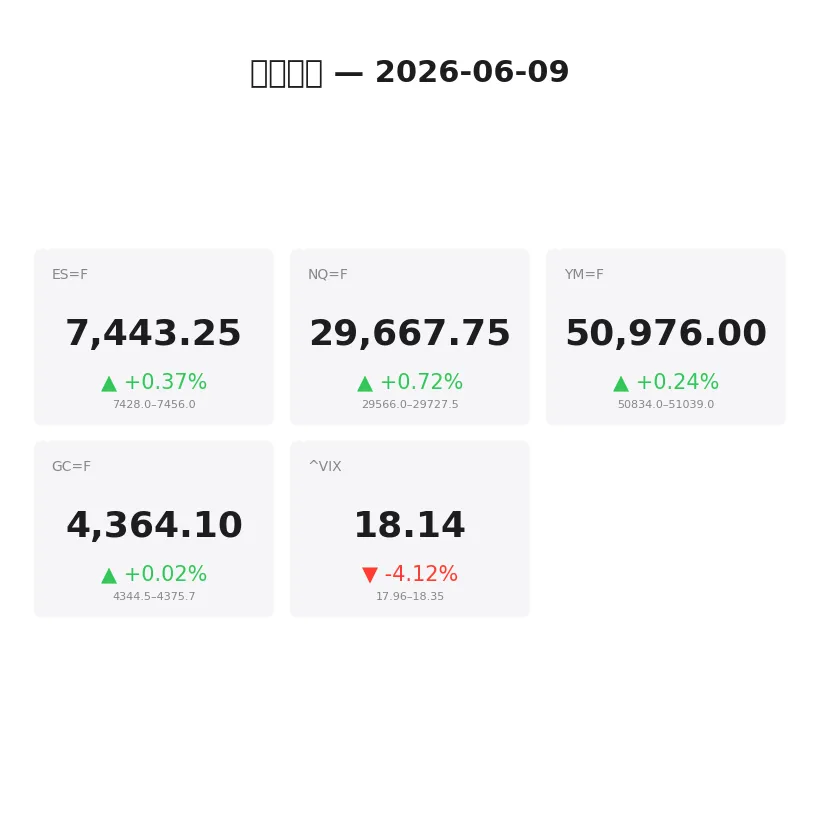
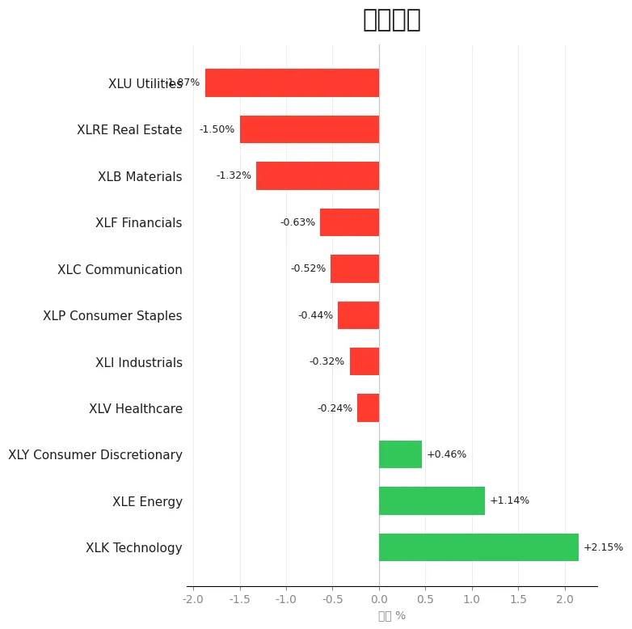
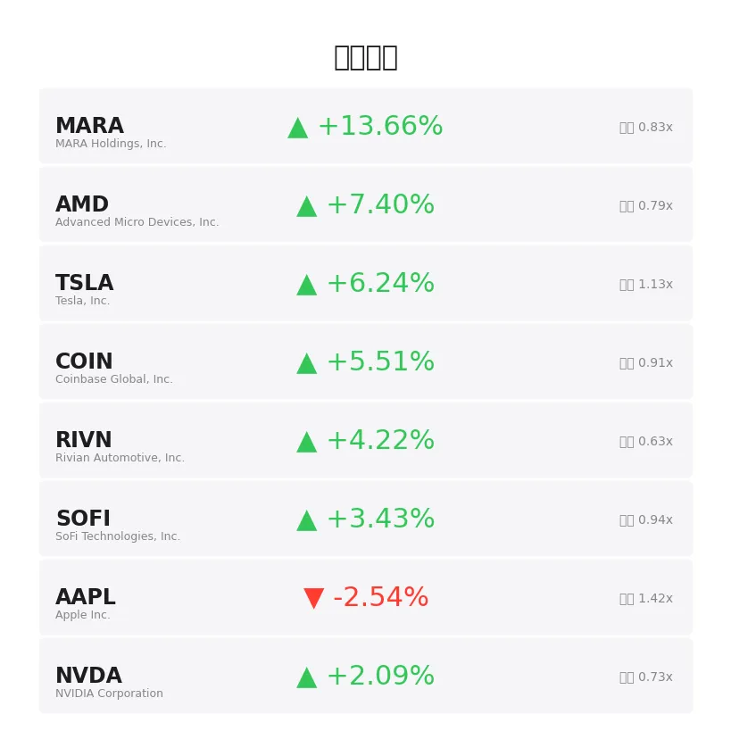
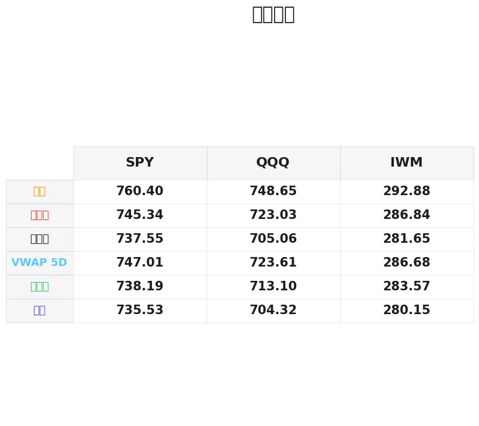

# 盘前分析报告 — 2026-06-09
*生成时间: 12:36:28 UTC*

---
## 数据速览

---
## 一、宏观环境

> [!info]- 详细数据：指数期货 & VIX
> ### 1.1 指数期货 & VIX
> | 品种 | 现价 | 涨跌幅 | 前收 | 日高 | 日低 |
> |------|------|--------|------|------|------|
> | ES=F | 7443.25 | +0.37% | 7416.0 | 7455.0 | 7390.25 |
> | NQ=F | 29667.75 | +0.72% | 29454.75 | 29727.5 | 29303.5 |
> | YM=F | 50976.0 | +0.24% | 50856.0 | 51039.0 | 50685.0 |
> | GC=F | 4364.1 | +0.02% | 4363.4 | 4375.7 | 4336.0 |
> | ^VIX | 18.14 | -4.12% | 18.92 | 18.35 | 17.96 |

> [!info]- 详细数据：隔夜走势
> ### 1.2 隔夜走势（Globex）
> | 品种 | 隔夜高 | 隔夜低 | 区间 | 亚洲高 | 亚洲低 | 欧洲高 | 欧洲低 |
> |------|--------|--------|------|--------|--------|--------|--------|
> | ES=F | 7456.0 | 7428.0 | 28.0 | 7440.75 | 7430.75 | 7456.0 | 7428.0 |
> | NQ=F | 29727.5 | 29566.0 | 161.5 | 29651.5 | 29588.75 | 29727.5 | 29566.0 |
> | YM=F | 51039.0 | 50834.0 | 205.0 | 50951.0 | 50878.0 | 51039.0 | 50834.0 |
> | GC=F | 4375.7 | 4344.5 | 31.2 | 4375.7 | 4348.6 | 4373.2 | 4344.5 |
> | ^VIX | 18.35 | 17.96 | 0.39 | — | — | 18.35 | 17.96 |

> [!info]- 详细数据：板块强弱
> ### 1.3 板块强弱
> | ETF | 板块 | 涨跌幅 |
> |-----|------|--------|
> | XLK | Technology | +2.15% |
> | XLE | Energy | +1.14% |
> | XLY | Consumer Discretionary | +0.46% |
> | XLV | Healthcare | -0.24% |
> | XLI | Industrials | -0.32% |
> | XLP | Consumer Staples | -0.44% |
> | XLC | Communication | -0.52% |
> | XLF | Financials | -0.63% |
> | XLB | Materials | -1.32% |
> | XLRE | Real Estate | -1.50% |
> | XLU | Utilities | -1.87% |

---
## 二、消息面

- **今日股市：道指受特朗普言论提振上涨；美光、闪迪持续反弹（实时报道）** — *Investor's Business Daily*
  > Stock Market Today: Dow Rises On Trump Comments; Micron, Sandisk Continue To Rebound (Live Coverage)
- **今年已翻三倍以上的5只"疯狂"成长股** — *Investor's Business Daily*
  > 5 'Insane' Growth Stocks Already Tripled Or More This Year
- **Zacks分析师博客聚焦SMH、QQQ、SPY、AIQ、EWY、英伟达和微软** — *Zacks*
  > The Zacks Analyst Blog Highlights SMH, QQQ, SPY, AIQ, EWY, SPY, NVIDIA and Microsoft
- **科技股反弹后纳指、标普500期货走高：NVDA、QCOM、AAPL等个股为何引发交易者关注** — *Stocktwits*
  > Nasdaq, S&P 500 Futures Gain After Tech-Led Rebound: Why NVDA, QCOM, AAPL, APLD, ASTS, NUVL Are Keeping Traders Engaged Today
- **在AI时代，比特币对投资者来说是否太无聊了？** — *etf.com*
  > Is Bitcoin Too Boring for Investors in an AI World?
- **当下更值得买的ETF：QQQ还是SCHG？** — *Motley Fool*
  > Better ETF Buy Right Now: QQQ vs. SCHG
- **芯片股复苏推动标普500和纳指上涨，以色列-伊朗停火提振市场情绪** — *Stocktwits*
  > S&P 500 and Nasdaq Gain As Chipmaker Stocks Revive, While Israel-Iran Ceasefire Aids Sentiment — AAPL, INTC, AAL, PSKY, CBRS In Focus
- **想参与SpaceX IPO但不想直接买股票？你需要了解的期权策略** — *Investopedia*
  > Want to Own the SpaceX IPO—But Not Buy the Stock? Here's What You Need to Know About Your Options.
- **科技股强势反弹持续，市场恐慌指数回落** — *Barrons.com*
  > Market Fear Index Slips as Tech Rebound Rages On
- **投资者重返科技股，市场恐慌指数持续下滑** — *Barrons.com*
  > Market Fear Index Slides as Investors Pile Back Into Tech Stocks
- **本周股市确实波动剧烈，但请保持投资** — *Barrons.com*
  > Yes, Stocks Were Volatile This Week. Stay Invested.
- **2026年6月5日股市新闻** — *Zacks*
  > Stock Market News for Jun 5, 2026
- **2026年6月4日股市新闻** — *Zacks*
  > Stock Market News for Jun 4, 2026
- **6月9日周二白银价格：本周初回落至较低区间** — *Yahoo Personal Finance*
  > Silver prices today, Tuesday, June 9: Settling into a lower range to start the week
- **急报：美国国债被挤下全球外汇储备霸主地位** — *Financial Post*
  > Posthaste: Sorry Uncle Sam, U.S. Treasuries just got toppled from the world's foreign reserve throne
- **Trident Resources为Contact Lake金矿夏季钻探项目调集人员和设备** — *MT Newswires*
  > Trident Resources Mobilizes Crews, Equipment for Summer Drill Program at Contact Lake Gold Project
- **West Red Lake金矿发布Rowan项目更新矿产资源估算** — *MT Newswires*
  > West Red Lake Gold Mines Releases Updated Mineral Resource Estimate for Rowan Project
- **印度上调黄金关税引发走私复苏，挤压银行和精炼商** — *Reuters*
  > India's gold tariff hike fuels smuggling revival, squeezes banks and refiners
- **今日股市：债券收益率上升拖累道指、标普500和纳指下跌** — *Yahoo Finance*
  > Stock market today: Dow, S&P 500, Nasdaq drop amid rising bond yields
- **伊朗战争担忧引发FTSE 100和美股大跌，油价剧烈波动** — *Yahoo Finance UK*
  > FTSE 100 and US stocks dive and oil swings amid Iran war jitters

---
## 三、盘前异动

> [!info]- 详细数据：盘前异动
> | 代码 | 名称 | 现价 | 缺口 | 量比 |
> |------|------|------|------|------|
> | MARA | MARA Holdings, Inc. | 14.0 | +13.66% | 0.83x |
> | AMD | Advanced Micro Devices, Inc. | 500.9 | +7.40% | 0.79x |
> | TSLA | Tesla, Inc. | 415.39 | +6.24% | 1.13x |
> | COIN | Coinbase Global, Inc. | 160.79 | +5.51% | 0.91x |
> | RIVN | Rivian Automotive, Inc. | 17.04 | +4.22% | 0.63x |
> | SOFI | SoFi Technologies, Inc. | 16.58 | +3.43% | 0.94x |
> | AAPL | Apple Inc. | 299.54 | -2.54% | 1.42x |
> | NVDA | NVIDIA Corporation | 209.39 | +2.09% | 0.73x |
> | GS | Goldman Sachs Group, Inc. (The) | 1055.68 | +1.64% | 0.98x |

---
## 四、关键价位

> [!info]- 详细数据：SPY 关键价位
> ### SPY
> | 价位类型 | 价格 |
> |----------|------|
> | Prior Day High | 745.34 |
> | Prior Day Low | 738.19 |
> | Prior Day Close | 737.55 |
> | Premarket Price | 743.2424 |
> | Approx Vwap 5D | 747.01 |
> | Weekly High | 760.4 |
> | Weekly Low | 735.53 |

> [!info]- 详细数据：QQQ 关键价位
> ### QQQ
> | 价位类型 | 价格 |
> |----------|------|
> | Prior Day High | 723.0276 |
> | Prior Day Low | 713.1 |
> | Prior Day Close | 705.06 |
> | Premarket Price | 722.6178 |
> | Approx Vwap 5D | 723.61 |
> | Weekly High | 748.65 |
> | Weekly Low | 704.32 |

> [!info]- 详细数据：IWM 关键价位
> ### IWM
> | 价位类型 | 价格 |
> |----------|------|
> | Prior Day High | 286.84 |
> | Prior Day Low | 283.575 |
> | Prior Day Close | 281.65 |
> | Premarket Price | 287.27 |
> | Approx Vwap 5D | 286.68 |
> | Weekly High | 292.88 |
> | Weekly Low | 280.15 |

---
## 五、AI 技术分析 & 操盘建议

## 第一部分：隔夜市场回顾

### 亚洲时段（18:00–02:00 ET）

亚洲时段整体呈窄幅整理态势。ES在7430.75–7440.75之间运行，仅10点区间，显示亚洲交易者对上周五美股收盘后的走势持观望态度。NQ区间略宽（29588.75–29651.5），反映科技股方向仍存分歧。GC黄金在亚洲时段相对活跃，高点触及4375.7，显示避险需求仍有韧性。

**关键信号：** 亚洲时段成交量清淡、波动收敛，典型的周一开盘前蓄势格局。

### 欧洲时段（02:00–08:00 ET）

欧洲开盘后波动明显放大。ES区间扩展至7428–7456（28点），NQ更是拉出29566–29727.5的161.5点大区间。这一波拉升的催化剂来自两方面：（1）以色列-伊朗停火消息提振风险偏好；（2）科技/芯片股盘前续涨带动期货走高。GC黄金在欧洲时段小幅回落至4344.5–4373.2区间，与风险偏好回升一致。

**关键信号：** 欧洲时段NQ领涨、ES跟随，科技板块主导叙事。VIX隔夜区间17.96–18.35，收在低端附近（18.14，-4.12%），压力释放明显。

### 对美盘的启示

1. **科技股主导**：NQ涨幅（+0.72%）远超ES（+0.37%）和YM（+0.24%），市场风格偏向成长/动量
2. **VIX回落至18下方边缘**：恐慌情绪快速消退，但18关口是关键分水岭，跌破后可能加速多头行情
3. **板块极端分化**：XLK +2.15% vs XLU -1.87%，近4个百分点的价差显示资金从防御板块大举流向科技，这是典型的Risk-On信号
4. **地缘风险缓和**：以色列-伊朗停火消息为风险资产提供支撑，但需关注后续进展
5. **债券收益率上升**：上周五债券抛售的余波可能在美盘时段继续施压利率敏感板块（XLRE -1.50%、XLU -1.87%已体现）

## 第二部分：期货品种分析

### ES（E-mini S&P 500）— 现价 7443.25

**多时间框架分析：**
- **日线**：上周五收7416后今日跳空高开至7443区域，正在回补上周四下跌缺口。日线格局仍偏多，但接近前高7455阻力带
- **4小时**：从上周低点7390.25反弹至7455区域，50+点的V型反转，动量偏多但已接近短期超买
- **1小时/15分钟**：隔夜在7428–7456窄幅震荡，欧洲时段守住7428支撑并反弹，短期结构偏多

**关键价位：**
| 类型 | 价位 | 备注 |
|------|------|------|
| 强阻力 | 7455–7460 | 隔夜高点+日高区域，突破打开上行空间 |
| 弱阻力 | 7443–7445 | 当前价格附近密集成交区 |
| 弱支撑 | 7428–7430 | 隔夜低点+亚洲时段低点 |
| 强支撑 | 7412–7416 | 前收+今日开盘价，失守则日内转空 |
| 极端支撑 | 7390 | 日低，跌破意味多头结构彻底破坏 |

**方向偏见：** 偏多（置信度 70%）

**交易计划：**
- **做多方案A（回踩买入）：** 等待回踩7428–7432区域企稳，观察order flow是否出现吸收性买盘。入场7430附近，止损7422（隔夜低点下方8点），目标T1: 7455, T2: 7470
- **做多方案B（突破追多）：** 若放量突破7456并回踩不破7450，入场7452，止损7442，目标T1: 7475, T2: 7500
- **做空方案（反转做空）：** 若7455–7460区域出现明显卖压且未能突破，可短空。入场7457，止损7465，目标T1: 7435, T2: 7416
- **失效条件：** 若价格在7435–7455之间反复震荡无方向、delta和CVD无明显趋势，则观望等待突破

---

### NQ（E-mini Nasdaq 100）— 现价 29667.75

**多时间框架分析：**
- **日线**：上周五收29454.75后今日大幅跳空至29667，+0.72%的涨幅领跑三大指数。AMD +7.4%、TSLA +6.2%等权重股盘前暴涨是主要驱动
- **4小时**：从上周低点29303.5反弹至29727.5（隔夜高），累计超400点反弹，多头气势强劲
- **1小时/15分钟**：欧洲时段主力拉升至29727.5后小幅回落至29660附近，呈高位整理态势

**关键价位：**
| 类型 | 价位 | 备注 |
|------|------|------|
| 强阻力 | 29720–29730 | 隔夜高点=日高，突破则冲击30000心理关口 |
| 弱阻力 | 29660–29680 | 当前价格区域，盘前密集成交 |
| 弱支撑 | 29566–29590 | 隔夜低点+亚洲低点 |
| 强支撑 | 29435–29455 | 前收+今日开盘价 |
| 极端支撑 | 29300 | 日低，跌破意味抛售重启 |

**方向偏见：** 偏多（置信度 75%）— NQ今日是领头羊，科技权重盘前表现强势

**交易计划：**
- **做多方案A（回踩买入）：** 回踩29570–29590区域观察买盘力度，入场29580，止损29540（40点），目标T1: 29720, T2: 29850
- **做多方案B（突破追多）：** 突破29730并站稳，入场29735，止损29690（45点），目标T1: 29900, T2: 30000
- **做空方案：** 若29720–29730出现连续大单抛售且快速跌破29650，可短空。入场29645，止损29700，目标T1: 29580, T2: 29455
- **失效条件：** 若AMD/TSLA/NVDA盘中翻绿，NQ多头逻辑失效，需立即减仓

---

### GC（黄金期货）— 现价 4364.1

**多时间框架分析：**
- **日线**：GC近期在4336–4376区间整理，今日微涨+0.02%，几乎平开。日线级别缺乏方向
- **4小时**：上周从4400+区域回落至4336后反弹，目前在4360–4375区间内震荡，方向不明
- **1小时/15分钟**：亚洲时段高点4375.7成为短期阻力，欧洲时段未能突破后回落至4364

**关键价位：**
| 类型 | 价位 | 备注 |
|------|------|------|
| 强阻力 | 4375–4380 | 亚洲高点+隔夜高点，多次测试未破 |
| 弱阻力 | 4365–4370 | 当前价格附近 |
| 弱支撑 | 4344–4348 | 欧洲低点+隔夜低点下沿 |
| 强支撑 | 4336 | 日低=近期关键支撑 |

**方向偏见：** 中性偏空（置信度 55%）— 风险偏好回升压制避险需求，但印度关税+美债储备地位下降提供底部支撑

**交易计划：**
- **做空方案（主）：** 若反弹至4373–4376再次受阻，观察卖压力度。入场4374，止损4382（8点），目标T1: 4350, T2: 4336
- **做多方案（次）：** 若回踩4336–4340出现强力买盘吸收，入场4340，止损4330（10点），目标T1: 4365, T2: 4376
- **突破方案：** 若放量突破4380并站稳，转多。入场4382，止损4372，目标T1: 4400, T2: 4420
- **失效条件：** 地缘消息突发（伊朗停火破裂等）可能导致GC瞬间拉升50+点，需设好止损

## 第三部分：ETF品种分析

### SPY — 盘前价 743.24

**关键价位：**
| 类型 | 价位 | 备注 |
|------|------|------|
| 周线阻力 | 760.40 | 本周高点，中期关键天花板 |
| 5日VWAP | 747.01 | 机构成本线，突破确认多头趋势 |
| 前日高 | 745.34 | 首个日内阻力目标 |
| 盘前价 | 743.24 | 跳空高开+0.77%，缺口是否回补是关键 |
| 前日低 | 738.19 | 日内多空分界线 |
| 前日收 | 737.55 | 缺口底部，完全回补意味空头占优 |
| 周线支撑 | 735.53 | 本周低点，失守转入周线级别下跌 |

**日内分析：**
SPY盘前跳空高开至743.24，距离前日高745.34仅2点。缺口幅度+0.77%属于中等跳空，既有继续上攻动力也有回补风险。5日VWAP在747.01，是今日多头的终极目标——若能收盘站上此价位，意味着本周均线多头排列确认。

**交易计划：**
- **做多：** 开盘后若守住742.50–743.00并出现买盘放量推升，入场743.00，止损741.50（$1.50），目标T1: 745.34（前日高）, T2: 747.00（5D VWAP）
- **做空：** 若开盘直接冲击745但快速回落至743下方，入场742.80，止损744.00（$1.20），目标T1: 740.00, T2: 738.20（前日低）
- **注意：** SPY今日成交量需关注——若量比>1.2x配合上攻，多头信号更可靠。AAPL盘前-2.54%是SPY最大拖累因子，需密切关注AAPL开盘后走势

---

### QQQ — 盘前价 722.62

**关键价位：**
| 类型 | 价位 | 备注 |
|------|------|------|
| 周线阻力 | 748.65 | 本周高点，突破意味新一轮科技牛市 |
| 5日VWAP | 723.61 | 机构成本线，盘前已接近触及 |
| 前日高 | 723.03 | 盘前价已接近此位，开盘能否突破是关键 |
| 盘前价 | 722.62 | 大幅跳空高开+2.49%，Gap巨大 |
| 前日低 | 713.10 | 日内极端支撑 |
| 前日收 | 705.06 | 缺口底部，极端做空目标 |
| 周线支撑 | 704.32 | 本周低点 |

**日内分析：**
QQQ今日是绝对的焦点品种。盘前跳空+2.49%（$17.56），这是一个巨大的缺口。驱动力来自AMD +7.4%、TSLA +6.2%、COIN +5.5%等成长/动量股的集体暴涨。盘前价722.62已逼近前日高723.03和5日VWAP 723.61，这是一个密集阻力区。

**交易计划：**
- **做多（突破追多）：** 若开盘后放量突破723.61（5D VWAP）并站稳，入场724.00，止损722.00（$2.00），目标T1: 730.00, T2: 740.00。这是趋势交易，需要确认突破有效
- **做空（缺口回补）：** 若开盘冲高至723–724区域后快速回落并跌破720.00，入场719.80，止损722.50（$2.70），目标T1: 715.00, T2: 713.10（前日低）。缺口如此之大，回补概率不低
- **注意：** QQQ +2.49%的跳空极端，盘中波动会非常剧烈。建议减小仓位（正常的50–70%），用宽一些的止损换取生存空间。不要在723–724密集区追涨杀跌，等待明确突破或回落后再入场

## 第四部分：今日市场总览

### 整体情绪评估：偏多（Risk-On）

今日市场呈现典型的"科技领涨、防御落后"的Risk-On格局。核心驱动力包括：
1. **芯片/科技板块强势反弹**：AMD +7.4%、NVDA +2.1%领衔，叠加Micron和Sandisk持续反弹，半导体板块回暖信号明确
2. **地缘风险缓和**：以色列-伊朗停火消息减少尾部风险溢价
3. **特朗普相关言论**：市场解读为利好道指（YM +0.24%），但具体政策影响待观察
4. **加密货币联动**：MARA +13.6%、COIN +5.5%暗示投机情绪回升，与Risk-On叙事一致

### VIX分析

VIX收18.14（-4.12%），从18.92快速回落。隔夜区间17.96–18.35，低点已触及18下方。

- **18是关键分界线**：若VIX在美盘持续运行在18下方，意味着波动率溢价快速出清，利好股市多头
- **但警惕反弹风险**：VIX从高位快速下跌后容易出现"VIX弹弓"效应——若日内出现利空消息，VIX可能快速反弹至19+，触发程序化卖盘
- **操作启示**：VIX 18下方可以更积极做多，但需在VIX反弹至18.50+时减仓或对冲

### 需回避的时间窗口

| 时间（ET） | 事件 | 影响 |
|------------|------|------|
| 09:30–09:45 | 开盘15分钟 | 缺口+高波动=假突破高发，建议观望 |
| 10:00 | 可能有经济数据发布 | 需提前查看日历确认 |
| 11:30–12:30 | 午间流动性枯竭 | 价差扩大、滑点增加，不宜重仓 |
| 15:45–16:00 | 收盘前15分钟 | MOC订单可能引发波动 |

**特别提醒：** 今日周一开盘，上周五收盘后的隔夜缺口（ES +27点、NQ +213点）需要消化。开盘前15分钟极易出现"Gap and Go"或"Gap and Fade"的分歧，建议等到09:45–10:00后再确认方向。

### 板块轮动观察

资金流向非常明确：
- **流入：** 科技（XLK +2.15%）> 能源（XLE +1.14%）> 可选消费（XLY +0.46%）
- **流出：** 公用事业（XLU -1.87%）< 房地产（XLRE -1.50%）< 材料（XLB -1.32%）

这一格局显示：（1）债券收益率上升驱动资金从利率敏感的防御板块撤出；（2）科技/成长板块重新获得市场青睐；（3）能源受油价波动和地缘溢价支撑。

**轮动策略：** 做多科技（QQQ/XLK），做空公用事业（XLU）作为对冲，是今日最符合市场结构的配对交易。

---

### 🎯 今日核心交易论点

**科技主导的Risk-On行情在盘前已经启动，NQ/QQQ是今日主战场。关键决策点在5日VWAP（ES 未提供/QQQ 723.61）：突破则追多看趋势延续，受阻则等缺口回补后低接。VIX 18下方确认多头友好环境，但QQQ +2.49%的巨大缺口意味着波动极端——控制仓位、拉宽止损、不在密集区追涨杀跌。**
