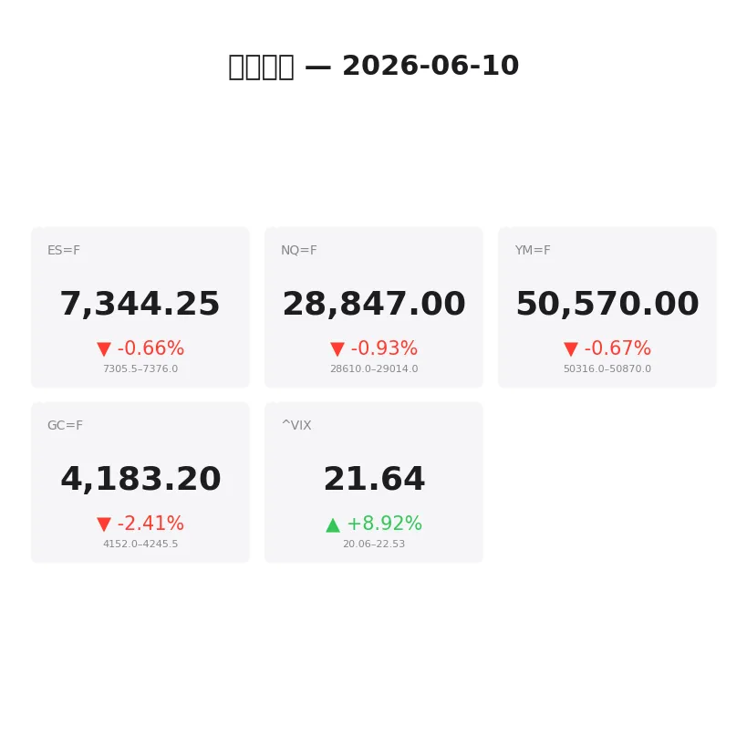
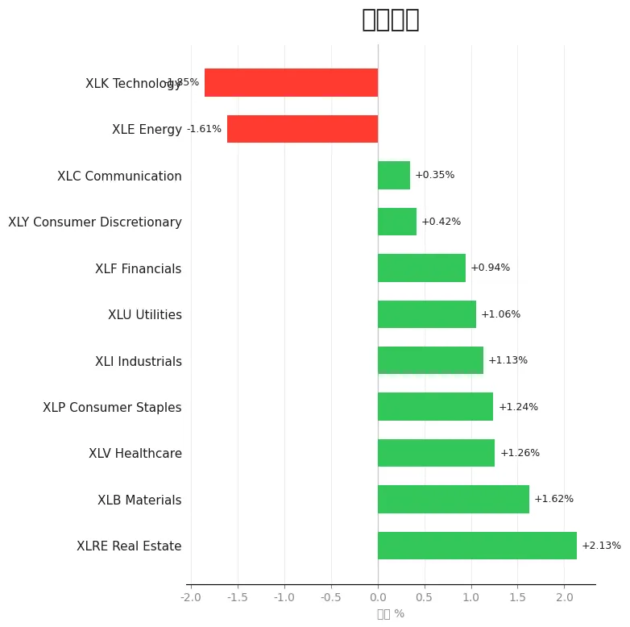
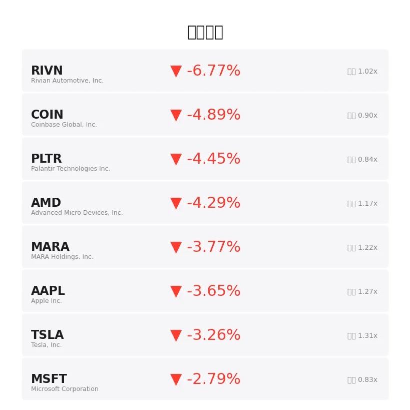
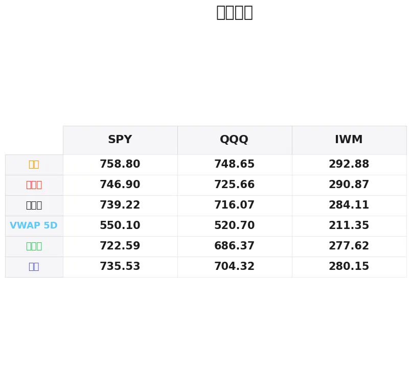

# 盘前分析报告 — 2026-06-10
*生成时间: 12:41:21 UTC*

---
## 数据速览

---
## 一、宏观环境

> [!info]- 详细数据：指数期货 & VIX
> ### 1.1 指数期货 & VIX
> | 品种 | 现价 | 涨跌幅 | 前收 | 日高 | 日低 |
> |------|------|--------|------|------|------|
> | ES=F | 7350.0 | -0.58% | 7392.75 | 7393.0 | 7306.5 |
> | NQ=F | 28869.5 | -0.85% | 29117.0 | 29169.0 | 28610.0 |
> | YM=F | 50611.0 | -0.59% | 50909.0 | 50906.0 | 50316.0 |
> | GC=F | 4188.4 | -2.29% | 4286.4 | 4281.1 | 4152.6 |
> | ^VIX | 21.69 | +9.15% | 19.87 | 22.53 | 20.06 |

> [!info]- 详细数据：隔夜走势
> ### 1.2 隔夜走势（Globex）
> | 品种 | 隔夜高 | 隔夜低 | 区间 | 亚洲高 | 亚洲低 | 欧洲高 | 欧洲低 |
> |------|--------|--------|------|--------|--------|--------|--------|
> | ES=F | 7376.0 | 7305.5 | 70.5 | 7370.75 | 7353.75 | 7376.0 | 7305.5 |
> | NQ=F | 29014.0 | 28610.0 | 404.0 | 28977.75 | 28853.75 | 29014.0 | 28610.0 |
> | YM=F | 50870.0 | 50316.0 | 554.0 | 50845.0 | 50751.0 | 50870.0 | 50316.0 |
> | GC=F | 4245.5 | 4152.0 | 93.5 | 4232.2 | 4194.2 | 4245.5 | 4168.2 |
> | ^VIX | 22.53 | 20.06 | 2.47 | — | — | 22.53 | 20.06 |

> [!info]- 详细数据：板块强弱
> ### 1.3 板块强弱
> | ETF | 板块 | 涨跌幅 |
> |-----|------|--------|
> | XLRE | Real Estate | +2.13% |
> | XLB | Materials | +1.62% |
> | XLV | Healthcare | +1.26% |
> | XLP | Consumer Staples | +1.24% |
> | XLI | Industrials | +1.13% |
> | XLU | Utilities | +1.06% |
> | XLF | Financials | +0.94% |
> | XLY | Consumer Discretionary | +0.42% |
> | XLC | Communication | +0.35% |
> | XLE | Energy | -1.61% |
> | XLK | Technology | -1.85% |

---
## 二、消息面

- **今日股市：因特朗普言论道指下跌500点；CPI通胀数据即将公布** — *Investor's Business Daily*
  > Stock Market Today: Dow Falls 500 Points On Trump Comments; CPI Inflation Data Next (Live Coverage)
- **华尔街严阵以待周三早间重磅通胀数据：哪些数字将决定股市涨跌** — *24/7 Wall St.*
  > Wall Street is Braced for Massive Inflation Numbers Wednesday Morning. Here's What Numbers Could Cause Stocks to Sink or Soar.
- **忘了VOO吧：富达科技ETF上涨29%，远超大盘表现** — *24/7 Wall St.*
  > Forget VOO: Fidelity's Tech ETF Is Up 29% While the Broad Market Lags
- **标普500、道指、纳指期货下跌，美国对伊朗发动新一轮"自卫打击"** — *Stocktwits*
  > S&P 500, Dow, Nasdaq Futures Decline As US Launches Fresh 'Self-Defense Strikes' On Iran: SMCI, TLRY, DKNG, CBRL In Focus
- **Rob Arnott：SpaceX会制造史上最大泡沫吗？** — *etf.com*
  > Rob Arnott: Will SpaceX Create The Biggest Bubble Ever?
- **这只ETF在过去20年中有16年跑赢标普500，今年能否延续？** — *Motley Fool*
  > This ETF Has Outperformed the S&P 500 in 16 of the Past 20 Years. Will This Year Be the Same?
- **深入解读一次不寻常的标普500回调** — *Schaeffer's Investment Research*
  > A Closer Look at an Unusual S&P 500 Pullback
- **市场恐惧指数跳升，AI担忧加剧** — *Barrons.com*
  > Market Fear Index Jumps as AI Worries Build
- **标普500、纳指下跌，科技股抛售再起，特朗普誓言回应美直升机被击落事件** — *Reuters*
  > S&P 500, Nasdaq fall as tech selling resumes, Trump vows to respond to downed US helicopter
- **纳指下跌1.8%后从日内低点反弹** — *Barrons.com*
  > Nasdaq Slips 1.8%, Bounces Off Earlier Lows
- **恐惧指数回落，科技股强势反弹持续** — *Barrons.com*
  > Market Fear Index Slips as Tech Rebound Rages On
- **通胀报告前美元走强，黄金下跌2%** — *Yahoo Finance*
  > Gold falls 2% as dollar rises ahead of crucial inflation report
- **6月10日周三黄金价格：美伊冲突及CPI报告前价格下跌** — *Yahoo Personal Finance*
  > Gold prices today, Wednesday, June 10: Prices falling after U.S., Iran strikes and ahead of CPI report
- **魁北克官员参观Troilus项目并宣布70兆瓦水力发电配额** — *MT Newswires*
  > Quebec Officials Visit Troilus Project for Announcement of 70 MW Hydroelectric Power Allocation
- **黄金价格暴跌创新低，避险资金因伊朗局势另寻他处** — *Barrons.com*
  > Gold Price Slump Hits New Low as Haven Seekers Look Elsewhere for Iran Shelter
- **Hemlo Mining宣布升级至多伦多证券交易所** — *MT Newswires*
  > Hemlo Mining Announces Graduation to the Toronto Stock Exchange
- **今日股市：国债收益率上升，道指、标普500、纳指全线下跌** — *Yahoo Finance*
  > Stock market today: Dow, S&P 500, Nasdaq drop amid rising bond yields
- **伊朗战争忧虑下富时100指数与美股跳水，油价剧烈波动** — *Yahoo Finance UK*
  > FTSE 100 and US stocks dive and oil swings amid Iran war jitters
- **美联储会议及伊朗冲突预期下，富时100指数与美股反弹** — *Yahoo Finance UK*
  > FTSE 100 and US stocks rally with Fed meeting and Iran conflict in view
- **今日股市：Nvidia财报在即，科技股提振道指、标普500、纳指上涨** — *Yahoo Finance*
  > Stock market today: Dow, S&P 500, Nasdaq rally on tech jolt as Nvidia earnings loom

---
## 三、盘前异动

> [!info]- 详细数据：盘前异动
> | 代码 | 名称 | 现价 | 缺口 | 量比 |
> |------|------|------|------|------|
> | RIVN | Rivian Automotive, Inc. | 15.62 | -7.24% | 1.02x |
> | COIN | Coinbase Global, Inc. | 153.8 | -5.13% | 0.9x |
> | AMD | Advanced Micro Devices, Inc. | 467.07 | -4.74% | 1.17x |
> | PLTR | Palantir Technologies Inc. | 130.26 | -4.55% | 0.84x |
> | MARA | MARA Holdings, Inc. | 13.22 | -4.06% | 1.22x |
> | AAPL | Apple Inc. | 290.15 | -3.78% | 1.27x |
> | TSLA | Tesla, Inc. | 394.98 | -3.42% | 1.31x |
> | MSFT | Microsoft Corporation | 399.47 | -2.98% | 0.83x |
> | NVDA | NVIDIA Corporation | 205.19 | -1.66% | 0.95x |
> | BAC | Bank of America Corporation | 54.45 | +1.53% | 0.6x |

---
## 四、关键价位

> [!info]- 详细数据：SPY 关键价位
> ### SPY
> | 价位类型 | 价格 |
> |----------|------|
> | Prior Day High | 746.9 |
> | Prior Day Low | 722.59 |
> | Prior Day Close | 739.22 |
> | Premarket Price | 733.12 |
> | Approx Vwap 5D | 550.1 |
> | Weekly High | 758.8 |
> | Weekly Low | 735.53 |

> [!info]- 详细数据：QQQ 关键价位
> ### QQQ
> | 价位类型 | 价格 |
> |----------|------|
> | Prior Day High | 725.66 |
> | Prior Day Low | 686.37 |
> | Prior Day Close | 716.07 |
> | Premarket Price | 702.68 |
> | Approx Vwap 5D | 520.7 |
> | Weekly High | 748.65 |
> | Weekly Low | 704.32 |

> [!info]- 详细数据：IWM 关键价位
> ### IWM
> | 价位类型 | 价格 |
> |----------|------|
> | Prior Day High | 290.87 |
> | Prior Day Low | 277.62 |
> | Prior Day Close | 284.11 |
> | Premarket Price | 284.7 |
> | Approx Vwap 5D | 211.35 |
> | Weekly High | 292.88 |
> | Weekly Low | 280.15 |

---
## 五、AI 技术分析 & 操盘建议

## 第一部分：隔夜市场回顾

### 亚洲时段（18:00–02:00 ET）

亚洲时段整体交投清淡，但方向偏空。ES在7370.75–7353.75区间窄幅震荡，NQ区间为28977.75–28853.75，均在前收盘下方运行。亚盘尾段出现一波抛压，暗示亚洲资金对美伊局势升级的避险反应。GC黄金在亚洲时段从4232.2跌至4194.2，跌幅明显，说明避险资金并未流入黄金，而是选择了美元。

**亚盘解读：** 亚洲资金风险偏好显著下降，科技股和加密相关标的遭受最大抛压。黄金未能受益于避险情绪，反而因美元走强而承压，这暗示市场的核心矛盾不是地缘政治，而是CPI通胀预期。

### 欧洲时段（02:00–09:30 ET）

欧洲开盘后波动加剧。ES从亚洲收盘区间向下突破，一度触及隔夜低点7305.5（整个Globex时段低点），随后反弹至7376.0附近。NQ跌幅更大，最低触及28610.0，区间达404点，显示科技股在欧洲时段遭受集中抛售。YM表现相对抗跌，低点50316仅略低于亚盘水平。

GC黄金在欧洲时段延续弱势，从4245.5一路下滑至4168.2，跌超77美元，显示全球资金在CPI前选择持有美元现金。

**欧盘解读：** 欧洲时段的大幅波动（ES 70.5点区间、NQ 404点区间）为美盘交易提供了明确的技术参考。空头在欧洲时段主导，但在低位出现买盘接力，说明7305–7310区域存在结构性支撑。VIX从20.06跳升至22.53（+12.3%），确认市场进入高波动状态。

### 对美盘的影响

1. **CPI是今日绝对核心事件** — 所有隔夜走势都围绕CPI预期定价。若CPI高于预期，当前的抛售将加速；若低于预期，可能出现暴力空头回补。
2. **地缘政治是次要催化剂** — 美伊冲突升级推高了VIX，但黄金下跌说明市场更关心通胀而非战争。
3. **科技股是最脆弱板块** — NQ隔夜跌幅是ES的约1.5倍，XLK是唯二下跌板块之一（-1.85%），盘前异动中科技股占据多数。
4. **防御性板块轮动明显** — XLRE（+2.13%）、XLB（+1.62%）、XLV（+1.26%）大幅跑赢，资金从成长股流向价值/防御板块。

## 第二部分：期货品种分析

### ES（E-mini S&P 500）

**多时间框架分析：**

- **日线：** 前一交易日收于7392.75，今日盘前已跌至7350附近，跌破前日低点7306.5后反弹。日线趋势仍为多头（价格高于20日均线），但短期出现明显回调压力。
- **4小时：** 从上周高点7393.0回落，形成高位阴线结构。关键在于能否守住7300–7310支撑区（Globex低点附近）。
- **1小时/15分钟：** 隔夜在7305.5–7376.0区间震荡，形成一个明确的value area。欧洲时段低点7305.5与前日低点7306.5形成双底结构。

**关键价位：**
| 类型 | 价格 | 说明 |
|------|------|------|
| 隔夜高（R1） | 7376.0 | 欧洲时段高点，突破看多 |
| 前日收盘 | 7392.75 | 回到此上方，空头叙事失效 |
| 前日高点 | 7393.0 | 强阻力 |
| 枢轴 | 7350.0 | 当前交易价格，隔夜value area中枢 |
| 亚洲低点 | 7353.75 | 短期支撑 |
| 隔夜低/双底 | 7305.5 | 关键支撑，破位看7280 |
| 下方目标 | 7280.0 | 破位延伸目标 |

**方向偏见：** 偏空（信心 65%）

CPI前市场情绪偏谨慎，VIX跳升至21.69确认避险氛围。但7305–7310双底结构提供支撑，空头需要CPI利空配合才能有效突破。

**交易计划：**
- **空头方案（首选）：** 在7370–7380区域（隔夜高点/前日收盘区域）寻找空头入场信号。止损7395（前日高点上方），T1: 7320, T2: 7305。失效条件：价格持续站稳7393上方。
- **多头方案（反弹）：** 若价格二次测试7305–7310并出现止跌信号（delta转正、bid stack出现），可轻仓做多。止损7295, T1: 7350, T2: 7376。

**CPI情景分析：**
- CPI高于预期 → 7305直接破位，看7250–7280
- CPI符合预期 → 维持7305–7376区间震荡
- CPI低于预期 → 快速回补至7400+，可能创新高

---

### NQ（E-mini Nasdaq 100）

**多时间框架分析：**

- **日线：** 从29117前收大幅回落至28869，跌幅-0.85%，是ES跌幅的1.5倍。科技股抛压明显重于大盘。
- **4小时：** 隔夜区间达404点（28610–29014），波动率极高。价格目前处于隔夜区间中上段。
- **1小时/15分钟：** 欧洲时段28610低点为强支撑（大量买单接盘），29014高点为强阻力。亚洲区间28853–28977相对紧凑。

**关键价位：**
| 类型 | 价格 | 说明 |
|------|------|------|
| 隔夜高（R1） | 29014.0 | 强阻力，突破看29117 |
| 前日收盘 | 29117.0 | 回到此上方，空头完全失效 |
| 前日高点 | 29169.0 | 极强阻力 |
| 枢轴 | 28870.0 | 当前交易价格 |
| 亚洲低点 | 28853.75 | 近端支撑 |
| 隔夜低 | 28610.0 | 关键支撑，欧洲时段吸收区 |
| 下方目标 | 28400.0 | 破位延伸目标 |

**方向偏见：** 偏空（信心 70%）

NQ的空头信号比ES更明确：跌幅更大、科技板块最弱（XLK -1.85%）、盘前异动中AMD -4.74%、NVDA -1.66%、AAPL -3.78%均为权重股。AI泡沫担忧（Barron's头条）进一步压制情绪。

**交易计划：**
- **空头方案（首选）：** 在29000–29014区域（隔夜高点）寻找空头入场。止损29050, T1: 28700, T2: 28610。NQ波动大，仓位须缩小。失效条件：站稳29050以上。
- **多头方案（反弹）：** 28610–28650二次测试出现止跌信号时轻仓做多。止损28550, T1: 28850, T2: 29000。

---

### GC（黄金期货）

**多时间框架分析：**

- **日线：** 前收4286.4，今日暴跌至4188.4（-2.29%），单日跌近100美元。这是近期罕见的大幅单日下跌，显示黄金多头结构遭到严重破坏。
- **4小时：** 从4245.5隔夜高点持续走低至4152.0（隔夜低点），跌幅93.5美元。几乎没有像样的反弹，属于单边下跌行情。
- **1小时/15分钟：** 亚洲时段从4232.2跌至4194.2（-38美元），欧洲时段从4245.5跌至4168.2（-77美元）。当前价格4188在隔夜区间偏下方。

**关键价位：**
| 类型 | 价格 | 说明 |
|------|------|------|
| 前日收盘 | 4286.4 | 极远阻力，今日不太可能触及 |
| 隔夜高 | 4245.5 | 第一阻力，反弹目标 |
| 亚洲高 | 4232.2 | 中期阻力 |
| 枢轴 | 4188.0 | 当前交易价格 |
| 欧洲低 | 4168.2 | 近端支撑 |
| 隔夜低 | 4152.0 | 关键支撑 |
| 下方目标 | 4120.0 | 破位延伸目标 |

**方向偏见：** 偏空（信心 75%）

GC今日空头信号最为明确：跌幅最大（-2.29%）、多条新闻确认黄金遭抛售、美元走强是核心驱动。特别值得注意的是，地缘政治紧张（美伊冲突）本应利好黄金避险，但黄金反而暴跌，说明CPI通胀预期+美元强势的影响远超地缘政治。

**交易计划：**
- **空头方案（首选）：** 在4200–4210区域（反弹至value area中段）寻找空头入场。止损4225, T1: 4165, T2: 4152。若破4152看4120。
- **多头方案（超跌反弹）：** 仅在4150–4155区域出现强止跌信号（大量limit bid、delta持续正值）时考虑。止损4140, T1: 4190, T2: 4210。注意：逆趋势交易，仓位减半。

**CPI情景分析：**
- CPI高于预期 → 美元继续走强，GC破4150看4100
- CPI符合预期 → GC维持4150–4210区间
- CPI低于预期 → GC急速反弹至4250+

## 第三部分：ETF品种分析

### SPY（SPDR S&P 500 ETF）

**关键价位：**
| 类型 | 价格 | 说明 |
|------|------|------|
| 周高 | 758.8 | 本周阻力上限 |
| 前日高 | 746.9 | 强阻力 |
| 前日收盘 | 739.22 | 关键参考 |
| 周低 | 735.53 | 近端支撑 |
| 盘前价 | 733.12 | 已跌破周低！ |
| 前日低 | 722.59 | 重要支撑 |

**分析：** SPY盘前733.12已跌破本周低点735.53，这是一个重要的空头信号。若开盘后无法快速回到735以上，可能延续下探至前日低点722.59附近。5日VWAP在550.1，说明近期大幅上涨后正在进行健康回调。

**交易计划：**
- **空头方案：** 开盘后如反弹至735–737区域受阻（此前周低变阻力），可做空。止损739.5, T1: 728, T2: 723。
- **多头方案：** 若开盘直接跌至722–724区域（前日低点支撑），出现止跌可做多反弹。止损720, T1: 730, T2: 735。

### QQQ（Invesco QQQ Trust）

**关键价位：**
| 类型 | 价格 | 说明 |
|------|------|------|
| 周高 | 748.65 | 本周阻力上限 |
| 前日高 | 725.66 | 强阻力 |
| 前日收盘 | 716.07 | 关键参考 |
| 周低 | 704.32 | 近端支撑 |
| 盘前价 | 702.68 | 已跌破周低！ |
| 前日低 | 686.37 | 重要支撑 |

**分析：** QQQ跌幅明显大于SPY（盘前跌1.87% vs SPY跌0.83%），科技权重股全线下挫。702.68已跌破周低704.32，空头占据明显优势。AMD（-4.74%）、AAPL（-3.78%）、MSFT（-2.98%）、NVDA（-1.66%）四大权重同时走弱，NQ的疲态将直接映射到QQQ。

**交易计划：**
- **空头方案（首选）：** 开盘后如反弹至704–706区域（周低变阻力）受阻，做空。止损708, T1: 695, T2: 688。
- **多头方案：** 仅在686–690区域（前日低点附近）出现强止跌信号时考虑。止损684, T1: 700, T2: 706。

## 第四部分：今日市场总览

### 整体情绪判断

今日市场处于**"CPI前避险+地缘政治双重压力"**状态。VIX跳升至21.69（+9.15%）确认恐慌情绪升温，但尚未进入极端恐慌区间（VIX > 25）。市场核心矛盾是**CPI通胀数据**，所有盘前走势都是对该数据的预期定价。

### VIX分析

VIX从19.87飙升至21.69，涨幅+9.15%，日内曾触及22.53。这意味着：
- 期权市场定价的日内波动增加约15–20%
- 建议减小仓位规模至正常的60–70%
- 止损应适当放宽以应对高波动环境
- 避免在CPI数据公布前（8:30 AM ET）建立大仓位

### 需要回避的时间窗口

1. **8:25–8:40 AM ET** — CPI数据公布窗口，极端波动，禁止新开仓
2. **9:30–9:45 AM ET** — 开盘头15分钟，订单流混乱，等待方向确认
3. **10:00 AM ET** — 若有其他经济数据发布，注意二次波动

### 板块轮动解读

今日呈现典型的**Risk-Off轮动**格局：
- **防御板块领涨：** XLRE（+2.13%）、XLB（+1.62%）、XLV（+1.26%）、XLP（+1.24%）
- **进攻板块领跌：** XLK（-1.85%）、XLE（-1.61%）
- **解读：** 资金从高beta科技股撤出，流入低波防御板块。这种轮动模式通常在市场预期利空数据时出现，暗示机构在减仓等待CPI结果。若CPI超预期利空，防御板块也将补跌；若CPI利好，进攻板块将出现暴力反弹。

### 核心交易论点

**今日CPI数据决定一切。在数据公布前保持轻仓或空仓，数据公布后跟随方向做趋势突破交易。科技股是最大变量，NQ/QQQ空头动能最强，若CPI利空则优先做空NQ；若CPI利好则优先做多NQ（弹性最大）。黄金（GC）空头趋势最明确，是今日阻力最小的空头方向。**
