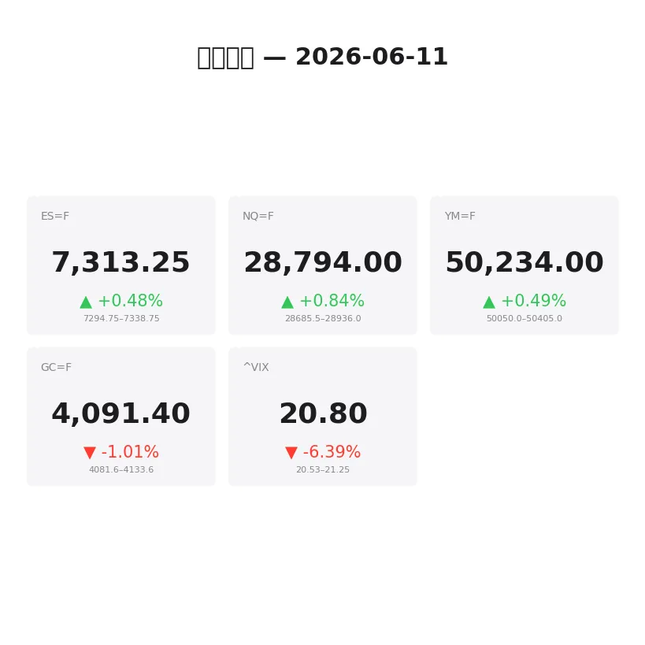
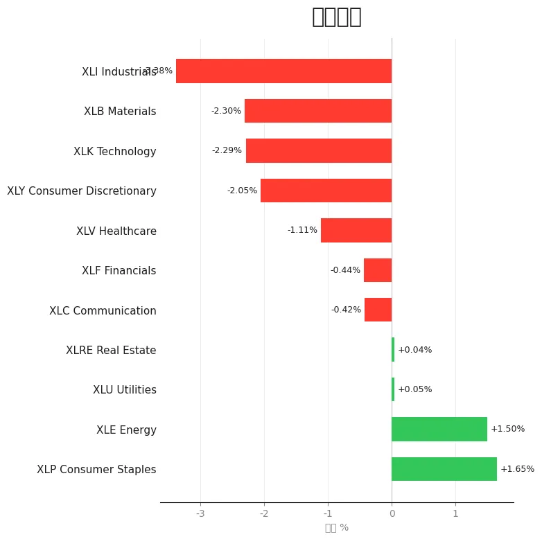
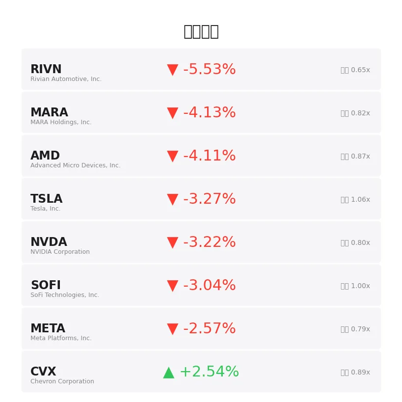
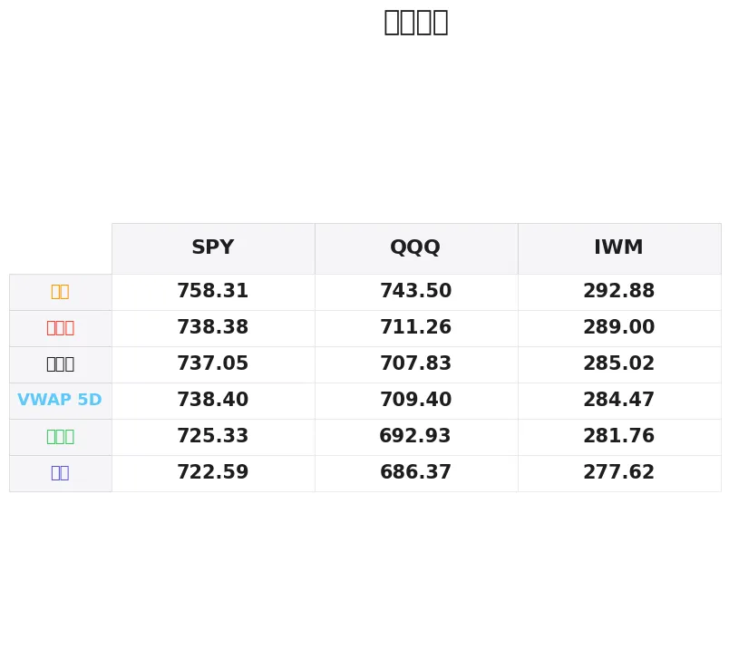

# 盘前分析报告 — 2026-06-11
*生成时间: 12:35:21 UTC*

---
## 数据速览

---
## 一、宏观环境

> [!info]- 详细数据：指数期货 & VIX
> ### 1.1 指数期货 & VIX
> | 品种 | 现价 | 涨跌幅 | 前收 | 日高 | 日低 |
> |------|------|--------|------|------|------|
> | ES=F | 7313.25 | +0.48% | 7278.5 | 7338.75 | 7232.25 |
> | NQ=F | 28794.0 | +0.84% | 28554.0 | 28936.0 | 28265.75 |
> | YM=F | 50234.0 | +0.49% | 49990.0 | 50405.0 | 49758.0 |
> | GC=F | 4091.4 | -1.01% | 4133.3 | 4138.5 | 4046.2 |
> | ^VIX | 20.8 | -6.39% | 22.22 | 21.25 | 20.53 |

> [!info]- 详细数据：隔夜走势
> ### 1.2 隔夜走势（Globex）
> | 品种 | 隔夜高 | 隔夜低 | 区间 | 亚洲高 | 亚洲低 | 欧洲高 | 欧洲低 |
> |------|--------|--------|------|--------|--------|--------|--------|
> | ES=F | 7338.75 | 7294.75 | 44.0 | 7317.5 | 7300.5 | 7338.75 | 7294.75 |
> | NQ=F | 28936.0 | 28685.5 | 250.5 | 28803.0 | 28704.75 | 28936.0 | 28685.5 |
> | YM=F | 50405.0 | 50050.0 | 355.0 | 50181.0 | 50087.0 | 50405.0 | 50050.0 |
> | GC=F | 4133.6 | 4081.6 | 52.0 | 4127.4 | 4091.2 | 4133.6 | 4097.0 |
> | ^VIX | 21.25 | 20.53 | 0.72 | — | — | 21.25 | 20.53 |

> [!info]- 详细数据：板块强弱
> ### 1.3 板块强弱
> | ETF | 板块 | 涨跌幅 |
> |-----|------|--------|
> | XLP | Consumer Staples | +1.65% |
> | XLE | Energy | +1.50% |
> | XLU | Utilities | +0.05% |
> | XLRE | Real Estate | +0.04% |
> | XLC | Communication | -0.42% |
> | XLF | Financials | -0.44% |
> | XLV | Healthcare | -1.11% |
> | XLY | Consumer Discretionary | -2.05% |
> | XLK | Technology | -2.29% |
> | XLB | Materials | -2.30% |
> | XLI | Industrials | -3.38% |

---
## 二、消息面

- **今日股市：美国空袭之际道指大涨400点；甲骨文因财报暴跌（实时报道）** — *Investor's Business Daily*
  > Stock Market Today: Dow Rallies 400 Points Amid U.S. Strikes; Oracle Plunges On Earnings (Live Coverage)
- **首只万亿美元ETF成为基金界的"埃隆·马斯克"** — *Investor's Business Daily*
  > The First Trillion-Dollar ETF Becomes The 'Elon Musk' Of Funds
- **有资本利得？投资组合如何免税转入ETF** — *etf.com*
  > Got Cap Gains? How Portfolios Can Move Into ETFs Tax-Free
- **SpaceX何时会出现在你的投资组合中？** — *Zacks*
  > When will SpaceX Show Up in Your Portfolio?
- **中东紧张局势升级，美股大幅收低** — *Barchart*
  > Stocks Settle Sharply Lower on Escalating Middle East Tensions
- **OpenAI对决Anthropic IPO：这两家AI公司有何不同？** — *Yahoo Finance Video*
  > OpenAI vs. Anthropic IPO: What sets these AI companies apart
- **ARKQ vs. QQQ：哪只科技ETF更值得买？** — *Motley Fool*
  > ARKQ vs. QQQ: Which Tech Stock ETF is the Better Buy?
- **华尔街策略师：SpaceX将迫使股市大洗牌，买入这些替代标的** — *24/7 Wall St.*
  > Wall Street Strategist: SpaceX Will Force a Major Stock Market Repositioning. Buy These Stocks Instead.
- **科技股反弹，市场恐慌指数回落** — *Barrons.com*
  > Market Fear Index Dips as Tech Stocks Rebound
- **华尔街主要指数跌逾1%，受科技股抛售及伊朗战争忧虑拖累** — *Reuters*
  > Wall Street indexes fall more than 1%, hit by tech, Iran war worries
- **这些ETF或能为投资者提供市场风险保护** — *Zacks*
  > ETFs That May Provide Investors Protection From Market Risks
- **深入解读标普500的一次异常回调** — *Schaeffer's Investment Research*
  > A Closer Look at an Unusual S&P 500 Pullback
- **AI忧虑升温，市场恐慌指数跳升** — *Barrons.com*
  > Market Fear Index Jumps as AI Worries Build
- **今日白银价格（6月11日周四）：美国空袭伊朗后创去年12月以来最低开盘价** — *Yahoo Personal Finance*
  > Silver prices today, Thursday, June 11, 2026: Lowest open since Dec. '25 following U.S. strikes against Iran
- **5月CPI数据公布，期货下挫、波动率飙升** — *Yahoo Finance Video*
  > Stock futures slide, volatility spikes in response to May CPI
- **Troilus Gold公布West Rim发现区最新钻探结果** — *MT Newswires*
  > Troilus Gold Provides Additional Drill Results from West Rim Discovery
- **油价回软缓解通胀忧虑，黄金价格回升** — *InvestorsHub*
  > Gold Recovers as Softer Oil Prices Ease Inflation Concerns
- **美伊新一轮空袭后黄金剧烈震荡** — *Bloomberg*
  > Gold Swings in Volatile Session After Fresh US-Iran Strikes
- **今日股市：债券收益率攀升，道指、标普500、纳指齐跌** — *Yahoo Finance*
  > Stock market today: Dow, S&P 500, Nasdaq drop amid rising bond yields
- **富时100与美股跳水，伊朗战争忧虑令油价剧烈波动** — *Yahoo Finance UK*
  > FTSE 100 and US stocks dive and oil swings amid Iran war jitters

---
## 三、盘前异动

> [!info]- 详细数据：盘前异动
> | 代码 | 名称 | 现价 | 缺口 | 量比 |
> |------|------|------|------|------|
> | RIVN | Rivian Automotive, Inc. | 14.86 | -5.53% | 0.65x |
> | MARA | MARA Holdings, Inc. | 12.76 | -4.13% | 0.82x |
> | AMD | Advanced Micro Devices, Inc. | 455.96 | -4.11% | 0.87x |
> | TSLA | Tesla, Inc. | 383.69 | -3.27% | 1.06x |
> | NVDA | NVIDIA Corporation | 201.49 | -3.22% | 0.8x |
> | SOFI | SoFi Technologies, Inc. | 15.97 | -3.04% | 1.0x |
> | META | Meta Platforms, Inc. | 569.54 | -2.57% | 0.79x |
> | CVX | Chevron Corporation | 191.5 | +2.54% | 0.89x |
> | GS | Goldman Sachs Group, Inc. (The) | 1006.01 | -2.52% | 0.93x |
> | GOOGL | Alphabet Inc. | 355.54 | -2.39% | 0.85x |

---
## 四、关键价位

> [!info]- 详细数据：SPY 关键价位
> ### SPY
> | 价位类型 | 价格 |
> |----------|------|
> | Prior Day High | 738.38 |
> | Prior Day Low | 725.33 |
> | Prior Day Close | 737.05 |
> | Premarket Price | 727.44 |
> | Approx Vwap 5D | 738.4 |
> | Weekly High | 758.31 |
> | Weekly Low | 722.59 |

> [!info]- 详细数据：QQQ 关键价位
> ### QQQ
> | 价位类型 | 价格 |
> |----------|------|
> | Prior Day High | 711.26 |
> | Prior Day Low | 692.93 |
> | Prior Day Close | 707.83 |
> | Premarket Price | 697.56 |
> | Approx Vwap 5D | 709.4 |
> | Weekly High | 743.5 |
> | Weekly Low | 686.37 |

> [!info]- 详细数据：IWM 关键价位
> ### IWM
> | 价位类型 | 价格 |
> |----------|------|
> | Prior Day High | 289.0 |
> | Prior Day Low | 281.76 |
> | Prior Day Close | 285.02 |
> | Premarket Price | 283.48 |
> | Approx Vwap 5D | 284.47 |
> | Weekly High | 292.88 |
> | Weekly Low | 277.62 |

---
## 五、AI 技术分析 & 操盘建议

# 2026年6月11日 盘前技术分析报告

---

## 第一部分：隔夜市场回顾

### 亚洲盘（18:00–02:00 ET）

亚洲时段波动有限但整体方向偏多。ES=F 在 7300.5–7317.5 的 17 点窄幅区间内运行，显示亚洲资金对前日美盘抛售后的价格有一定承接意愿。NQ=F 在 28704.75–28803.0 区间整理，波幅约 98 点，科技股在亚洲盘未出现进一步恶化。GC=F 从 4091.2 温和上行至 4127.4，亚洲买盘对避险资产有持续兴趣——考虑到美伊局势持续紧张，这并不意外。YM=F 在 50087–50181 内横盘。

**特征：** 亚盘未出现恐慌性延续抛售，相反小幅走高，暗示隔夜资金在试探性接盘。但成交量偏低，方向确认力度不足。

### 欧洲盘（02:00–08:00 ET）

欧洲盘是隔夜行情的主战场，呈现明显的**先涨后跌**走势。ES=F 在欧洲盘初段上攻至隔夜高点 7338.75（较亚洲盘高点再涨21点），但随后遭遇强烈抛售，回落至隔夜低点 7294.75，完整扫荡了 44 点的隔夜区间。NQ=F 更为剧烈——先冲高至 28936.0 后暴跌 250 点至 28685.5，形成隔夜"倒V"结构，科技股在高位遭遇密集抛压。GC=F 在欧洲盘触及 4133.6 后回落至 4097.0，同样呈冲高回落，但跌幅相对温和。YM=F 在欧洲盘拉升至 50405 后回落至 50050，355 点区间显示道指波动极大。

**特征：** 欧洲盘资金先尝试推高后被打回——**卖方在高位占据主导权**。VIX虽从22.22跌至20.8，但仍处高位，市场结构混乱。

### 隔夜总结

隔夜整体方向**高度矛盾**，但最终收盘偏向上方（ES +0.48%，NQ +0.84%），核心信号：
1. **欧洲盘形成倒V结构** — 先涨后跌，但尾盘从低点反弹，当前停在隔夜区间中部偏上，方向不明确
2. **NQ隔夜波幅250点** — 极端波动，反映科技股多空激烈博弈
3. **VIX 20.8（-6.39%）** — 虽大幅回落但仍在20以上，恐慌未完全消退
4. **板块极端分化** — XLP +1.65%、XLE +1.50% 领涨（防御+能源），XLK -2.29%、XLI -3.38% 领跌（科技+工业），典型的 **Risk-Off 轮动**
5. **地缘风险高企** — 美伊空袭持续、中东局势恶化，消息面主导市场情绪
6. **SPY/QQQ 盘前跳空低开** — SPY 727.44 vs 前收 737.05（缺口 -1.3%），QQQ 697.56 vs 前收 707.83（缺口 -1.5%）

**对美盘暗示：** 跳空低开格局已确立。关键观察：① 开盘后缺口是否继续扩大（空头延续）；② 是否在首个小时内形成底部开始回补缺口（多头反攻）。考虑到期货在隔夜区间中部、VIX仍高、板块轮动偏防御，**今日不宜激进做多，以观望和防御性交易为主**。

---

## 第二部分：期货品种分析

---

### ES=F — E-mini S&P 500 Futures（期货合约价位）

**隔夜走势：**
- 亚洲盘：高=7317.5，低=7300.5，方向=窄幅偏多
- 欧洲盘：高=7338.75，低=7294.75，方向=冲高回落（倒V）
- 隔夜总区间：7294.75 – 7338.75（44 点）

**多时间框架分析：**
- **周线：** 上周从周高 7583 区域急跌，本周低点已触及 7225 附近（周低 7232.25）。周线级别形成了从7580高点到7230低点的350+点下跌波段，当前7313处于跌幅回撤约25%的位置，属于弱反弹结构。周线趋势已转空，反弹卖出格局。
- **日线：** 前日收于 7278.5，今日盘前在 7313（+0.48%）。日线在前日的大阴线（日高7338→日低7232，跌幅超100点）后小幅反弹，属于典型的**空头回踩**。5日VWAP估计在7380附近快速下移，价格运行在VWAP下方，日线偏空。
- **小时线：** 从欧洲盘高点7338回落后在7300-7320区间整理，小时线形成了短期的下降高点结构（亚洲高7317→欧洲高7338→当前7313回落）。若跌破7295（隔夜低点），小时级别将加速下行。

**关键价位（期货合约价位）：**

| 级别 | 价位 | 原因 |
|------|------|------|
| 强阻力 | **7335–7340** | 隔夜高点+前日日内密集成交区，欧洲盘已在此处被打回 |
| 弱阻力 | **7315–7320** | 亚洲盘高点+当前价格附近短期供给 |
| 枢轴点 | **7305** | 隔夜区间中位数，盘中多空分水岭 |
| 弱支撑 | **7295–7300** | 隔夜低点+整数关口，首次测试可能有反应 |
| 强支撑 | **7275–7280** | 前日收盘+前日尾盘低点，跌破则打开下方空间至7232 |

**订单流关注点：**
- **7330–7340 区域：** 关注卖方堆叠失衡——欧洲盘已在此证明卖压强劲。若美盘再次推至此区域出现连续卖方失衡（Ask侧被大量吸收但价格无法突破），高胜率做空入场
- **7275–7295 区域：** 关注买方堆叠失衡——若回踩此区域出现买方失衡+Delta翻正，可能提供日内反弹做多机会，但仅限日内短线
- **开盘后初始平衡区间（IBR）：** 若IBR在7290-7320之间形成，则全日大概率以区间震荡为主；若IBR向下突破7290，全日偏空

**今日操盘建议：**
- **方向偏好：** 偏空/观望（置信度：中）
- **理由：** 周线转空+跳空低开+板块轮动偏防御+地缘风险悬顶。但VIX大跌6%暗示恐慌有所消退，纯做空也有风险
- **首选策略：** 反弹至7330-7340做空，配合卖方堆叠失衡信号
- **止损参考：** 7345（隔夜高点上方7点）
- **目标位：** T1=7295（隔夜低点），T2=7278（前日收盘）
- **备选策略：** 若跌至7275-7280出现买方堆叠失衡，轻仓做多日内反弹，止损7268，目标7310
- **风险提示：** 美伊局势突发消息可能造成10-20点瞬间脉冲，地缘驱动日止损必须严格；今日若有重大经济数据，数据发布前后5分钟避免持仓

---

### NQ=F — E-mini Nasdaq 100 Futures（期货合约价位）

**隔夜走势：**
- 亚洲盘：高=28803.0，低=28704.75，方向=温和上行
- 欧洲盘：高=28936.0，低=28685.5，方向=剧烈冲高回落（隔夜领跌品种）
- 隔夜总区间：28685.5 – 28936.0（250.5 点）

**多时间框架分析：**
- **周线：** 本周从周高约29350急跌至28265.75（周低），跌幅超1000点。当前28794处于本周跌幅的约50%回撤位，但考虑到科技板块XLK -2.29%的极弱表现，周线空头动能强劲。
- **日线：** 前日收于28554，今日盘前28794（+0.84%）。与ES类似，NQ在前日暴跌后出现小幅反弹，但XLK深度下跌意味着科技股抛售压力未解除。日线呈连续下跌后的弱反弹结构。
- **小时线：** 欧洲盘形成极端的倒V走势——从28685.5急拉至28936.0（+250点）后快速回落。当前28794运行在隔夜区间中部。小时线高点在递降（28936→当前回落中），结构偏空。

**关键价位（期货合约价位）：**

| 级别 | 价位 | 原因 |
|------|------|------|
| 强阻力 | **28900–28936** | 隔夜高点+欧洲盘冲高被打回的位置，强供给确认 |
| 弱阻力 | **28800–28820** | 亚洲盘高点附近+当前价位上方短期压力 |
| 枢轴点 | **28810** | 隔夜区间中位数 |
| 弱支撑 | **28700–28720** | 亚洲盘低点附近，回踩第一档 |
| 强支撑 | **28550–28600** | 前日收盘+隔夜低点下方缓冲，失守则重新测试日低28265 |

**订单流关注点：**
- **28900–28936 区域：** 欧洲盘已在此形成清晰的卖方主导区域。关注footprint上连续3层以上卖方堆叠失衡——若出现，高胜率做空信号
- **28685–28720 区域：** 若回踩出现买方堆叠失衡（连续Bid吸收+Delta翻正），可做短线反弹多单
- **注意大型科技股盘前异动：** AMD -4.11%、NVDA -3.22%、META -2.57%、GOOGL -2.39%，科技权重股全线大跌，NQ做多需格外谨慎

**今日操盘建议：**
- **方向偏好：** 偏空（置信度：中高）
- **理由：** 科技板块XLK -2.29%领跌全市场，权重股AMD/NVDA/META/GOOGL盘前全线下跌3-4%，NQ beta最大，跳空低开后空头延续概率较高
- **首选策略：** 反弹至28900-28936做空，配合卖方堆叠失衡信号
- **止损参考：** 28960（隔夜高点上方24点）
- **目标位：** T1=28700，T2=28550
- **备选策略：** 若跌至28550-28600出现强烈买方堆叠失衡+VIX走低，轻仓做多日内反弹，止损28520，目标28800
- **风险提示：** NQ日内波动极大（隔夜区间已250点），止损必须适当放宽至40-60点；地缘消息+CPI数据双重不确定性，仓位减半操作

---

### GC=F — Gold Futures（期货合约价位）

**隔夜走势：**
- 亚洲盘：高=4127.4，低=4091.2，方向=温和上行，避险买盘持续
- 欧洲盘：高=4133.6，低=4097.0，方向=冲高回落，但跌幅温和
- 隔夜总区间：4081.6 – 4133.6（52 美元）

**多时间框架分析：**
- **周线：** 黄金本周从周高4138区域回落至当前4091，跌幅约-1%。但考虑到美伊冲突持续升级、地缘风险高企，黄金的下跌主要是技术性回调而非趋势逆转。周线仍处于大级别上升趋势中，4000-4050是周线级别的强支撑区。
- **日线：** 前日收于4133.3，今日盘前4091.4（-1.01%）。日线出现明显回调，从近期高点4138回落了47美元。这次回调可能与油价回软+风险资产企稳（VIX大跌）有关——避险需求短期减弱。
- **小时线：** 隔夜呈现先涨后跌结构——亚洲盘推升至4127，欧洲盘进一步至4133后回落至4091。当前价格在隔夜低点附近运行，小时线偏空但下方支撑密集。

**关键价位（期货合约价位）：**

| 级别 | 价位 | 原因 |
|------|------|------|
| 强阻力 | **4130–4135** | 隔夜高点+前日收盘，双重压力 |
| 弱阻力 | **4110–4115** | 隔夜区间中部+日内反弹可能遇到的第一阻力 |
| 枢轴点 | **4107** | 隔夜区间中位数 |
| 弱支撑 | **4085–4090** | 当前价格附近+亚洲盘低点 |
| 强支撑 | **4046–4050** | 日低4046.2+心理整数关口4050，跌破则打开下方空间至4000 |

**订单流关注点：**
- **4085–4092 区域：** 当前价格附近。若footprint显示买方堆叠失衡（大量Market Buy吃穿Ask层），支撑有效可做多反弹
- **4130–4135 区域：** 前日收盘+隔夜高点。若反弹至此出现卖方堆叠失衡，做空机会
- **4046–4050 区域：** 日低附近的关键多头防线。若跌至此处出现Delta极负后翻正+买方堆叠，波段做多信号
- **地缘消息驱动提醒：** 黄金在美伊冲突升级日可能出现单根K线20-30美元脉冲，订单流信号可能被瞬间冲击失效

**今日操盘建议：**
- **方向偏好：** 观望偏多（置信度：中低）
- **理由：** 黄金处于周线上升趋势中，地缘风险（美伊空袭）为黄金提供中期支撑。但今日VIX大跌+风险资产企稳压制避险买盘，短期承压。矛盾环境下以区间交易为主
- **首选策略：** 回踩4046-4060做多，配合买方堆叠失衡信号
- **止损参考：** 4040（日低下方6美元）
- **目标位：** T1=4110，T2=4130
- **备选策略：** 若反弹至4130-4135出现卖方堆叠失衡，轻仓做空回调，止损4140，目标4100
- **风险提示：** 地缘驱动日黄金波动极端，52美元的隔夜区间暗示日内可能更大；若盘中突发美伊局势升级消息，黄金可能瞬间脉冲至4150+，空头需设严格止损

---

## 第三部分：ETF 品种分析

---

### SPY — SPDR S&P 500 ETF（ETF 价位）

**盘前缺口分析：**
SPY盘前 $727.44 vs 前日收盘 $737.05，**跳空低开约$9.61（-1.30%）**。这是一个中等偏大的缺口。前日高点 $738.38→盘前 $727.44，回撤幅度接近前日全日区间（$738.38-$725.33=$13.05）的73%。

**关键价位（ETF 价位）：**

| 级别 | 价位 | 原因 |
|------|------|------|
| 强阻力 | **$737–$738** | 前日收盘+前日高点，缺口上沿，完全回补需大量买盘 |
| 弱阻力 | **$732–$733** | 缺口50%回补位，短期反弹可能在此遇阻 |
| 枢轴点 | **$728** | 盘前价格附近，开盘初始多空分界 |
| 弱支撑 | **$725–$726** | 前日低点$725.33附近，首次回踩支撑 |
| 强支撑 | **$722–$723** | 本周低点$722.59+心理关口，跌破则周线空间打开 |

**今日操盘建议：**
- **方向偏好：** 偏空/观望（置信度：中）
- **关注入场区域：** ① 反弹至$732-$734做空（缺口50%回补位阻力）；② 跌至$722-$723做多日内反弹（本周低点支撑）
- **止损参考：** 做空止损$735.50；做多止损$720.50
- **目标位：** 做空T1=$726/T2=$723；做多T1=$728/T2=$732
- **备注：** 5日VWAP在$738.40，价格远在VWAP下方，均值回归力量可能提供反弹动力，但需时间和催化剂。板块轮动极度偏防御（XLP/XLE领涨，XLK/XLI领跌），不利于SPY整体走强。跳空低开日核心策略：**等待IBR形成后顺势操作**——若IBR向下突破，做空延续；若IBR守住$725并向上突破，做多回补缺口。

---

### QQQ — Invesco QQQ Trust（ETF 价位）

**盘前缺口分析：**
QQQ盘前 $697.56 vs 前日收盘 $707.83，**跳空低开约$10.27（-1.45%）**。缺口幅度大于SPY，反映科技股承受更大抛压。前日区间 $711.26-$692.93（$18.33），盘前价格在前日区间的25%分位附近，偏弱。

**关键价位（ETF 价位）：**

| 级别 | 价位 | 原因 |
|------|------|------|
| 强阻力 | **$707–$711** | 前日收盘$707.83+前日高点$711.26，缺口上沿 |
| 弱阻力 | **$702–$704** | 缺口50%回补位，短期反弹阻力 |
| 枢轴点 | **$698** | 盘前价格附近，开盘初始参考 |
| 弱支撑 | **$693–$695** | 前日低点$692.93附近 |
| 强支撑 | **$686–$688** | 本周低点$686.37，跌破则进入周线空头加速区 |

**今日操盘建议：**
- **方向偏好：** 偏空（置信度：中高）
- **关注入场区域：** ① 反弹至$702-$705做空（缺口50%回补位）；② 跌至$686-$688做多日内反弹（本周低点强支撑）
- **止损参考：** 做空止损$707；做多止损$684
- **目标位：** 做空T1=$695/T2=$688；做多T1=$695/T2=$702
- **备注：** QQQ今日面临的压力远大于SPY：① 科技板块XLK -2.29%领跌；② 权重股全线暴跌（AMD -4.1%，NVDA -3.2%，META -2.6%，GOOGL -2.4%）；③ 5日VWAP在$709.40，价格已跌破VWAP近$12。QQQ在Risk-Off日通常是表现最差的主流ETF。**今日QQQ做空优于SPY做空**——beta更高、板块压力更大、缺口更深。但需警惕：若盘中出现地缘缓和消息（美伊谈判重启等），科技股可能暴力反弹，空头需设严格止损。本周低点$686.37是底线，若跌至此处出现买方堆叠失衡，是全日最佳的逆势做多机会。

---

## 第四部分：今日市场总览

### 整体市场情绪：风险规避（Risk-Off）转向谨慎

今日市场情绪复杂但整体偏Risk-Off：
- **股指跳空低开** — SPY -1.3%，QQQ -1.5%，缺口显著
- **科技股领跌** — XLK -2.29%，权重股AMD/NVDA/META/GOOGL全线下跌3-4%
- **防御板块逆势领涨** — XLP +1.65%，XLE +1.50%，资金明确转向防御
- **VIX 20.8（-6.39%）** — 虽大幅回落，但仍在20以上高位，恐慌未完全释放
- **黄金回调-1%** — 与股指同时下跌，暗示部分资金在去杠杆/平仓而非单纯避险
- **地缘风险主导** — 美伊空袭持续，中东局势为市场核心变量

### VIX 环境评估

**VIX 20.8（-6.39%）** 处于中高位区域，对堆叠失衡策略的影响：

- **注意：** VIX虽从22.22大幅回落，但20.8仍远高于长期均值（~15-16），意味着日内波动将极为剧烈。ES预计日内区间40-50点，NQ预计200-300点
- **信号可靠性：** VIX 20+ 环境下footprint失衡信号的**假信号率升高**——价格脉冲频繁、订单簿深度变薄、市价单冲击更大。需要等待**连续3层以上**的堆叠失衡才可确认信号有效，单层失衡可能是噪音
- **止损建议：** ES止损建议6-8点，NQ止损40-60点，GC止损8-10美元——比正常环境（VIX<18）放宽50%以上
- **仓位建议：** 在VIX 20+环境下，所有交易仓位减半。宁可错过机会，不可被假信号反复止损

### 需要规避的时段

- **09:30–09:45 ET：** 开盘前15分钟，跳空低开日的前15分钟波动极端，必须等待初始平衡区间（IBR）形成
- **跳空低开特别规则：** 不要在开盘后立即抄底。等待至少30分钟观察缺口是否有回补迹象
- **10:00 ET 附近：** 若有二级经济数据发布（密切关注今日经济日历），数据前后5分钟避免持仓
- **地缘消息窗口：** 美伊局势任何时间都可能突发重大消息，全天保持高度警惕
- **尾盘14:00–15:00 ET：** 若全日维持缺口未回补，尾盘可能出现加速抛售

### 板块轮动信号

| 板块 | 涨跌幅 | 信号 |
|------|--------|------|
| XLP 必需消费 | **+1.65%** | 资金涌入防御龙头，典型Risk-Off |
| XLE 能源 | **+1.50%** | 油价因伊朗局势支撑，能源股逆势走强 |
| XLU 公用事业 | +0.05% | 防御板块持平，资金未大量流入 |
| XLRE 房地产 | +0.04% | 中性 |
| XLC 通信 | -0.42% | 轻微抛压 |
| XLF 金融 | -0.44% | 轻微抛压，但跌幅有限 |
| XLV 医疗 | -1.11% | 中等抛压 |
| XLY 可选消费 | **-2.05%** | ⚠️ 消费信心受创，TSLA -3.27% 拖累 |
| XLK 科技 | **-2.29%** | ⚠️ 科技股全面抛售，NVDA/AMD/META领跌 |
| XLB 材料 | **-2.30%** | ⚠️ 工业需求前景恶化 |
| XLI 工业 | **-3.38%** | ⚠️ 领跌板块，中东冲突冲击供应链预期 |

**轮动解读：** 极端的Risk-Off轮动格局——资金从成长+周期板块（XLK、XLI、XLB、XLY）大规模撤出，涌入防御板块（XLP、XLE）。XLI -3.38% 领跌全市场是重要信号，反映市场对中东冲突扩大化→全球供应链中断的担忧。XLE +1.50% 逆势走强是地缘溢价的直接体现。**这种极端分化（XLP +1.65% vs XLI -3.38%，差距5.0%）在近期历史中极为罕见，通常出现在重大地缘事件冲击期。** 日内交易应规避科技/工业多头，若做多仅考虑XLP/XLE方向。

---

### ⚡ 今日核心操盘策略

> **首选：NQ=F 反弹做空**
> 等待 NQ 反弹至 28900–28936 区域（隔夜高点），配合 footprint 连续3层以上卖方堆叠失衡信号入场做空，止损 28960，目标 28700/28550。科技板块-2.29%全线崩溃、权重股盘前跌3-4%，这是今日胜率最高的方向。**仓位减半**（VIX 20+环境）。

> **次选：ES=F 反弹做空**
> 等待 ES 反弹至 7330–7340 区域（隔夜高点+欧洲盘被打回位置），确认卖方失衡后做空，止损 7345，目标 7295/7278。

> **机会型：GC=F 回踩做多**
> 黄金回踩至 4046–4060 出现买方堆叠失衡时做多，止损 4040，目标 4110/4130。地缘风险为黄金提供中期支撑底，回调是买入机会而非趋势反转。

> **逆势机会：QQQ 跌至周低做多**
> 若QQQ跌至$686-$688（本周低点），出现强烈买方堆叠失衡+Delta翻正+VIX见顶回落，轻仓做多日内反弹，止损$684，目标$695/$702。这是全日风险回报比最佳的逆势交易，但仅限日内短线。

> **纪律提醒：**
> ① 跳空低开日不抄底——等30分钟看缺口动向
> ② VIX 20+环境仓位减半，止损放宽50%
> ③ 地缘驱动日随时可能突发消息，不留隔夜仓
> ④ 若开盘后1小时缺口开始回补且VIX跌破20，市场情绪可能反转——此时空头平仓观望
> ⑤ 板块极端分化日，做空优先选NQ/QQQ（beta最高），做多仅考虑XLP/XLE
