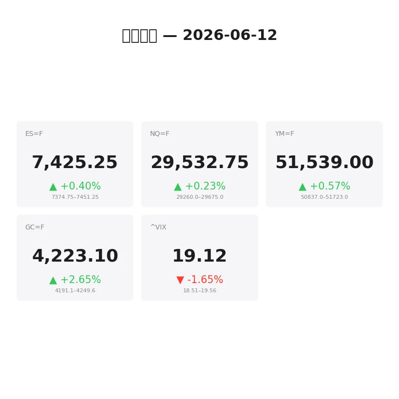
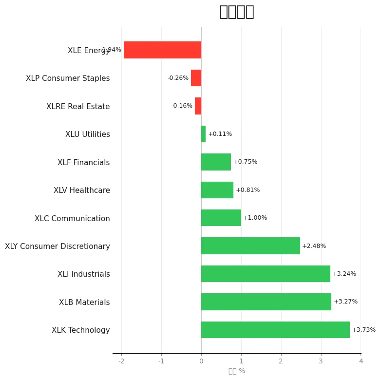
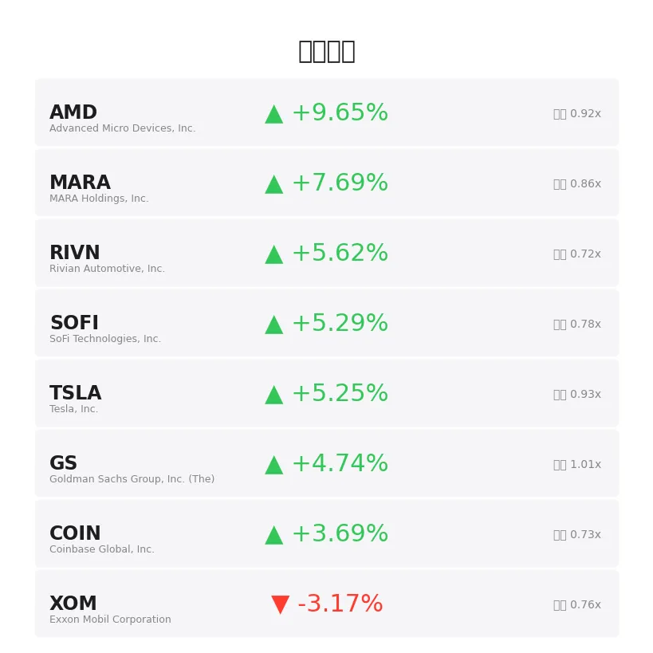
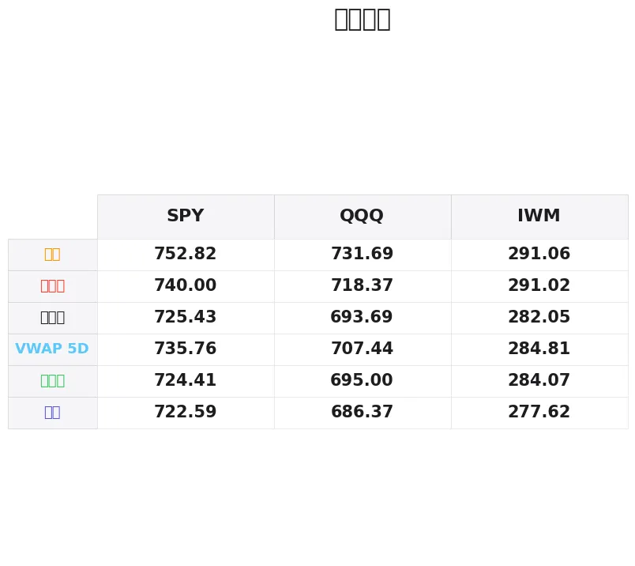

# 盘前分析报告 — 2026-06-12
*生成时间: 12:38:23 UTC*

---
## 数据速览

---
## 一、宏观环境

> [!info]- 详细数据：指数期货 & VIX
> ### 1.1 指数期货 & VIX
> | 品种 | 现价 | 涨跌幅 | 前收 | 日高 | 日低 |
> |------|------|--------|------|------|------|
> | ES=F | 7425.25 | +0.40% | 7396.0 | 7451.25 | 7374.75 |
> | NQ=F | 29532.75 | +0.23% | 29464.75 | 29659.25 | 29260.0 |
> | YM=F | 51539.0 | +0.57% | 51247.0 | 51723.0 | 51212.0 |
> | GC=F | 4223.1 | +2.65% | 4114.0 | 4267.8 | 4191.6 |
> | ^VIX | 19.12 | -1.65% | 19.44 | 19.56 | 18.51 |

> [!info]- 详细数据：隔夜走势
> ### 1.2 隔夜走势（Globex）
> | 品种 | 隔夜高 | 隔夜低 | 区间 | 亚洲高 | 亚洲低 | 欧洲高 | 欧洲低 |
> |------|--------|--------|------|--------|--------|--------|--------|
> | ES=F | 7451.25 | 7374.75 | 76.5 | 7412.75 | 7387.5 | 7451.25 | 7374.75 |
> | NQ=F | 29675.0 | 29260.0 | 415.0 | 29554.75 | 29375.0 | 29675.0 | 29260.0 |
> | YM=F | 51723.0 | 50837.0 | 886.0 | 50943.0 | 50851.0 | 51723.0 | 50837.0 |
> | GC=F | 4249.6 | 4191.1 | 58.5 | 4222.6 | 4192.1 | 4249.6 | 4191.1 |
> | ^VIX | 19.56 | 18.51 | 1.05 | — | — | 19.56 | 18.51 |

> [!info]- 详细数据：板块强弱
> ### 1.3 板块强弱
> | ETF | 板块 | 涨跌幅 |
> |-----|------|--------|
> | XLK | Technology | +3.73% |
> | XLB | Materials | +3.27% |
> | XLI | Industrials | +3.24% |
> | XLY | Consumer Discretionary | +2.48% |
> | XLC | Communication | +1.00% |
> | XLV | Healthcare | +0.81% |
> | XLF | Financials | +0.75% |
> | XLU | Utilities | +0.11% |
> | XLRE | Real Estate | -0.16% |
> | XLP | Consumer Staples | -0.26% |
> | XLE | Energy | -1.94% |

---
## 二、消息面

- **Stock Market Today: Dow Rises On Iran Peace Deal Hopes; SpaceX IPO To Start Trading (Live Coverage)** — *Investor's Business Daily*
- **Elon Musk Only Owns 46% Of SpaceX — Who Has The Rest?** — *Investor's Business Daily*
- **Dan Ives’ Own ETF Is Up 27% YTD. The AI Revolution Trade Is Real.** — *24/7 Wall St.*
- **Batteries Beat the S&P 500: BATT Is Up 25% While SPY Hugs 11%** — *24/7 Wall St.*
- **Wall Street Strategist: Stock Market Just Became a “Buyer’s Dream” After Recent Pull-Back** — *24/7 Wall St.*
- **Forget QQQ as the Same Company Sells the Same Nasdaq-100 for 17% Less** — *24/7 Wall St.*
- **Stocks Settle Sharply Higher on Middle East Peace Hopes** — *Barchart*
- **Exchange-Traded Funds Rise as US Equities Advance After Midday** — *MT Newswires*
- **MoneyMasters Podcast 6-11-26- Palantir, Marvell,  the Three "Hockey Sticks" of AI Growth** — *MoneyShow*
- **Market Fear Index Drops as Investors Hope for Iran Deal** — *Barrons.com*
- **Market Fear Index Dips as Tech Stocks Rebound** — *Barrons.com*
- **Wall Street indexes fall more than 1%, hit by tech, Iran war worries** — *Reuters*
- **ETFs That May Provide Investors Protection From Market Risks** — *Zacks*
- **A Closer Look at an Unusual S&P 500 Pullback** — *Schaeffer's Investment Research*
- **Silver prices today, Friday, June 12, 2026: Strong opening after Trump claims war is over** — *Yahoo Personal Finance*
- **Gold prices today, Friday, June 12: Gold opens much higher after Trump claims Iran war has ended** — *Yahoo Personal Finance*
- **Bernie Sanders says Kevin O'Leary is 'completely separated from the reality that ordinary Americans are experiencing'** — *Moneywise*
- **UBS cuts gold price forecasts on delayed Fed easing outlook** — *Investing.com*
- **TSX futures rise after Trump signals Middle East peace deal** — *Reuters*
- **Stock market today: Dow, S&P 500, Nasdaq drop amid rising bond yields** — *Yahoo Finance*

---
## 三、盘前异动

> [!info]- 详细数据：盘前异动
> | 代码 | 名称 | 现价 | 缺口 | 量比 |
> |------|------|------|------|------|
> | AMD | Advanced Micro Devices, Inc. | 496.06 | +9.65% | 0.92x |
> | MARA | MARA Holdings, Inc. | 13.59 | +7.69% | 0.86x |
> | RIVN | Rivian Automotive, Inc. | 15.59 | +5.62% | 0.72x |
> | SOFI | SoFi Technologies, Inc. | 16.71 | +5.29% | 0.78x |
> | TSLA | Tesla, Inc. | 401.63 | +5.25% | 0.93x |
> | GS | Goldman Sachs Group, Inc. (The) | 1048.77 | +4.74% | 1.01x |
> | COIN | Coinbase Global, Inc. | 159.65 | +3.69% | 0.73x |
> | XOM | Exxon Mobil Corporation | 145.85 | -3.17% | 0.76x |
> | CVX | Chevron Corporation | 184.71 | -2.68% | 0.68x |
> | NVDA | NVIDIA Corporation | 205.39 | +2.48% | 0.82x |

---
## 四、关键价位

> [!info]- 详细数据：SPY 关键价位
> ### SPY
> | 价位类型 | 价格 |
> |----------|------|
> | Prior Day High | 740.0 |
> | Prior Day Low | 724.412 |
> | Prior Day Close | 725.43 |
> | Premarket Price | 740.4476 |
> | Approx Vwap 5D | 735.76 |
> | Weekly High | 752.82 |
> | Weekly Low | 722.59 |

> [!info]- 详细数据：QQQ 关键价位
> ### QQQ
> | 价位类型 | 价格 |
> |----------|------|
> | Prior Day High | 718.3721 |
> | Prior Day Low | 695.0 |
> | Prior Day Close | 693.69 |
> | Premarket Price | 717.94 |
> | Approx Vwap 5D | 707.44 |
> | Weekly High | 731.69 |
> | Weekly Low | 686.37 |

> [!info]- 详细数据：IWM 关键价位
> ### IWM
> | 价位类型 | 价格 |
> |----------|------|
> | Prior Day High | 291.02 |
> | Prior Day Low | 284.07 |
> | Prior Day Close | 282.05 |
> | Premarket Price | 291.6 |
> | Approx Vwap 5D | 284.81 |
> | Weekly High | 291.06 |
> | Weekly Low | 277.62 |

---
## 五、AI 技术分析 & 操盘建议

## 第一部分：隔夜市场回顾

### 亚洲时段（18:00–02:00 ET）

亚洲时段整体交投清淡、波动有限。ES在7387.5–7412.75区间内窄幅震荡，NQ交投于29375–29555之间，均未对前一日收盘价形成有效突破。YM表现最弱，区间仅在50851–50943之间。GC黄金在该时段保持温和上行，亚洲高点4222.6基本持平当前价位。

**解读**：亚洲时段的窄幅震荡表明市场在等待欧洲时段的方向指引。缺乏明确的趋势信号，但买方底部支撑尚可。

### 欧洲时段（02:00–09:30 ET）

欧洲时段才是今夜的主战场。特朗普声称伊朗战争已结束的消息引爆风险偏好：
- **ES** 在欧洲时段创出隔夜新高7451.25，随后回吐至7374.75形成隔夜低点，区间76.5点——波动显著放大
- **NQ** 区间更大：29260–29675，高达415点。欧洲时段的暴力洗盘表明做市商在积极清理双向止损
- **YM** 道指期货最为强势，区间886点（50837–51723），反映的是传统价值/周期股受和平协议刺激最大
- **GC** 黄金欧洲时段冲高至4249.6后小幅回落，日高4267.8。地缘政治不确定性+美元走弱共同支撑金价

### 关键信号

1. **风险偏好明显回暖**：VIX从19.44降至19.07（-1.75%），恐慌指数持续回落；三大指数期货全线上涨
2. **板块轮动剧烈**：科技XLK(+3.73%)、原材料XLB(+3.27%)、工业XLI(+3.24%)领涨；能源XLE(-1.94%)独跌——典型的"战争结束"交易
3. **黄金悖论**：通常地缘缓和利空黄金，但GC仍大涨+2.65%，说明市场定价的是美联储降息预期延后（UBS下调金价预测）与避险需求的博弈，金价强势暗示对"和平"的持续性存疑
4. **SpaceX IPO首日交易**：这是今天的重大事件风险，可能吸走大量市场流动性，关注10:00-11:00 ET的价格发现期

## 第二部分：期货品种分析

### ES（E-mini S&P 500）— 当前价 ~7426

**多时间框架分析：**
- **日线**：昨日收盘7396，今日盘前跳空高开约30点。周线高点752.82对应的SPY→期货换算约7528附近是上方主要阻力。日线结构为回调后的反弹修复，尚未确认突破新高
- **4H**：欧洲时段形成的7451.25是清晰的供给区。7374.75是隔夜低点/需求区。4H趋势看多但接近阻力
- **1H/15min**：盘前价格在7420-7430区间盘整，等待开盘方向选择

**关键价位：**
| 类型 | 价位 | 说明 |
|------|------|------|
| R3 | 7528 | 周线高点对应区域 |
| R2 | 7451 | 隔夜高/欧洲时段高点 |
| R1 | 7426–7430 | 当前盘前价/开盘区 |
| S1 | 7396 | 前收盘 |
| S2 | 7375 | 隔夜低/欧洲时段低点 |
| S3 | 7350 | 周中回调低点区域 |

**方向偏多** | 置信度：70%

**交易计划：**
- **做多方案A（回踩接多）**：等待开盘回踩7396–7405区域（前收盘+VWAP回归），确认15min看涨结构后入场。止损7372（隔夜低点下方），T1: 7430，T2: 7451
- **做多方案B（突破追多）**：若开盘直接突破7451并在5min收盘站稳上方，回踩7445–7451入场。止损7428，T1: 7480，T2: 7528
- **做空方案（防守性）**：仅在7451区域出现明确空头吞没+delta翻负时考虑。止损7465，T1: 7426，T2: 7396
- **失效条件**：若开盘直接跌破7375并无法在5min内收回，多头逻辑失效，观望等待二次结构

---

### NQ（E-mini Nasdaq）— 当前价 ~29538

**多时间框架分析：**
- **日线**：昨收29465，盘前涨约73点（+0.25%）。相比ES和YM，NQ涨幅最小，说明资金在从科技向价值轮动。但XLK日内+3.73%意味着个股层面科技仍然强势（AMD +9.8%）
- **4H**：29675是隔夜高点/关键阻力。29260是隔夜低点/强支撑。415点的隔夜区间说明波动极大
- **1H/15min**：盘前在29520-29550之间盘整，价格偏隔夜区间中上部

**关键价位：**
| 类型 | 价位 | 说明 |
|------|------|------|
| R2 | 29675 | 隔夜高点 |
| R1 | 29555 | 亚洲时段高点 |
| Pivot | 29538 | 当前盘前价 |
| S1 | 29465 | 前收盘 |
| S2 | 29375 | 亚洲时段低点 |
| S3 | 29260 | 隔夜低点 |

**方向偏多** | 置信度：60%（低于ES，因为NQ涨幅相对落后+波动大）

**交易计划：**
- **做多方案**：开盘回踩29465–29480（前收盘回归），15min收盘确认买入。止损29370（亚洲低点下方），T1: 29555，T2: 29675
- **做空方案**：29660–29675区域（隔夜高点）出现明确的卖压信号（累积delta持续走弱、大单抛售）。止损29700，T1: 29540，T2: 29465
- **失效条件**：若跌破29260（隔夜低点），今日NQ转为弱势，不再做多

---

### GC（黄金期货）— 当前价 ~4223

**多时间框架分析：**
- **日线**：大阳线上涨+2.65%（前收4114→现4223），这是一根情绪驱动的大幅跳空线。日高4267.8已经触及短期超买区域
- **4H**：隔夜区间4191–4250。价格目前处于区间中上部。4250-4268区间是日内关键供给区
- **1H/15min**：欧洲时段冲高回落后在4220附近企稳。形态上看像是一面旗形整理

**关键价位：**
| 类型 | 价位 | 说明 |
|------|------|------|
| R2 | 4268 | 日高 |
| R1 | 4250 | 欧洲高/隔夜高 |
| Pivot | 4223 | 当前价 |
| S1 | 4192 | 隔夜低点 |
| S2 | 4114 | 前收盘 |

**方向偏多** | 置信度：65%

**交易计划：**
- **做多方案（旗形突破）**：若价格突破4250并在15min收盘站稳，入场做多。止损4235，T1: 4268，T2: 4290
- **做多方案（回踩接多）**：回踩4192–4200区域（隔夜低点附近），确认15min看涨结构。止损4180，T1: 4230，T2: 4250
- **做空方案**：仅在4265–4270出现清晰的双顶/大单出货时考虑。止损4280，T1: 4235，T2: 4210
- **风险提示**：黄金今日受消息驱动极强，特朗普关于伊朗的任何后续表态都可能引发30-50点的瞬间波动。建议缩小仓位、放宽止损

## 第三部分：ETF品种分析

### SPY（SPDR S&P 500 ETF）— 盘前价 ~740.60

**关键价位总览：**
| 类型 | 价位 | 说明 |
|------|------|------|
| R3 | 752.82 | 周线高点 |
| R2 | 740.77 | 盘前高点 |
| R1 | 740.00 | 前日高点 |
| Pivot | 735.76 | 5日VWAP |
| S1 | 725.43 | 前收盘 |
| S2 | 724.41 | 前日低点 |
| S3 | 722.59 | 周线低点 |

**技术分析：**
SPY盘前跳空高开至740.60，直接回到前日高点740.00上方。这是一个强势的缺口，盘前价格已突破前日整个交易区间（724.41–740.00）。5日VWAP在735.76，盘前价格远在其上方，短期超买但趋势明确偏多。

周线高点752.82是上方第一个重要目标。从当前价到该目标约有12点空间。需要关注开盘后是否能守住740（前日高点转支撑）——若能，则趋势延续看752；若开盘回补缺口跌至735以下，则变为区间震荡。

**交易计划：**
- **做多方案（缺口不补）**：开盘后SPY守住739.50–740.00区域（前日高点回踩），15min收盘确认后做多。止损737.50，T1: 745，T2: 750
- **做多方案（缺口半补后接多）**：若开盘回踩至735–736区域（5日VWAP），出现明显买盘承接后入场。止损733，T1: 740，T2: 745
- **做空方案**：仅在SPY冲击745后出现明显的卖压堆积（成交量激增但价格不再创新高）时考虑短空。止损746.50，T1: 741，T2: 738

---

### QQQ（Invesco QQQ Trust）— 盘前价 ~718.27

**关键价位总览：**
| 类型 | 价位 | 说明 |
|------|------|------|
| R2 | 731.69 | 周线高点 |
| R1 | 718.37 | 前日高点 |
| Pivot | 718.27 | 盘前价（=前日高） |
| VWAP5D | 707.44 | 5日VWAP |
| S1 | 695.00 | 前日低点 |
| S2 | 693.69 | 前收盘 |
| S3 | 686.37 | 周线低点 |

**技术分析：**
QQQ的跳空幅度更为惊人：从693.69直接跳至718.27，缺口高达24.58点（+3.54%）。盘前价格精确到达前日高点718.37，这是一个关键的测试位。

与SPY不同，QQQ的缺口更大、5日VWAP（707.44）距离当前价更远（超过10点），说明QQQ的短期超买程度更高。AMD(+9.8%)和NVDA(+2.5%)的盘前大涨是QQQ的主要驱动力。

**交易计划：**
- **做多方案（突破前日高）**：QQQ需要在开盘后15min内有效站上718.50并持稳，入场做多。止损716，T1: 725，T2: 731
- **做空方案（前日高阻力反转）**：若QQQ在718–719区域受阻，出现15min级别的看跌吞没或pin bar，可考虑做空缺口回补。止损721，T1: 712，T2: 707
- **关键观察**：QQQ的缺口极大，完全不回补的概率较低。开盘后第一根15min K线的收盘位至关重要——若收在715以下，优先考虑空头；若收在720以上，多头延续

## 第四部分：今日市场总览

### 整体市场情绪：偏多（Risk-On）

今日市场情绪受三大催化剂主导：

1. **伊朗和平协议信号** — 特朗普声称战争结束，驱动风险资产全面反弹。但需注意，这类地缘声明的持续性存疑，任何"否认"或"细节分歧"都可能引发快速反转
2. **SpaceX IPO首日交易** — 市场流动性可能被大量吸走。历史上超级IPO首日通常导致大盘波动放大但方向不定
3. **科技反弹+轮动** — XLK领涨+3.73%，AMD盘前+9.8%，但能源XLE-1.94%大幅落后。这是一笔纯粹的"和平交易"

### VIX分析

VIX当前19.07（-1.75%），隔夜区间18.51–19.56。VIX处于19附近意味着市场预期的日内波动约为±1.2%。今天考虑到消息面的不确定性，实际波动可能更大。

**VIX关键位**：
- 18.50以下 = 多头信心充足，可加码
- 19.50以上 = 情绪开始转向谨慎
- 20.00以上 = 和平叙事开始瓦解，切换防守

### 需要回避的时间窗口

| 时间 (ET) | 事件/原因 |
|-----------|-----------|
| 09:30–09:45 | 开盘15分钟流动性陷阱，等待方向确认 |
| 10:00–10:30 | SpaceX IPO可能开始交易，极端波动期 |
| 12:00–13:30 | 午间死区，成交量萎缩 |
| 15:45–16:00 | 周五收盘前的仓位调整，不开新仓 |

### 板块轮动分析

**今日强势板块**：科技(XLK +3.73%)、原材料(XLB +3.27%)、工业(XLI +3.24%)——这是典型的"成长+周期"组合，反映市场对经济前景的乐观预期
**今日弱势板块**：能源(XLE -1.94%)——战争结束叙事直接打压油价和能源股；消费必需品(XLP -0.26%)、房地产(XLRE -0.16%)——防御板块被抛售，资金流向进攻型品种

**异动个股关注**：
- **AMD +9.8%** — 今日盘前最强半导体，可能有未公开的AI芯片消息，关注开盘后能否维持涨幅
- **TSLA +5.4%** — 受益于风险偏好回暖+SpaceX IPO溢出效应
- **XOM -3.2% / CVX -2.7%** — 能源股做空机会，但需等待盘中确认，勿追空

---

### 🎯 今日核心交易论点

**"和平缺口买入，但保持灵活"** — 伊朗和平信号驱动的跳空高开提供了多头机会，优先做ES回踩7396-7405的接多。但缺口越大、消息面越不确定，越需要严格执行止损。今天不是满仓干的日子，是轻仓+精准择时的日子。SpaceX IPO的流动性冲击是最大的未知变量——10点前完成第一笔交易，10点后观望至IPO定价完成。

> **仓位管理建议**：今日最大风险敞口不超过常规的70%。每笔交易风险控制在账户的0.5-0.75%。优先做ES/SPY，次选GC，谨慎做NQ/QQQ（波动太大、缺口太大）。
