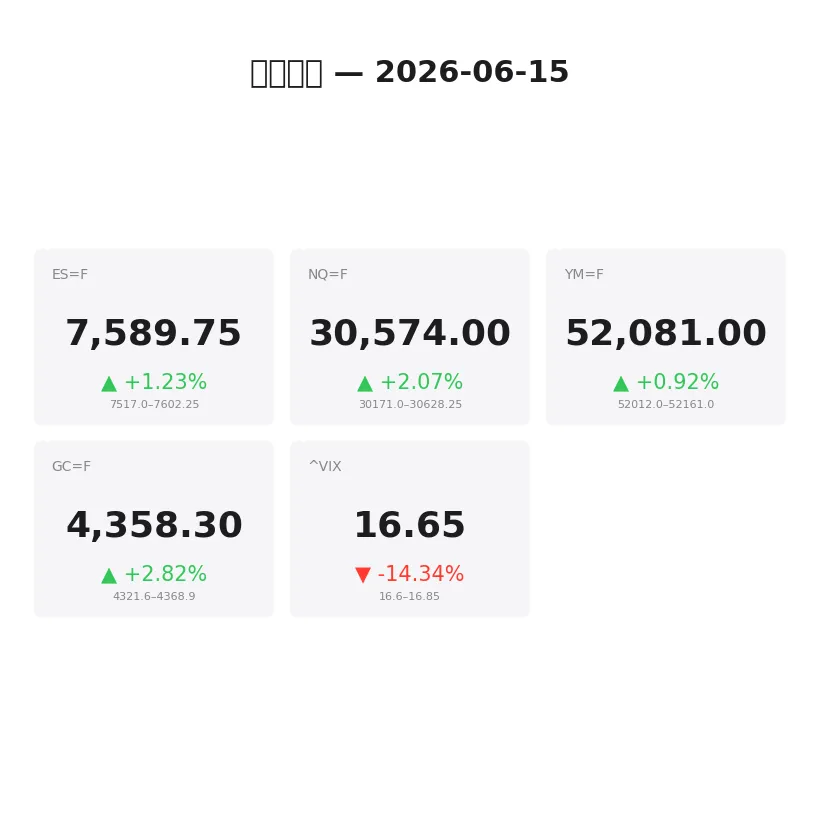
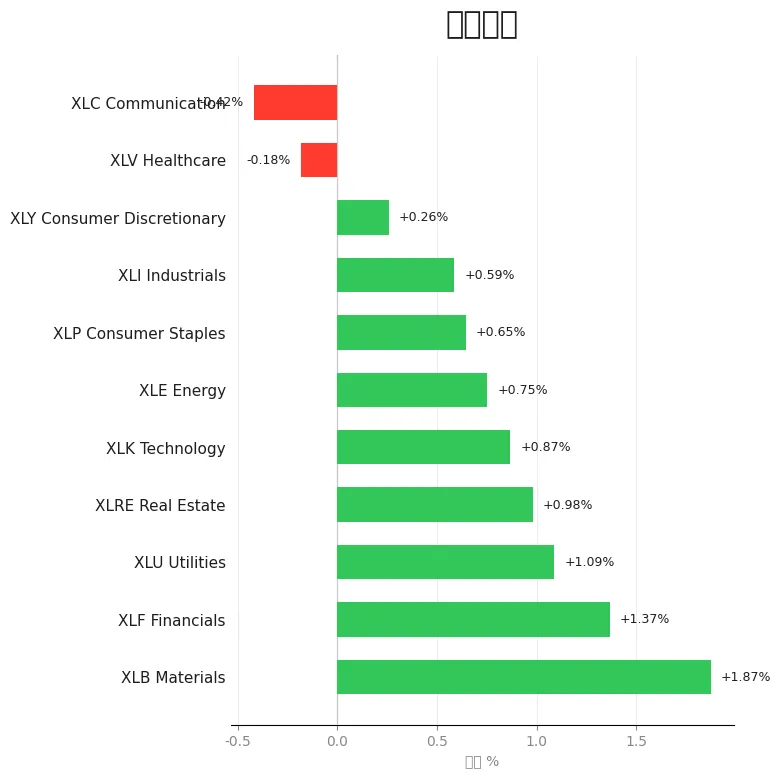
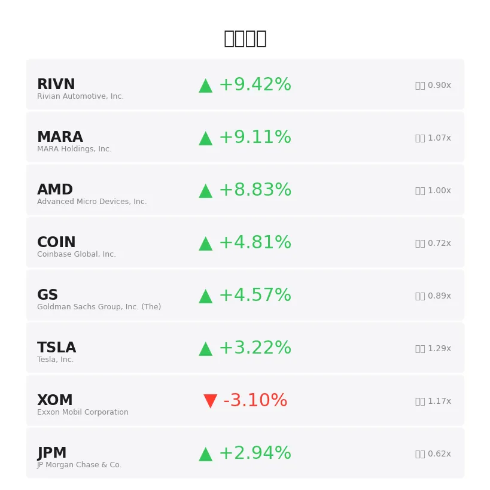
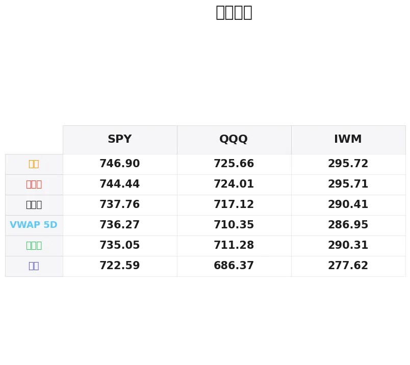

# 盘前分析报告 — 2026-06-15
*生成时间: 12:36:28 UTC*

---
## 数据速览

---
## 一、宏观环境

> [!info]- 详细数据：指数期货 & VIX
> ### 1.1 指数期货 & VIX
> | 品种 | 现价 | 涨跌幅 | 前收 | 日高 | 日低 |
> |------|------|--------|------|------|------|
> | ES=F | 7589.75 | +1.23% | 7497.5 | 7602.25 | 7542.0 |
> | NQ=F | 30574.0 | +2.07% | 29954.75 | 30628.25 | 30191.0 |
> | YM=F | 52081.0 | +0.92% | 51605.0 | 52161.0 | 51743.0 |
> | GC=F | 4358.3 | +2.82% | 4238.8 | 4368.7 | 4283.4 |
> | ^VIX | 16.65 | -14.34% | 19.44 | 16.85 | 16.6 |

> [!info]- 详细数据：隔夜走势
> ### 1.2 隔夜走势（Globex）
> | 品种 | 隔夜高 | 隔夜低 | 区间 | 亚洲高 | 亚洲低 | 欧洲高 | 欧洲低 |
> |------|--------|--------|------|--------|--------|--------|--------|
> | ES=F | 7602.25 | 7517.0 | 85.25 | 7531.25 | 7517.0 | 7602.25 | 7521.0 |
> | NQ=F | 30628.25 | 30171.0 | 457.25 | 30244.75 | 30171.0 | 30628.25 | 30220.0 |
> | YM=F | 52161.0 | 52012.0 | 149.0 | 52151.0 | 52039.0 | 52161.0 | 52012.0 |
> | GC=F | 4368.9 | 4321.6 | 47.3 | 4353.9 | 4328.6 | 4368.9 | 4321.6 |
> | ^VIX | 16.85 | 16.6 | 0.25 | — | — | 16.85 | 16.6 |

> [!info]- 详细数据：板块强弱
> ### 1.3 板块强弱
> | ETF | 板块 | 涨跌幅 |
> |-----|------|--------|
> | XLB | Materials | +1.87% |
> | XLF | Financials | +1.37% |
> | XLU | Utilities | +1.09% |
> | XLRE | Real Estate | +0.98% |
> | XLK | Technology | +0.87% |
> | XLE | Energy | +0.75% |
> | XLP | Consumer Staples | +0.65% |
> | XLI | Industrials | +0.59% |
> | XLY | Consumer Discretionary | +0.26% |
> | XLV | Healthcare | -0.18% |
> | XLC | Communication | -0.42% |

---
## 二、消息面

- **今日股市：美伊达成协议，道指飙升500点；油价大幅下跌（实时报道）** — *Investor’s Business Daily*
  > Stock Market Today: Dow Rallies 500 Points On U.S.-Iran Deal; Oil Prices Tumble (Live Coverage)
- **当前AI市场已触发2000年纳斯达克崩盘前的全部5个预警信号** — *24/7 Wall St.*
  > Today’s AI market hits all 5 warning signs that preceded 2000 Nasdaq crash.
- **纳指、标普500、道指期货上涨，油价下滑——美伊协议暗示霍尔木兹海峡中断结束：DJT、NFLX、GLXY、SPCX成焦点** — *Stocktwits*
  > Nasdaq, S&P 500, Dow Futures Climb While Oil Slides As US-Iran Deal Signals End To Hormuz Disruption: DJT, NFLX, GLXY, SPCX In Focus
- **被誉为最佳股票投资的标普500指数基金是否已变得危险？令人担忧的新趋势及可能更优的替代方案** — *Motley Fool*
  > Have S&P 500 Index Funds, Often Touted as the Best Stock Investments, Become Dangerous? There’s a Worrisome Development -- and a Possibly Better Alternative.
- **苏泽·奥曼建议54岁拥有60万美元的投资者：省下1.5%管理费，自己理财** — *24/7 Wall St.*
  > Suze Orman to 54-Year-Old With $600,000: Skip the 1.5% Fee and Manage It Yourself
- **他从5万美元起步，押上房产购买TQQQ，最终赚到1000万美元** — *24/7 Wall St.*
  > He Started With $50k, Then Bet His House to Buy TQQQ and Turned it Into $10 Million
- **别听理财网红推销的"三重ETF策略"——用这只精选基金管理风险和波动性** — *Barchart*
  > Ignore the Financial Influencers Pushing a ‘Trifecta’ ETF Strategy. Manage Risk and Volatility with 1 of These Savvy Funds Instead.
- **美伊紧张局势缓和，华尔街恐慌指数大幅回落** — *Barrons.com*
  > Wall Street Fear Index Drops as Iran Worries Ease
- **SpaceX上市，通胀跳升至三年多新高** — *Detroit Free Press*
  > SpaceX goes public, inflation jumps to over 3-year highs
- **投资者寄望美伊协议，市场恐慌指数回落** — *Barrons.com*
  > Market Fear Index Drops as Investors Hope for Iran Deal
- **科技股反弹，市场恐慌指数走低** — *Barrons.com*
  > Market Fear Index Dips as Tech Stocks Rebound
- **科技股与伊朗战争忧虑拖累华尔街主要指数跌超1%** — *Reuters*
  > Wall Street indexes fall more than 1%, hit by tech, Iran war worries
- **6月15日白银价格：美伊停火协议推动银价上涨** — *Yahoo Personal Finance*
  > Silver prices today, Monday, June 15, 2026: Silver prices moving up following U.S., Iran ceasefire deal
- **6月15日黄金价格：美伊停火协议后金价走高** — *Yahoo Personal Finance*
  > Gold prices today, Monday, June 15: Gold moves higher following U.S., Iran ceasefire agreement
- **PYBAR在澳大利亚获得三份新矿业合同** — *Mining Technology*
  > PYBAR secures three new mine contracts in Australia
- **美伊协议打压油价，金银之争终见分晓** — *BeInCrypto*
  > The Gold vs Silver Debate Picks a Side as the US-Iran Deal Sinks Oil
- **中东和平协议下黄金逆势攀升** — *InvestorsHub*
  > Gold Climbs Despite Middle East Peace Agreement
- **今日股市：美伊重开霍尔木兹海峡协议推动道指、标普500、纳指期货飙升** — *Yahoo Finance*
  > Stock market today: Dow, S&P 500, Nasdaq futures soar on US-Iran pact to reopen Hormuz
- **今日股市：国债收益率上升拖累道指、标普500、纳指下跌** — *Yahoo Finance*
  > Stock market today: Dow, S&P 500, Nasdaq drop amid rising bond yields
- **伊朗战争忧虑下富时100与美股大幅下挫，油价剧烈波动** — *Yahoo Finance UK*
  > FTSE 100 and US stocks dive and oil swings amid Iran war jitters

---
## 三、盘前异动

> [!info]- 详细数据：盘前异动
> | 代码 | 名称 | 现价 | 缺口 | 量比 |
> |------|------|------|------|------|
> | RIVN | Rivian Automotive, Inc. | 17.0 | +9.42% | 0.9x |
> | MARA | MARA Holdings, Inc. | 14.85 | +9.11% | 1.07x |
> | AMD | Advanced Micro Devices, Inc. | 531.6 | +8.83% | 1.0x |
> | COIN | Coinbase Global, Inc. | 168.15 | +4.81% | 0.72x |
> | GS | Goldman Sachs Group, Inc. (The) | 1083.0 | +4.57% | 0.89x |
> | TSLA | Tesla, Inc. | 412.0 | +3.22% | 1.29x |
> | XOM | Exxon Mobil Corporation | 142.06 | -3.10% | 1.17x |
> | JPM | JP Morgan Chase & Co. | 322.7 | +2.94% | 0.62x |
> | BAC | Bank of America Corporation | 56.46 | +2.35% | 0.79x |
> | SOFI | SoFi Technologies, Inc. | 17.06 | +2.34% | 0.67x |

---
## 四、关键价位

> [!info]- 详细数据：SPY 关键价位
> ### SPY
> | 价位类型 | 价格 |
> |----------|------|
> | Prior Day High | 744.44 |
> | Prior Day Low | 735.05 |
> | Prior Day Close | 737.76 |
> | Premarket Price | 750.851 |
> | Approx Vwap 5D | 736.27 |
> | Weekly High | 746.9 |
> | Weekly Low | 722.59 |

> [!info]- 详细数据：QQQ 关键价位
> ### QQQ
> | 价位类型 | 价格 |
> |----------|------|
> | Prior Day High | 724.01 |
> | Prior Day Low | 711.28 |
> | Prior Day Close | 717.12006 |
> | Premarket Price | 736.1696 |
> | Approx Vwap 5D | 710.35 |
> | Weekly High | 725.66 |
> | Weekly Low | 686.37 |

> [!info]- 详细数据：IWM 关键价位
> ### IWM
> | 价位类型 | 价格 |
> |----------|------|
> | Prior Day High | 295.715 |
> | Prior Day Low | 290.31 |
> | Prior Day Close | 290.41 |
> | Premarket Price | 297.2195 |
> | Approx Vwap 5D | 286.95 |
> | Weekly High | 295.72 |
> | Weekly Low | 277.62 |

---
## 五、AI 技术分析 & 操盘建议

## 第一部分：隔夜市场回顾

### 亚洲时段（18:00-02:00 ET）
亚洲时段整体表现温和偏多。ES在7517-7531区间窄幅震荡，仅14点波动，反映亚洲交易者对美伊协议消息的初步消化。NQ在30171-30244区间运行，波幅约73点。GC在4328-4353区间整理，避险情绪有所降温但金价底部抬升。整体特征：低波动率的蓄势整理，买盘在低位有接手。

### 欧洲时段（02:00-09:30 ET）
欧洲开盘后行情显著加速。ES从7521拉升至7602.25，波幅扩至81点，突破了亚洲高点后持续走高。NQ表现最为强劲，从30220推至30628.25，涨幅逾400点，科技股多头主导。GC同步走高至4368.9，尽管地缘紧张缓和通常利空黄金，但通胀担忧（SpaceX IPO推高风险偏好+通胀跳升至三年新高）为贵金属提供支撑。

### 对美盘的启示
1. **缺口性质判断**：ES跳空约92点（+1.23%），NQ跳空约619点（+2.07%）。考虑到催化剂量级（霍尔木兹海峡重开=全球供应链利好），这属于**突破型缺口（Breakaway Gap）**，短期内大概率不会完全回补。
2. **VIX骤降14.34%至16.65**：恐慌指数大幅跳水说明空头被迫回补、期权市场快速定价风险下降。但VIX绝对值仍在16+，并非极低，后续仍有波动空间。
3. **板块轮动线索**：材料（XLB +1.87%）和金融（XLF +1.37%）领涨，通信服务（XLC -0.42%）和医疗（XLV -0.18%）落后。资金流向偏周期而非纯科技防御，属于典型的"Risk-On轮动"。
4. **油价逻辑**：美伊协议 → 霍尔木兹重开 → 原油供应预期增加 → 油价暴跌 → XOM等能源股承压（-3.10%），但同时降低通胀预期 → 利好大盘。

## 第二部分：期货品种分析

### ES（E-mini S&P 500）— 现价 7589.75

**多时间框架分析：**
- **日线**：上周五收于7497.5，今日跳空高开92点。周线级别此前在7400-7500区间构建了约两周的整理平台，今日跳空突破。若日线收于7550以上，确认突破有效。
- **4H**：隔夜从7517启动的单边上涨结构清晰，欧洲时段高点7602.25形成短期阻力。目前价格在7590附近运行，距离高点仅12点，属于高位盘整而非回落，强势特征。
- **1H/15min**：关注开盘后对7602.25（隔夜高点/Globex高点）的测试——突破则打开上方空间，受阻则先回踩整理。

**关键价位：**
| 类型 | 价位 | 说明 |
|------|------|------|
| 阻力R2 | 7625-7640 | 心理整数位+潜在延伸目标 |
| 阻力R1 | 7602.25 | 隔夜/Globex高点 |
| 枢轴 | 7590 | 盘前运行中枢 |
| 支撑S1 | 7550-7560 | 跳空缺口上沿+欧洲时段回踩低点 |
| 支撑S2 | 7517-7521 | 隔夜低点/亚洲低点 |
| 支撑S3 | 7497.5 | 前收盘价（完全回补缺口） |

**方向偏向：** 偏多（置信度 75%）
- **做多方案A（突破追踪）**：突破7602.25后回踩不破7595，入场做多。止损7580，T1: 7625，T2: 7650。
- **做多方案B（回踩接多）**：回落至7550-7560支撑区企稳（观察delta转正+成交量萎缩），入场做多。止损7535，T1: 7590，T2: 7602。
- **失效条件**：跌破7517（隔夜低点），多头逻辑完全失效，缺口有完全回补风险。

### NQ（E-mini Nasdaq 100）— 现价 30574

**多时间框架分析：**
- **日线**：跳空619点（+2.07%），为近期最大单日缺口。AMD盘前+8.83%是科技股的核心驱动力，叠加美伊协议降低供应链风险。NQ对科技情绪极其敏感，今日属于beta放大行情。
- **4H**：从30171到30628.25的单边拉升结构非常清晰，457点波幅。价格在30574运行，距高点约54点。
- **1H/15min**：30628.25为关键阻力。开盘后NQ波动通常高于ES，注意假突破风险。

**关键价位：**
| 类型 | 价位 | 说明 |
|------|------|------|
| 阻力R2 | 30800-30850 | 前期密集成交区域 |
| 阻力R1 | 30628.25 | 隔夜/Globex高点 |
| 枢轴 | 30550-30575 | 盘前运行中枢 |
| 支撑S1 | 30350-30400 | 欧洲时段回踩区域 |
| 支撑S2 | 30220 | 欧洲时段低点 |
| 支撑S3 | 30171 | 隔夜低点 |

**方向偏向：** 偏多（置信度 70%）——波动率高于ES，仓位应适当减小
- **做多方案**：突破30628后回踩30600-30610不破，入场。止损30550，T1: 30750，T2: 30850。
- **回踩方案**：回落至30350-30400区间企稳，观察买入delta回升，入场。止损30300，T1: 30575，T2: 30628。
- **失效条件**：跌破30171（隔夜低点），空头占据主动。

### GC（黄金期货）— 现价 4358.3

**多时间框架分析：**
- **日线**：+2.82%（+119.5点），虽然美伊停火理论上减少避险需求，但金价反而大涨——这说明市场将通胀叙事（三年新高）置于地缘避险之上。黄金的底层逻辑已从"避险资产"转变为"抗通胀资产"，这一结构性变化非常重要。
- **4H**：从4283.4到4368.9的大幅攀升，波幅85.5点。价格在4358附近运行，接近高点。
- **1H**：欧洲时段推动主升浪，亚洲时段底部4328-4330是短期关键支撑。

**关键价位：**
| 类型 | 价位 | 说明 |
|------|------|------|
| 阻力R2 | 4400 | 心理大关 |
| 阻力R1 | 4368.9 | 隔夜高点 |
| 枢轴 | 4358 | 盘前运行区域 |
| 支撑S1 | 4330-4335 | 亚洲时段低点区域 |
| 支撑S2 | 4321.6 | 隔夜低点 |
| 支撑S3 | 4283.4 | 日低/前期结构支撑 |

**方向偏向：** 偏多（置信度 72%）
- **做多方案**：突破4368.9后回踩4360不破，入场。止损4345，T1: 4390，T2: 4400。
- **回踩方案**：回落至4330-4335企稳，入场。止损4318，T1: 4358，T2: 4368。
- **失效条件**：跌破4321.6（隔夜低点），通胀交易暂时失效。
- **特别注意**：黄金与股指同涨的背景下，若股指开盘后回落，黄金可能表现相对抗跌——可作为对冲工具。

## 第三部分：ETF品种分析

### SPY — 盘前价 750.85

**关键价位梳理：**
| 类型 | 价位 | 说明 |
|------|------|------|
| 阻力R2 | 758-760 | 潜在延伸目标 |
| 阻力R1 | 750-752 | 盘前运行区域+心理关口 |
| 枢轴 | 746.9 | 周高点 |
| 支撑S1 | 744.44 | 前日高点 |
| 支撑S2 | 737.76 | 前日收盘价 |
| 支撑S3 | 736.27 | 5日VWAP |
| 支撑S4 | 735.05 | 前日低点 |

**盘前缺口分析：**
SPY盘前750.85 vs 前收737.76 = 跳空+13.09点（+1.77%）。这是对前日高点744.44的突破性跳空，价格已站上周高点746.9。5日VWAP在736.27，大幅偏离均值说明今日是极端单边日的概率较高。

**交易计划：**
- **做多（顺势）**：开盘后若能守住748-750区间（前周高点上方），可在回踩企稳后做多。止损746，T1: 755，T2: 758。
- **做空（逆势/高风险）**：仅在价格跌破744.44（前日高点变支撑失败）后考虑短空至737.76（缺口回补）。此方案为逆势操作，仓位减半。
- **关注点**：开盘前30分钟的成交量集中度——若放量突破752则追踪做多，若缩量滞涨则需警惕缺口回补。

### QQQ — 盘前价 736.17

**关键价位梳理：**
| 类型 | 价位 | 说明 |
|------|------|------|
| 阻力R2 | 745-750 | 前期密集区域 |
| 阻力R1 | 736-738 | 盘前运行区域 |
| 枢轴 | 725.66 | 周高点 |
| 支撑S1 | 724.01 | 前日高点 |
| 支撑S2 | 717.12 | 前日收盘价 |
| 支撑S3 | 711.28 | 前日低点 |
| 支撑S4 | 710.35 | 5日VWAP |

**盘前缺口分析：**
QQQ盘前736.17 vs 前收717.12 = 跳空+19.05点（+2.66%）。这是远超前日高点724.01的巨大缺口（+12.16点越过PDH），也远超周高点725.66。缺口幅度极大，说明NQ科技股的alpha显著。5日VWAP在710.35，价格偏离度约+3.6%，属于极端偏离。

**交易计划：**
- **做多（顺势）**：开盘后若首根5分钟K线守住733+，等待回踩企稳做多。止损730，T1: 740，T2: 745。AMD（+8.83%）是今日NQ/QQQ的锚——关注AMD的盘中走势作为QQQ的领先指标。
- **做空（均值回归）**：仅在开盘首30分钟出现明确的卖出信号（如放量长上影线、连续down tick）后考虑。目标回到725.66（周高点），止损设在入场高点+2点。
- **注意事项**：QQQ缺口远大于SPY（+2.66% vs +1.77%），意味着今日NQ/QQQ的beta更高，波动更大。适当缩小仓位，用SPY的走势验证QQQ的方向。

## 第四部分：今日市场总览

### 整体情绪判断
**偏多，但需保持警惕。** 美伊协议是今日最大催化剂，驱动了大幅跳空高开。VIX从19.44暴跌至16.65（-14.34%），空头被大规模挤压。板块轮动呈现典型的Risk-On格局（材料+金融领涨，通信+医疗落后）。但需注意几个风险点：
1. **通胀叙事未解决**——SpaceX IPO+通胀跳升至三年新高的消息与"Risk-On"形成矛盾，这也是黄金与股指同涨的原因
2. **缺口幅度极大**——ES +1.23%、NQ +2.07%的跳空在无FOMC/重大财报的背景下属于罕见级别，部分缺口可能在盘中或次日回补
3. **周一效应**——周一往往是方向确立日，但也容易出现开盘后半小时的假突破

### VIX 解读
VIX从19.44跌至16.65（-14.34%）。VIX的16-17区间在历史上属于"中性偏低"水平，说明市场恐慌已充分释放。但注意：VIX在16以下才是真正的低波区间，当前水平下仍可能出现日内2-3%级别的波动。若VIX盘中跌破16，做空波动率的策略可能加速推升股指。

### 需要规避的时间窗口
| 时间（ET） | 事件/风险 |
|------------|-----------|
| 09:30-10:00 | 开盘首30分钟：跳空行情下机构order flow集中释放，假突破概率高。建议观察不参与，等10:00后方向明确。 |
| 10:00 | 关注是否有经济数据发布（如有则可能引发波动） |
| 11:30-13:00 | 午盘低量期：大缺口日的午盘容易出现缓慢回补，谨防被套 |
| 15:00-15:30 | MOC（收盘竞价）流入前：方向可能反转 |

### 板块轮动要点
- **做多方向**：材料（XLB +1.87%）、金融（XLF +1.37%）——受益于降低地缘风险+经济复苏预期
- **做多方向**：科技（XLK +0.87%）——AMD +8.83%领涨芯片板块，但注意科技整体涨幅不如周期板块，说明资金在分散配置而非纯追科技
- **回避**：通信服务（XLC -0.42%）、医疗保健（XLV -0.18%）——资金流出防御板块
- **做空方向**：能源（XOM -3.10%）——油价下跌直接利空，但注意超跌反弹风险

### 盘前异动个股关注
- **RIVN +9.42%**：电动车板块受风险偏好提振，但量比仅0.9x，盘中若放量突破则可追踪
- **AMD +8.83%**：今日科技板块核心驱动力，关注其走势作为NQ/QQQ的领先信号
- **TSLA +3.22%（量比1.29x）**：放量上涨，关注能否突破前期阻力，可能是日内最有持续性的做多标的
- **XOM -3.10%（量比1.17x）**：放量下跌，若反弹至开盘价附近企稳不了，可顺势做空

---

### 🎯 核心交易论点（One-Liner）

**美伊协议催化的突破型缺口行情：顺势做多ES/NQ为主线，回踩前日高点（ES 7602/SPY 744）不破即为最佳入场时机；黄金（GC）的通胀逻辑独立于地缘事件，同步偏多；严格规避开盘首30分钟假突破，缺口不回补则持仓过午。**
