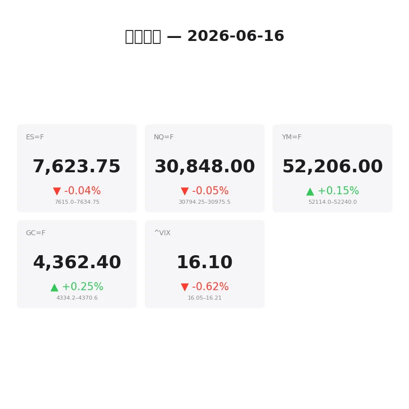
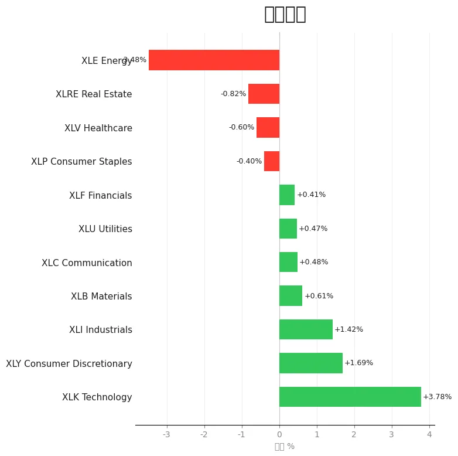
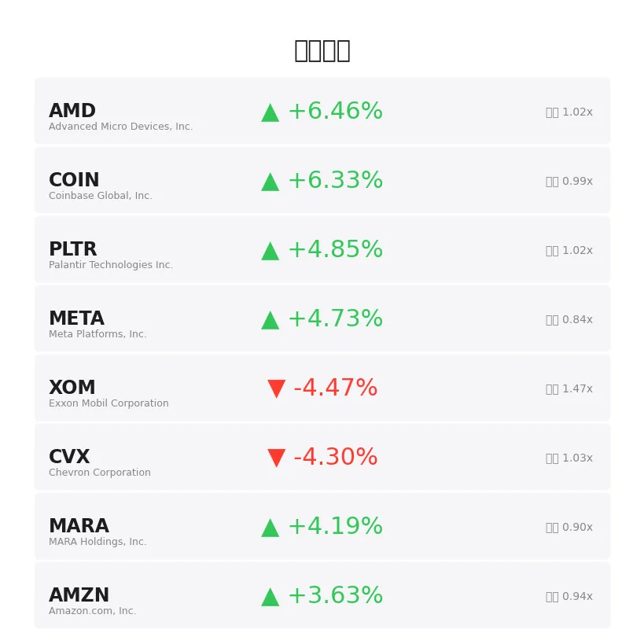
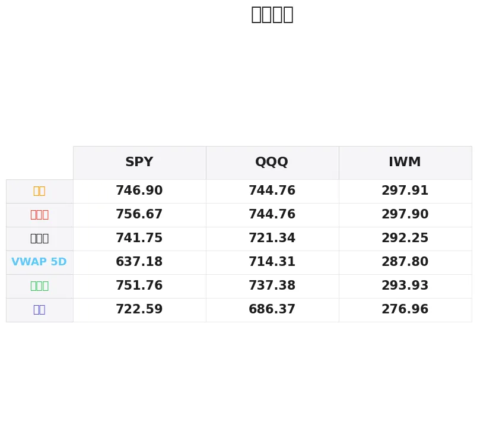

# 盘前分析报告 — 2026-06-16
*生成时间: 12:35:29 UTC*

---
## 数据速览

---
## 一、宏观环境

> [!info]- 详细数据：指数期货 & VIX
> ### 1.1 指数期货 & VIX
> | 品种 | 现价 | 涨跌幅 | 前收 | 日高 | 日低 |
> |------|------|--------|------|------|------|
> | ES=F | 7623.75 | -0.04% | 7626.5 | 7634.75 | 7612.0 |
> | NQ=F | 30848.0 | -0.05% | 30864.25 | 30975.5 | 30755.0 |
> | YM=F | 52206.0 | +0.15% | 52129.0 | 52239.0 | 52080.0 |
> | GC=F | 4362.4 | +0.25% | 4351.6 | 4370.0 | 4326.7 |
> | ^VIX | 16.1 | -0.62% | 16.2 | 16.21 | 16.05 |

> [!info]- 详细数据：隔夜走势
> ### 1.2 隔夜走势（Globex）
> | 品种 | 隔夜高 | 隔夜低 | 区间 | 亚洲高 | 亚洲低 | 欧洲高 | 欧洲低 |
> |------|--------|--------|------|--------|--------|--------|--------|
> | ES=F | 7634.75 | 7615.0 | 19.75 | 7625.25 | 7615.0 | 7634.5 | 7617.0 |
> | NQ=F | 30975.5 | 30794.25 | 181.25 | 30846.5 | 30794.25 | 30975.5 | 30797.75 |
> | YM=F | 52240.0 | 52114.0 | 126.0 | 52185.0 | 52114.0 | 52240.0 | 52135.0 |
> | GC=F | 4370.6 | 4334.2 | 36.4 | 4353.0 | 4335.5 | 4370.6 | 4334.2 |
> | ^VIX | 16.21 | 16.05 | 0.16 | — | — | 16.21 | 16.05 |

> [!info]- 详细数据：板块强弱
> ### 1.3 板块强弱
> | ETF | 板块 | 涨跌幅 |
> |-----|------|--------|
> | XLK | Technology | +3.78% |
> | XLY | Consumer Discretionary | +1.69% |
> | XLI | Industrials | +1.42% |
> | XLB | Materials | +0.61% |
> | XLC | Communication | +0.48% |
> | XLU | Utilities | +0.47% |
> | XLF | Financials | +0.41% |
> | XLP | Consumer Staples | -0.40% |
> | XLV | Healthcare | -0.60% |
> | XLRE | Real Estate | -0.82% |
> | XLE | Energy | -3.48% |

---
## 二、消息面

- **戴夫·拉姆齐为何选择5000美元指数基金而非SpaceX：数学解析** — *24/7 Wall St.*
  > Why Dave Ramsey Chooses $5,000 Index Funds Over SpaceX: The Math Explained
- **今日股市：美联储会议前道指上涨；SpaceX持续飙升（实时报道）** — *Investor's Business Daily*
  > Stock Market Today: Dow Rises Ahead Of Fed Meet; SpaceX Continues To Soar (Live Coverage)
- **美联储会否终结标普500的反弹行情？** — *Trefis*
  > Will The Fed Kill The S&P 500's Relief Rally?
- **道指创历史新高，纳指和标普受美伊协议及SpaceX乐观情绪推动大涨——SPCX、NVDA、ROKU、CRM、AMZN受关注** — *Stocktwits*
  > Dow Hits Record High, Nasdaq And S&P 500 Jump On US-Iran Deal And SpaceX Optimism — SPCX, NVDA, ROKU, CRM, AMZN In Focus
- **共同基金转换为ETF的理由：资金流向分析** — *etf.com*
  > The Case For Mutual Fund-To-ETF Conversion: Flow Picture
- **Zacks分析师博客聚焦SPCX、IWF、QQQ、ORBX、NASA、MARS等ETF** — *Zacks*
  > The Zacks Analyst Blog Highlights SPCX, IWF, QQQ, ORBX, NASA, MARS, JEDI, AIS, UFO, RONB and XOVR
- **每日ETF资金流向：NASA、ARKK、ARKQ受益于SPCX上市** — *etf.com*
  > Daily ETF Flows: NASA, ARKK, ARKQ Benefit From SPCX IPO
- **伊朗局势担忧缓解，华尔街恐慌指数回落** — *Barrons.com*
  > Wall Street Fear Index Drops as Iran Worries Ease
- **SpaceX上市，通胀跃升至三年多来最高水平** — *Detroit Free Press*
  > SpaceX goes public, inflation jumps to over 3-year highs
- **投资者期待伊朗协议，市场恐慌指数下降** — *Barrons.com*
  > Market Fear Index Drops as Investors Hope for Iran Deal
- **科技股反弹，市场恐慌指数小幅回落** — *Barrons.com*
  > Market Fear Index Dips as Tech Stocks Rebound
- **受科技股及伊朗战争忧虑拖累，华尔街指数跌逾1%** — *Reuters*
  > Wall Street indexes fall more than 1%, hit by tech, Iran war worries
- **6月16日周二白银价格：美联储会议前录得一周多以来最佳开盘价** — *Yahoo Personal Finance*
  > Silver prices today, Tuesday, June 16: Best opening price in over a week ahead of Fed meeting
- **Troilus Mining发布Connector Zone最新钻探结果** — *MT Newswires*
  > Troilus Mining Provides Latest Drill Results from Connector Zone
- **各国央行重新考虑黄金储存地点** — *The Wall Street Journal*
  > Central Banks Are Rethinking Where They Store Their Gold
- **Elemental Royalty（TSX:ELE）宣布5%回购计划后，股价或仍低于公允价值4%** — *Simply Wall St.*
  > Elemental Royalty (TSX:ELE) Stock Could Be 4% Below Fair Value After 5% Buyback Plan
- **前高盛分析师看涨至1000美元，XRP大幅反弹** — *BeInCrypto*
  > XRP Rallies as Former Goldman Analyst Backs $1,000 Target
- **今日股市：债券收益率上升，道指、标普500、纳指下跌** — *Yahoo Finance*
  > Stock market today: Dow, S&P 500, Nasdaq drop amid rising bond yields
- **伊朗战争紧张局势下，富时100和美股大跌，油价剧烈波动** — *Yahoo Finance UK*
  > FTSE 100 and US stocks dive and oil swings amid Iran war jitters
- **美联储会议及伊朗冲突在即，富时100和美股反弹** — *Yahoo Finance UK*
  > FTSE 100 and US stocks rally with Fed meeting and Iran conflict in view

---
## 三、盘前异动

> [!info]- 详细数据：盘前异动
> | 代码 | 名称 | 现价 | 缺口 | 量比 |
> |------|------|------|------|------|
> | AMD | Advanced Micro Devices, Inc. | 544.6 | +6.46% | 1.02x |
> | COIN | Coinbase Global, Inc. | 169.9 | +6.33% | 0.99x |
> | PLTR | Palantir Technologies Inc. | 134.2 | +4.85% | 1.02x |
> | META | Meta Platforms, Inc. | 593.79 | +4.73% | 0.84x |
> | XOM | Exxon Mobil Corporation | 140.44 | -4.47% | 1.47x |
> | CVX | Chevron Corporation | 179.17 | -4.30% | 1.03x |
> | MARA | MARA Holdings, Inc. | 14.67 | +4.19% | 0.9x |
> | AMZN | Amazon.com, Inc. | 247.22 | +3.63% | 0.94x |
> | SOFI | SoFi Technologies, Inc. | 17.13 | +3.32% | 1.03x |
> | NVDA | NVIDIA Corporation | 211.31 | +2.98% | 0.79x |

---
## 四、关键价位

> [!info]- 详细数据：SPY 关键价位
> ### SPY
> | 价位类型 | 价格 |
> |----------|------|
> | Prior Day High | 756.67 |
> | Prior Day Low | 751.76 |
> | Prior Day Close | 741.75 |
> | Premarket Price | 754.46 |
> | Approx Vwap 5D | 637.18 |
> | Weekly High | 746.9 |
> | Weekly Low | 722.59 |

> [!info]- 详细数据：QQQ 关键价位
> ### QQQ
> | 价位类型 | 价格 |
> |----------|------|
> | Prior Day High | 744.7599 |
> | Prior Day Low | 737.38 |
> | Prior Day Close | 721.34 |
> | Premarket Price | 743.5 |
> | Approx Vwap 5D | 714.31 |
> | Weekly High | 744.76 |
> | Weekly Low | 686.37 |

> [!info]- 详细数据：IWM 关键价位
> ### IWM
> | 价位类型 | 价格 |
> |----------|------|
> | Prior Day High | 297.9 |
> | Prior Day Low | 293.93 |
> | Prior Day Close | 292.255 |
> | Premarket Price | 295.17 |
> | Approx Vwap 5D | 287.8 |
> | Weekly High | 297.91 |
> | Weekly Low | 276.96 |

---
## 五、AI 技术分析 & 操盘建议

## 第一部分：隔夜市场回顾

### 亚洲时段（18:00–02:00 ET）

- **ES** 亚洲时段窄幅整理，区间仅10.25点（7615.0–7625.25），价格贴近隔夜低点运行，多空博弈平淡。NQ同步弱势，亚盘低点30794.25即为Globex低点，显示亚盘是空方主导。
- **GC** 黄金亚盘在4335.5–4353.0区间温和上行，受央行储金地点重新审视的消息面支撑，但力度有限。
- **总体特征**：亚盘交投清淡，风险偏好中性偏弱。市场等待欧盘和美联储会议指引。

### 欧洲时段（02:00–09:30 ET）

- **ES** 欧盘走出当日主要方向，高点7634.5基本测试了Globex高点7634.75，但未能突破，形成双顶结构。低点7617.0较亚盘抬高，显示买方逐步介入。
- **NQ** 欧盘表现显著强于亚盘，高点30975.5即为Globex高点，从亚盘低点反弹超180点。科技板块+3.78%的强势在NQ盘前得到充分体现。
- **GC** 黄金欧盘冲高至4370.6（Globex高点），但也回踩至4334.2（Globex低点），波动率放大，多空分歧加剧。各国央行储金消息、伊朗局势和通胀数据三重因素交织。
- **VIX** 16.1，下跌0.62%，恐慌情绪温和回落。美伊协议预期和SpaceX上市利好推动风险偏好改善。

### 隔夜走势对美盘的启示

1. **ES/NQ** 隔夜构建了明确的区间——ES 7615–7635，NQ 30794–30976。美盘开盘大概率先测试区间边界。若突破则趋势延伸，若受阻则回踩对侧。
2. 欧盘NQ冲高但ES跟随力度有限，暗示权重股和科技成长股的分化。关注美盘是否确认NQ独立走强的格局。
3. VIX低位+今日美联储利率决议=波动率可能在午后显著扩大。上午可做区间交易，下午需切换到趋势思维。

## 第二部分：期货品种分析

### ES（E-mini S&P 500） — 现价 7623.75

**多周期分析：**
- **日线**：上周五收于7626.5，本周一盘前微跌0.04%，处于高位窄幅震荡。周线级别维持上升趋势，但距离周高7634.75仅11点空间，上方压力逐步累积。
- **4H**：隔夜Globex形成7615–7635的20点窄幅箱体。欧盘双顶7634.5/7634.75是短线关键阻力。价格目前在箱体中部。
- **1H/15min**：亚盘低点7615.0是短线支撑锚点。若跌破将打开下行空间至7600整数关口。上方7635突破将指向7650–7660。

**方向偏向**：中性偏多 | **置信度**：55%（受Fed决议不确定性压制）

**交易计划：**

| 项目 | 多单方案 | 空单方案 |
|------|---------|---------|
| 进场区间 | 7612–7618（隔夜低点区域回踩确认） | 7633–7637（隔夜高点/双顶区域假突破） |
| 止损 | 7605（隔夜低点下方7点） | 7644（Globex高点上方10点） |
| 目标1 | 7635（隔夜高点测试） | 7615（隔夜低点回踩） |
| 目标2 | 7655（上方延伸目标） | 7600（整数关口） |
| 失效条件 | 跌破7600且无快速收回 | 站稳7645上方15min收盘 |

⚠️ **风控提醒**：14:00 ET美联储利率决议前30分钟建议平仓或大幅缩减仓位。决议公布后等待5-10分钟消化再考虑入场。

---

### NQ（E-mini Nasdaq 100） — 现价 30848.0

**多周期分析：**
- **日线**：上周五收于30864.25，隔夜微跌0.05%。科技板块XLK +3.78%是全市场最强板块，盘前AMD +6.46%、META +4.73%、NVDA +2.98%的强势将为NQ提供上行动能。
- **4H**：隔夜区间30794–30976，近180点，波动率高于ES（相对比例）。欧盘高点30975.5是关键多空分水岭。
- **1H/15min**：从亚盘低点30794反弹至30848，反弹幅度约为区间的30%，略偏弱。若能站上30900则多头格局强化。

**方向偏向**：偏多 | **置信度**：62%（科技权重股盘前强势支撑）

**交易计划：**

| 项目 | 多单方案 | 空单方案 |
|------|---------|---------|
| 进场区间 | 30780–30810（亚盘低点区域） | 30960–30990（Globex高点区域） |
| 止损 | 30720（低点下方60点） | 31050（高点上方75点） |
| 目标1 | 30975（Globex高点测试） | 30800（亚盘低点回踩） |
| 目标2 | 31100（突破后延伸） | 30700（下方支撑） |
| 失效条件 | 跌破30700且放量 | 站稳31050上方15min收盘 |

⚠️ **关注**：NVDA、AMD、META盘前涨幅若在开盘30分钟内回吐超过50%，NQ多头逻辑弱化，需警惕"买预期卖事实"。

---

### GC（黄金期货） — 现价 4362.4

**多周期分析：**
- **日线**：收于4351.6上方，今日+0.25%温和上涨。日线仍处于高位整理阶段，4370（Globex高点）和4326（近期低点区域）构成日线级别区间。
- **4H**：隔夜区间4334.2–4370.6，约36点。欧盘先涨后跌再涨，走势纠结，反映多空分歧。各国央行重新审视储金地点的消息提供底部支撑，但伊朗局势缓和压制避险需求。
- **1H/15min**：价格在4362附近，距高点8点、距低点28点，偏向高位。短线关注4370能否突破。

**方向偏向**：中性 | **置信度**：50%（消息面多空交织）

**交易计划：**

| 项目 | 多单方案 | 空单方案 |
|------|---------|---------|
| 进场区间 | 4330–4338（Globex低点区域） | 4368–4375（Globex高点区域） |
| 止损 | 4320（低点下方15点） | 4385（高点上方15点） |
| 目标1 | 4370（Globex高点） | 4335（Globex低点） |
| 目标2 | 4395（上方延伸） | 4310（下方支撑） |
| 失效条件 | 跌破4310日线支撑 | 站稳4390上方 |

⚠️ **风控提醒**：黄金对美联储声明极度敏感。若Fed暗示鹰派（通胀跳升至3年高点背景下），GC可能急跌30-40点；若偏鸽，则有望突破4400。决议前控制仓位至常规的50%。

## 第三部分：ETF品种分析

### SPY — 盘前 754.46

**关键价位：**
| 价位 | 含义 |
|------|------|
| 756.67 | 前日高点（PDH）—— 多头突破确认位 |
| 754.46 | 当前盘前价 |
| 751.76 | 前日低点（PDL）—— 空头突破确认位 |
| 746.90 | 周高 —— 上周五拉升后的参考 |
| 741.75 | 前日收盘（PDC）—— 今日缺口下沿 |
| 722.59 | 周低 —— 极端回撤目标 |

**盘前解读：**
- SPY盘前754.46，高于PDC 741.75约**12.7点（+1.71%）**，形成显著跳空高开。这一缺口需要关注是否在开盘后30分钟内回补。
- 盘前价已接近PDH 756.67，仅差2.2点。若开盘即突破PDH，则确认多头延续，目标看760整数关口。
- 若开盘回落跌破751.76（PDL），则缺口有回补风险，下方支撑看746.90（周高，角色转换为支撑）。
- 5日VWAP 637.18远低于当前价格，说明近期涨幅极大，均值回归风险存在但短期趋势仍向上。

**交易计划：**
- **多单**：开盘回踩751.5–752.5不破PDL后企稳买入，止损750.5，目标1: 756.7（PDH），目标2: 760
- **空单**：触及756.5–757.0区域出现明显卖压（放量长上影），止损758.5，目标1: 752，目标2: 747
- **缺口交易**：若开盘15分钟无法站稳753上方，可轻仓做空博缺口回补至746–748区域

---

### QQQ — 盘前 743.50

**关键价位：**
| 价位 | 含义 |
|------|------|
| 744.76 | 前日高点/周高（PDH = Weekly High）—— 关键阻力 |
| 743.50 | 当前盘前价 |
| 737.38 | 前日低点（PDL） |
| 721.34 | 前日收盘（PDC）—— 缺口下沿 |
| 714.31 | 5日VWAP |
| 686.37 | 周低 |

**盘前解读：**
- QQQ盘前743.50，高于PDC 721.34约**22.2点（+3.07%）**，缺口幅度非常大。科技板块XLK +3.78%和AMD +6.46%、META +4.73%的强势是主要推力。
- 盘前距PDH/周高744.76仅1.26点，这是一个**极度关键的多空分水岭**。若突破并站稳，QQQ进入蓝天区域（无历史阻力），上方目标看750心理整数关口。
- 若在744.76受阻回落，考虑到3%+的巨大缺口，回踩幅度可能较深。首个支撑737.38（PDL），深度支撑721.34（缺口回补）。
- SpaceX IPO驱动的资金流入科技/创新板块（ARKK、NASA ETF等均有大额流入），这为QQQ提供短期增量资金支撑。

**交易计划：**
- **多单**：突破744.80后回踩744.0–744.5不破买入，止损742.5，目标1: 748，目标2: 750
- **空单**：744.50–745.00区域出现放量滞涨（15min上影线>实体），止损746.0，目标1: 738，目标2: 733
- **关键观察**：AMD和NVDA在开盘后30分钟的走势决定QQQ方向。若两者均守住盘前涨幅的50%以上，QQQ多头格局确立。

## 第四部分：今日市场总览

### 整体市场情绪

**偏多，但需警惕Fed尾部风险。**

今日市场受三大催化剂驱动：
1. **美伊协议预期**——VIX从16.2降至16.1，地缘风险溢价收缩，风险资产获益
2. **SpaceX IPO首日效应**——大量资金涌入科技/航空主题ETF（SPCX、NASA、ARKK），推动科技板块全面走强
3. **Fed利率决议（14:00 ET）**——核心变量。通胀跳至3年高点的背景下，市场定价Fed按兵不动但措辞可能偏鹰

**VIX分析**：16.1处于低位区间，隐含波动率偏低。但Fed决议日VIX通常会在午后快速跳升2-4点。当前低VIX意味着期权保护成本低，可考虑在午前买入看跌期权对冲尾部风险。

### ⏰ 重要时间窗口

| 时间（ET） | 事件 | 影响 |
|------------|------|------|
| 09:30 | 美股开盘 | 缺口方向确认——前30分钟决定今日基调 |
| 10:00 | 开盘区间确立 | 突破/失败交易窗口 |
| 13:30–14:00 | Fed决议前 | ⚠️ **高危时段——建议平仓或极轻仓** |
| 14:00 | FOMC利率决议公布 | 🔴 **当日最大波动事件** |
| 14:30 | 鲍威尔新闻发布会 | 二次波动，关注前瞻指引措辞 |
| 15:00–16:00 | 尾盘 | 机构定价消化，可能出现方向性走势 |

### 板块轮动观察

- **强势**：科技（XLK +3.78%）>> 可选消费（XLY +1.69%）> 工业（XLI +1.42%）
- **弱势**：能源（XLE -3.48%）<< 地产（XLRE -0.82%）< 医疗（XLV -0.60%）
- **解读**：典型的"Risk-On"轮动格局。资金从防御性板块（能源、地产、医疗）流向进攻性板块（科技、可选消费）。伊朗协议预期压低油价，直接拖累能源板块。SpaceX IPO推升科技情绪。
- **操作启示**：顺势做多科技相关标的（NQ/QQQ/AMD/NVDA），回避能源多头。若Fed意外鹰派，科技的回撤幅度也会最大——高Beta双刃剑。

### 盘前异动关注

- **AMD +6.46%**：半导体板块领涨，可能有未公开催化剂（AI芯片订单？）。盘前量比1.02x正常，若开盘放量确认则追多有效。
- **COIN +6.33%、MARA +4.19%**：加密货币概念股联动走强。XRP消息面利好外溢。
- **XOM -4.47%、CVX -4.30%**：能源双雄大跌，美伊协议预期+油价走弱。量比1.47x（XOM）显示抛压真实。

### 🎯 核心交易论点

> **今日是"科技主导+Fed检验"的格局。上午利用SpaceX IPO和美伊协议的Risk-On动能做多NQ/QQQ，但必须在13:30前大幅减仓。Fed决议后根据声明措辞重新定位——若偏鸽，追多科技至收盘；若偏鹰，黄金可能成为唯一赢家。仓位管理是今天的第一要务。**
