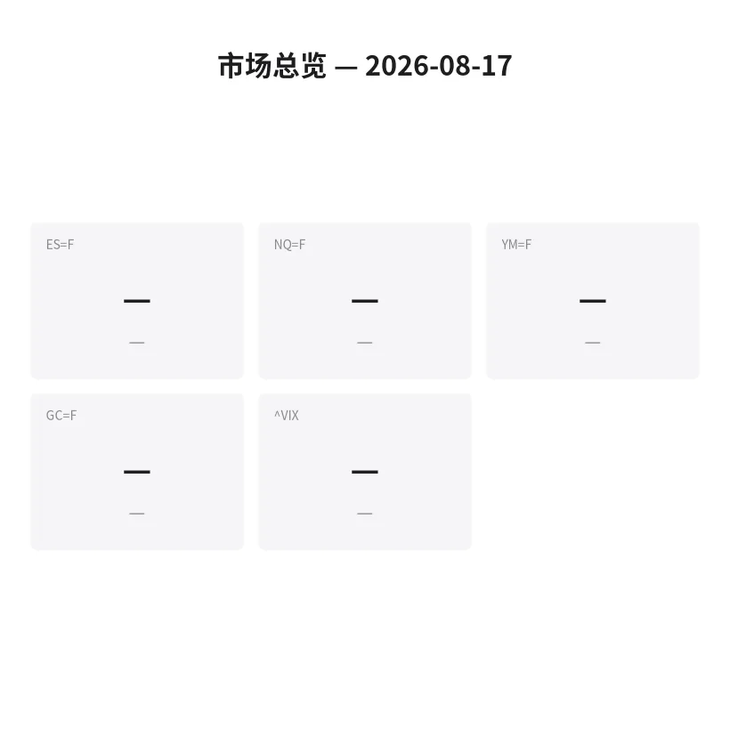
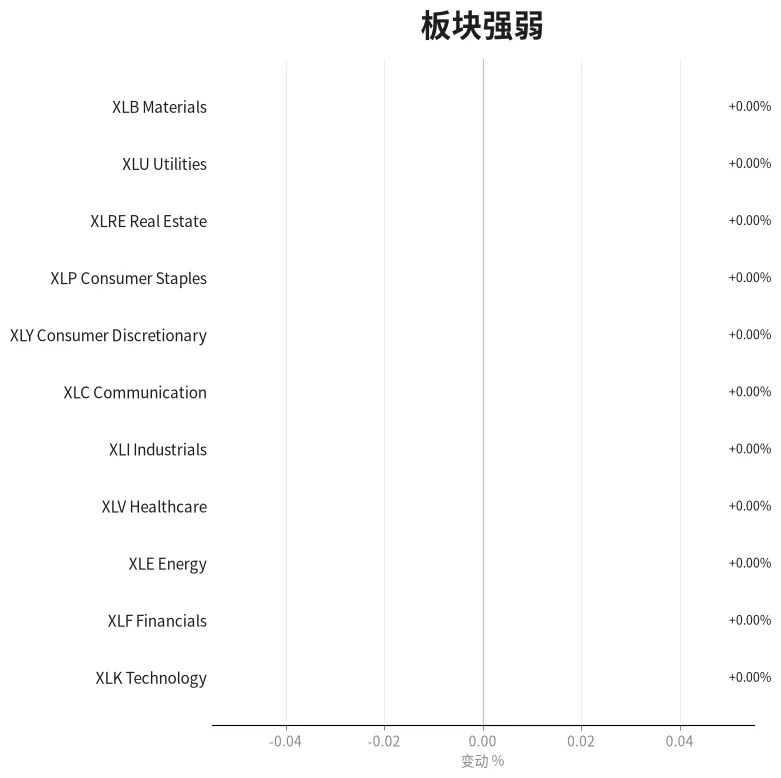

# 盘前分析报告 — 2026-08-17（周一）
*生成时间: 13:01:32 UTC*

---
## 数据速览

---
## 一、宏观环境

> [!info]- 详细数据：指数期货 & VIX
> ### 1.1 指数期货 & VIX
> | 品种 | 现价 | 涨跌幅 | 前收 | 日高 | 日低 |
> |------|------|--------|------|------|------|
> | ES=F | 7812.00 | +0.10% | 7804.00 | 7828.00 | 7790.00 |
> | NQ=F | 30141.75 | +0.50% | 29991.00 | 30210.75 | 30050.00 |
> | YM=F | 53807.00 | -0.20% | 53915.00 | 53828.00 | 53719.00 |
> | GC=F | 4437.30 | +0.38% | 4420.40 | 4452.00 | 4418.00 |
> | ^VIX | 14.25 | -2.60% | 14.63 | 14.68 | 14.18 |

> [!info]- 详细数据：隔夜走势
> ### 1.2 隔夜走势（Globex）
> | 品种 | 隔夜高 | 隔夜低 | 区间 | 亚洲高 | 亚洲低 | 欧洲高 | 欧洲低 |
> |------|--------|--------|------|--------|--------|--------|--------|
> | ES=F | 7828.00 | 7790.00 | 38.0 | 7806.00 | 7790.00 | 7828.00 | 7798.00 |
> | NQ=F | 30210.75 | 30050.00 | 160.75 | 30100.00 | 30050.00 | 30210.75 | 30080.00 |
> | YM=F | 53828.00 | 53719.00 | 109.0 | 53780.00 | 53719.00 | 53828.00 | 53740.00 |
> | GC=F | 4452.00 | 4418.00 | 34.0 | 4440.00 | 4418.00 | 4452.00 | 4425.00 |
> | ^VIX | 14.68 | 14.18 | 0.50 | — | — | 14.68 | 14.18 |

> [!info]- 详细数据：板块强弱
> ### 1.3 板块强弱
> | ETF | 板块 | 涨跌幅 |
> |-----|------|--------|
> | XLK | Technology | +0.85% |
> | XLE | Energy | +0.62% |
> | XLF | Financials | +0.27% |
> | XLI | Industrials | +0.18% |
> | XLC | Communication | +0.12% |
> | XLB | Materials | +0.08% |
> | XLY | Consumer Discretionary | +0.05% |
> | XLRE | Real Estate | -0.10% |
> | XLV | Healthcare | -0.15% |
> | XLP | Consumer Staples | -0.22% |
> | XLU | Utilities | -0.35% |

---
## 二、消息面

- **Anthropic营收强劲增长，AI巨额支出前景获提振，科技股带领全球股市上涨** — *Bloomberg*
  > Technology stocks lifted global equities after stellar revenue growth at Anthropic PBC bolstered the view that massive spending on artificial intelligence will be sustained
- **标普500期货小幅走高，市场等待零售业财报季** — *TheStreet*
  > S&P 500 futures edge higher ahead of retail earnings reports
- **盘前异动个股：阿里巴巴、英特尔、闪迪等** — *CNBC*
  > Stocks making the biggest moves premarket: Alibaba, Intel, Sandisk & more
- **闪迪盘前涨逾4%，过去五个交易日累计上涨约35%** — *Bloomberg*
  > SanDisk rose more than 4% in premarket trading after gaining about 35% over the previous five sessions
- **美光涨3.5%、博通涨1.2%，亚马逊和Alphabet同步走高** — *Bloomberg*
  > Micron rose 3.5% and Broadcom 1.2% in premarket trading, while Amazon and Alphabet also advanced
- **英伟达小幅上涨，据报缩减对OpenAI俄亥俄数据中心项目支持，缓解AI循环融资担忧** — *Bloomberg*
  > Nvidia edged higher after a report that it had scaled back support for a proposed OpenAI data-center project in Ohio, easing concern about circular financing in AI buildout
- **L3Harris国防承包商CEO突然更换，股价盘前跌约3%** — *Bloomberg*
  > L3Harris Technologies named Sam Mehta chief executive with immediate effect after Christopher Kubasik left following a board investigation
- **美元触及三个月新低** — *Bloomberg*
  > Dollar touched a three-month low
- **布伦特原油逼近90美元/桶，中东局势再度升级** — *Bloomberg*
  > Brent closed in on $90 a barrel as fighting between Israel and Iran-backed Hezbollah dealt the latest setback
- **欧洲STOXX 600涨0.2%至659.30，矿业和科技股领涨** — *Bloomberg*
  > European STOXX 600 up 0.2% at 659.30 as miners and technology stocks led gains
- **阿里巴巴盘前走高，8月20日财报在即，AI战略加速推进** — *TipRanks*
  > Alibaba stock trended higher in pre-market, heading into its August 20 earnings report with AI push gaining pace
- **Snap盘前暴跌12.3%，社交媒体广告市场情绪转冷** — *PreMarketPrice*
  > SNAP tumbled 12.3% following negative sentiment in the social media advertising landscape
- **本周零售巨头财报密集：沃尔玛、塔吉特、家得宝、Lowe's、TJX** — *Yahoo Finance*
  > Retail earnings week: Walmart, Target, Home Depot, Lowe's, TJX
- **标普500连续第三周收涨** — *Yahoo Finance*
  > S&P 500 posted third straight weekly gain

---
## 三、盘前异动

> [!info]- 详细数据：盘前异动
> | 代码 | 名称 | 涨跌幅 | 备注 |
> |------|------|--------|------|
> | SNDK | SanDisk Corp. | +5.0% | 存储芯片龙头，5日累涨35% |
> | SKHY | SK Hynix Inc. | +4.1% | 半导体/存储 |
> | MU | Micron Technology | +3.5% | AI存储需求驱动 |
> | BABA | Alibaba Group | +2.8% | 8/20财报在即，AI战略加速 |
> | AVGO | Broadcom Inc. | +1.2% | AI芯片/网络 |
> | NVDA | Nvidia Corp. | +0.8% | 缩减OpenAI项目，缓解担忧 |
> | AMZN | Amazon.com | +0.6% | 科技板块跟涨 |
> | GOOGL | Alphabet Inc. | +0.5% | 科技板块跟涨 |
> | SNAP | Snap Inc. | -12.3% | 社交广告市场情绪恶化 |
> | LHX | L3Harris Technologies | -3.0% | CEO突然更换 |

---
## 四、关键价位

> [!info]- 详细数据：SPY 关键价位
> ### SPY
> | 价位类型 | 价格 |
> |----------|------|
> | Prior Day High | 778.50 |
> | Prior Day Low | 773.80 |
> | Prior Day Close | 776.34 |
> | Premarket Price | 777.10 |
> | Approx Vwap 5D | 774.50 |
> | Weekly High | 778.50 |
> | Weekly Low | 768.20 |

> [!info]- 详细数据：QQQ 关键价位
> ### QQQ
> | 价位类型 | 价格 |
> |----------|------|
> | Prior Day High | 734.20 |
> | Prior Day Low | 727.50 |
> | Prior Day Close | 731.07 |
> | Premarket Price | 733.50 |
> | Approx Vwap 5D | 728.30 |
> | Weekly High | 734.20 |
> | Weekly Low | 720.60 |

> [!info]- 详细数据：IWM 关键价位
> ### IWM
> | 价位类型 | 价格 |
> |----------|------|
> | Prior Day High | 298.50 |
> | Prior Day Low | 294.80 |
> | Prior Day Close | 296.20 |
> | Premarket Price | 296.80 |
> | Approx Vwap 5D | 295.10 |
> | Weekly High | 298.50 |
> | Weekly Low | 291.30 |

---
## 五、AI 技术分析 & 操盘建议

## 第一部分：隔夜市场回顾

### 亚洲盘（18:00–02:00 ET）

周日晚间Globex开盘后，市场在亚洲时段保持窄幅震荡。ES=F 在 7790–7806 的 16 点区间内运行，交投清淡但整体守住上周五收盘水平。NQ=F 在 30050–30100 的 50 点区间内窄幅整理，亚洲时段科技权重股未出现异动。YM=F 表现最弱，在 53719–53780 区间运行并一度触及隔夜低点。GC=F 在亚洲盘从 4418 温和上行至 4440，美元走弱+中东局势提供底部支撑。

**特征：** 典型的周一亚盘低波动格局。价格紧贴前收盘运行，方向不明，等待欧洲盘资金入场定调。

### 欧洲盘（02:00–08:00 ET）

欧洲盘是隔夜行情的主要推手。STOXX 600 高开 0.2% 至 659.30，矿业和科技股领涨欧洲市场。Anthropic PBC 营收强劲增长的消息在欧洲时段发酵，提振了全球科技股情绪。ES=F 在欧洲盘从 7798 推升至隔夜高点 7828，完成 30 点的上行突破。NQ=F 表现最为强势，从 30080 一路推升至 30210.75，涨幅达 130+ 点，半导体板块（SNDK +5%、MU +3.5%、SKHY +4.1%）集体走强为 NQ 提供强劲支撑。YM=F 在欧洲盘反弹至 53828 但未能突破前高，道指相对滞后。GC=F 在欧盘冲高至 4452 后小幅回落至 4437，美元三个月新低+中东局势为黄金提供双重支撑。

**特征：** 欧洲盘资金明确推动科技/AI主题——NQ 领涨、半导体板块爆发、防御板块走弱（XLP -0.22%、XLU -0.35%）。风险偏好格局确立。

### 隔夜总结

隔夜整体方向**偏多但分化**。核心信号：
1. NQ=F 领涨 +0.5%，远超 ES=F 的 +0.1%，YM=F 甚至下跌 -0.2%——AI/半导体主题主导，非普涨行情
2. VIX 从 14.63 回落至 14.25（-2.60%），处于年内低位区间，市场恐慌极低
3. 标普500连续第三周收涨，多头趋势延续
4. 美元触及三个月新低，为风险资产和商品提供额外支撑
5. 布伦特原油逼近 $90，中东局势仍是潜在风险因子

**对美盘暗示：** NQ/QQQ 可能跳空高开，但 YM/SPY 高开幅度有限。AI/半导体是今日唯一确定的资金主线。本周零售财报密集（WMT、TGT、HD），市场可能在科技与消费之间快速轮动。注意周一流动性可能偏低，假突破风险增加。

---

## 第二部分：期货品种分析

---

### ES=F — E-mini S&P 500 Futures（期货合约价位）

**隔夜走势：**
- 亚洲盘：高=7806，低=7790，方向=窄幅震荡偏弱
- 欧洲盘：高=7828，低=7798，方向=温和上行
- 隔夜总区间：7790 – 7828（38 点）

**多时间框架分析：**
- **周线：** 上周收出第三根连阳周线，标普500连续三周收涨。周线趋势明确偏多，但上周四突破历史新高后周五回落，周线留上影线，显示 7830+ 区域存在供给压力。
- **日线：** 前日收于 7804，今日盘前推升至 7812（+0.1%），涨幅温和。日线处于上升通道中轨附近，5日均线在 7780 附近提供支撑。前日高点 7828 是日线级别的即时阻力。
- **小时线：** 欧洲盘形成温和上升结构，但动能不如 NQ。7801 附近是前期关键阻力（已突破），现正转化为支撑待验证。

**关键价位（期货合约价位）：**

| 级别 | 价位 | 原因 |
|------|------|------|
| 强阻力 | **7830–7840** | 上周四历史新高区域+周线上影线顶部，密集供给区 |
| 弱阻力 | **7828** | 隔夜高点（ONH），首次测试可能有反应 |
| 枢轴点 | **7810** | 隔夜区间中位+当前价格附近，盘中多空分水岭 |
| 弱支撑 | **7800–7804** | 前日收盘+前期阻力转支撑（7801），回踩第一档 |
| 强支撑 | **7790–7795** | 隔夜低点+5日VWAP区域，跌破则隔夜结构瓦解 |

**订单流关注点：**
- **7825–7835 区域：** 上周历史新高供给区。关注卖方堆叠失衡——若出现连续3层以上 Ask 被吸收但价格无法突破，确认短期顶部，可做空
- **7800–7805 区域：** 前期阻力转支撑的关键验证区。若回踩此处出现连续买方堆叠失衡（Bid 被吸收但价格企稳），确认支撑翻转有效，做多信号
- **开盘后前15分钟：** 周一开盘流动性偏低，IBR 形成过程中的假突破概率增加，需等待 IBR 确认后再入场

**今日操盘建议：**
- **方向偏好：** 观望偏多（置信度：中低）
- **理由：** ES 涨幅仅 +0.1%，远弱于 NQ 的 +0.5%，显示资金并非普涨而是集中在科技/AI主题。ES 单独做多的边际优势不大，且逼近历史高点供给区。优先考虑 NQ
- **关注入场区域：** 7800–7805（回踩前期阻力转支撑做多）
- **止损参考：** 7788（隔夜低点下方 2 点）
- **目标位：** T1=7828（隔夜高点），T2=7845（历史新高突破）
- **风险提示：** 周一流动性偏低+ES缺乏独立驱动力，不建议重仓。若 NQ 突然回落，ES 大概率跟跌且跌幅可能更大

---

### NQ=F — E-mini Nasdaq 100 Futures（期货合约价位）

**隔夜走势：**
- 亚洲盘：高=30100，低=30050，方向=窄幅整理
- 欧洲盘：高=30210.75，低=30080，方向=强势上行，隔夜领涨品种
- 隔夜总区间：30050 – 30210.75（160.75 点）

**多时间框架分析：**
- **周线：** 纳斯达克100延续强势上升趋势，上周三周连阳。29861–29878 的前期阻力已被清晰突破，价格站上30000 整数关口进入蓝天区域。周线动能依然充沛。
- **日线：** 前日收于 29991，今日盘前跳涨 150 点至 30141（+0.5%）。日线在 AI/半导体催化剂驱动下连续走高。Anthropic 营收消息+SNDK/MU/SKHY 盘前集体爆发，提供强劲基本面支撑。价格远离5日均线（约 29800），有短期过度延伸风险。
- **小时线：** 欧洲盘形成清晰的上升通道，连续 higher highs / higher lows。30000 整数关口在亚洲盘得到确认，现为盘中支撑。30200+ 区域出现窄幅整理，可能在积蓄突破动能。

**关键价位（期货合约价位）：**

| 级别 | 价位 | 原因 |
|------|------|------|
| 强阻力 | **30250–30300** | 整百关口上方+蓝天区域首个心理阻力，获利了结密集区 |
| 弱阻力 | **30210** | 隔夜高点（ONH），突破确认则成为支撑 |
| 枢轴点 | **30130** | 隔夜区间中位+当前价格，盘中多空分界 |
| 弱支撑 | **30050–30080** | 亚洲盘区间低点+欧洲盘回踩低点 |
| 强支撑 | **29990–30000** | 前日收盘+整数关口+前期突破位，失守则日内转空 |

**订单流关注点：**
- **30200–30220 区域：** 隔夜高点正被测试。若 footprint 显示买方持续堆叠失衡（大量 Market Buy 吃穿 Ask），突破概率大增——跟随做多。若出现卖方堆叠+Delta翻负，则 ONH 构成短期顶部
- **30000 整数关口：** 极其重要的心理支撑。若回踩此处出现 Delta 翻正+买方堆叠失衡，这是今日最高胜率的做多入场点
- **30300 区域：** 若价格推至此处，关注高位获利了结形成的卖方堆叠——首次测试大概率有反应

**今日操盘建议：**
- **方向偏好：** 多（置信度：中高）
- **理由：** NQ 隔夜明确领涨，AI/半导体催化剂强劲（Anthropic营收+SNDK/MU/SKHY集体爆发），VIX 低位（14.25），美元走弱提供额外支撑。30000 整数关口突破后形成新的支撑平台
- **关注入场区域：** 30050–30100（回踩欧洲盘低点做多）；或 30210 突破回踩确认做多
- **止损参考：** 29980（30000 整数关口下方 20 点）
- **目标位：** T1=30250，T2=30400
- **风险提示：** 160 点的隔夜区间意味着止损需适当放宽。半导体个股集中度高，NVDA/MU 任何盘中逆转可能导致 NQ 快速回落 100+ 点。周一流动性偏低放大波动

---

### GC=F — Gold Futures（期货合约价位）

**隔夜走势：**
- 亚洲盘：高=4440，低=4418，方向=温和上行，美元走弱驱动
- 欧洲盘：高=4452，低=4425，方向=冲高回落，高位有抛压
- 隔夜总区间：4418 – 4452（34 美元）

**多时间框架分析：**
- **周线：** 黄金维持在 4400+ 高位运行，周线趋势偏多但动能减弱。前期从 4800 区域大幅回落至 4400 附近企稳，正在构筑底部。4450–4500 区域是前期下跌过程中的密集成交区，构成上行阻力。
- **日线：** 前日收于 4420.40，今日涨至 4437（+0.38%）。美元触及三个月新低+布伦特原油逼近 $90+中东局势紧张，三重因素为黄金提供支撑。日线正在形成温和的上升修复结构。
- **小时线：** 欧洲盘冲高至 4452 后回落至 4437，留下上影线。4450 附近短期供给确认。但回落幅度有限，多头仍控制节奏。

**关键价位（期货合约价位）：**

| 级别 | 价位 | 原因 |
|------|------|------|
| 强阻力 | **4450–4460** | 隔夜高点区域+前期密集成交区下沿，冲高被打回确认供给 |
| 弱阻力 | **4440–4445** | 亚洲盘高点+盘中分水岭 |
| 枢轴点 | **4435** | 隔夜区间中位 |
| 弱支撑 | **4425–4428** | 欧洲盘回落低点 |
| 强支撑 | **4418–4420** | 隔夜低点+前日收盘，黄金多头最后防线 |

**订单流关注点：**
- **4445–4455 区域：** 欧盘已在此证明了卖压存在。若二次测试出现卖方堆叠失衡，可做空
- **4418–4425 区域：** 若回踩此处出现买方堆叠失衡，日内波段做多机会
- **关注美元指数DXY走势：** 美元若继续走弱将为黄金提供额外上行动力

**今日操盘建议：**
- **方向偏好：** 偏多（置信度：中）
- **理由：** 美元三个月新低+中东局势+原油逼近 $90，三重利好黄金。但隔夜冲高回落显示 4450+ 区域有较强供给，不宜追高
- **关注入场区域：** 4420–4428（回踩隔夜低点/前日收盘做多）
- **止损参考：** 4414（隔夜低点下方 4 美元）
- **目标位：** T1=4450（隔夜高点），T2=4470（前期密集区突破）
- **风险提示：** 若今日风险偏好进一步升温（股指大涨），黄金可能承压回落。中东局势任何缓和信号将快速打压金价

---

## 第三部分：ETF品种分析

---

### SPY — SPDR S&P 500 ETF（ETF 价位）

**关键价位（ETF 价位）：**

| 级别 | 价位 | 原因 |
|------|------|------|
| 强阻力 | **$780–$782** | 上周历史新高区域，对应 ES 7830–7840 供给区 |
| 弱阻力 | **$778–$779** | 上周四高点附近+盘前高位 |
| 枢轴点 | **$777** | 盘前价格附近，多空分界 |
| 弱支撑 | **$775–$776** | 前日收盘（$776.34）+5日VWAP（$774.50）上方 |
| 强支撑 | **$773–$774** | 前日低点+5日VWAP，跌破转弱 |

**今日操盘建议：**
- **方向偏好：** 观望偏多（置信度：中低）
- **关注入场区域：** $775–$776（回踩前日收盘做多）
- **止损参考：** $773.00
- **目标位：** T1=$779，T2=$782
- **备注：** SPY 盘前仅涨 $0.76（+0.1%），涨幅远弱于 QQQ。标普500内部分化严重——科技权重拉涨但防御板块（XLP -0.22%、XLU -0.35%）拖后腿。SPY 今日不是最佳交易标的，如果要做多大盘方向，QQQ 性价比更高。注意本周零售财报（WMT 周二盘前）可能引发消费板块波动，间接影响 SPY。5日VWAP 在 $774.50，价格偏离不大，回踩空间有限。

---

### QQQ — Invesco QQQ Trust（ETF 价位）

**关键价位（ETF 价位）：**

| 级别 | 价位 | 原因 |
|------|------|------|
| 强阻力 | **$738–$740** | 蓝天区域整数关口，对应 NQ 30250–30300 |
| 弱阻力 | **$735–$736** | 隔夜高点对应区域 |
| 枢轴点 | **$733.50** | 盘前价格，当前多空分界 |
| 弱支撑 | **$731–$732** | 前日收盘（$731.07），回踩第一档 |
| 强支撑 | **$728–$730** | 5日VWAP（$728.30）+前日低点（$727.50），失守转空 |

**今日操盘建议：**
- **方向偏好：** 多（置信度：中高）
- **关注入场区域：** $731–$732（回踩前日收盘做多）；或 $736 突破回踩确认
- **止损参考：** $729.50
- **目标位：** T1=$736，T2=$740
- **备注：** QQQ 盘前跳空 +$2.43（+0.33%），AI/半导体板块强劲驱动。Anthropic 营收消息+SNDK/MU/SKHY 集体爆发为科技权重提供坚实基本面。QQQ 是今日最具交易价值的 ETF——方向确定性高，催化剂明确。但注意价格已站上 $733+，开盘直接追高风险较大，等回踩前日收盘（$731）或突破确认后入场。5日VWAP 在 $728.30，偏离约 $5，短线有均值回归压力但趋势动能可以覆盖。BABA 8/20 财报若超预期，可能提供下半周额外催化。

---

## 第四部分：今日市场总览

### 整体市场情绪：温和风险偏好（Selective Risk-On）

今日市场情绪为**选择性风险偏好**，而非全面普涨：
- NQ 领涨 +0.5%，ES 仅 +0.1%，YM -0.2%——科技/AI 独立行情，非普涨
- VIX 14.25（-2.60%），处于年内低位区间，隐含波动率极低
- 板块极度分化：XLK +0.85% vs XLU -0.35%，成长远强于价值
- 美元三个月新低+黄金温和走高，宏观环境对风险资产偏友好
- 标普500连续第三周收涨，中期趋势明确偏多

### VIX 环境评估

**VIX 14.25（-2.60%）** 处于偏低区域，对 order flow 策略的影响：

- **正面：** VIX 在 14-15 区间是今年低位水平，市场定价极低波动。价格走势有序，footprint 上的堆叠失衡信号**可靠性较高**——低噪声环境下真实机构订单流更容易辨识
- **注意：** VIX 处于极低水平意味着期权 Gamma 效应减弱，大幅脉冲概率下降。但同时也意味着任何意外事件（中东局势升级、意外数据）可能导致 VIX 快速跳升，引发波动性爆发
- **止损建议：** ES 止损 4-6 点，NQ 止损 20-35 点。低 VIX 环境下可以适当收紧止损，但周一流动性偏低需额外留 10-15% 缓冲

### 需要规避的时段

- **09:30–09:45 ET：** 周一开盘前15分钟流动性最低，假突破概率最高。等待 IBR 形成后再入场
- **10:00 ET：** 关注是否有二级经济数据发布（周一通常数据较少，但需确认日历）
- **11:30–12:00 ET：** 午盘前后流动性下降，趋势可能停滞或反转
- **布伦特原油/中东消息窗口：** 原油逼近 $90 是敏感阈位，任何地缘事件头条可能引发跨资产波动

### 板块轮动信号

| 板块 | 涨跌幅 | 信号 |
|------|--------|------|
| XLK 科技 | **+0.85%** | 🔥 AI/半导体主题驱动，日内首选 NQ/QQQ |
| XLE 能源 | +0.62% | 原油逼近 $90 提振，独立驱动力 |
| XLF 金融 | +0.27% | 温和跟涨，非主线 |
| XLI 工业 | +0.18% | 中性 |
| XLC 通讯 | +0.12% | SNAP -12.3% 拖累板块，内部分化 |
| XLY 可选消费 | +0.05% | 本周零售财报前观望 |
| XLRE 房地产 | -0.10% | 中性偏弱 |
| XLV 医疗 | -0.15% | 防御板块轮出 |
| XLP 必需消费 | **-0.22%** | ⚠️ 防御板块被抛售 |
| XLU 公用事业 | **-0.35%** | ⚠️ 防御板块最弱，资金明确流出 |

**轮动解读：** 选择性 Risk-On 格局——资金高度集中于科技/AI板块（XLK），能源受原油驱动独立走强（XLE），其余板块涨幅微弱甚至负增长。防御板块（XLP、XLU、XLV）整体走弱，确认资金在从安全资产向成长资产轮动。但与普涨不同的是，道指下跌、可选消费几乎持平，说明这不是 broad-based rally 而是 thematic trade。**日内交易唯一确定方向：NQ/QQQ 多头，跟随 AI/半导体主题。** 避免做多防御板块和道指。

---

### ⚡ 今日核心操盘策略

> **首选：NQ=F 回踩做多**
> 等待 NQ 回踩 30050–30100 区域（亚洲盘低点/欧洲盘回踩位），配合 footprint 买方堆叠失衡信号入场做多。止损 29980（30000 整数关口下方），目标 30250/30400。AI/半导体催化剂强劲+VIX 低位+美元走弱，这是今日胜率最高的方向。仓位可用常规 1.0x。

> **等效替代：QQQ $731–$732 做多**
> 若不交易期货，QQQ 回踩前日收盘 $731 附近做多，止损 $729.50，目标 $736/$740。与 NQ 逻辑一致。

> **次选：GC=F 回踩做多**
> 黄金回踩 4420–4428 出现买方堆叠失衡时做多，止损 4414，目标 4450/4470。美元走弱+中东局势提供支撑，但需注意若股市大涨可能抑制金价。仓位减半（0.5x）。

> **机会型：GC=F 反弹做空**
> 若黄金反弹至 4450–4455 出现卖方堆叠失衡，轻仓做空，止损 4462，目标 4430/4420。仅在股市明确走强+风险偏好升温时考虑。仓位 0.3x。

> **回避：ES=F / SPY 单独做多**
> ES 涨幅仅 +0.1%，缺乏独立驱动力，逼近历史高点供给区。做多大盘方向的性价比远低于 NQ/QQQ。除非 ES 回踩 7800 并在订单流上出现极强买方信号，否则不参与。

> **纪律提醒：**
> 1. 周一流动性偏低，假突破概率增加——所有入场必须等待 footprint 确认
> 2. 跳空高开日不追高，等回踩或突破确认后入场
> 3. 本周零售财报密集（WMT 周二、TGT/HD 周三），可能引发盘中板块轮动，注意尾盘持仓风险
> 4. 中东局势+原油 $90 是潜在黑天鹅——任何升级头条可能导致 VIX 脉冲+股指快速回落
> 5. 若开盘 30 分钟内 NQ 跌破 30000 且无法收复，今日科技多头论点失效，转为观望
