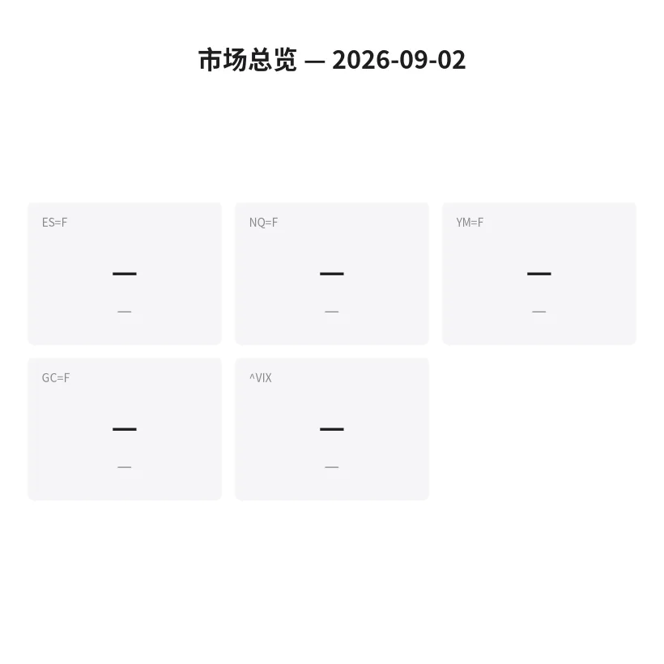

# 盘前分析报告 — 2026-09-02
*生成时间: 07:22 UTC*

---
## 数据速览

---
## 一、宏观环境

### 1.1 指数期货 & VIX
| 品种 | 现价 | 涨跌幅 | 前收 | 日高 | 日低 |
|------|------|--------|------|------|------|
| ES | 7,645.50 | +0.04% | 7,642.75 | 7,647.25 | 7,631.75 |
| NQ | 29,106.25 | -0.07% | 29,125.50 | 29,170.00 | 29,065.75 |
| YM | 52,813 | +0.09% | 52,768 | 52,850 | 52,710 |
| GC | 4,481.50 | -0.06% | 4,484.20 | 4,510.50 | 4,374.20 |
| VIX | 16.44 | +10.21% | 14.92 | 16.58 | 14.92 |

### 1.2 隔夜走势（Globex）
| 品种 | 隔夜高 | 隔夜低 | 区间 |
|------|--------|--------|------|
| ES | 7,647.25 | 7,631.75 | 15.50 |
| NQ | 29,170.00 | 29,065.75 | 104.25 |
| YM | 52,850 | 52,710 | 140 |
| GC | 4,510.50 | 4,374.20 | 136.30 |

### 1.3 宏观指标
| 指标 | 数值 | 变动 |
|------|------|------|
| 美十年期国债收益率 | 4.81% | +4bp |
| WTI 原油 | $90.10 | +5.2% |
| 美元指数 DXY | 走强 | — |

### 1.4 板块强弱
| ETF | 板块 | 涨跌幅 |
|-----|------|--------|
| XLE | 能源 | +1.42% |
| XLV | 医疗 | -0.36% |
| XLF | 金融 | -0.67% |
| XLK | 科技 | -1.03% |
| XLI | 工业 | -0.45% |
| XLC | 通讯 | -0.55% |
| XLY | 可选消费 | -0.72% |
| XLP | 必需消费 | -0.30% |
| XLRE | 房地产 | -0.85% |
| XLU | 公用事业 | -0.40% |
| XLB | 材料 | -0.50% |

---
## 二、消息面

- **美伊冲突升级：美军打击伊朗拉拉克岛火箭发射器，德黑兰反击阿联酋和约旦** — *Reuters*
  > US forces target Iranian rocket launchers on Larak Island; Tehran responds with attacks on UAE and Jordan
- **特朗普威胁打击伊朗哈尔克岛石油出口枢纽，霍尔木兹海峡超级油轮触雷起火** — *Bloomberg*
  > Trump extends military threats to Kharg Island, Iran's key oil export hub; supertanker hit by naval mines in Strait of Hormuz
- **WTI原油飙升5%突破90美元，创7月24日以来新高** — *FXStreet*
  > WTI crude surges over 5% to top $90/barrel, highest since July 24
- **美债收益率攀升至2008年以来最高，油价冲击推高通胀预期** — *Bloomberg*
  > Bond yields climb to highest since 2008 as oil shock boosts inflation expectations
- **美联储主席沃什鹰派发言："控制物价仍有大量工作要做"，9月加息预期升温** — *CNBC*
  > Fed Chair Kevin Warsh: "work to do" on price control, rate-hike expectations grow ahead of September meeting
- **俄罗斯炼油厂罢工加剧全球炼油产能紧张，亚洲进口商转向阿根廷采购** — *Reuters*
  > Russian refinery strikes tighten global refining capacity; Asian importers turn to Argentina for supply
- **本周劳动力市场数据密集：JOLTS职位空缺、ADP私企就业、周五非农报告** — *CNBC*
  > Busy week of labor data: JOLTS job openings, ADP private payrolls, Friday NFP report

---
## 三、盘前异动

| 代码 | 名称 | 现价 | 缺口 | 备注 |
|------|------|------|------|------|
| GPRO | GoPro | — | +75.0% | YouTuber Markiplier 披露8.5%持股 |
| BRNX | Borneo | — | -19.0% | 低成交量下跌 |
| INTC | Intel | $86.88 | -3.0% | 受大盘抛压拖累 |
| XLE | 能源ETF | — | +1.42% | 原油飙升带动 |

---
## 四、关键价位

### ES（标普500期货）
| 价位类型 | 价格 |
|----------|------|
| 历史新高阻力 | 7,838.50 |
| 隔夜高点 | 7,647.25 |
| 前日收盘 | 7,642.75 |
| 隔夜低点 | 7,631.75 |
| 关键支撑位 | 7,600.00 |
| 结构性支撑 | 7,542.75 |
| 深层支撑 | 7,400.00 |

### NQ（纳斯达克100期货）
| 价位类型 | 价格 |
|----------|------|
| 月高阻力 | 30,343.00 |
| 隔夜高点 | 29,170.00 |
| 前日收盘 | 29,125.50 |
| 隔夜低点 | 29,065.75 |
| 月低支撑 | 28,313.50 |

### GC（黄金期货）
| 价位类型 | 价格 |
|----------|------|
| 日内高点 | 4,510.50 |
| 前日收盘 | 4,484.20 |
| 日内低点 | 4,374.20 |
| 200日均线 | ~4,450 |
| 关键支撑 | 4,100.00 |

### SPY
| 价位类型 | 价格 |
|----------|------|
| 历史新高 | ~783.85 |
| 前日收盘 | 761.78 |
| 前日开盘 | 767.05 |
| 关键支撑 | 754.28 |

### QQQ
| 价位类型 | 价格 |
|----------|------|
| 阻力位 | 720.51 |
| 前日收盘 | 716.76 |
| 支撑位 | 701.35 |

---
## 五、AI 技术分析 & 操盘建议

## 第一部分：隔夜市场回顾

### 亚洲时段
亚洲开盘后市场即承压下行，核心驱动因素是**美伊冲突骤然升级**——美军对伊朗拉拉克岛实施打击后，德黑兰对阿联酋和约旦发动报复性攻击。地缘溢价迅速反映到原油市场，WTI一度冲上$90以上，为7月24日以来新高。

- ES在亚洲时段交投清淡，窄幅震荡于7,632-7,640区间
- NQ相对弱势，科技权重在利率敏感环境下领跌
- GC先冲高后回落——避险买盘推动金价触及4,510高点，但美元走强和加息预期回升导致获利盘涌出，随后回落至4,380附近
- VIX从14.92跳升至16.44（+10.21%），恐慌指标明显升温

### 欧洲时段
欧洲开盘后进一步消化地缘风险：
- 霍尔木兹海峡超级油轮触雷起火的消息加剧了原油供应中断恐慌
- 美十年期国债收益率攀升至**4.81%**，为2008年以来最高水平
- 欧洲股市普跌，Stoxx 600指数承压
- 俄罗斯炼油厂罢工消息进一步推高炼油利润率

### 对美盘的影响
**整体基调：Risk-Off，但非恐慌性抛售。** 今日市场面临的核心矛盾是「地缘溢价推高油价 → 通胀预期上行 → 加息预期升温 → 权益资产承压」。这一传导链条已在隔夜完成第一轮定价。美盘开盘后需观察：
1. 油价能否在$90上方稳住——若继续上冲则对equity压力加大
2. 美债收益率能否突破4.85%——若破则risk-off加速
3. VIX是否突破18——16.44的VIX说明市场紧张但尚未进入极端恐慌

## 第二部分：期货品种分析

### ES（标普500期货） — 方向偏空，置信度 65%

**多周期分析：**
- **日线**：8月13日触及7,838.50历史新高后回落，形成lower high结构。目前在7,600-7,838区间内高位震荡，价格位于区间中部偏上。周一收出带上影的小阴线，暗示上方抛压。
- **4H**：从7,838回落后在7,640附近获得短期支撑，但反弹力度不足，MACD零轴下方运行。油价冲击和收益率飙升构成持续下行压力。
- **1H/15M**：隔夜窄幅盘整，价格重心缓慢下移。开盘前在7,640-7,648狭窄区间内运行。

**关键价位：**
| 级别 | 多头 | 空头 |
|------|------|------|
| 一级阻力 | 7,660 (盘中枢轴) | — |
| 二级阻力 | 7,690-7,700 (8/28高点) | — |
| 一级支撑 | — | 7,631 (隔夜低点) |
| 二级支撑 | — | 7,600 (关键结构支撑) |
| 深层支撑 | — | 7,543 (8月低点) |

**交易计划：**
- **首选方向**：空头，顺应risk-off主题
- **入场区域**：7,655-7,665（回抽隔夜高点区域放空）
- **止损**：7,678（隔夜高点上方清晰）
- **目标1**：7,631（隔夜低点，盈亏比 ~1.8:1）
- **目标2**：7,600（关键支撑位，盈亏比 ~3:1）
- **失效条件**：若价格站稳7,670上方且VIX回落至15以下，空头逻辑失效，转为观望

**替代方案（多头）**：若价格直接下探7,600-7,610并出现明显的order flow reversal（大单absorption、delta翻正），可轻仓试多至7,640，止损7,590。

---

### NQ（纳斯达克100期货） — 方向偏空，置信度 70%

**多周期分析：**
- **日线**：从30,343高点回落约4%，科技股对利率敏感，10Y收益率4.81%构成持续压力。日线MACD形成死叉，动量明显偏空。
- **4H**：29,125附近的前日收盘位正在被测试，下方29,065隔夜低点是短期关键。若跌破，下一目标看向28,800-28,700（8月初的结构支撑）。
- **1H/15M**：弱于ES，相对强弱明显偏弱。隔夜反弹受阻于29,170，形成lower high。

**关键价位：**
| 级别 | 多头 | 空头 |
|------|------|------|
| 一级阻力 | 29,170 (隔夜高点) | — |
| 二级阻力 | 29,350 (8/29高点) | — |
| 一级支撑 | — | 29,066 (隔夜低点) |
| 二级支撑 | — | 28,800 (结构支撑) |
| 深层支撑 | — | 28,314 (月低) |

**交易计划：**
- **首选方向**：空头
- **入场区域**：29,130-29,170（回抽前收/隔夜高点放空）
- **止损**：29,210（隔夜高点上方）
- **目标1**：29,066（隔夜低点，盈亏比 ~1.5:1）
- **目标2**：28,800（结构支撑，盈亏比 ~3.5:1）
- **失效条件**：若美债收益率回落至4.75%以下且科技权重企稳，NQ反弹突破29,200则空头失效

---

### GC（黄金期货） — 方向中性偏多，置信度 55%

**多周期分析：**
- **日线**：金价面临矛盾驱动——地缘避险利多 vs 美元走强+加息预期利空。昨日从4,510高点大幅回落至4,374低点（136点区间），收于4,481附近。日线在200日均线（~4,450）附近反复拉锯。
- **4H**：4,374为短期底部，但反弹未能有效突破4,510。若连续两日收于200MA下方（<4,450），技术面趋势将转为偏空。
- **1H/15M**：亚洲时段冲高回落后在欧洲时段低位盘整，价格重心在4,450-4,490之间。

**关键价位：**
| 级别 | 多头 | 空头 |
|------|------|------|
| 一级阻力 | 4,510 (隔夜高点) | — |
| 二级阻力 | 4,560 (上周高点) | — |
| 枢轴 | 4,450 (200日均线) | 4,450 |
| 一级支撑 | — | 4,374 (隔夜低点) |
| 深层支撑 | — | 4,300 (结构位) |

**交易计划：**
- **首选方向**：中性，等待方向明确后再入场
- **多头场景**：若价格回踩4,430-4,450（200MA附近）并获得支撑，可做多至4,510，止损4,410
- **空头场景**：若价格跌破4,374（隔夜低点），顺势做空至4,300，止损4,400
- **核心逻辑**：金价当前处于避险需求与利率压力的拉锯中，波动率极高（隔夜136点区间）。建议缩小仓位、放宽止损。若油价继续上涨推升通胀预期，黄金可能跟随走高作为通胀对冲工具。

## 第三部分：ETF品种分析

### SPY（标普500 ETF）

**前日表现**：SPY收于761.78（-0.69%），从767.05开盘后持续走低，收盘几乎在日内最低区域，说明空头主导全天。

**关键价位：**
| 类型 | 价位 | 说明 |
|------|------|------|
| 历史新高 | ~783.85 | 对应ES 7,838.50 |
| 前日开盘 | 767.05 | 缺口上沿参考 |
| 前日收盘 | 761.78 | 当前锚定位 |
| 支撑1 | 754.28 | 1标准差下沿 |
| 关键支撑 | 750.00 | 心理整数位+结构位 |

**交易计划：**
- **偏空操作**：若开盘低于761.50且无法在前5分钟收复762.00，可在761.00-761.50区域放空
- **止损**：763.00
- **目标1**：758.00（盈亏比 ~2:1）
- **目标2**：754.28（1σ支撑，盈亏比 ~3.5:1）
- **多头替代**：若开盘下探至754-755区域并出现明显的buying absorption，可轻仓试多至759，止损752

---

### QQQ（纳斯达克100 ETF）

**前日表现**：QQQ收于716.76，科技权重在利率环境恶化中表现弱于大盘。NQ期货隔夜继续走弱，暗示QQQ今日开盘面临进一步下行压力。

**关键价位：**
| 类型 | 价位 | 说明 |
|------|------|------|
| 阻力1 | 720.51 | 1标准差上沿 |
| 前日收盘 | 716.76 | 当前锚定位 |
| 支撑1 | 710.00 | 心理整数位 |
| 关键支撑 | 701.35 | 1标准差下沿 |

**交易计划：**
- **偏空操作**：QQQ今日是相对弱势品种（科技股对利率最敏感）。若开盘低于716且NQ无法收复29,125，做空QQQ
- **入场**：715.50-716.50
- **止损**：718.50
- **目标1**：712.00（盈亏比 ~1.5:1）
- **目标2**：707.00（盈亏比 ~3:1）
- **多头替代**：若盘中油价回落+美债收益率回落构成科技股反弹条件，QQQ在710附近可试多

**配对思路**：今日可考虑**做多XLE / 做空QQQ**的配对交易，押注能源跑赢科技的板块轮动趋势。

## 第四部分：今日市场总览

### 市场情绪评估
**整体基调：谨慎偏空（Risk-Off）**

| 维度 | 评估 | 说明 |
|------|------|------|
| 地缘风险 | 🔴 高 | 美伊直接冲突升级，霍尔木兹海峡通航受威胁 |
| 通胀预期 | 🔴 急升 | WTI破$90、十年期收益率4.81% |
| 流动性 | 🟡 中等 | 9月首个完整交易周，机构资金重新部署中 |
| 技术面 | 🟡 偏空 | ES形成lower high，VIX跳升，但未破关键支撑 |
| 资金流向 | 🔴 防御 | 能源独强，科技承压，资金流向防御板块 |

### VIX 分析
VIX 16.44（+10.21%）处于**中等偏高**水平。关键阈值：
- **<15**：市场乐观，可正常操作
- **15-18（当前）**：警觉区间，建议减小仓位至正常的60-70%
- **>18**：高波动环境，仅限scalp，不隔夜持仓
- **>20**：极端波动，建议观望或仅做波动率交易

### 今日需规避的时间窗口
| 时间（ET） | 事件 | 影响 |
|------------|------|------|
| 09:30-09:45 | 开盘15分钟 | 地缘事件后开盘波动加剧，等待方向明确 |
| 10:00 | ISM制造业数据（如有） | 数据出炉瞬间波动剧烈 |
| 12:00-13:00 | 午间低量区 | 流动性枯竭，容易被扫止损 |
| 14:00-14:30 | 美联储官员讲话（如有） | 在加息预期升温背景下，任何鹰派发言都会加剧波动 |

### 板块轮动格局
今日清晰的**能源 > 防御 > 大盘 > 科技**板块梯队：
- **做多**：XLE（原油飙升直接受益）
- **中性**：XLP、XLU（防御性板块受益于risk-off）
- **做空**：XLK、QQQ（利率敏感，隔夜已领跌）
- **观望**：XLRE（收益率飙升对房地产最不利，但可能已price-in）

### 核心交易论点

> **今日是一个典型的「地缘冲击 + 利率恐慌」叠加日。原油飙升 → 通胀预期上行 → 美债收益率新高 → 科技权重承压。操作核心：顺势做空NQ/QQQ，或做多XLE捕捉能源溢价。不要逆势抄底科技股，除非VIX回落至15以下且油价跌回$87。仓位控制在正常的60%，止损严格执行——地缘驱动的波动没有「均值回归」逻辑可依赖。**

---
*免责声明：以上分析仅供参考，不构成投资建议。期货交易存在高风险，请根据自身风险承受能力谨慎操作。*
