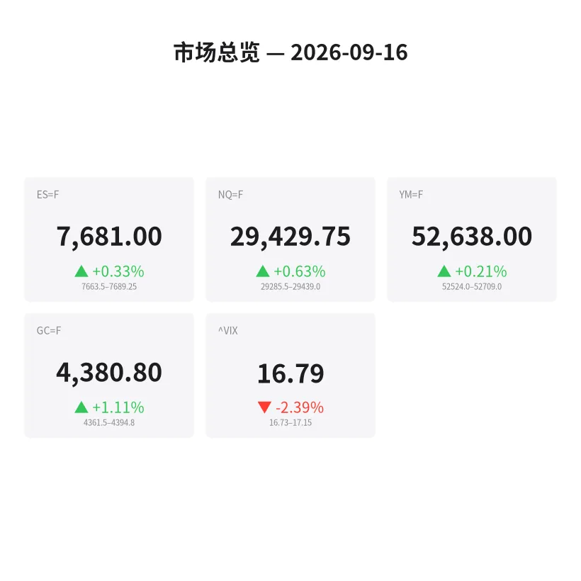
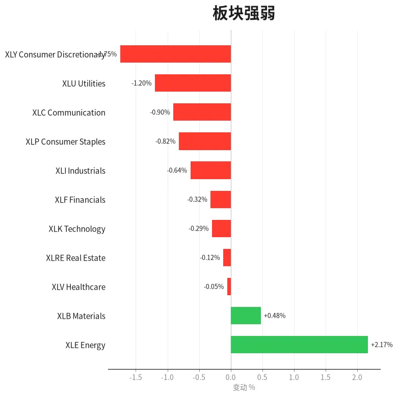
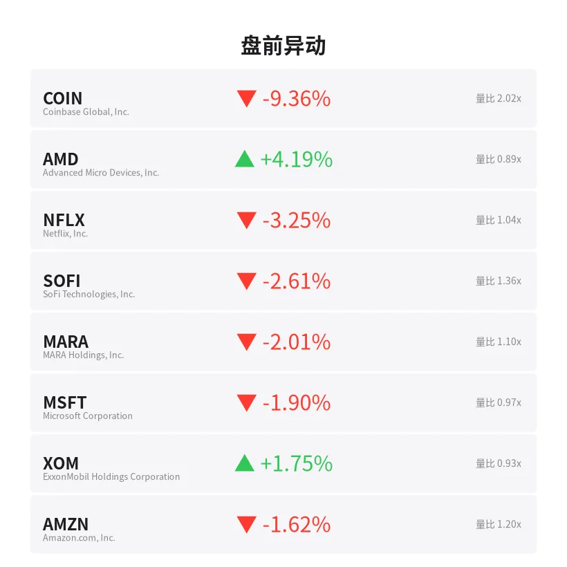
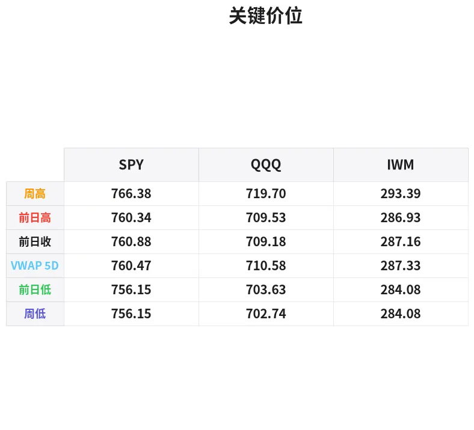

# 盘前分析报告 — 2026-09-16
*生成时间: 12:36:17 UTC*

---
## 数据速览

---
## 一、宏观环境

> [!info]- 详细数据：指数期货 & VIX
> ### 1.1 指数期货 & VIX
> | 品种 | 现价 | 涨跌幅 | 前收 | 日高 | 日低 |
> |------|------|--------|------|------|------|
> | ES=F | 7681.0 | +0.33% | 7656.0 | 7688.75 | 7658.75 |
> | NQ=F | 29429.75 | +0.63% | 29246.75 | 29439.0 | 29226.0 |
> | YM=F | 52638.0 | +0.21% | 52526.0 | 52709.0 | 52524.0 |
> | GC=F | 4380.8 | +1.11% | 4332.8 | 4394.8 | 4315.2 |
> | ^VIX | 16.79 | -2.39% | 17.2 | 17.15 | 16.73 |

> [!info]- 详细数据：隔夜走势
> ### 1.2 隔夜走势（Globex）
> | 品种 | 隔夜高 | 隔夜低 | 区间 | 亚洲高 | 亚洲低 | 欧洲高 | 欧洲低 |
> |------|--------|--------|------|--------|--------|--------|--------|
> | ES=F | 7689.25 | 7663.5 | 25.75 | 7674.0 | 7665.5 | 7683.5 | 7663.5 |
> | NQ=F | 29439.0 | 29285.5 | 153.5 | 29348.25 | 29285.5 | 29419.25 | 29326.0 |
> | YM=F | 52709.0 | 52524.0 | 185.0 | 52651.0 | 52599.0 | 52697.0 | 52524.0 |
> | GC=F | 4394.8 | 4361.5 | 33.3 | 4374.3 | 4361.5 | 4394.8 | 4361.7 |
> | ^VIX | 17.15 | 16.73 | 0.42 | — | — | 17.15 | 16.73 |

> [!info]- 详细数据：板块强弱
> ### 1.3 板块强弱
> | ETF | 板块 | 涨跌幅 |
> |-----|------|--------|
> | XLE | Energy | +2.17% |
> | XLB | Materials | +0.48% |
> | XLV | Healthcare | -0.05% |
> | XLRE | Real Estate | -0.12% |
> | XLK | Technology | -0.29% |
> | XLF | Financials | -0.32% |
> | XLI | Industrials | -0.64% |
> | XLP | Consumer Staples | -0.82% |
> | XLC | Communication | -0.90% |
> | XLU | Utilities | -1.20% |
> | XLY | Consumer Discretionary | -1.75% |

---
## 二、消息面

- **美光股价达到927美元：你该怎么操作** — *24/7 Wall St.*
  > Micron Trades Hands at $927: Here’s What You Should Do
- **股市前瞻：标普500今天高开还是低开？** — *Benzinga Prediction Markets*
  > Stock Market: Will S&P 500 Open Up or Down Today?
- **标普500、纳指、道指全线收跌，投资者提前定价美联储加息——AMZN、META、MU、TSLA、PLTR成焦点** — *Stocktwits*
  > S&P 500, Nasdaq, Dow End Lower As Investors Price In Rate Hike Ahead Of Fed Meeting — AMZN, META, MU, TSLA, PLTR In Focus
- **JEPQ月度分红从每股$0.34波动至$0.70：50万美元退休金根本无法依赖它做预算** — *24/7 Wall St.*
  > JEPQ’s Monthly Check Has Swung From $0.34 to $0.70 a Share: The $500,000 Retiree Can’t Budget on It
- **富国银行发布新的标普500目标价，暗示市场前方有麻烦** — *TheStreet*
  > Wells Fargo’s new S&P 500 call signals trouble ahead
- **今日股市：道指在美联储大概率加息前走高，Warsh发表讲话；英特尔、SK海力士大涨** — *Investor’s Business Daily*
  > Stock Market Today: Dow Rises Ahead Of Likely Fed Hike, Warsh Comments; Intel, SK Hynix Jump (Live Coverage)
- **市场导航：通胀、收益率与美联储** — *Zacks*
  > Navigating the Market: Inflation, Yields, & the Fed
- **高盛发现市场恐慌情绪在危险时刻消散** — *GuruFocus.com*
  > Goldman Sachs Sees Market Fear Vanish at Risky Moment
- **富国银行重新设定标普500目标价，但有附加条件** — *GuruFocus.com*
  > Wells Fargo Resets S&P 500 Target With a Catch
- **华尔街恐慌指数在美联储利率决议前回落** — *Barrons.com*
  > Wall Street Fear Index Slips Ahead of Fed Rate Decision
- **标普500为何在油价飙升、战争扩大、美联储加息之际未陷入恐慌** — *Investor's Business Daily*
  > Why The S&P 500 Isn't Panicking As Oil Surges, War Spreads, The Fed Hikes
- **华尔街恐慌指数飙升：AI板块遭遇猛烈抛售冲击市场** — *Barrons.com*
  > Wall Street Fear Index Jumps as Brutal AI Selloff Hits Market
- **9月10日Long Straddle期权交易策略构思** — *Barchart*
  > Long Straddle Trade Ideas September 10th
- **今日金价（2026年9月16日周三）：黄金持稳于$4,300区间，等待美联储决议** — *Yahoo Personal Finance*
  > Gold price today, Wednesday, September 16, 2026: Gold holds in the $4,300 range, awaiting the Fed's decision
- **黄金与美元：为何两者常常反向波动** — *Yahoo Personal Finance*
  > Gold and the U.S. dollar: Why they often move in opposite directions
- **可口可乐(KO)从14个非洲市场和100亿美元支出中获得了什么？** — *Simply Wall St.*
  > What Does Coca-Cola (KO) Gain From 14 African Markets And $10 Billion Spending?
- **泛非资源CEO：创纪录年度为增长推进奠定"健康"的资产负债表** — *Proactive*
  > Pan African Resources CEO: Record year sets up 'healthy' balance sheet for growth push
- **巴菲特给通用汽车CEO的"惊人"建议对伯克希尔反而适得其反，尽管该股翻了三倍** — *Moneywise*
  > Warren Buffett's 'phenomenal' advice to GM CEO backfired for Berkshire despite the stock tripling. Avoid his big mistake
- **今日股市：道指首次收于52,000点上方，标普500和纳指在科技股带动下上涨** — *Yahoo Finance*
  > Stock market today: Dow closes above 52,000 for first time, S&P 500 and Nasdaq rally as tech gains
- **今日股市：标普500和纳指终结两周连涨，AI忧虑拖累科技股** — *Yahoo Finance*
  > Stock market today: S&P 500, Nasdaq snap 2-week win streak as AI jitters pressure tech

---
## 三、盘前异动

> [!info]- 详细数据：盘前异动
> | 代码 | 名称 | 现价 | 缺口 | 量比 |
> |------|------|------|------|------|
> | COIN | Coinbase Global, Inc. | 173.54 | -9.36% | 2.02x |
> | AMD | Advanced Micro Devices, Inc. | 514.08 | +4.19% | 0.89x |
> | NFLX | Netflix, Inc. | 77.71 | -3.25% | 1.04x |
> | SOFI | SoFi Technologies, Inc. | 17.19 | -2.61% | 1.36x |
> | MARA | MARA Holdings, Inc. | 11.27 | -2.01% | 1.1x |
> | MSFT | Microsoft Corporation | 495.8 | -1.90% | 0.97x |
> | XOM | ExxonMobil Holdings Corporation | 167.96 | +1.75% | 0.93x |
> | AMZN | Amazon.com, Inc. | 249.43 | -1.62% | 1.2x |
> | CVX | Chevron Corporation | 215.5 | +1.57% | 1.2x |
> | META | Meta Platforms, Inc. | 676.0 | +1.56% | 0.93x |

---
## 四、关键价位

> [!info]- 详细数据：SPY 关键价位
> ### SPY
> | 价位类型 | 价格 |
> |----------|------|
> | Prior Day High | 760.34 |
> | Prior Day Low | 756.15 |
> | Prior Day Close | 760.88 |
> | Premarket Price | 759.89 |
> | Approx Vwap 5D | 760.47 |
> | Weekly High | 766.38 |
> | Weekly Low | 756.15 |

> [!info]- 详细数据：QQQ 关键价位
> ### QQQ
> | 价位类型 | 价格 |
> |----------|------|
> | Prior Day High | 709.5299 |
> | Prior Day Low | 703.635 |
> | Prior Day Close | 709.18 |
> | Premarket Price | 708.5456 |
> | Approx Vwap 5D | 710.58 |
> | Weekly High | 719.7 |
> | Weekly Low | 702.74 |

> [!info]- 详细数据：IWM 关键价位
> ### IWM
> | 价位类型 | 价格 |
> |----------|------|
> | Prior Day High | 286.93 |
> | Prior Day Low | 284.08 |
> | Prior Day Close | 287.16 |
> | Premarket Price | 285.68 |
> | Approx Vwap 5D | 287.33 |
> | Weekly High | 293.39 |
> | Weekly Low | 284.08 |

---
## 五、AI 技术分析 & 操盘建议

## 第一部分：隔夜市场回顾

### 亚盘时段（约18:00–02:00 ET）
- **ES** 在亚洲时段表现平稳，窄幅震荡于7665.5–7674.0之间（仅8.5点区间），多头试探上方但缺乏动能，整体呈现低波动蓄势格局。
- **NQ** 亚盘走势偏弱，区间29285.5–29348.25，在下方试探后回升，显示科技板块隔夜承压但有买盘承接。
- **GC（黄金）** 亚洲时段在4361.5–4374.3区间交投，延续昨日涨势，多头占优。美联储利率决议前避险情绪持续推升金价。

### 欧盘时段（约02:00–09:30 ET）
- **ES** 欧盘波动加大，高点7683.5、低点7663.5，区间扩展至20点。多头在欧洲开盘后推高，但在7685附近遇阻回落，市场在美联储决议前维持谨慎。
- **NQ** 欧盘表现强势，高点29419.25接近隔夜高点29439.0，科技股买盘回流。区间29326–29419，呈现lower low后的反弹格局。
- **GC** 欧盘创下隔夜新高4394.8，多头发力明显。黄金连涨信号显示市场对美联储加息的对冲需求旺盛，同时地缘政治风险（油价飙升+战争扩大）推升避险。

### 对美盘的含义
1. **VIX 下行至16.79（-2.39%）**：市场表面恐慌降温，但多条新闻信号矛盾（恐慌指数"飙升"又"回落"），说明日内VIX可能在美联储决议前后出现剧烈波动。
2. **板块极度分化**：能源XLE独涨+2.17%（油价驱动），而消费XLY(-1.75%)、公用事业XLU(-1.20%)、通信XLC(-0.90%)全线杀跌。这种"能源独强+防御全弱"格局在加息周期中极为罕见，暗示资金在做"滞胀交易"。
3. **FOMC日效应**：今天是美联储利率决议日，预计加息概率极高。历史数据显示FOMC日上午通常震荡收窄，14:00 ET决议公布后波动率爆发。建议上午轻仓或观望，下午才是主战场。
4. **隔夜区间偏窄**：ES隔夜仅25.75点区间，NQ 153.5点，均属于偏窄水平。窄区间隔夜+重大事件日=开盘后可能迅速扩展波动。

## 第二部分：期货品种分析

### ES（E-mini S&P 500）— 现价 7681.0 | +0.33%

**多时间框架分析：**
- **日线**：昨日收于7656.0（前收），今日盘前高开至7681.0，gap up约25点。日线处于近期高位震荡区间，道指刚创52000历史新高，ES在7700关口下方蓄势。
- **4H**：隔夜形成一个从7658.75反弹至7688.75的上升波段，当前处于波段高位附近。注意7688.75是隔夜高点/短期阻力。
- **1H/15min**：欧盘打出高点7683.5后小幅回落，开盘前在7680附近整理。价格位于隔夜区间上半部分。

**关键价位：**
| 类型 | 价位 | 备注 |
|------|------|------|
| 隔夜高 (ONH) | 7689.25 | 短线第一阻力，突破看7700 |
| 欧盘高 | 7683.5 | 盘前即时阻力 |
| 隔夜中枢 | 7676.4 | (ONH+ONL)/2，日内支撑/阻力分界 |
| 欧盘低/隔夜低 | 7663.5 | 第一支撑位 |
| 前收 | 7656.0 | 回补缺口位，跌破转弱 |
| 心理关口 | 7700.0 | 整数大关，突破则打开上行空间 |

**方向偏见：** 中性偏多 | 置信度 60%
- FOMC日上午预计震荡。多头需守住7663.5（隔夜低），若突破7689.25则看向7700+。
- 14:00后看美联储声明基调：如加息25bp且偏鸽（暗示暂停），ES可能冲击7720+；若偏鹰（更多加息预期），可能跌穿7650。

**交易计划：**
- **做多入场区**：7663–7668（隔夜低+欧盘低附近），等待order flow确认买盘
- **止损**：7655（前收下方）
- **T1**：7689（隔夜高）| **T2**：7700–7710
- **失效条件**：跌破7650且无快速回收，则多头逻辑完全失效

---

### NQ（E-mini Nasdaq 100）— 现价 29429.75 | +0.63%

**多时间框架分析：**
- **日线**：NQ从前收29246.75跳空高开约180点至29429.75，表现强于ES（0.63% vs 0.33%）。盘前接近隔夜高点29439，显示科技股买盘持续。
- **4H**：亚盘低点29285.5→欧盘高点29419.25→现价29429.75，形成明显的"V型"结构从亚盘弱势到欧盘反转。
- **1H/15min**：价格紧贴29440隔夜高点区域，为潜在突破蓄势。

**关键价位：**
| 类型 | 价位 | 备注 |
|------|------|------|
| 隔夜高 (ONH) | 29439.0 | 当前紧邻，突破看29500+ |
| 隔夜中枢 | 29362.3 | 日内关键支撑 |
| 亚盘高 | 29348.25 | 二级支撑 |
| 亚盘低/隔夜低 | 29285.5 | 强支撑，跌破转弱 |
| 前收 | 29246.75 | 缺口回补位 |
| 心理关口 | 29500 / 30000 | 突破29500进入加速区 |

**方向偏见：** 偏多 | 置信度 65%
- NQ隔夜表现领先大盘，AMD盘前+4.19%和META+1.56%提供科技板块支撑。但FOMC决议可能引发科技股高波动。
- AI板块近期矛盾信号多（"AI抛售"vs科技反弹），需注意决议后的方向选择。

**交易计划：**
- **做多入场区**：29340–29370（隔夜中枢附近回踩）
- **止损**：29270（隔夜低下方）
- **T1**：29500 | **T2**：29600–29650
- **失效条件**：跌破29285且成交量放大，缺口回补风险激增

---

### GC（黄金期货）— 现价 4380.8 | +1.11%

**多时间框架分析：**
- **日线**：GC从前收4332.8大幅跳空高开至4380.8（+48点），日线连阳，黄金在地缘风险+美联储决议双重催化下走出强势多头。隔夜高4394.8距离4400整数关口仅5点。
- **4H**：亚盘低4361.5→欧盘高4394.8，欧盘时段拉出33.3点的日内大区间，多头主导明显。
- **1H/15min**：冲高4394.8后回落至4380附近整理，属于强势回调不破关键位。

**关键价位：**
| 类型 | 价位 | 备注 |
|------|------|------|
| 隔夜高 (ONH) | 4394.8 | 短线第一目标/阻力 |
| 心理大关 | 4400.0 | 突破可能触发CTA追多 |
| 现价 | 4380.8 | — |
| 隔夜中枢 | 4378.2 | 当前紧邻，守住=多头延续 |
| 亚盘低 | 4361.5 | 强支撑 |
| 前收 | 4332.8 | 缺口回补位，极端止损 |

**方向偏见：** 强多 | 置信度 75%
- 三大催化同时作用：①美联储加息→实际利率预期博弈推升黄金；②油价飙升+战争扩大→避险需求；③美元可能在加息落地后走弱（"买预期卖事实"）。
- 今日金价新闻反复提及"$4,300区间等待美联储"，市场对突破4400极为敏感。

**交易计划：**
- **做多入场区**：4365–4378（隔夜中枢+亚盘低之间的回踩）
- **止损**：4355（亚盘低下方）
- **T1**：4395（隔夜高重测）| **T2**：4410–4420（4400突破后的扩展目标）
- **失效条件**：美联储声明超预期鹰派（加50bp或暗示连续加息），GC可能急速回落至4340以下

## 第三部分：ETF品种分析

### SPY — 盘前 759.89 | 前收 760.88（-0.13%）

**关键价位：**
| 类型 | 价位 | 备注 |
|------|------|------|
| 周高 | 766.38 | 本周高位阻力 |
| 前日高 (PDH) | 760.34 | 当前紧邻，翻越即进入正值域 |
| 前收 | 760.88 | 平盘参考线 |
| 盘前价 | 759.89 | 略低于前收，微弱gap down |
| 5日VWAP | 760.47 | 多空分界线，均值回归锚点 |
| 前日低 (PDL) | 756.15 | 第一强支撑 |
| 周低 | 756.15 | 与PDL重合，跌破则开启周内新低 |

**交易计划：**
- SPY盘前微幅低开，基本平盘。FOMC日SPY通常上午维持窄幅震荡（758–762区间），真正方向在14:00后出现。
- **上午策略**：观望或极短线scalp。若SPY在开盘后30分钟稳住760.00上方，可小仓做多目标762；若跌破759立即止盈/止损。
- **下午策略（FOMC后）**：
  - 偏鸽情景：SPY突破762→目标766（周高）→可能测试770
  - 偏鹰情景：SPY跌破756（PDL/周低）→目标752–750
- **止损纪律**：FOMC公布瞬间波动可能达3-5美元，建议用较宽止损或等待第一波冲刷结束后再入场

---

### QQQ — 盘前 708.55 | 前收 709.18（-0.09%）

**关键价位：**
| 类型 | 价位 | 备注 |
|------|------|------|
| 周高 | 719.70 | 本周高位，突破意味强势延续 |
| 5日VWAP | 710.58 | 均值回归目标 |
| 前收 | 709.18 | 平盘线 |
| 前日高 (PDH) | 709.53 | 紧邻前收，微弱阻力 |
| 盘前价 | 708.55 | 基本平盘微弱低开 |
| 前日低 (PDL) | 703.64 | 第一支撑 |
| 周低 | 702.74 | 强支撑，跌破转弱 |

**交易计划：**
- QQQ盘前与SPY类似，微幅低开。AMD盘前+4.19%和META+1.56%提供个股支撑，但COIN-9.36%和NFLX-3.25%形成拖累，板块分化明显。
- **上午策略**：QQQ可能比SPY波动更大（科技敏感度高）。若开盘后站稳710.50（5日VWAP）上方，短多目标712–714；跌破707立即离场。
- **下午策略（FOMC后）**：
  - 偏鸽情景：QQQ目标714→719（周高），科技股可能领涨
  - 偏鹰情景：QQQ跌破703（PDL附近）→目标698–695，科技股首当其冲
- **特别注意**：AI板块今日消息面矛盾极大（"AI抛售冲击"vs"科技反弹"），FOMC后AI权重股的反应将决定QQQ方向。如果NVDA、MSFT、META在决议后同方向运动，跟随即可；若分化则避开QQQ做SPY。

## 第四部分：今日市场总览

### 整体市场情绪
**中性偏谨慎** — 今天是FOMC利率决议日，市场处于"等待模式"。VIX降至16.79（-2.39%）表面看似平静，但这恰恰是风暴前的宁静。高盛指出"市场恐慌在危险时刻消散"，与VIX走势一致——这往往是波动率即将爆发的前兆。

### VIX分析
- **当前**：16.79，处于偏低水平
- **隔夜区间**：16.73–17.15，窄幅震荡
- **预判**：FOMC决议前VIX可能继续压缩至16.5附近；14:00后预计跳升至18–20区间。若决议出乎意料（加50bp或措辞极鹰），VIX可能飙升至22+
- **对策**：上午不要卖波动率；下午可在VIX冲高至19+后考虑卖权策略

### 需要规避的时间窗口
| 时间 (ET) | 事件 | 风险等级 |
|-----------|------|---------|
| 09:30–10:00 | 开盘波动+盘前缺口消化 | ⚠️ 中 |
| 13:30–14:00 | FOMC决议前最后半小时，流动性枯竭 | 🔴 高 |
| 14:00–14:30 | FOMC声明公布+初始反应，双向剧烈震荡 | 🔴 极高 |
| 14:30–15:00 | 鲍威尔新闻发布会，可能二次反转 | 🔴 高 |

**建议交易窗口**：10:00–13:00（上午均值回归scalp），15:00–16:00（FOMC方向确认后趋势跟随）

### 板块轮动观察
- **能源独强**（XLE +2.17%）：油价飙升驱动，与大盘脱钩运行。能源多头不受FOMC影响大，可独立操作。XOM+1.75%、CVX+1.57%盘前领涨。
- **科技板块分裂**：XLK -0.29%整体偏弱，但个股严重分化。AMD+4.19%与COIN-9.36%冰火两重天。AI板块成分歧焦点。
- **防御全线弱势**：XLP(-0.82%)、XLU(-1.20%)、XLY(-1.75%)——传统避险板块不避险，资金既不追科技也不进防御，大量观望等FOMC。
- **加密概念暴跌**：COIN-9.36%、MARA-2.01%，加密资产风险偏好快速收缩，与传统市场联动性增强。

### 🎯 核心交易论点（一句话）

**今天是FOMC定调日——上午控制仓位做窄幅scalp，真正的机会在14:00之后：黄金(GC)是最清晰的趋势品种（强多偏见+75%置信度），ES/NQ等待声明后方向确认再跟随。能源(XOM/CVX)可独立于大盘布局多头。**

---
*免责声明：以上分析仅供参考，不构成投资建议。期货交易存在高风险，请根据自身风险承受能力做出独立判断。*
