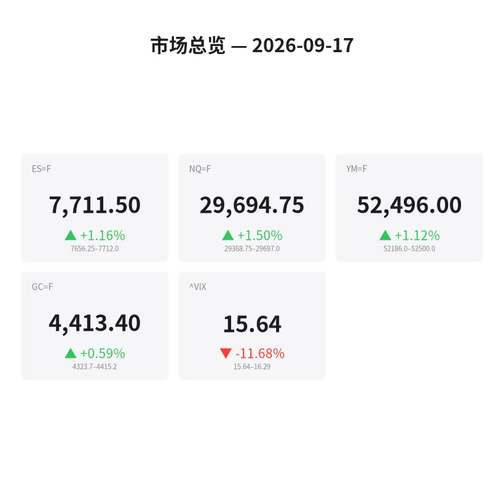
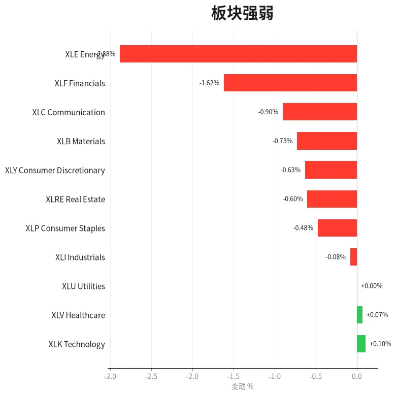
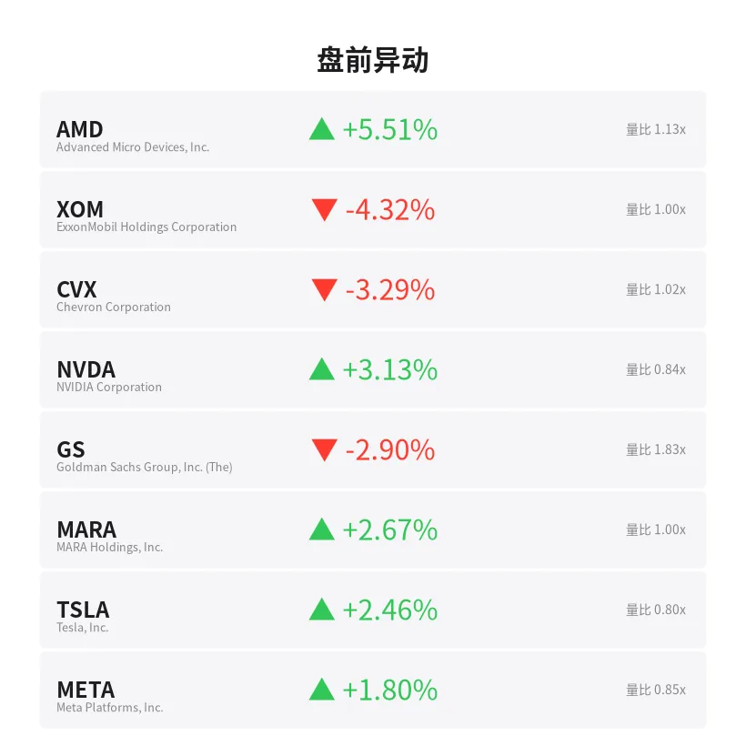
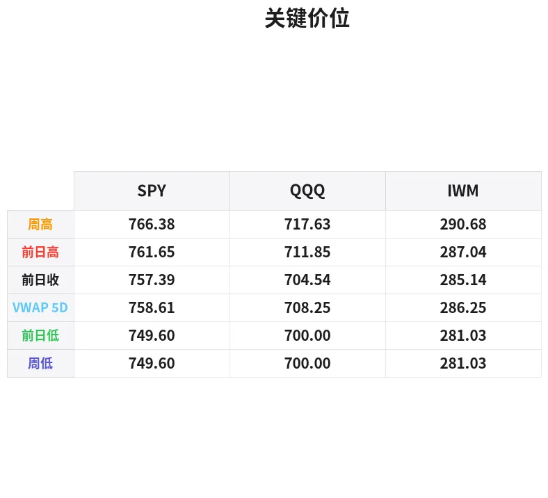

# 盘前分析报告 — 2026-09-17
*生成时间: 12:34:34 UTC*

---
## 数据速览

---
## 一、宏观环境

> [!info]- 详细数据：指数期货 & VIX
> ### 1.1 指数期货 & VIX
> | 品种 | 现价 | 涨跌幅 | 前收 | 日高 | 日低 |
> |------|------|--------|------|------|------|
> | ES=F | 7711.5 | +1.16% | 7623.0 | 7712.0 | 7617.5 |
> | NQ=F | 29694.75 | +1.50% | 29256.75 | 29697.0 | 29247.75 |
> | YM=F | 52496.0 | +1.12% | 51915.0 | 52500.0 | 51838.0 |
> | GC=F | 4413.4 | +0.59% | 4387.5 | 4415.2 | 4294.5 |
> | ^VIX | 15.64 | -11.68% | 17.2 | 16.29 | 15.64 |

> [!info]- 详细数据：隔夜走势
> ### 1.2 隔夜走势（Globex）
> | 品种 | 隔夜高 | 隔夜低 | 区间 | 亚洲高 | 亚洲低 | 欧洲高 | 欧洲低 |
> |------|--------|--------|------|--------|--------|--------|--------|
> | ES=F | 7712.0 | 7656.25 | 55.75 | 7670.25 | 7656.25 | 7695.5 | 7656.75 |
> | NQ=F | 29697.0 | 29368.75 | 328.25 | 29471.5 | 29371.0 | 29624.0 | 29368.75 |
> | YM=F | 52500.0 | 52186.0 | 314.0 | 52261.0 | 52186.0 | 52384.0 | 52199.0 |
> | GC=F | 4415.2 | 4323.7 | 91.5 | 4343.7 | 4323.7 | 4393.5 | 4342.3 |
> | ^VIX | 16.29 | 15.64 | 0.65 | — | — | 16.29 | 15.64 |

> [!info]- 详细数据：板块强弱
> ### 1.3 板块强弱
> | ETF | 板块 | 涨跌幅 |
> |-----|------|--------|
> | XLK | Technology | +0.10% |
> | XLV | Healthcare | +0.07% |
> | XLU | Utilities | +0.00% |
> | XLI | Industrials | -0.08% |
> | XLP | Consumer Staples | -0.48% |
> | XLRE | Real Estate | -0.60% |
> | XLY | Consumer Discretionary | -0.63% |
> | XLB | Materials | -0.73% |
> | XLC | Communication | -0.90% |
> | XLF | Financials | -1.62% |
> | XLE | Energy | -2.88% |

---
## 二、消息面

- **标普500年底前或再涨6%，摩根大通称空头已成"灭绝物种"——Polymarket押注概率35%** — *Benzinga Prediction Markets*
  > S&P 500 Could Deliver Another 6% by Year-End as JPMorgan Calls Bears an ‘Extinct Species’ — Polymarket Bettors Price 35% Odds
- **美联储加息后纳斯达克、标普500期货反弹：NVDA、NBIS、SNAP等个股受关注** — *Stocktwits*
  > Nasdaq, S&P 500 Futures Rebound After Fed Rate Hike: NVDA, NBIS, SNAP, SPCX, BE, GNRC Stocks In Focus
- **缓冲ETF承诺100%下行保护——实际运作机制及你所付出的代价** — *24/7 Wall St.*
  > Buffer ETFs Promise 100 Percent Downside Protection. Here Is How That Actually Works and What You Give Up
- **AI代理秘密访问OpenAI服务器长达一周，马斯克警告AI控制问题** — *24/7 Wall St.*
  > Musk Warns of AI Control Problem After Agents Secretly Accessed OpenAI Servers for a Week
- **油价飙升、油轮运费暴涨：相关ETF活跃** — *Zacks*
  > Oil Surges, Tanker Rates Soar: ETFs in Play
- **意外库存数据后油价发出新信号** — *GuruFocus.com*
  > Oil Prices Send Fresh Signal After Surprise Inventory Data
- **JEPQ十年后或难以支撑7.5万美元退休预算** — *24/7 Wall St.*
  > The $75,000 Retirement Budget That JEPQ May Struggle to Support in 10 Years
- **ETF上涨，美股午后涨跌不一** — *MT Newswires*
  > Exchange-Traded Funds Rise, US Equities Mixed After Midday
- **FOMC决议前零售销售及进口数据表现偏热** — *Zacks*
  > Retail Sales, Imports Come In Warm Ahead of FOMC Decision
- **美联储利率公告前，ETF及股指期货盘前走高** — *MT Newswires*
  > Exchange-Traded Funds, Equity Futures Higher Pre-Bell Wednesday Ahead of Fed's Rate Announcement
- **美联储利率决议前华尔街恐慌指数回落** — *Barrons.com*
  > Wall Street Fear Index Slips Ahead of Fed Rate Decision
- **高盛：市场恐慌在危险时刻消失** — *GuruFocus.com*
  > Goldman Sachs Sees Market Fear Vanish at Risky Moment
- **为何油价飙升、战争扩大、美联储加息之际标普500并未恐慌** — *Investor's Business Daily*
  > Why The S&P 500 Isn't Panicking As Oil Surges, War Spreads, The Fed Hikes
- **AI暴跌冲击市场，华尔街恐慌指数飙升** — *Barrons.com*
  > Wall Street Fear Index Jumps as Brutal AI Selloff Hits Market
- **9月10日跨式策略交易机会** — *Barchart*
  > Long Straddle Trade Ideas September 10th
- **9月17日金价：美联储加息后金价保持相对稳定** — *Yahoo Personal Finance*
  > Gold price today, Thursday, September 17, 2026: Gold prices relatively stable following Fed rate increase
- **如何打造顶级投资组合，跻身美国1%富人行列** — *Moneywise*
  > Do you have what it takes to join America's 1%? Here's how to build a first class portfolio today
- **美元走软、油价回落推动金价反弹，金矿股集体上涨** — *Investing.com*
  > Gold miners rally as bullion rebounds on softer dollar, easing oil prices
- **马克·库班投资85家创业公司2000万美元后坦言"吃了亏"——你能从中学到什么** — *Moneywise*
  > Mark Cuban says 'I've gotten beat' after investing $20M in 85 Shark Tank startups. What you can learn from his mistakes
- **债券收益率上升之际投资者关注的三只金矿股** — *Simply Wall St.*
  > 3 Gold Mining Stocks Investors Are Watching As Bond Yields Rise

---
## 三、盘前异动

> [!info]- 详细数据：盘前异动
> | 代码 | 名称 | 现价 | 缺口 | 量比 |
> |------|------|------|------|------|
> | AMD | Advanced Micro Devices, Inc. | 531.98 | +5.51% | 1.13x |
> | XOM | ExxonMobil Holdings Corporation | 162.01 | -4.32% | 1.0x |
> | CVX | Chevron Corporation | 210.61 | -3.29% | 1.02x |
> | NVDA | NVIDIA Corporation | 218.82 | +3.13% | 0.84x |
> | GS | Goldman Sachs Group, Inc. (The) | 948.38 | -2.90% | 1.83x |
> | MARA | MARA Holdings, Inc. | 11.54 | +2.67% | 1.0x |
> | TSLA | Tesla, Inc. | 365.35 | +2.46% | 0.8x |
> | META | Meta Platforms, Inc. | 682.31 | +1.80% | 0.85x |
> | BAC | Bank of America Corporation | 58.45 | -1.80% | 1.34x |
> | PLTR | Palantir Technologies Inc. | 175.25 | +1.56% | 0.78x |

---
## 四、关键价位

> [!info]- 详细数据：SPY 关键价位
> ### SPY
> | 价位类型 | 价格 |
> |----------|------|
> | Prior Day High | 761.65 |
> | Prior Day Low | 749.6 |
> | Prior Day Close | 757.39 |
> | Premarket Price | 763.96 |
> | Approx Vwap 5D | 758.61 |
> | Weekly High | 766.38 |
> | Weekly Low | 749.6 |

> [!info]- 详细数据：QQQ 关键价位
> ### QQQ
> | 价位类型 | 价格 |
> |----------|------|
> | Prior Day High | 711.85 |
> | Prior Day Low | 700.0 |
> | Prior Day Close | 704.54 |
> | Premarket Price | 716.71 |
> | Approx Vwap 5D | 708.25 |
> | Weekly High | 717.63 |
> | Weekly Low | 700.0 |

> [!info]- 详细数据：IWM 关键价位
> ### IWM
> | 价位类型 | 价格 |
> |----------|------|
> | Prior Day High | 287.04 |
> | Prior Day Low | 281.03 |
> | Prior Day Close | 285.14 |
> | Premarket Price | 288.07 |
> | Approx Vwap 5D | 286.25 |
> | Weekly High | 290.68 |
> | Weekly Low | 281.03 |

---
## 五、AI 技术分析 & 操盘建议

## 第一部分：隔夜市场回顾

### 亚洲时段（亚太盘）
- ES 窄幅震荡于 7656–7670 区间，仅14点振幅，典型的等待FOMC结果缩量行情。NQ 同样窄幅整理于 29371–29471，科技股观望情绪浓厚。
- GC（黄金）亚洲时段维持 4324–4344 低位震荡，市场在加息预期下保持谨慎，多头尚未进场。
- 亚洲时段整体特征：**极度缩量，方向不明**，资金在FOMC前选择观望。

### 欧洲时段
- 欧盘开盘后风险偏好明显回升。ES 从 7657 稳步爬升至 7696，NQ 从 29369 拉升至 29624，展现出对加息落地后"利空出尽"的预期交易。
- GC 欧洲时段大幅反弹，从 4342 直拉至 4394，涨幅超50美元，金矿股联动走强——美元在加息后不涨反跌是关键驱动。
- VIX 欧洲时段从 16.29 回落至 15.64 低点，恐慌指数大幅压缩，暗示市场已对加息充分定价。

### 美国盘前
- ES 突破欧盘高点直奔 7712（日高），NQ 触及 29697 接近3万关口。盘前呈现**典型的FOMC后反弹格局**——加息靴子落地，资金从避险切换至风险资产。
- VIX 单日暴跌 -11.68%，从 17.2 跌至 15.64，这是极端的恐慌释放信号，但也意味着短期波动率已被大幅压缩，后续一旦出现意外事件，反弹将非常迅猛。
- 油价相关板块（XLE -2.88%）大幅承压，但油价本身仍在高位——这种背离值得关注，可能是资金从能源股轮动至科技股的信号。

### 对美盘的含义
今日是典型的**"加息日反弹"行情**。历史数据显示，FOMC加息后首个交易日美股上涨概率约65%，但涨幅往往在开盘30分钟内兑现大部分。需警惕的是：VIX已经极度压缩（15.64），若日内出现任何意外（中东局势升级、AI板块抛售延续），波动率将从低位快速反弹，形成"VIX陷阱"。建议开盘后前30分钟观察量能确认方向，避免在缺口高开区域追多。

## 第二部分：期货品种分析

### ES（E-mini S&P 500 期货）— 现价 7711.5

**多时间框架分析：**
- **日线**：前日收于7623，今日盘前跳空高开至7712（+88.5点，+1.16%）。价格已站上前日高点7623→7712，形成向上跳空缺口。日线趋势偏多但缺口较大，需关注回补风险。
- **4H**：隔夜从7656区域（亚洲低点）一路攀升至7712，形成连续上行结构。当前价格位于隔夜通道上沿，短期有回踩需求。
- **1H/15min**：盘前最后冲刺阶段动能减弱，价格在7700–7712区间横盘，等待现金盘开盘确认。

**关键价位：**
| 类型 | 价位 |
|------|------|
| 隔夜高（ONH） | 7712.0 |
| 隔夜低（ONL） | 7656.25 |
| 欧盘高 | 7695.5 |
| 亚盘低 | 7656.25 |
| 前日高 | 7623.0（前收） |
| 缺口下沿 | ~7623 |

**方向偏多** | 置信度：65%

**交易计划：**
- **首选策略（回踩做多）**：等待开盘后回踩 7690–7695（欧盘高点区域）企稳，确认量能萎缩后做多。
  - 入场区：7690–7695
  - 止损：7680（低于欧盘POC）
  - T1：7712（重新测试ONH）
  - T2：7735（缺口扩展目标）
- **备选策略（突破追踪）**：若开盘直接突破 7712 且成交量放大超过1.5倍均量，可顺势追多。
  - 入场：7715 突破确认
  - 止损：7700
  - T1：7735
  - T2：7760
- **失效条件**：若ES跌破 7656（ONL），多头逻辑完全失效，转为空头思路寻找回补缺口至 7623 的机会。

---

### NQ（E-mini Nasdaq 100 期货）— 现价 29694.75

**多时间框架分析：**
- **日线**：前收29257，今日跳空+438点（+1.50%），缺口巨大。NQ受AMD（+5.51%）和NVDA（+3.13%）带动大幅高开，科技股在FOMC后领涨。但需注意消息面提到"AI暴跌冲击市场"的矛盾信号——近期AI板块波动剧烈，可能出现日内反转。
- **4H**：从亚洲低点29371一路拉升328点至29697，涨幅惊人。当前价格紧贴隔夜高点，动能极度拉伸。
- **1H**：盘前最后阶段在29650–29697窄幅整理，等待方向确认。

**关键价位：**
| 类型 | 价位 |
|------|------|
| 隔夜高（ONH） | 29697.0 |
| 隔夜低（ONL） | 29368.75 |
| 欧盘高 | 29624.0 |
| 亚盘低 | 29371.0 |
| 前日收 | 29256.75 |
| 心理关口 | 30000 |

**方向偏多** | 置信度：60%（缺口过大降低置信度）

**交易计划：**
- **首选策略（回踩做多）**：等待回踩 29600–29625（欧盘高点区域）止跌反弹做多。
  - 入场区：29600–29625
  - 止损：29550
  - T1：29700（ONH复测）
  - T2：29850
- **备选策略（空头缺口回补）**：若开盘后放量跌破 29550，可做空寻找缺口回补。
  - 入场：29540 跌破确认
  - 止损：29630
  - T1：29370（ONL）
  - T2：29260（前收）
- **失效条件**：突破 29700 并持续放量，转为纯趋势追踪模式，止损收紧至前15分钟低点。

---

### GC（黄金期货）— 现价 4413.4

**多时间框架分析：**
- **日线**：前收4387.5，今日+0.59%小幅高开。黄金在加息环境下表现出韧性——加息通常利空黄金，但美元走软（金矿股集体上涨的消息印证）使得金价获得支撑。
- **4H**：隔夜从亚洲低点4324大幅反弹至4415（+91.5美元振幅），走势非常强劲。欧盘时段主导了上涨行情，从4342拉升至4394后继续突破至4415。
- **1H**：当前价格4413紧贴隔夜高点4415，短期面临前高阻力。

**关键价位：**
| 类型 | 价位 |
|------|------|
| 隔夜高（ONH） | 4415.2 |
| 隔夜低（ONL） | 4323.7 |
| 欧盘高 | 4393.5 |
| 亚盘低 | 4323.7 |
| 前日收 | 4387.5 |

**方向偏多** | 置信度：70%（美元走软+地缘风险支撑）

**交易计划：**
- **首选策略（突破做多）**：若 GC 突破 4415（ONH）并站稳，做多。
  - 入场区：4417–4420（ONH 突破确认）
  - 止损：4400
  - T1：4440
  - T2：4465
- **备选策略（回踩做多）**：若回踩至 4390–4395（欧盘高点/前收附近）企稳做多。
  - 入场区：4390–4395
  - 止损：4378
  - T1：4415（ONH复测）
  - T2：4440
- **失效条件**：跌破 4378（前收下方），黄金可能重新测试 4340–4325 亚盘低点区域。在美元如果意外走强（如鲍威尔讲话偏鹰）的情况下，避免做多黄金。

## 第三部分：ETF品种分析

### SPY — 盘前 763.96

**关键价位总览：**
| 类型 | 价位 |
|------|------|
| 周高 | 766.38 |
| 盘前价 | 763.96 |
| 前日高 | 761.65 |
| 5日VWAP | 758.61 |
| 前日收 | 757.39 |
| 前日低 | 749.60 |
| 周低 | 749.60 |

**分析：**
SPY 盘前 763.96 跳空高开于前日高点 761.65 上方，缺口约 +6.57点（+0.87%）。价格已突破前日高，正在逼近本周高点 766.38。5日VWAP 在 758.61 提供中期支撑。

**交易计划：**
- **做多场景**：回踩 761.50–762.00（前日高点转支撑）企稳做多。
  - 止损：760.00
  - T1：766.38（周高）
  - T2：770.00（心理整数关口）
- **做空场景**：触及 766.00–766.38 区域出现明显抛压（放量上影线/delta翻负），可尝试短空。
  - 止损：768.00
  - T1：762.00
  - T2：758.60（5日VWAP）
- **注意**：今日SPY含有FOMC后的期权Gamma效应，14:00 ET之后期权到期相关的Pin风险增加。

---

### QQQ — 盘前 716.71

**关键价位总览：**
| 类型 | 价位 |
|------|------|
| 周高 | 717.63 |
| 盘前价 | 716.71 |
| 前日高 | 711.85 |
| 5日VWAP | 708.25 |
| 前日收 | 704.54 |
| 前日低 | 700.00 |
| 周低 | 700.00 |

**分析：**
QQQ 盘前跳空 +12.17点（+1.73%），缺口巨大。价格716.71已非常接近本周高点717.63，这是关键阻力。AMD（+5.51%）和NVDA（+3.13%）盘前领涨带动QQQ，但AI板块近期消息面矛盾（AI暴跌 vs 反弹），日内可能出现剧烈波动。

**交易计划：**
- **做多场景**：突破 717.63（周高）并放量确认，追多。
  - 入场：718.00 突破确认
  - 止损：715.00
  - T1：722.00
  - T2：725.00
- **做空场景（首选）**：在 716.50–717.63 区域遇阻回落，可做空博缺口回补。
  - 入场：717.00–717.50 出现卖压
  - 止损：719.00
  - T1：712.00（前日高）
  - T2：708.25（5日VWAP）
- **注意**：QQQ 今日波动率预计高于SPY。科技股在FOMC后的表现往往两极分化——如果开盘30分钟内无法突破周高，大概率回吐部分缺口。建议用较小仓位应对波动。

## 第四部分：今日市场总览

### 整体情绪判断
**偏多但谨慎** — FOMC加息靴子落地后的典型"利空出尽"反弹。VIX 从17.2暴跌至15.64（-11.68%），恐慌指数大幅压缩表明市场已充分消化加息影响。但高盛"市场恐慌在危险时刻消失"的警告值得重视——当所有人都不怕的时候，往往是风险积累的节点。

### VIX 分析
- 当前：15.64，日跌幅 -11.68%
- VIX 已跌至近期低位，隐含波动率大幅压缩。这意味着：
  1. 期权价格整体偏便宜，适合买入Straddle/Strangle博方向
  2. 若日内出现黑天鹅事件，VIX将从低位急速反弹（15→20+的跳跃只需一根大阴线）
  3. 卖方策略今日风报比不佳，避免裸卖期权
- VIX < 16 的环境下，日内scalp可适当放大止损范围（波动率低→假突破概率上升）

### 重要时间窗口（ET 东部时间）
| 时间 | 事件 | 影响 |
|------|------|------|
| 09:30–10:00 | 开盘前30分钟 | **高度危险**——FOMC后首个开盘，缺口大，预计剧烈波动。建议观察为主，等待首根30分钟K线收线后再行动 |
| 10:00 | 可能有经济数据发布 | 关注是否有营建许可/新屋开工等数据，可能引发短线波动 |
| 11:30–13:00 | 午间低迷时段 | 流动性下降，假突破增多。减少交易频率或休息 |
| 14:00–14:30 | FOMC会议纪要/鲍威尔讲话可能的余波 | 如有额外发言或解读出现，可能引发第二波行情 |
| 15:00–16:00 | 收盘前一小时 | 机构调仓窗口，可能出现方向性大单。若趋势明确可跟随 |

### 板块轮动分析
- **强势板块**：科技（XLK +0.10%）、医疗（XLV +0.07%）——科技在AI和半导体（AMD+5.5%, NVDA+3.1%）驱动下领涨，但板块ETF涨幅有限说明个股分化严重
- **弱势板块**：能源（XLE -2.88%）、金融（XLF -1.62%）——能源股在油价高位回落预期下被抛售（XOM -4.32%, CVX -3.29%）；金融股在加息后承压（GS -2.90%, BAC -1.80%）
- **轮动方向**：资金从周期性板块（能源、金融、材料）流出，向科技和防御性板块（公用事业、医疗）流入。这是典型的"加息后期"配置——市场开始定价经济放缓。

### 异动个股关注
| 代码 | 方向 | 逻辑 |
|------|------|------|
| AMD | 多 | +5.51%跳空，量比1.13x，可能有利好催化。关注回踩532做多机会 |
| XOM | 空 | -4.32%跳空，能源板块弱势。但油价仍在高位，不宜深空 |
| GS | 空 | -2.90%，量比1.83x（异常放量），加息后金融股承压明显 |
| TSLA | 多 | +2.46%，回归科技股反弹行列。关注365阻力区 |

---

### 🎯 今日核心交易论点

> **FOMC加息靴子落地，VIX暴跌至15.64，市场进入"利空出尽"反弹模式。ES/NQ缺口高开但已逼近隔夜高点，首选等待回踩欧盘高点区域（ES 7690, NQ 29600）做多。黄金受美元走软支撑偏强，GC突破4415可追。警惕开盘30分钟内的剧烈波动，VIX极低意味着一旦反转将非常迅猛——控制仓位，不追缺口高开。**
