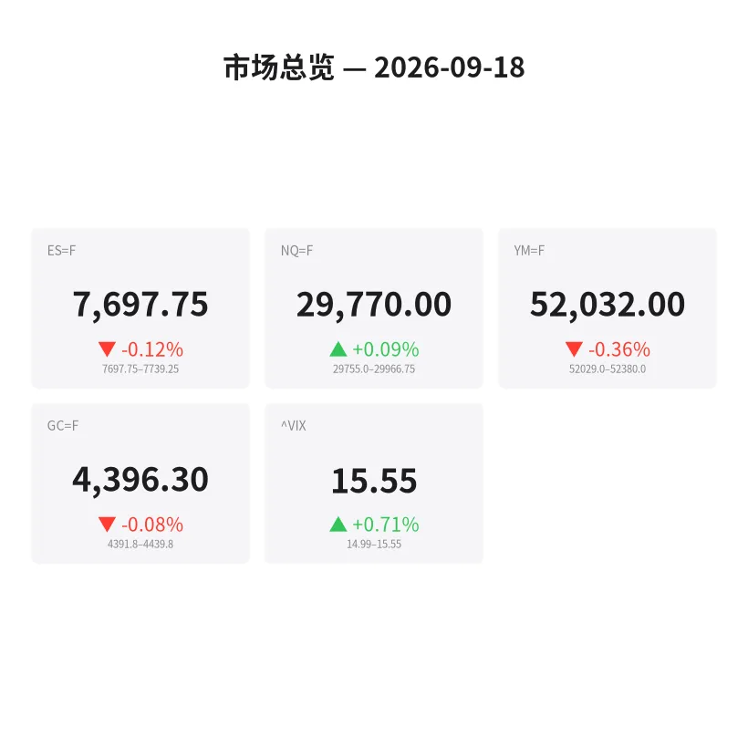
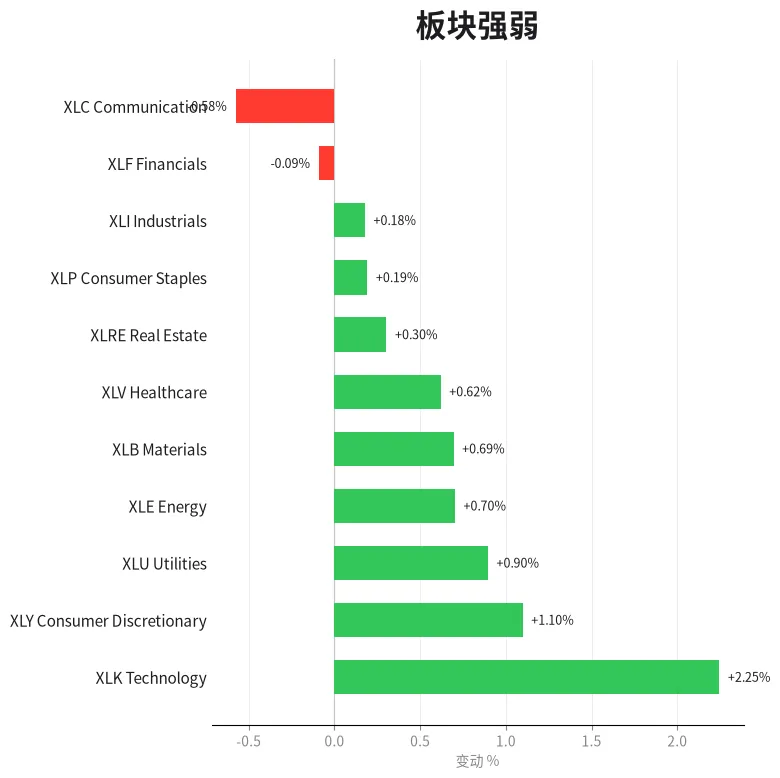
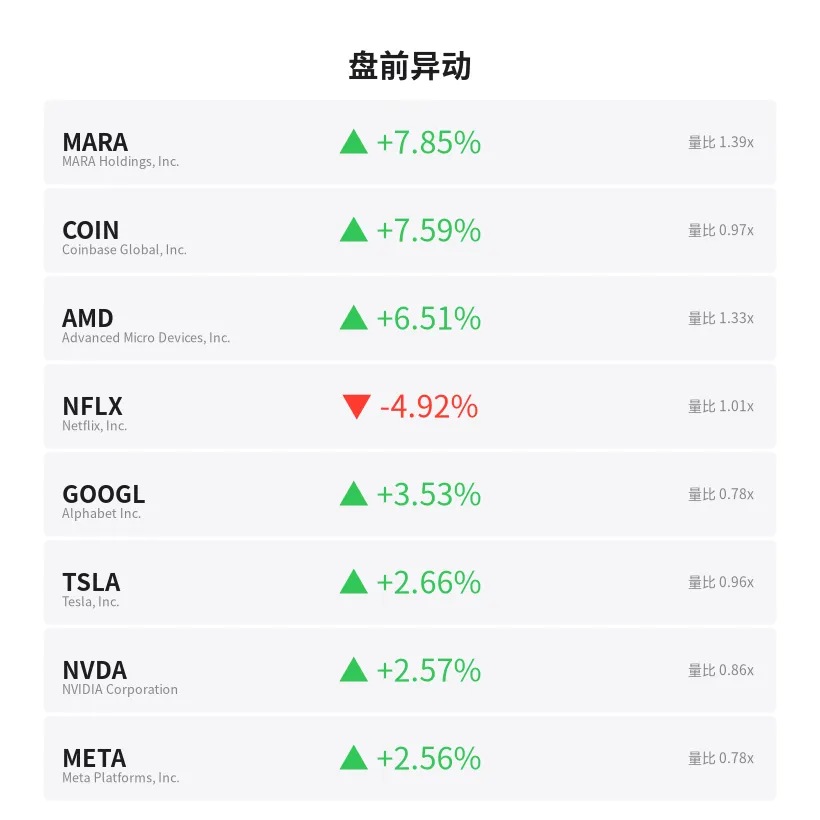
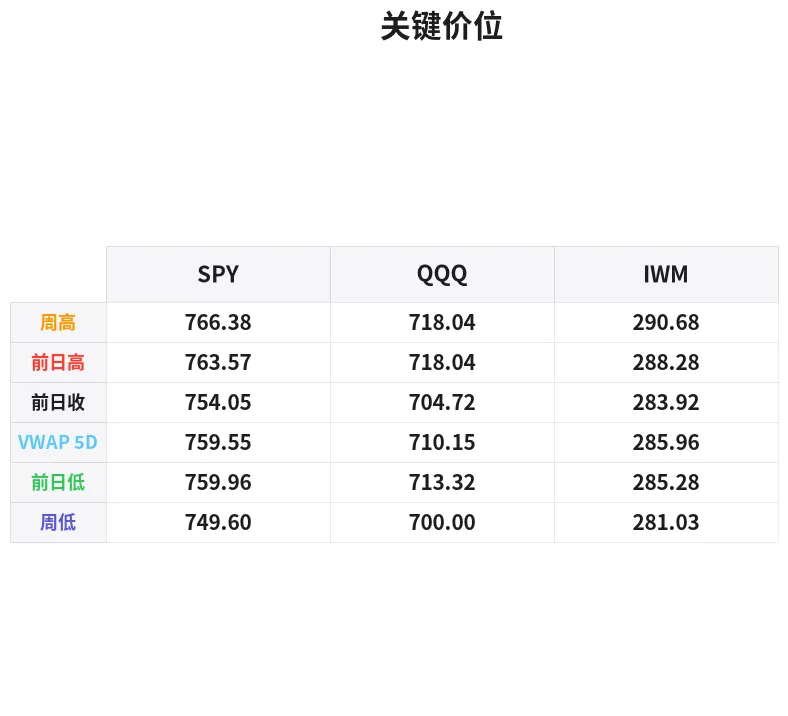

# 盘前分析报告 — 2026-09-18
*生成时间: 12:35:26 UTC*

---
## 数据速览

---
## 一、宏观环境

> [!info]- 详细数据：指数期货 & VIX
> ### 1.1 指数期货 & VIX
> | 品种 | 现价 | 涨跌幅 | 前收 | 日高 | 日低 |
> |------|------|--------|------|------|------|
> | ES=F | 7697.75 | -0.12% | 7707.25 | 7739.25 | 7696.0 |
> | NQ=F | 29770.0 | +0.09% | 29743.0 | 29966.75 | 29648.0 |
> | YM=F | 52032.0 | -0.36% | 52220.0 | 52380.0 | 52029.0 |
> | GC=F | 4396.3 | -0.08% | 4399.7 | 4439.5 | 4372.2 |
> | ^VIX | 15.55 | +0.71% | 17.71 | 15.55 | 14.99 |

> [!info]- 详细数据：隔夜走势
> ### 1.2 隔夜走势（Globex）
> | 品种 | 隔夜高 | 隔夜低 | 区间 | 亚洲高 | 亚洲低 | 欧洲高 | 欧洲低 |
> |------|--------|--------|------|--------|--------|--------|--------|
> | ES=F | 7739.25 | 7697.75 | 41.5 | 7730.25 | 7712.75 | 7739.25 | 7710.25 |
> | NQ=F | 29966.75 | 29755.0 | 211.75 | 29859.25 | 29755.0 | 29966.75 | 29822.5 |
> | YM=F | 52380.0 | 52029.0 | 351.0 | 52350.0 | 52257.0 | 52380.0 | 52146.0 |
> | GC=F | 4439.8 | 4391.8 | 48.0 | 4418.1 | 4391.8 | 4439.8 | 4411.4 |
> | ^VIX | 15.55 | 14.99 | 0.56 | — | — | 15.55 | 14.99 |

> [!info]- 详细数据：板块强弱
> ### 1.3 板块强弱
> | ETF | 板块 | 涨跌幅 |
> |-----|------|--------|
> | XLK | Technology | +2.25% |
> | XLY | Consumer Discretionary | +1.10% |
> | XLU | Utilities | +0.90% |
> | XLE | Energy | +0.70% |
> | XLB | Materials | +0.69% |
> | XLV | Healthcare | +0.62% |
> | XLRE | Real Estate | +0.30% |
> | XLP | Consumer Staples | +0.19% |
> | XLI | Industrials | +0.18% |
> | XLF | Financials | -0.09% |
> | XLC | Communication | -0.58% |

---
## 二、消息面

- **这些"高收益"ETF年付5%–9%，却在悄悄侵蚀你的本金——应该持有什么替代品** — *24/7 Wall St.*
  > These ‘High-Yield’ ETFs Pay 5%–9% While Quietly Shrinking Your Principal. Here’s What to Own Instead
- **纳斯达克、标普500和道指期货为何盘前上涨？NVDA、CRWV、AMD、SPCX、BE成为焦点** — *Stocktwits*
  > Why Are Nasdaq, S&P 500 And Dow Futures Rising Premarket? NVDA, CRWV, AMD, SPCX, BE Stocks In Focus
- **股市：标普500今天高开还是低开？** — *Benzinga Prediction Markets*
  > Stock Market: Will S&P 500 Open Up or Down Today?
- **ETF绿洲亮相Future Proof大会：周二精选** — *etf.com*
  > ETF Oasis at Future Proof: Tuesday Highlights
- **标普500、纳斯达克、道指收高，油价下跌缓解通胀担忧——NVDA、MCD、CRWV、LMT、AMZN受关注** — *Stocktwits*
  > S&P 500, Nasdaq, Dow End Higher As Drop In Oil Prices Allays Inflationary Concerns — NVDA, MCD, CRWV, LMT, AMZN In Focus
- **今日股市：油价持续走低，道指震荡；苹果、AMD进入买入区间（实时报道）** — *Investor's Business Daily*
  > Stock Market Today: Dow Wavers As Oil Extends Losses; Apple, AMD In Buy Zones (Live Coverage)
- **本周美股：SPY、QQQ是否跑赢亚洲股市？** — *Stocktwits*
  > US Stock Market This Week: Are SPY, QQQ Beating Asian Equities?
- **每月定投100美元QQQ，20年后能增长到多少？** — *Motley Fool*
  > A $100 Monthly Investment in QQQ Could Grow Into This Over 20 Years
- **预测：未来5年景顺QQQ信托将再次跑赢标普500** — *Motley Fool*
  > Prediction: The Invesco QQQ Trust Beats the S&P 500 Again Over the Next 5 Years
- **美联储利率决议前夕，华尔街恐慌指数回落** — *Barrons.com*
  > Wall Street Fear Index Slips Ahead of Fed Rate Decision
- **高盛：市场恐慌情绪在关键时刻消退** — *GuruFocus.com*
  > Goldman Sachs Sees Market Fear Vanish at Risky Moment
- **油价飙升、战事蔓延、美联储加息——标普500为何不慌？** — *Investor's Business Daily*
  > Why The S&P 500 Isn't Panicking As Oil Surges, War Spreads, The Fed Hikes
- **AI暴跌冲击市场，华尔街恐慌指数飙升** — *Barrons.com*
  > Wall Street Fear Index Jumps as Brutal AI Selloff Hits Market
- **9月10日跨式期权交易策略** — *Barchart*
  > Long Straddle Trade Ideas September 10th
- **今日金价（2026年9月18日周五）：通胀担忧消退，黄金触及周内高点** — *Yahoo Personal Finance*
  > Gold price today, Friday, September 18, 2026: Gold hits weekly high as inflation concerns fade
- **退休后大手大脚？且慢——婴儿潮一代最后悔的4大消费及避免方法** — *Moneywise*
  > Retirement spending spree? Not so fast. Here are 4 big purchases boomers regret making — and how to avoid them
- **Nexa Resources (NEXA) 上涨7.0%：涨势能否持续？** — *Zacks*
  > Nexa Resources (NEXA) Moves 7.0% Higher: Will This Strength Last?
- **B vs. KGC：现在该押注哪只黄金矿业股？** — *Zacks*
  > B vs. KGC: Which Gold Mining Stock Should You Bet on Now?
- **高盛解读：美联储加息对2027年金价意味着什么** — *Investing.com*
  > What Fed rate hikes mean for gold prices in 2027, according to Goldman
- **今日股市：道指首次收于52000点上方，科技股领涨标普500和纳斯达克** — *Yahoo Finance*
  > Stock market today: Dow closes above 52,000 for first time, S&P 500 and Nasdaq rally as tech gains

---
## 三、盘前异动

> [!info]- 详细数据：盘前异动
> | 代码 | 名称 | 现价 | 缺口 | 量比 |
> |------|------|------|------|------|
> | MARA | MARA Holdings, Inc. | 11.91 | +7.85% | 1.39x |
> | COIN | Coinbase Global, Inc. | 176.99 | +7.59% | 0.97x |
> | AMD | Advanced Micro Devices, Inc. | 545.86 | +6.51% | 1.33x |
> | NFLX | Netflix, Inc. | 72.65 | -4.92% | 1.01x |
> | GOOGL | Alphabet Inc. | 354.98 | +3.53% | 0.78x |
> | TSLA | Tesla, Inc. | 367.61 | +2.66% | 0.96x |
> | NVDA | NVIDIA Corporation | 219.4 | +2.57% | 0.86x |
> | META | Meta Platforms, Inc. | 690.53 | +2.56% | 0.78x |
> | AMZN | Amazon.com, Inc. | 252.14 | +2.51% | 0.97x |
> | RIVN | Rivian Automotive, Inc. | 15.47 | +1.58% | 1.3x |

---
## 四、关键价位

> [!info]- 详细数据：SPY 关键价位
> ### SPY
> | 价位类型 | 价格 |
> |----------|------|
> | Prior Day High | 763.57 |
> | Prior Day Low | 759.96 |
> | Prior Day Close | 754.05 |
> | Premarket Price | 760.4962 |
> | Approx Vwap 5D | 759.55 |
> | Weekly High | 766.38 |
> | Weekly Low | 749.6 |

> [!info]- 详细数据：QQQ 关键价位
> ### QQQ
> | 价位类型 | 价格 |
> |----------|------|
> | Prior Day High | 718.0401 |
> | Prior Day Low | 713.32 |
> | Prior Day Close | 704.72 |
> | Premarket Price | 718.181 |
> | Approx Vwap 5D | 710.15 |
> | Weekly High | 718.04 |
> | Weekly Low | 700.0 |

> [!info]- 详细数据：IWM 关键价位
> ### IWM
> | 价位类型 | 价格 |
> |----------|------|
> | Prior Day High | 288.28 |
> | Prior Day Low | 285.28 |
> | Prior Day Close | 283.92 |
> | Premarket Price | 284.55 |
> | Approx Vwap 5D | 285.96 |
> | Weekly High | 290.68 |
> | Weekly Low | 281.03 |

---
## 五、AI 技术分析 & 操盘建议

## 第一部分：隔夜市场回顾

### 亚洲时段（18:00–02:00 ET）
- **ES** 在亚洲时段交投清淡，区间 7712.75–7730.25（仅17.5点），贴近前收 7707 上方窄幅震荡，多空未表态。
- **NQ** 亚洲时段相对疲软，区间 29755–29859，未能突破 29900 整数关口，暗示亚洲资金对科技股追涨意愿有限。
- **GC** 黄金亚洲时段探底 4391.8 后反弹，受通胀担忧消退与避险需求减弱双重影响，窄幅整理。
- **解读**：亚洲时段整体属于盘整蓄势，成交量低迷，未提供明确方向指引。

### 欧洲时段（02:00–09:30 ET）
- **ES** 欧洲时段扩大波动，高点触及 7739.25（隔夜最高），但随后回落至 7710 附近，形成一个假突破结构。目前回落至 7697.75（隔夜低点），注意这里是关键多空分水岭。
- **NQ** 欧洲时段表现最强，冲高 29966.75 逼近 30000 心理关口未果后回落。这一冲高回落形态需要警惕：若开盘未能收复 29900，可能形成日内double top。
- **YM** 道指期货欧洲时段跌幅最大，从 52380 回落至 52029，回吐隔夜全部涨幅，反映出价值/周期板块承压（XLF -0.09%，XLC -0.58%）。
- **GC** 黄金欧洲时段冲高 4439.8 后快速回落至 4396 附近，形成一个shooting star形态，短线面临抛压。

### 对美盘的启示
1. **ES当前位于隔夜区间下沿**（7697.75），若开盘跌破将测试 7690–7680 支撑区域；若守住则可能回抽 7720–7730。
2. **NQ的30000心理关口**是今日关键战场——欧洲时段未能拿下，美盘若冲关成功将打开上行空间。
3. **VIX 15.55** 处于低位且盘前继续走低，市场整体风险偏好仍然偏多，但需注意美联储利率决议（若今日有）可能引发波动率骤增。
4. **油价下跌**是昨日收涨的核心驱动，若美盘油价继续走低，利好大盘（尤其运输、航空、消费板块）。

## 第二部分：期货品种分析

### ES（E-mini S&P 500）
**多时间框架分析：**
- **日线**：昨收 7707，道指首破 52000 确认多头趋势。但ES今日盘前微跌 -0.12%，处于前日实体内部，属于正常回踩。日线仍处上升趋势中。
- **4H**：从欧洲高点 7739 回落至 7697，形成一根看跌吞没的4H K线。7700 整数关口得失是短线关键。
- **1H/15min**：隔夜形成 7739–7697 的下降通道，每次反弹高点递减（7739→7730→7720→7710），空方暂时占优。

**关键价位：**
| 类型 | 价格 |
|------|------|
| 隔夜高/强阻力 | 7739.25 |
| 欧洲时段POC | 7720 |
| 整数关口/枢轴 | 7700 |
| 隔夜低/当前价 | 7697.75 |
| 下方支撑1 | 7690（周一低点附近） |
| 下方支撑2 | 7680（5日VWAP下方） |
| 强支撑 | 7660（周低附近） |

**方向偏向**：震荡偏空 → 🔻 60%概率先下探
**置信度**：中等（VIX低位+大趋势偏多，但短线动能偏弱）

**交易计划：**
- **空单机会**：若开盘跌破 7695 并回测 7700 不过 → 做空，止损 7712，目标1: 7680，目标2: 7660
- **多单机会**：若快速下探 7680 后出现明显买盘（delta翻正+大单吃offer）→ 做多，止损 7670，目标1: 7700，目标2: 7720
- **失效条件**：若开盘直接站上 7720 并放量突破，空头逻辑失效，转为观望或顺势追多至 7739

---

### NQ（E-mini Nasdaq 100）
**多时间框架分析：**
- **日线**：昨收 29743，今日盘前 29770（+0.09%），连续多日收阳但涨幅收窄，动能减弱信号。XLK板块 +2.25% 领涨暗示科技仍有资金流入。
- **4H**：欧洲时段冲击 29966.75 失败（距30000仅33点），回落后形成pin bar。30000 是极强心理阻力+期权gamma墙。
- **1H**：目前位于 29770 附近，隔夜区间 29755–29966 的下半部分。29800 是短线多空分界。

**关键价位：**
| 类型 | 价格 |
|------|------|
| 心理关口/强阻力 | 30000 |
| 隔夜高 | 29966.75 |
| 欧洲POC | 29880 |
| 短线枢轴 | 29800 |
| 隔夜低/强支撑 | 29755 |
| 下方支撑 | 29650（前日低点） |
| 关键支撑 | 29500 |

**方向偏向**：震荡偏多 → 🔺 55%概率回抽测试30000
**置信度**：中等（科技板块强势但30000关口压力大，需量能配合）

**交易计划：**
- **多单机会**：若开盘守住 29755–29780 区域并出现买盘堆积 → 做多，止损 29720，目标1: 29880，目标2: 29960
- **空单机会**：若再次冲击 29960–30000 出现明显抛压（cumulative delta走平/走弱+大单砸bid）→ 做空，止损 30030，目标1: 29850，目标2: 29760
- **失效条件**：若开盘直接gap up突破 30000 并站稳，空头失效，等待回踩 30000 做多

---

### GC（黄金期货）
**多时间框架分析：**
- **日线**：黄金近期在 4370–4440 区间震荡，今日 4396 处于区间中部。新闻面提示"通胀担忧消退+黄金触及周内高点"——矛盾信号，说明黄金走的是避险逻辑而非通胀逻辑。
- **4H**：欧洲时段冲高 4439.8 后迅速回落至 4396，形成shooting star形态，短线看跌信号明确。
- **1H**：从 4439 到 4396 的下跌通道完整，目前在 4395–4400 寻找支撑。

**关键价位：**
| 类型 | 价格 |
|------|------|
| 隔夜高/强阻力 | 4439.8 |
| 欧洲开盘高 | 4420 |
| 短线阻力 | 4410 |
| 当前价/枢轴 | 4396 |
| 隔夜低/支撑 | 4391.8 |
| 强支撑 | 4372（日低） |
| 关键支撑 | 4350 |

**方向偏向**：偏空 → 🔻 65%概率继续下探
**置信度**：中高（VIX走低+风险偏好回升不利避险资产，shooting star技术信号明确）

**交易计划：**
- **空单机会**：若反弹至 4408–4415 区域遇阻（orderflow显示卖盘主导）→ 做空，止损 4425，目标1: 4385，目标2: 4372
- **多单机会**：仅在 4370–4375 出现强势V型反转时考虑，止损 4360，目标 4395
- **失效条件**：若重新站上 4420 并持续放量，空头逻辑失效

## 第三部分：ETF品种分析

### SPY（SPDR S&P 500 ETF）
**关键价位：**
| 类型 | 价格 |
|------|------|
| 周高/强阻力 | 766.38 |
| 前日高 | 763.57 |
| 盘前价 | 760.50 |
| 前日低 | 759.96 |
| 5日VWAP | 759.55 |
| 前日收盘 | 754.05 |
| 周低/强支撑 | 749.60 |

**分析：**
- 盘前价 760.50 较前收 754.05 **跳空高开约 +0.85%**，直接站上前日高低区间（759.96–763.57）内部。
- 5日VWAP 759.55 将是开盘后的关键回踩支撑——若跳空后回落，759.50–760.00 是第一道防线。
- 若守住 760 上方整理后放量突破 763.57（前日高），则打开向 766–768 的上行空间。
- 若跌破 759.50（5日VWAP），跳空填补风险增大，可能回落至 756–754 区域。

**交易计划：**
- **做多**：开盘回踩 759.50–760.00 区域出现承接 → 入场做多，止损 758.50，目标1: 763.50，目标2: 766.00
- **做空**：若冲击 763.50 明显受阻并出现卖压 → 短空，止损 764.50，目标 760.50
- **观望**：若开盘在 760–763 之间窄幅震荡无量，等待突破后再介入

---

### QQQ（Invesco QQQ Trust）
**关键价位：**
| 类型 | 价格 |
|------|------|
| 盘前价/周高附近 | 718.18 |
| 前日高/周高 | 718.04 |
| 前日低 | 713.32 |
| 5日VWAP | 710.15 |
| 前日收盘 | 704.72 |
| 周低/强支撑 | 700.00 |

**分析：**
- 盘前价 718.18 **大幅跳空高开 +1.91%**，直接站上前日高 718.04 和周高，创近期新高！这是极强的信号。
- XLK +2.25% 领涨所有板块，AMD +6.51%、NVDA +2.57%、META +2.56% 等科技权重股全面走强，验证了QQQ的强势。
- 风险点：跳空幅度较大（+13.46点），开盘后有回补缺口的需求。但若NQ能突破 30000，QQQ将获得额外动能。
- 关键观察：718.04 由前日阻力转为支撑——若开盘回踩不破此位，多头格局确认。

**交易计划：**
- **做多**：开盘回踩 717.50–718.50 区域（前日高转支撑）出现买盘 → 做多，止损 715.50，目标1: 722.00，目标2: 725.00
- **做空**：不主动做空（趋势极强），仅在冲高至 724+ 出现极端抛压时考虑短线反向
- **观望**：若开盘直接冲高至 722+ 不回踩，不追，等待第一次回踩再决策

## 第四部分：今日市场总览

### 整体情绪判读
**偏多，但分化明显。**

| 指标 | 读数 | 含义 |
|------|------|------|
| VIX | 15.55（-9.4% vs 前收17.71） | 恐慌极低，市场极度自满 |
| ES涨跌 | -0.12% | 大盘微跌，权重拖累 |
| NQ涨跌 | +0.09% | 科技微涨但冲高回落 |
| XLK | +2.25% | 科技板块独领风骚 |
| XLC | -0.58% | 通信服务逆势走弱 |
| 油价 | 大幅下跌（新闻面） | 利好消费/运输，压制能源 |

### VIX 深度解读
- VIX从17.71大幅回落至15.55，日内低点14.99，说明市场定价的不确定性快速消退。
- **警惕**：VIX处于极低水平+美联储利率决议窗口 = 波动率可能骤然回升。低VIX不等于安全，恰恰是gamma squeeze（波动率爆发）的温床。
- 建议：关注VVIX（VIX的VIX），若VVIX走高而VIX走低，说明聪明钱在买入波动率保护。

### 需要规避的时间窗口
1. **09:30–09:45 ET**：开盘前15分钟，跳空消化期，不要追涨杀跌
2. **10:00 ET**：经济数据发布窗口（若有），等数据落地再操作
3. **14:00 ET**：美联储利率决议公布（若今日为FOMC日），**这是今日最大风险事件**——决议前30分钟开始减仓，决议后等15分钟再重新入场
4. **15:45–16:00 ET**：收盘前MOC（Market on Close）订单流可能造成剧烈波动

### 板块轮动信号
- **科技（XLK +2.25%）绝对领涨**：AMD +6.51%、NVDA +2.57% 驱动。半导体/AI链条是今日核心主线。
- **加密关联股暴涨**：MARA +7.85%、COIN +7.59%，可能与比特币突破某关键位有关，留意加密货币走势。
- **金融（XLF -0.09%）、通信（XLC -0.58%）走弱**：NFLX -4.92% 拖累通信板块。
- **防御板块分化**：公用事业（XLU +0.90%）走强 vs 消费必需品（XLP +0.19%）平淡——不是典型避险轮动，更像是利率敏感型板块受益于降息预期。

### 🎯 核心交易论点（一句话）

**科技主导的risk-on格局延续，NQ/QQQ是多头主战场（30000关口突破与否定义今日方向），ES相对弱势适合高空低多的区间操作；黄金shooting star后偏空看待；VIX极低环境下仓位控制在50%以下，美联储事件窗口前务必减仓。**
