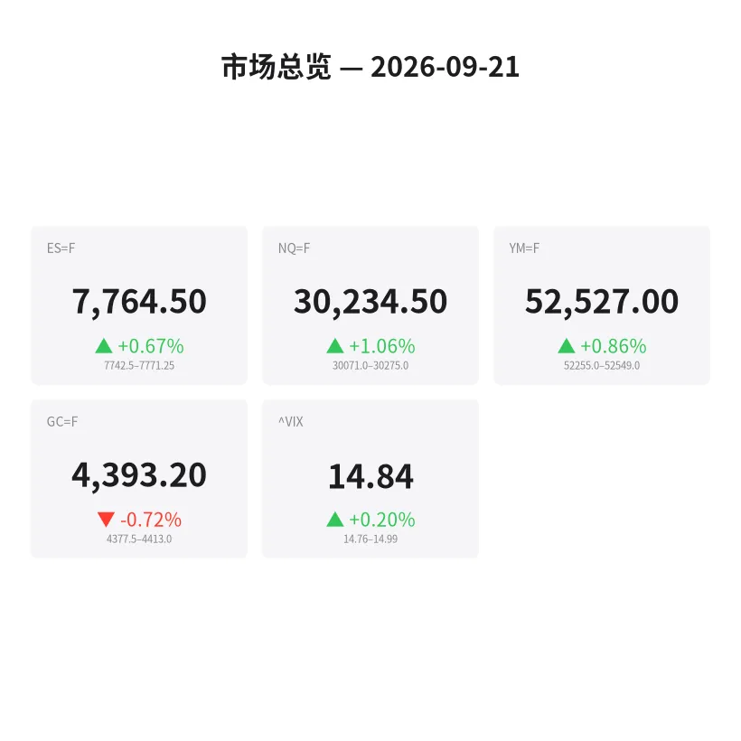
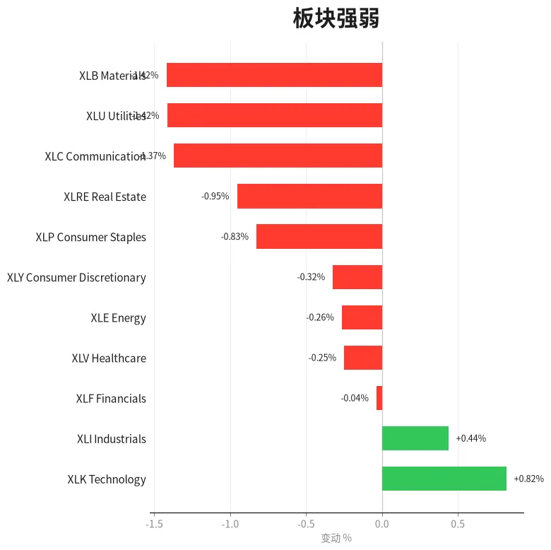
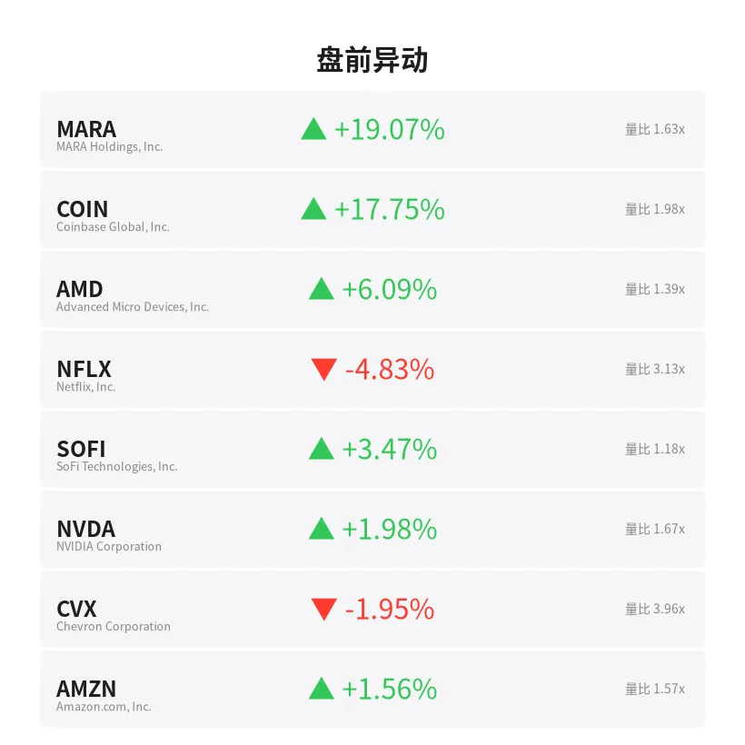
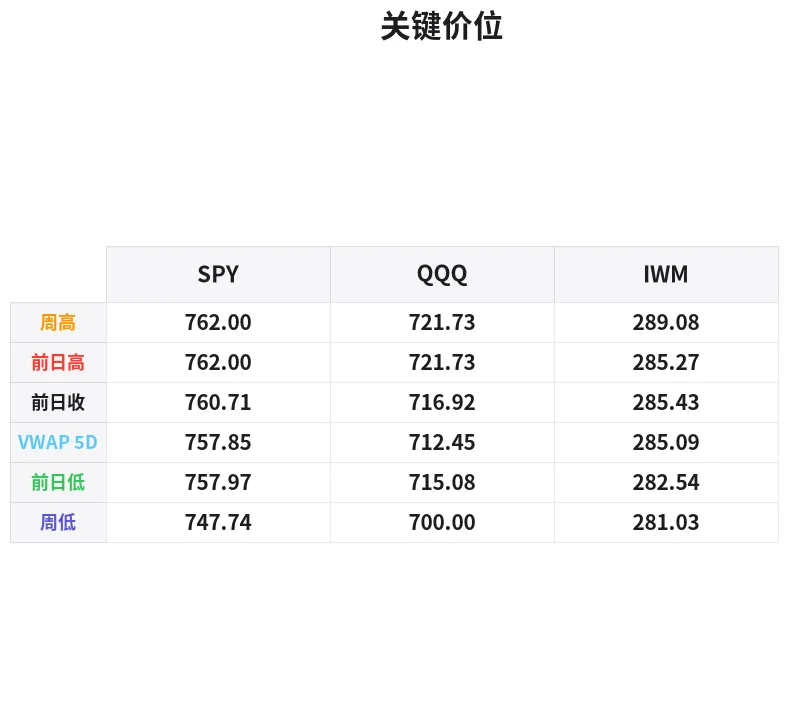

# 盘前分析报告 — 2026-09-21
*生成时间: 12:36:39 UTC*

---
## 数据速览

---
## 一、宏观环境

> [!info]- 详细数据：指数期货 & VIX
> ### 1.1 指数期货 & VIX
> | 品种 | 现价 | 涨跌幅 | 前收 | 日高 | 日低 |
> |------|------|--------|------|------|------|
> | ES=F | 7764.5 | +0.67% | 7712.5 | 7771.0 | 7713.75 |
> | NQ=F | 30234.5 | +1.06% | 29917.25 | 30274.75 | 29904.0 |
> | YM=F | 52527.0 | +0.86% | 52079.0 | 52549.0 | 52080.0 |
> | GC=F | 4393.2 | -0.72% | 4424.9 | 4422.1 | 4377.5 |
> | ^VIX | 14.84 | +0.20% | 14.81 | 14.99 | 14.76 |

> [!info]- 详细数据：隔夜走势
> ### 1.2 隔夜走势（Globex）
> | 品种 | 隔夜高 | 隔夜低 | 区间 | 亚洲高 | 亚洲低 | 欧洲高 | 欧洲低 |
> |------|--------|--------|------|--------|--------|--------|--------|
> | ES=F | 7771.25 | 7742.5 | 28.75 | 7748.5 | 7742.5 | 7771.25 | 7745.5 |
> | NQ=F | 30275.0 | 30071.0 | 204.0 | 30111.75 | 30071.0 | 30266.75 | 30090.5 |
> | YM=F | 52549.0 | 52255.0 | 294.0 | 52291.0 | 52255.0 | 52549.0 | 52267.0 |
> | GC=F | 4413.0 | 4377.5 | 35.5 | 4402.9 | 4386.3 | 4409.4 | 4377.5 |
> | ^VIX | 14.99 | 14.76 | 0.23 | — | — | 14.99 | 14.76 |

> [!info]- 详细数据：板块强弱
> ### 1.3 板块强弱
> | ETF | 板块 | 涨跌幅 |
> |-----|------|--------|
> | XLK | Technology | +0.82% |
> | XLI | Industrials | +0.44% |
> | XLF | Financials | -0.04% |
> | XLV | Healthcare | -0.25% |
> | XLE | Energy | -0.26% |
> | XLY | Consumer Discretionary | -0.32% |
> | XLP | Consumer Staples | -0.83% |
> | XLRE | Real Estate | -0.95% |
> | XLC | Communication | -1.37% |
> | XLU | Utilities | -1.42% |
> | XLB | Materials | -1.42% |

---
## 二、消息面

- **Credo Technology三个月暴跌：华尔街分析师称即将翻倍** — *24/7 Wall St.*
  > Credo Technology Crashed for 3 Months: This Wall Street Pro Says It’s About to Double
- **特朗普-习近平本周峰会前纳指、标普500、道指期货上涨：NVDA、META等个股受关注** — *Stocktwits*
  > Nasdaq, S&P 500, Dow Futures Rise Ahead Of Trump-Xi Summit This Week: NVDA, META, CRML, GLND, SPCX, RKLB, BE Stocks In Focus
- **今日股市：标普500开盘将涨还是跌？** — *Benzinga Prediction Markets*
  > Stock Market: Will S&P 500 Open Up or Down Today?
- **生物科技周报：XLV跑赢大盘——下周值得关注的个股、数据与事件** — *Stocktwits*
  > Biotech Week Ahead: XLV Beats The Market — Here Are The Stocks, Readouts And Events To Watch Next
- **如何从零开始构建每月3250美元股息收入以覆盖夫妇社保支出** — *24/7 Wall St.*
  > How to Build $3,250 a Month in Dividend Income to Cover a Married Couple’s Social Security Checks, Starting From Zero
- **若AI泡沫如互联网泡沫般破裂，历史数据表明QQQ可能要到2042年才能收复失地** — *Motley Fool*
  > If the AI Bubble Bursts as the Dot-Com Did, History Says the QQQ Might Not Recover Until 2042
- **历史数据显示：即使在互联网泡沫顶点买入纳斯达克100，1万美元最终也能变成约7.2万美元** — *Motley Fool*
  > History Says Buying the Nasdaq-100 at the Dot-Com Peak Still (Eventually) Turned $10,000 Into About $72,000
- **SpaceX在纳斯达克100季度再平衡中权重将跃升至2.82%** — *Investing.com*
  > SpaceX Nasdaq 100 weight to jump to 2.82% in quarterly rebalance -Bloomberg
- **股市面临越来越多的威胁——为何投资者依然如此淡定？** — *MarketWatch*
  > Stocks face a growing list of threats — so why are investors staying so calm?
- **美联储加息后期权交易者买入AI芯片看涨期权** — *Quartz*
  > Options traders buy AI chip calls after Fed rate hike
- **美联储利率决议前华尔街恐慌指数回落** — *Barrons.com*
  > Wall Street Fear Index Slips Ahead of Fed Rate Decision
- **高盛发现市场恐慌情绪在高风险时刻消散** — *GuruFocus.com*
  > Goldman Sachs Sees Market Fear Vanish at Risky Moment
- **油价飙升、战争蔓延、美联储加息——为何标普500毫不恐慌** — *Investor’s Business Daily*
  > Why The S&P 500 Isn’t Panicking As Oil Surges, War Spreads, The Fed Hikes
- **DPM Metals (TSX:DPM) 扩展Brevene矿藏发现，该股是否已充分定价？** — *Simply Wall St.*
  > DPM Metals (TSX:DPM) Extends Brevene Discovery, Is The Stock Fully Valued?
- **黄金下跌，市场焦点仍在利率前景** — *Barrons.com*
  > Gold Falls as Focus Remains on Rate Outlook
- **欧洲芯片股周初早盘走高** — *The Wall Street Journal*
  > European Chip Stocks Open Week With Early Gains
- **DPM Metals新Brevene斑岩南区钻探和冶金结果出炉，投资者是否需要行动？** — *Simply Wall St.*
  > Should New Brevene Porphyry South Drilling and Metallurgy Results Require Action From DPM Metals (TSX:DPM) Investors?
- **First Majestic 2026年展望：收购后白银产量目标持续扩张** — *Motley Fool*
  > First Majestic’s 2026 Outlook: Silver Production Targets Continued Scale Post-Acquisition
- **今日股市：道指首次收于52000点上方，标普500和纳指在科技股带动下齐涨** — *Yahoo Finance*
  > Stock market today: Dow closes above 52,000 for first time, S&P 500 and Nasdaq rally as tech gains
- **今日股市：AI焦虑施压科技股，标普500和纳指终结两周连涨** — *Yahoo Finance*
  > Stock market today: S&P 500, Nasdaq snap 2-week win streak as AI jitters pressure tech

---
## 三、盘前异动

> [!info]- 详细数据：盘前异动
> | 代码 | 名称 | 现价 | 缺口 | 量比 |
> |------|------|------|------|------|
> | MARA | MARA Holdings, Inc. | 13.86 | +19.07% | 1.63x |
> | COIN | Coinbase Global, Inc. | 204.85 | +17.75% | 1.98x |
> | AMD | Advanced Micro Devices, Inc. | 578.28 | +6.09% | 1.39x |
> | NFLX | Netflix, Inc. | 71.68 | -4.83% | 3.13x |
> | SOFI | SoFi Technologies, Inc. | 17.31 | +3.47% | 1.18x |
> | NVDA | NVIDIA Corporation | 223.68 | +1.98% | 1.67x |
> | CVX | Chevron Corporation | 207.45 | -1.95% | 3.96x |
> | AMZN | Amazon.com, Inc. | 255.1 | +1.56% | 1.57x |
> | PLTR | Palantir Technologies Inc. | 178.85 | +1.48% | 1.55x |
> | RIVN | Rivian Automotive, Inc. | 15.21 | -1.23% | 1.7x |

---
## 四、关键价位

> [!info]- 详细数据：SPY 关键价位
> ### SPY
> | 价位类型 | 价格 |
> |----------|------|
> | Prior Day High | 762.0 |
> | Prior Day Low | 757.971 |
> | Prior Day Close | 760.711 |
> | Premarket Price | 766.551 |
> | Approx Vwap 5D | 757.85 |
> | Weekly High | 762.0 |
> | Weekly Low | 747.74 |

> [!info]- 详细数据：QQQ 关键价位
> ### QQQ
> | 价位类型 | 价格 |
> |----------|------|
> | Prior Day High | 721.725 |
> | Prior Day Low | 715.08 |
> | Prior Day Close | 716.92 |
> | Premarket Price | 728.01 |
> | Approx Vwap 5D | 712.45 |
> | Weekly High | 721.73 |
> | Weekly Low | 700.0 |

> [!info]- 详细数据：IWM 关键价位
> ### IWM
> | 价位类型 | 价格 |
> |----------|------|
> | Prior Day High | 285.27 |
> | Prior Day Low | 282.54 |
> | Prior Day Close | 285.43 |
> | Premarket Price | 286.2 |
> | Approx Vwap 5D | 285.09 |
> | Weekly High | 289.08 |
> | Weekly Low | 281.03 |

---
## 五、AI 技术分析 & 操盘建议

## 第一部分：隔夜市场回顾

### 亚洲时段（18:00–02:00 ET）
- **ES** 亚洲时段窄幅震荡，高点7748.5、低点7742.5，区间仅6点，流动性极薄，几乎无方向性交易机会。
- **NQ** 亚洲时段同样窄幅，高7111.75/低30071.0，但跌破30100后迅速收回，形成假突破结构（stop run below Asia low），空头被收割。
- **GC** 亚洲盘在4386.3–4402.9区间内波动，卖压温和，反映亚洲交易者对美联储加息路径的谨慎态度。

### 欧洲时段（02:00–09:30 ET）
- **ES** 欧洲盘进场后主导了今日方向：从亚洲区间低位7745.5直接推升至隔夜新高7771.25，呈单边上行结构（one-time framing up），买盘主导明确。区间扩展至28.75点。
- **NQ** 表现最为强劲，欧洲时段从30090.5一路推至30266.75，涨幅近180点。科技板块（XLK +0.82%）领涨，AMD盘前+6.09%、NVDA+1.98%——半导体情绪高涨，主力资金明显回流科技。
- **GC** 欧洲时段承压加速下行，触及隔夜低点4377.5。Risk-on环境下，黄金遭到明显抛售，资金从避险资产向风险资产转移信号清晰。
- **VIX** 14.84，波动率处于极低水平，隔夜区间仅0.23点（14.76–14.99），市场自满情绪浓厚。

### 隔夜结构总结
隔夜整体呈现「亚洲筑底、欧洲拉升」的典型Risk-on结构。ES和NQ均在欧洲时段创出隔夜新高且尾盘未回落，属于强势单边结构（one-time framing higher）。叠加MARA +19%、COIN +17.75%的加密货币暴涨，市场风险偏好极度高涨。但需注意：VIX过低+缺口过大=开盘后可能出现获利回吐。本周特朗普-习近平峰会是最大宏观催化剂，地缘风险溢价的任何变化都会直接影响方向。

## 第二部分：期货品种分析

### ES（E-mini S&P 500） — 现价 7764.5 | +0.67%

**多周期分析：**
- **日线：** 上周五收于7712.5（前收），今日跳空高开至7764.5，突破上周高点7771.0区域。日线趋势强劲上行，价格远在所有均线上方。
- **4H：** 从上周低点7713.75至隔夜高点7771.25，形成连续higher high/higher low结构。4H级别趋势明确多头。
- **1H/15min：** 欧洲时段单边上行后，价格聚集在7760–7771区间，属于高位盘整蓄力。

**关键价位：**
| 级别 | 价位 | 说明 |
|------|------|------|
| R3 | 7800.0 | 心理关口，延伸目标 |
| R2 | 7785.0 | 隔夜高点上方投影 |
| R1 | 7771.25 | 隔夜高点（关键突破位） |
| **现价** | **7764.5** | |
| S1 | 7742.5 | 隔夜低点/亚洲低点（强支撑） |
| S2 | 7713.75 | 上周五日低 |
| S3 | 7712.5 | 前收盘（缺口下沿） |

**方向偏多 | 置信度：70%**
- **入场区：** 7742–7750（隔夜低点+亚洲低点confluence回踩），或突破7771.25后首次回踩
- **止损：** 7728（隔夜低点下方15点）
- **T1：** 7785（+20–40点）
- **T2：** 7800（心理关口）
- **失效条件：** 跌破7730且无法在5分钟内收回，转为中性/观望

---

### NQ（E-mini Nasdaq 100） — 现价 30234.5 | +1.06%

**多周期分析：**
- **日线：** 跳空高开315点（+1.06%），为近两周最大单日缺口。日线RSI进入偏高区域，但趋势强劲时超买可持续。
- **4H：** 从29904.0（周五低点）到30274.75（隔夜高点），单向上行370+点。结构极度看多。
- **1H/15min：** 欧洲时段从30090拉升至30266，尾盘略有回落至30234，但未破30200支撑。

**关键价位：**
| 级别 | 价位 | 说明 |
|------|------|------|
| R3 | 30500.0 | 延伸目标 |
| R2 | 30350.0 | 上方投影 |
| R1 | 30275.0 | 隔夜高点 |
| **现价** | **30234.5** | |
| S1 | 30100.0 | 欧洲时段低点 |
| S2 | 30071.0 | 隔夜/亚洲低点（关键支撑） |
| S3 | 30000.0 | 心理关口 |
| S4 | 29917.25 | 前收盘（缺口下沿） |

**方向偏多 | 置信度：75%**（科技领涨，半导体情绪高涨）
- **入场区：** 30100–30150回踩（欧盘低点附近），或突破30275后回踩确认
- **止损：** 30000以下（心理关口失守即失效）
- **T1：** 30350
- **T2：** 30500
- **失效条件：** 跌破30000，NQ转为中性。AMD/NVDA盘中翻绿是领先警告信号。

---

### GC（黄金期货） — 现价 4393.2 | -0.72%

**多周期分析：**
- **日线：** 从上周高点4424.9回落至4393.2，形成日线级别的lower high。若今日收于4390以下，日线将确认短期顶部。
- **4H：** 隔夜从4413.0持续走低至4377.5（隔夜低点），随后反弹至4393附近。4H趋势偏空。
- **1H：** 欧洲时段跌穿4390后反弹乏力，目前在4390–4400区间犹豫。

**关键价位：**
| 级别 | 价位 | 说明 |
|------|------|------|
| R2 | 4424.9 | 前收盘（强阻力） |
| R1 | 4413.0 | 隔夜高点 |
| **现价** | **4393.2** | |
| S1 | 4377.5 | 隔夜低点 |
| S2 | 4350.0 | 前低支撑区 |

**方向偏空 | 置信度：65%**
- **入场区：** 4410–4415反弹做空（隔夜高点附近）
- **止损：** 4428（前收盘上方）
- **T1：** 4377（隔夜低点）
- **T2：** 4350
- **失效条件：** 站稳4425以上，金价转多。关注特朗普-习近平峰会消息面——任何地缘紧张升级都是黄金急涨催化剂。

## 第三部分：ETF品种分析

### SPY — 盘前 766.55 | 缺口 +0.77%（从PDC 760.71）

**关键价位：**
| 价位 | 说明 |
|------|------|
| 770.0 | 上方整数关口阻力 |
| 766.55 | 盘前价（缺口高开） |
| 762.0 | PDH / 缺口回补上沿 |
| 760.71 | PDC / 缺口回补目标 |
| 757.97 | PDL |
| 757.85 | 5D VWAP（中期多空分界线） |
| 747.74 | 周低点（极端支撑） |

**交易计划：**
- **情景A（缺口不补，强势）：** 开盘后若SPY在762.0上方稳住（即缺口持有），第一根15min收阳后做多。目标770.0，止损760.0。此情景概率较高（~55%），因为隔夜结构单边偏强。
- **情景B（缺口回补后反弹）：** 若开盘冲高回落至762.0–760.7区间（PDH–PDC），观察是否出现买盘吸收（delta转正+成交量放大）。确认后做多，目标766–768，止损758.0。
- **情景C（弱势回补至VWAP）：** 若跌破760后直奔757.85（5D VWAP），此处是中期多空分界线。若守住则是绝佳多头入场点，若失守则今日转空。
- **避免：** 在766–770区间盲目追多——缺口首日开盘30分钟内回撤概率较高，耐心等待回踩确认。

---

### QQQ — 盘前 728.01 | 缺口 +1.55%（从PDC 716.92）

**关键价位：**
| 价位 | 说明 |
|------|------|
| 735.0 | 延伸目标 |
| 728.01 | 盘前价 |
| 721.73 | PDH / 上周高点 |
| 716.92 | PDC |
| 715.08 | PDL |
| 712.45 | 5D VWAP |
| 700.0 | 周低点（极端支撑） |

**交易计划：**
- **QQQ缺口极大（+1.55%，约11点），这是今日最需要谨慎的品种。**
- **情景A（逼空延续）：** 若开盘即站稳728以上且NQ同步强势，可轻仓跟多，目标730–735，止损725。但仓位控制在正常的50%——大缺口日波动剧烈。
- **情景B（缺口回补交易）：** 开盘后若快速翻绿或出现大量抛压，等待回补至721.73（PDH）附近。此处是最佳多头入场点——上周高点+缺口回补=强支撑confluence。目标728回到开盘价，止损719。
- **情景C（全面崩溃）：** 若跌穿716.92（PDC），不要抄底。等待712.45（5D VWAP）。
- **核心原则：** QQQ今日的波动率会非常高。宁可错过第一波也不追高被套。耐心是最大的优势。

## 第四部分：今日市场总览

### 整体情绪判断
**Risk-On，但处于伸展状态。** 隔夜结构单边偏多，加密货币暴涨（MARA +19%，COIN +17.75%），半导体强势（AMD +6%），资金从防御板块（XLU -1.42%，XLRE -0.95%）大举流入科技（XLK +0.82%）。市场情绪极度乐观——但也意味着任何利空都可能引发急速回撤。

### VIX 分析
- VIX 14.84，仅微涨+0.20%，维持在15以下的低波动率环境
- 隔夜区间仅0.23（14.76–14.99），几乎无波动
- **解读：** 市场自满情绪浓厚。VIX在15以下通常意味着"暴风雨前的宁静"——不代表立即转向，但一旦出现催化剂（如峰会消息面意外），波动率的扩张会非常剧烈
- **观察点：** 若VIX盘中突破15.5，ES大概率已跌破7742支撑，此时应果断减仓或翻空

### 需要回避的时间窗口
| 时间（ET） | 事件 | 建议 |
|------------|------|------|
| 9:30–10:00 | 开盘轮动（Opening Rotation） | 缺口日开盘前30分钟波动剧烈，建议观察不操作 |
| 10:00 | 可能的经济数据发布 | 留意日历，数据出炉前平仓短线单 |
| 12:00–13:00 | 午盘流动性低谷 | 避免建立新仓位，容易被假突破洗出 |
| 15:00–15:30 | 收盘前MOC（Market On Close）流入 | 可参与方向性交易，但止损要宽 |

### 板块轮动分析
- **领涨：** 科技（XLK +0.82%）、工业（XLI +0.44%）—— 顺周期+成长双轮驱动
- **落后：** 公用事业（XLU -1.42%）、材料（XLB -1.42%）、通讯（XLC -1.37%）、房地产（XLRE -0.95%）
- **解读：** 典型的Risk-on轮动格局。防御板块全面走弱，资金涌入高Beta科技股。但XLC（通讯服务，含META/GOOG）逆势下跌-1.37%值得关注——可能暗示大型科技内部出现分化，并非所有FAANG都在涨。
- **关注：** 若科技盘中翻绿而工业/金融维持涨幅，意味着轮动从成长转向价值——此时应立即将QQQ多单获利了结。

### 加密货币信号
MARA +19.07%、COIN +17.75%的盘前暴涨不是孤立事件。加密货币作为流动性和风险偏好的领先指标，大幅走强印证了市场「Risk-On到极致」的状态。但历史经验表明，加密暴涨日的美股尾盘经常出现获利回吐——下午2点后留意大盘回撤风险。

---

### 🎯 今日核心操盘论点

**「科技领涨的缺口高开日——回踩即机会，追高即陷阱。」**

ES/NQ隔夜结构单边偏多，缺口大概率持有（不完全回补）。最佳策略是等待开盘后30分钟的初始回踩，在关键支撑位（ES 7742、SPY 762、QQQ 721.73）附近做多。避免在盘前价格直接追多。GC偏空，反弹做空为主。全天保持60%仓位上限——大缺口日+低VIX=突发波动的概率远高于表面看到的平静。

**风控第一，纪律为王。祝交易顺利。** 🏁
