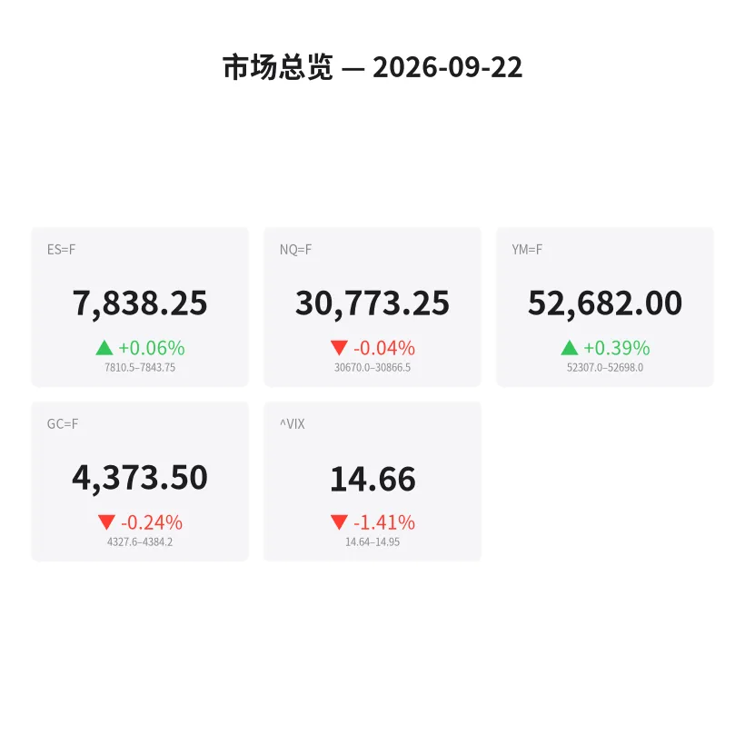
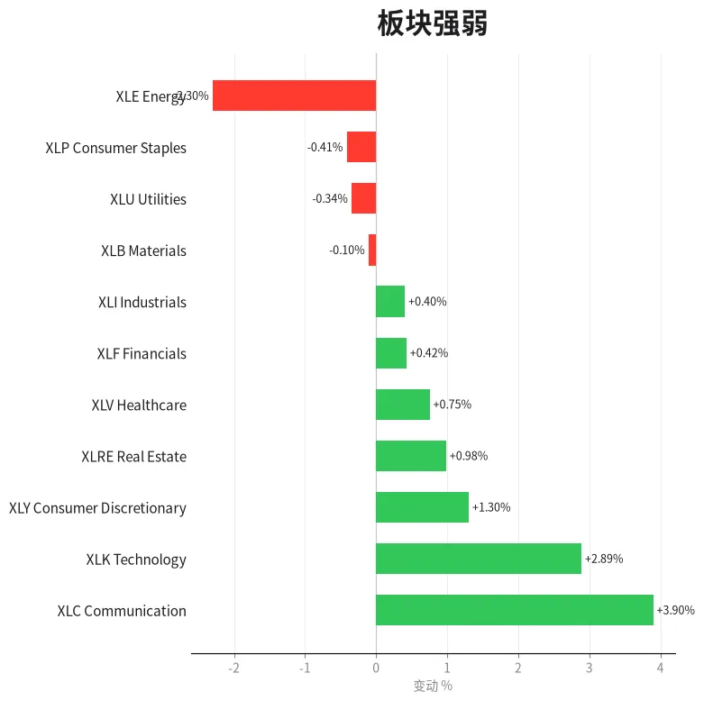
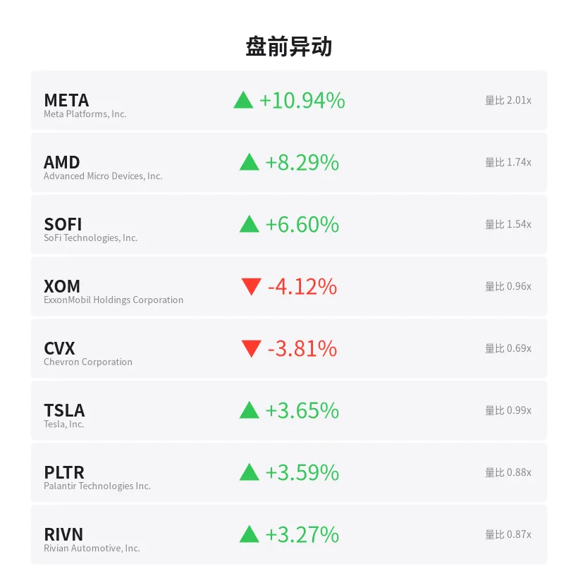
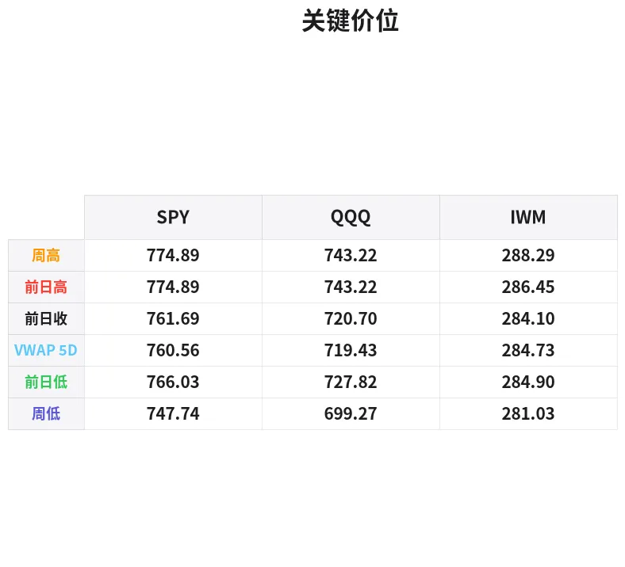

# 盘前分析报告 — 2026-09-22
*生成时间: 12:36:47 UTC*

---
## 数据速览

---
## 一、宏观环境

> [!info]- 详细数据：指数期货 & VIX
> ### 1.1 指数期货 & VIX
> | 品种 | 现价 | 涨跌幅 | 前收 | 日高 | 日低 |
> |------|------|--------|------|------|------|
> | ES=F | 7838.25 | +0.06% | 7833.5 | 7843.75 | 7810.5 |
> | NQ=F | 30773.25 | -0.04% | 30784.75 | 30916.5 | 30670.0 |
> | YM=F | 52682.0 | +0.39% | 52475.0 | 52698.0 | 52307.0 |
> | GC=F | 4373.5 | -0.24% | 4383.9 | 4414.1 | 4327.6 |
> | ^VIX | 14.66 | -1.41% | 14.87 | 14.95 | 14.64 |

> [!info]- 详细数据：隔夜走势
> ### 1.2 隔夜走势（Globex）
> | 品种 | 隔夜高 | 隔夜低 | 区间 | 亚洲高 | 亚洲低 | 欧洲高 | 欧洲低 |
> |------|--------|--------|------|--------|--------|--------|--------|
> | ES=F | 7843.75 | 7810.5 | 33.25 | 7839.5 | 7832.25 | 7843.75 | 7810.5 |
> | NQ=F | 30866.5 | 30670.0 | 196.5 | 30866.5 | 30779.5 | 30850.75 | 30670.0 |
> | YM=F | 52698.0 | 52307.0 | 391.0 | 52514.0 | 52385.0 | 52675.0 | 52307.0 |
> | GC=F | 4384.2 | 4327.6 | 56.6 | 4384.2 | 4352.7 | 4375.3 | 4327.6 |
> | ^VIX | 14.95 | 14.64 | 0.31 | — | — | 14.95 | 14.64 |

> [!info]- 详细数据：板块强弱
> ### 1.3 板块强弱
> | ETF | 板块 | 涨跌幅 |
> |-----|------|--------|
> | XLC | Communication | +3.90% |
> | XLK | Technology | +2.89% |
> | XLY | Consumer Discretionary | +1.30% |
> | XLRE | Real Estate | +0.98% |
> | XLV | Healthcare | +0.75% |
> | XLF | Financials | +0.42% |
> | XLI | Industrials | +0.40% |
> | XLB | Materials | -0.10% |
> | XLU | Utilities | -0.34% |
> | XLP | Consumer Staples | -0.41% |
> | XLE | Energy | -2.30% |

---
## 二、消息面

- **礼来制药遭遇艰难月份：全球顶级银行之一称37%涨幅即将开启** — *24/7 Wall St.*
  > Eli Lilly’s Tough Month: One of The Biggest Global Banks Says 37% Gains Begin Soon
- **12只标普500股票跻身万亿美元俱乐部——可能出什么问题？** — *Investor’s Business Daily*
  > 12 S&P 500 Stocks Hit Trillion-Dollar Club — What Could Go Wrong?
- **股市：标普500今天开盘是涨是跌？** — *Benzinga Prediction Markets*
  > Stock Market: Will S&P 500 Open Up or Down Today?
- **纳指大涨近3% AI股集体爆发，AMD跻身万亿俱乐部——AMD、ARM、META、AMZN、PSKY成焦点** — *Stocktwits*
  > Nasdaq Ends Nearly 3% Higher As AI Stocks Pop, AMD Enters $1 Trillion Club — AMD, ARM, META, AMZN, PSKY In Focus
- **Opendoor涨5%但月内仍跌24%，多空谁将胜出？** — *24/7 Wall St.*
  > Opendoor Gains 5% but Is Still Down 24% in a Month. Will the Bulls or Bears Win?
- **QQQ 20年后将在何处？纳斯达克100指数历史增长率的启示** — *Motley Fool*
  > Where Will QQQ Be in 20 Years? Here's What the Nasdaq-100's Historical Growth Rate Suggests.
- **Fastly因AI防火墙发布飙涨14%；Cloudflare涨7%，Datadog涨5%** — *24/7 Wall St.*
  > Fastly Soars 14% on AI Firewall Launch; Cloudflare Climbs 7%, Datadog Rises 5%
- **美股午后上涨带动ETF走高** — *MT Newswires*
  > Exchange-Traded Funds Rise as US Equities Advance After Midday
- **网络安全股因AI安全警告延续涨势：CrowdStrike和Okta涨4%，Palo Alto小幅上扬** — *24/7 Wall St.*
  > Cybersecurity Stocks Extend Gains on AI Safety Warnings: CrowdStrike and Okta Rise 4%, Palo Alto Ticks Up
- **高通AI互联演示推动股价飙涨7%，超越手机业务预期；Skyworks和Qorvo未参与涨势** — *24/7 Wall St.*
  > Qualcomm Jumps 7% as AI Interconnect Demo Points Past Handsets; Skyworks and Qorvo Sit Out the Rally
- **伊朗忧虑缓解，市场恐惧指数回落** — *Barrons.com*
  > Stock Market's Fear Index Slides as Iran Worries Ease
- **股市面临越来越多的威胁——投资者为何如此淡定？** — *MarketWatch*
  > Stocks face a growing list of threats — so why are investors staying so calm?
- **美联储加息后期权交易员买入AI芯片看涨期权** — *Quartz*
  > Options traders buy AI chip calls after Fed rate hike
- **美联储利率决议前华尔街恐惧指数回落** — *Barrons.com*
  > Wall Street Fear Index Slips Ahead of Fed Rate Decision
- **高盛：市场恐惧情绪在危险时刻消散** — *GuruFocus.com*
  > Goldman Sachs Sees Market Fear Vanish at Risky Moment
- **今日金价（9月22日周二）：中国黄金进口创纪录，金价维持稳定** — *Yahoo Personal Finance*
  > Gold price today, Tuesday, September 22, 2026: Gold prices holding as Chinese gold imports set record
- **今日金价（9月21日周一）：中东紧张局势令金价承压下滑** — *Yahoo Personal Finance*
  > Gold prices today, Monday, September 21, 2026: Gold prices slip on Middle East tensions
- **Meridian Mining股价跳涨10%，Cabaçal研究指向20亿美元价值** — *Proactive*
  > Meridian Mining shares jump 10% as Cabaçal study points to $2bn value
- **美元走强及美联储加息预期施压，黄金价格下跌** — *InvestorsHub*
  > Gold Prices Fall as Stronger Dollar and Fed Rate Expectations Weigh on Bullion
- **Sunda Energy、Meridian Mining、Quantum Helium等小盘股盘前异动** — *Proactive*
  > Sunda Energy, Meridian Mining, Quantum Helium, Light Science Technologies, Foresight Solar, hVIVO

---
## 三、盘前异动

> [!info]- 详细数据：盘前异动
> | 代码 | 名称 | 现价 | 缺口 | 量比 |
> |------|------|------|------|------|
> | META | Meta Platforms, Inc. | 737.99 | +10.94% | 2.01x |
> | AMD | Advanced Micro Devices, Inc. | 606.21 | +8.29% | 1.74x |
> | SOFI | SoFi Technologies, Inc. | 18.08 | +6.60% | 1.54x |
> | XOM | ExxonMobil Holdings Corporation | 156.8 | -4.12% | 0.96x |
> | CVX | Chevron Corporation | 201.52 | -3.81% | 0.69x |
> | TSLA | Tesla, Inc. | 377.58 | +3.65% | 0.99x |
> | PLTR | Palantir Technologies Inc. | 184.01 | +3.59% | 0.88x |
> | RIVN | Rivian Automotive, Inc. | 15.48 | +3.27% | 0.87x |
> | MSFT | Microsoft Corporation | 507.41 | +2.76% | 1.28x |
> | COIN | Coinbase Global, Inc. | 198.92 | +2.40% | 1.24x |

---
## 四、关键价位

> [!info]- 详细数据：SPY 关键价位
> ### SPY
> | 价位类型 | 价格 |
> |----------|------|
> | Prior Day High | 774.89 |
> | Prior Day Low | 766.03 |
> | Prior Day Close | 761.69 |
> | Premarket Price | 774.3614 |
> | Approx Vwap 5D | 760.56 |
> | Weekly High | 774.89 |
> | Weekly Low | 747.74 |

> [!info]- 详细数据：QQQ 关键价位
> ### QQQ
> | 价位类型 | 价格 |
> |----------|------|
> | Prior Day High | 743.22 |
> | Prior Day Low | 727.82 |
> | Prior Day Close | 720.699 |
> | Premarket Price | 741.2594 |
> | Approx Vwap 5D | 719.43 |
> | Weekly High | 743.22 |
> | Weekly Low | 699.27 |

> [!info]- 详细数据：IWM 关键价位
> ### IWM
> | 价位类型 | 价格 |
> |----------|------|
> | Prior Day High | 286.448 |
> | Prior Day Low | 284.9 |
> | Prior Day Close | 284.1 |
> | Premarket Price | 287.51 |
> | Approx Vwap 5D | 284.73 |
> | Weekly High | 288.29 |
> | Weekly Low | 281.03 |

---
## 五、AI 技术分析 & 操盘建议

## 第一部分：隔夜市场回顾

### 亚洲时段（约 18:00–02:00 ET）

- **ES**：亚洲时段极度窄幅震荡，仅在 7832.25–7839.50 之间运行，区间不足 7 点，表明亚洲资金观望情绪浓厚，缺乏方向性驱动。
- **NQ**：亚洲时段反而是隔夜高点所在（30866.50），说明亚洲时段有买盘推动科技权重，但随后未能持续突破，暗示上方存在卖压。
- **YM**：亚洲时段运行在 52385–52514，波动相对有限，整体偏防御。
- **GC（黄金）**：亚洲时段触及隔夜高点 4384.20，随后一路走弱。中国黄金进口创纪录的消息并未在价格上形成有效支撑，反映出卖压来自美元走强和加息预期。

### 欧洲时段（约 02:00–09:30 ET）

- **ES**：欧洲时段波动显著放大。先触及隔夜高点 7843.75 后回落至隔夜低点 7810.50，区间 33 点完全在欧洲时段完成。尾盘强劲反弹回到 7838 附近，属于"探底回升"形态。
- **NQ**：欧洲时段出现主要的抛压，从 30850 附近跌至隔夜低点 30670，下跌约 180 点。随后反弹至 30773，但未回到亚洲高点，反弹力度弱于 ES。科技股在欧洲时段遭遇获利了结。
- **GC**：持续走弱，从亚洲高点 4384 跌至欧洲低点 4327.6，跌幅约 57 点（约 1.3%）。美元走强+中东局势缓解双重压力。当前反弹至 4373.5 附近，在 4375–4384 区域面临明显阻力。

### 对美盘的启示

1. **ES 探底回升形态积极**：欧洲时段的"V 型反转"表明 7810 附近有真实买盘，这构成日内重要支撑参考。
2. **NQ 反弹偏弱需警惕**：虽然 AI 股盘前大涨（META +10.94%，AMD +8.29%），但 NQ 期货在隔夜并未创新高，存在"利好兑现卖出"的风险。
3. **三大指数均大幅跳空高开**（SPY +1.66%，QQQ +2.85%），缺口过大意味着开盘后有回补压力，不宜追高。
4. **VIX 14.66 且继续走低**：市场极度自满，适合谨慎做多但需设好止损。

## 第二部分：期货品种分析

### ES（E-mini S&P 500）— 当前 7838.25

**多时间框架分析：**
- **日线**：连续上行趋势中，上周五收盘创周内新高。+0.06% 表面平静，但 SPY 盘前 +1.66% 暗示现金指数将大幅跳空。
- **4H**：隔夜形成"探底回升"形态，7810.50 的支撑经过欧洲时段考验后成立。价格回到隔夜区间上半部。
- **1H/15M**：关注开盘后对隔夜高点 7843.75 的测试。若放量突破并回踩确认，则看高一线。

**关键价位：**
| 类型 | 价位 | 说明 |
|------|------|------|
| 阻力 R2 | 7860–7870 | 心理整数关口 + 延伸目标 |
| 阻力 R1 | 7843.75 | 隔夜高点 / 欧洲高点 |
| 当前价 | 7838.25 | — |
| 支撑 S1 | 7832–7833.5 | 亚洲低点 / 前收盘 |
| 支撑 S2 | 7810.50 | 隔夜低点（关键防守位） |
| 支撑 S3 | 7790–7800 | 缺口回补区域下沿 |

**方向偏向：** 📈 偏多 | **置信度：** 65%

**交易计划：**
- **场景 A（首选）— 回踩做多**：开盘后若回测 7825–7833 区域企稳（观察 delta 翻正、footprint 出现吸收），入场做多。止损 7808（隔夜低点下方），T1: 7850，T2: 7870。盈亏比约 1:2.5。
- **场景 B — 突破做多**：若直接放量突破 7843.75 并在 5 分钟内站稳（不回落至 7840 下方），入场做多。止损 7830，T1: 7860，T2: 7880。
- **失效条件**：跌破 7810 并收在该价位下方 15 分钟以上，多头逻辑失效，考虑反手空至 7790。

---

### NQ（E-mini Nasdaq 100）— 当前 30773.25

**多时间框架分析：**
- **日线**：AI 板块大爆发推动 QQQ 盘前涨 2.85%，但 NQ 期货仅 -0.04%，价格尚未反映现金指数的涨幅。开盘后可能出现剧烈波动。
- **4H**：隔夜形成宽幅震荡（196.5 点区间），从亚洲高点 30866.5 到欧洲低点 30670，当前在中位附近。
- **1H/15M**：30670 欧洲低点是关键，若开盘后下探不破此位，构成更高低点，看涨。

**关键价位：**
| 类型 | 价位 | 说明 |
|------|------|------|
| 阻力 R2 | 31000 | 心理整数大关 |
| 阻力 R1 | 30866.50 | 隔夜/亚洲高点 |
| 当前价 | 30773.25 | — |
| 支撑 S1 | 30670–30700 | 隔夜低点/欧洲低点 |
| 支撑 S2 | 30550 | 上周五盘中支撑区 |
| 支撑 S3 | 30400 | 更深层支撑 |

**方向偏向：** 📈 偏多（但波动率高） | **置信度：** 55%

**交易计划：**
- **场景 A — 回踩做多**：等 NQ 回踩 30680–30720 区域，观察订单流中是否出现大单吸收（bid stack 不退），入场做多。止损 30640（隔夜低点下方 30 点），T1: 30870（隔夜高点），T2: 31000。盈亏比约 1:3。
- **场景 B — 观察突破**：若直接突破 30866 且 CVD 持续上升，追多至 31000，但仓位减半（缺口太大风险高）。止损 30800。
- **失效条件**：跌破 30640 并伴随放量卖盘，空头接管，目标看 30550 甚至 30400。NQ 今天波动预计极大，严格控制仓位，不超过平时的 60%。

---

### GC（黄金期货）— 当前 4373.50

**多时间框架分析：**
- **日线**：本轮从高位回落，今日 -0.24%。中国黄金进口虽创纪录但价格不涨，说明美元端压制力更强。中东局势缓解进一步削弱避险溢价。
- **4H**：隔夜走出明显的"高开低走再反弹"形态。从亚洲高点 4384.2 一路跌至欧洲低点 4327.6（跌 57 点），然后反弹至 4373.5。反弹约 81% 回撤，力度不弱。
- **1H**：4375–4384 区域是近期密集成交区，构成上方阻力。4327.6 是日内关键支撑。

**关键价位：**
| 类型 | 价位 | 说明 |
|------|------|------|
| 阻力 R2 | 4414.10 | 日线高点 |
| 阻力 R1 | 4383.9–4384.2 | 前收盘 / 亚洲高点 |
| 当前价 | 4373.50 | — |
| 支撑 S1 | 4350–4355 | 亚洲低点区域 |
| 支撑 S2 | 4327.6 | 隔夜/欧洲低点（日内关键） |
| 支撑 S3 | 4300 | 心理整数关口 |

**方向偏向：** ↔️ 中性偏空 | **置信度：** 50%

**交易计划：**
- **场景 A — 阻力区做空**：若价格反弹至 4380–4385 区域遇阻（出现 iceberg sell 或反复上影线），入场做空。止损 4395，T1: 4350，T2: 4328。盈亏比约 1:2。
- **场景 B — 支撑区做多**：若回落至 4328–4335 区域出现明显买盘吸收（bid delta 翻正），可轻仓做多反弹。止损 4318，T1: 4360，T2: 4380。
- **失效条件**：突破 4395 并站稳（美元大幅走弱或突发避险事件），则放弃空头思路，等待回踩入场做多。

## 第三部分：ETF 品种分析

### SPY — 盘前 774.36（前收 761.69，缺口 +1.66%）

**关键价位：**
| 类型 | 价位 | 说明 |
|------|------|------|
| 阻力 R1 | 774.89 | 前日高点 = 周高点（双重阻力） |
| 阻力 R2 | 778–780 | 突破后延伸目标 |
| 当前盘前 | 774.36 | 逼近 PDH |
| 支撑 S1 | 770–771 | 盘前成交密集区（若有） |
| 支撑 S2 | 766–767 | 前日低点区域 / 缺口上沿 |
| 支撑 S3 | 761.69 | 前收盘（完全回补缺口） |
| VWAP 5D | 760.56 | 周度均衡价位 |

**交易计划：**
- **大缺口策略核心**：SPY 跳空 +1.66% 直接测试前日高点/周高点 774.89，这是一个关键决策点：
  - 若开盘放量突破 774.89 并在前 15 分钟站稳 775 上方，确认突破有效，做多目标 778–780。止损 773.50。
  - 若开盘冲击 774.89 后回落（出现大卖单、cumulative delta 下降），等待回踩 770–771 企稳后做多，目标回测 774.89。止损 768。
  - 若开盘直接低开或快速跌破 770，关注缺口回补交易——等待 766–767 企稳后做多反弹。止损 764。

- **不建议在 774.89 附近追空**：虽然缺口大，但板块轮动强劲（XLC +3.90%, XLK +2.89%），META 和 AMD 等权重股暴涨，下行空间有限除非系统性风险。

---

### QQQ — 盘前 741.26（前收 720.70，缺口 +2.85%）

**关键价位：**
| 类型 | 价位 | 说明 |
|------|------|------|
| 阻力 R1 | 743.22 | 前日高点 = 周高点 |
| 阻力 R2 | 748–750 | 延伸目标 / 心理关口 |
| 当前盘前 | 741.26 | 接近 PDH |
| 支撑 S1 | 735–737 | 盘前区间下沿（预估） |
| 支撑 S2 | 727–728 | 前日低点 / 缺口上沿 |
| 支撑 S3 | 720.70 | 前收盘（完全回补） |
| VWAP 5D | 719.43 | 周度均衡价位 |

**交易计划：**
- **极端缺口警告**：QQQ 跳空 +2.85% 是近期罕见的大缺口，完全由 AI 龙头股驱动（META +10.94%, AMD +8.29%）。这种缺口在利好兑现后极易出现"gap and crap"形态。
- **首选策略 — 等待确认**：
  - 不要在开盘第一根K线追多。等待前 15 分钟区间确立。
  - 若 15 分钟内守住 738+ 且 743.22 被突破，做多至 748–750。止损 736。
  - 若 15 分钟内跌破 738，观望或轻仓做空回补缺口至 730–732。止损 743。
- **缺口回补交易**：若日内回踩至 728–730 区域（前日低点附近），考虑做多反弹。止损 725，目标 738–740。
- **关键风险**：NQ 期货隔夜并未跟随 AI 股的涨势（-0.04%），暗示期货市场对缺口可持续性存疑。谨慎对待。

## 第四部分：今日市场总览

### 整体情绪判断

**偏乐观但需警惕缺口回补风险。** 今天的市场由 AI/科技板块单极驱动：META +10.94%、AMD +8.29%（跻身万亿俱乐部）、Fastly +14%、MSFT +2.76%。板块轮动极度偏向成长/科技（XLC +3.90%、XLK +2.89%），而能源板块大幅落后（XLE -2.30%），呈现典型的"risk-on 但非全面"格局。

### VIX 分析

VIX 14.66（-1.41%），处于低波动区间。多条新闻标题提及"恐惧指数下滑"、"市场恐惧消散"——当媒体集中报道低波动时，往往是波动率反转的前兆。高盛也警告"市场恐惧在危险时刻消散"。**建议**：不要裸卖期权，考虑在 VIX 低位配置少量尾部对冲。

### 需要回避的时间窗口

| 时间 (ET) | 事件 | 建议 |
|-----------|------|------|
| 09:30–09:45 | 开盘前 15 分钟 | 大缺口开盘波动极大，仅观察不交易 |
| 09:45–10:15 | 初始余额形成 | 等待方向确认，关注 opening range |
| 12:00–13:30 | 午间低量区 | 避免入场新仓，假突破概率高 |
| 15:45–16:00 | 收盘前 | MOC 流量影响大，除非有强趋势否则回避 |

### 板块轮动观察

- **做多首选**：XLC（通信，META 驱动）、XLK（科技，AMD/MSFT 驱动）
- **做空候选**：XLE（能源，XOM -4.12% / CVX -3.81% 拖累）
- **观望**：防御板块（XLP -0.41%、XLU -0.34%）表现弱但无明确做空信号
- **值得关注**：XLRE +0.98% — 在加息背景下地产板块走强，可能暗示市场预期加息周期接近尾声

### 🎯 核心交易论点

**今天是 AI 驱动的大缺口行情。不追涨、等回踩、控仓位。** 盘前缺口过大（SPY +1.66%、QQQ +2.85%），NQ 期货隔夜未跟随，预计开盘后 30 分钟内将出现剧烈双向波动。耐心等待 Initial Balance（09:45–10:15）确立后再决策。首选 ES 回踩 7825–7833 做多，次选 SPY 回踩 770 做多。黄金今日中性偏空，可在 4380–4385 阻力区轻仓做空。全天仓位控制在平时的 60–70%，严守止损。
