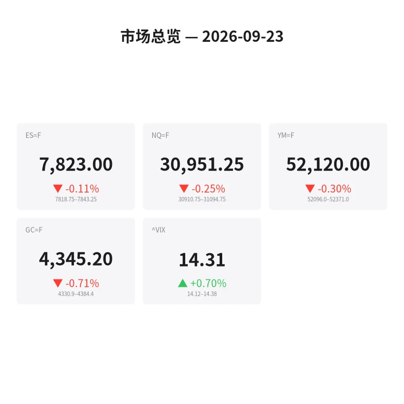
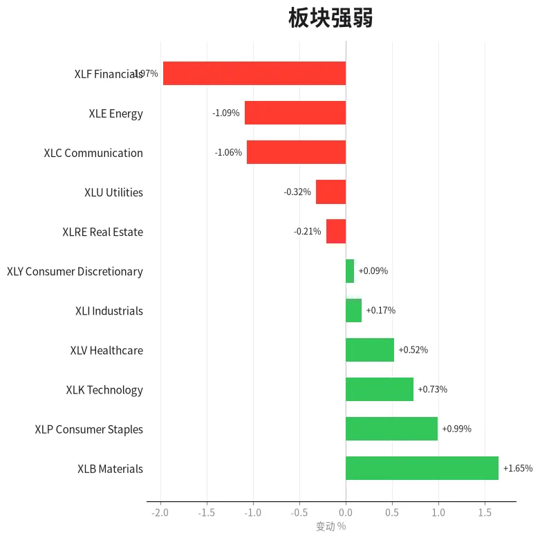
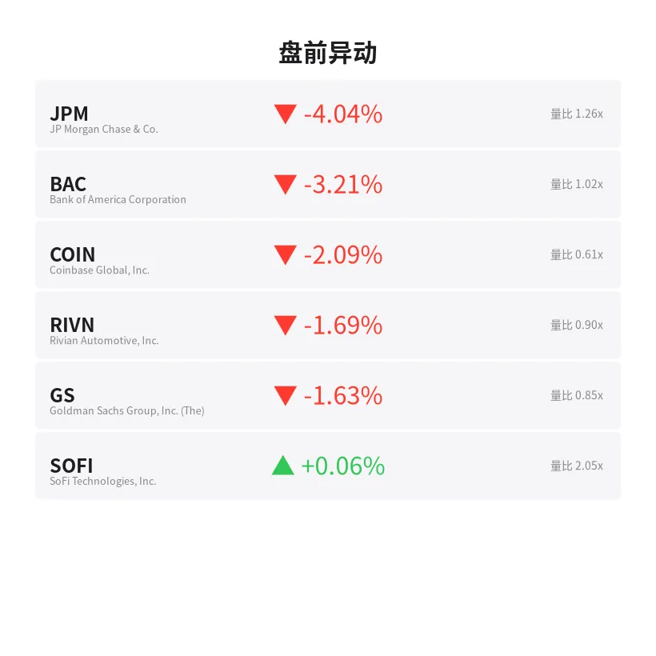
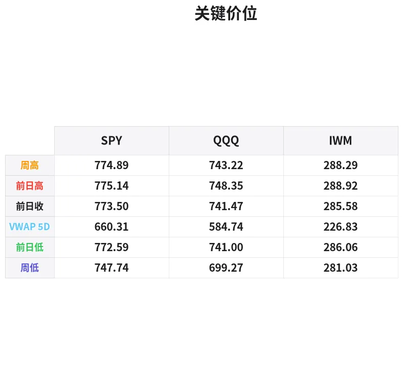

# 盘前分析报告 — 2026-09-23
*生成时间: 12:44:51 UTC*

---
## 数据速览

---
## 一、宏观环境

> [!info]- 详细数据：指数期货 & VIX
> ### 1.1 指数期货 & VIX
> | 品种 | 现价 | 涨跌幅 | 前收 | 日高 | 日低 |
> |------|------|--------|------|------|------|
> | ES=F | 7823.0 | -0.11% | 7831.75 | 7843.25 | 7818.75 |
> | NQ=F | 30951.25 | -0.25% | 31028.5 | 31094.75 | 30910.75 |
> | YM=F | 52120.0 | -0.30% | 52279.0 | 52371.0 | 52096.0 |
> | GC=F | 4345.2 | -0.71% | 4376.4 | 4407.5 | 4330.9 |
> | ^VIX | 14.31 | +0.70% | 14.21 | 14.38 | 14.12 |

> [!info]- 详细数据：隔夜走势
> ### 1.2 隔夜走势（Globex）
> | 品种 | 隔夜高 | 隔夜低 | 区间 | 亚洲高 | 亚洲低 | 欧洲高 | 欧洲低 |
> |------|--------|--------|------|--------|--------|--------|--------|
> | ES=F | 7843.25 | 7818.75 | 24.5 | 7840.75 | 7835.5 | 7843.25 | 7819.0 |
> | NQ=F | 31094.75 | 30910.75 | 184.0 | 31052.25 | 31019.0 | 31094.75 | 30910.75 |
> | YM=F | 52371.0 | 52096.0 | 275.0 | 52371.0 | 52307.0 | 52357.0 | 52096.0 |
> | GC=F | 4384.4 | 4330.9 | 53.5 | 4384.4 | 4365.1 | 4374.1 | 4330.9 |
> | ^VIX | 14.38 | 14.12 | 0.26 | — | — | 14.38 | 14.12 |

> [!info]- 详细数据：板块强弱
> ### 1.3 板块强弱
> | ETF | 板块 | 涨跌幅 |
> |-----|------|--------|
> | XLB | Materials | +1.65% |
> | XLP | Consumer Staples | +0.99% |
> | XLK | Technology | +0.73% |
> | XLV | Healthcare | +0.52% |
> | XLI | Industrials | +0.17% |
> | XLY | Consumer Discretionary | +0.09% |
> | XLRE | Real Estate | -0.21% |
> | XLU | Utilities | -0.32% |
> | XLC | Communication | -1.06% |
> | XLE | Energy | -1.09% |
> | XLF | Financials | -1.97% |

---
## 二、消息面

- **股市前瞻：标普500今日将高开还是低开？** — *Benzinga Prediction Markets*
  > Stock Market: Will S&P 500 Open Up or Down Today?
- **趁沃什上任前锁定2026年利润** — *Barrons.com*
  > Lock In 2026 Profits Before Warsh Takes Them Away
- **像巴菲特一样投资：奥马哈先知的经验教训** — *Zacks*
  > Invest Like Buffett: Lessons From the Oracle of Omaha
- **市场再度逼近历史新高，66岁手握现金却感觉在追高？这3只ETF助你从容入场** — *24/7 Wall St.*
  > The Market Is Near Another All-Time High and You’re 66 With Cash to Invest. Buying Now Feels Like the Top. These 3 ETFs Are How You Get In Anyway
- **VGT持有人买了"科技"却不含谷歌、Meta和亚马逊：决定成分股的板块分类规则** — *24/7 Wall St.*
  > VGT Holders Bought ‘Tech’ and Own No Google, Meta, or Amazon: The Sector Rule That Decides What’s Inside
- **今日股市：纳指创纪录新高后回落；美光、闪迪跌入买入区间（实时报道）** — *Investor's Business Daily*
  > Stock Market Today: Nasdaq Dips After Hitting Record Highs; Micron, Sandisk Sink In Buy Zones (Live Coverage)
- **纳指收盘创新高：芯片股走强、油价回落——AAPL、META、SPCX、MSFT、VKTX成焦点** — *Stocktwits*
  > Nasdaq Jumps To Close At Record As Chipmakers Climb, Oil Prices Cool — AAPL, META, SPCX, MSFT, VKTX In Focus
- **标普500逼近历史新高，但市场广度发出罕见警告** — *GuruFocus.com*
  > S&P 500 Nears Record as Breadth Sends Rare Warning
- **退休夫妇今年可卖出$98,900收益而无需向IRS缴税：这3只ETF专为0%税率区间打造** — *24/7 Wall St.*
  > A Retired Couple Can Sell $98,900 of Gains This Year and Owe the IRS Nothing. These 3 ETFs Are Built for the 0% Bracket
- **Fastly投资者日遭遇获利了结暴跌7%；Cloudflare和Akamai小幅走高** — *24/7 Wall St.*
  > Fastly Tumbles 7% as Investor Day Meets Profit Taking; Cloudflare and Akamai Edge Higher
- **恐慌指数显示市场平静，尽管特朗普态度强硬** — *Barrons.com*
  > Stock Market Fear Index Signals Calm Despite Trump's Tough Talk
- **2026年9月22日股市新闻汇总** — *Zacks*
  > Stock Market News for Sep 22, 2026
- **美债收益率持续攀升——美元或能揭示原因** — *Barrons.com*
  > Treasury Yields Keep Climbing. The Dollar Might Tell Us Why.
- **布局大行情：英伟达跨式期权交易方案** — *Barchart*
  > Positioning for a Big Move: Nvidia Long Straddle Trade Idea
- **伊朗局势忧虑缓解，恐慌指数回落** — *Barrons.com*
  > Stock Market's Fear Index Slides as Iran Worries Ease
- **9月23日金价：投资者权衡中国与伊朗关系，黄金持稳** — *Yahoo Personal Finance*
  > Gold price today, Wednesday, September 23, 2026: Gold holds as investors weigh China, Iran relations
- **纽蒙特创纪录的自由现金流势头能否延续至Q3？** — *Zacks*
  > Can Newmont's Record Free Cash Flow Momentum Carry Into Q3?
- **爱格尼科鹰矿业能否维持其股东友好型资本策略？** — *Zacks*
  > Can Agnico Eagle Sustain Its Shareholder-Friendly Capital Strategy?
- **AAAU vs. GDX：持有实物黄金还是投资金矿股更好？** — *Motley Fool*
  > AAAU vs. GDX: Is It Better to Hold Physical Gold or Invest in Gold Miners?
- **美元走强叠加利率预期施压，金价下跌** — *InvestorsHub*
  > Gold Prices Fall as Dollar Strengthens and Rate Expectations Weigh

---
## 三、盘前异动

> [!info]- 详细数据：盘前异动
> | 代码 | 名称 | 现价 | 缺口 | 量比 |
> |------|------|------|------|------|
> | JPM | JP Morgan Chase & Co. | 337.8 | -4.04% | 1.26x |
> | BAC | Bank of America Corporation | 56.1 | -3.21% | 1.02x |
> | COIN | Coinbase Global, Inc. | 196.85 | -2.09% | 0.61x |
> | RIVN | Rivian Automotive, Inc. | 15.1 | -1.69% | 0.9x |
> | GS | Goldman Sachs Group, Inc. (The) | 943.75 | -1.63% | 0.85x |
> | SOFI | SoFi Technologies, Inc. | 16.98 | +0.06% | 2.05x |

---
## 四、关键价位

> [!info]- 详细数据：SPY 关键价位
> ### SPY
> | 价位类型 | 价格 |
> |----------|------|
> | Prior Day High | 775.14 |
> | Prior Day Low | 772.59 |
> | Prior Day Close | 773.5 |
> | Premarket Price | 772.59 |
> | Approx Vwap 5D | 660.31 |
> | Weekly High | 774.89 |
> | Weekly Low | 747.74 |

> [!info]- 详细数据：QQQ 关键价位
> ### QQQ
> | 价位类型 | 价格 |
> |----------|------|
> | Prior Day High | 748.349 |
> | Prior Day Low | 741.0 |
> | Prior Day Close | 741.47 |
> | Premarket Price | 745.6688 |
> | Approx Vwap 5D | 584.74 |
> | Weekly High | 743.22 |
> | Weekly Low | 699.27 |

> [!info]- 详细数据：IWM 关键价位
> ### IWM
> | 价位类型 | 价格 |
> |----------|------|
> | Prior Day High | 288.92 |
> | Prior Day Low | 286.06 |
> | Prior Day Close | 285.58 |
> | Premarket Price | 285.8275 |
> | Approx Vwap 5D | 226.83 |
> | Weekly High | 288.29 |
> | Weekly Low | 281.03 |

---
## 五、AI 技术分析 & 操盘建议

## 第一部分：隔夜市场回顾

**亚洲时段（18:00–02:00 ET）：**
亚洲盘交投清淡，ES在7835–7841窄幅区间内震荡，波幅仅5.25点，显示隔夜多空双方均无明显意愿主导方向。NQ同样在31019–31052区间内窄幅整理。GC黄金在亚洲盘表现相对强势，高点触及4384.4，但此后逐步回落。整体看，亚洲盘资金观望情绪浓厚。

**欧洲时段（02:00–09:30 ET）：**
欧洲开盘后波动明显放大。ES在欧洲时段创出隔夜高点7843.25后快速回落至7819.0，区间扩大至24点，说明卖压主要集中在欧洲时段。NQ跌幅更加显著，从31094.75一路下探至30910.75，隔夜区间达184点，显示科技股在欧洲时段遭遇较强抛售。GC在欧洲时段同样走弱，从4374.1回落至4330.9，跌破亚洲盘支撑。

**对美盘的启示：**
- 隔夜走势呈现"亚洲筑顶、欧洲破位"的典型模式，美盘开盘前卖方占优
- ES隔夜区间仅24.5点（偏窄），暗示美盘可能出现区间扩展行情
- VIX小幅上升至14.31（+0.70%），但绝对值仍低，市场整体恐慌情绪有限
- 金融板块（XLF -1.97%）大幅领跌，JPM -4.04%、BAC -3.21%，关注是否为系统性风险信号
- 材料板块（XLB +1.65%）和必需消费品（XLP +0.99%）领涨，资金呈现防御性轮动特征
- 美债收益率持续攀升+美元走强，对黄金和成长股均构成压力

## 第二部分：期货品种分析

### ES（E-mini S&P 500）
**当前价：7823.0 | 前收：7831.75 | 涨跌：-0.11%**

**多周期分析：**
- **日线级别：** 市场处于历史高位附近，标普持续创新高但涨幅收窄。隔夜温和回调，收盘位于前一日低点附近，日线级别尚未破坏上升趋势。
- **4H级别：** 隔夜走出高位震荡后向下破位的结构。关键观察：7843（隔夜高）和7818（隔夜低/当前支撑）构成的区间是否会被美盘打破。
- **1H/15min级别：** 欧洲时段尾盘在7819附近企稳，形成短期底部结构。若美盘开盘能守住7818，可能形成日内V型反转。

**关键价位：**
| 类型 | 价位 | 说明 |
|------|------|------|
| 隔夜高 | 7843.25 | 强阻力，突破看7860 |
| 前收 | 7831.75 | 日内多空分界线 |
| 现价 | 7823.0 | — |
| 隔夜低 | 7818.75 | 关键支撑，失守看7800 |
| 心理关口 | 7800.0 | 整数位强支撑 |

**方向偏向：** 中性偏空 | **置信度：** 60%
- **做空方案：** 反弹至7830–7835区域（前收附近）遇阻做空，止损7845（隔夜高上方），T1: 7815，T2: 7800
- **做多方案：** 若7818–7820企稳放量反弹，可轻仓试多，止损7812，T1: 7832，T2: 7843
- **失效条件：** 若早盘直接突破7843且在此之上站稳15分钟，空头思路失效，转为回踩做多

### NQ（E-mini Nasdaq 100）
**当前价：30951.25 | 前收：31028.5 | 涨跌：-0.25%**

**多周期分析：**
- **日线级别：** 纳指前一日收盘创历史新高后出现获利回吐压力，属于正常的技术性回调。市场广度发出罕见警告（参见消息面），需关注是否仅为短暂回调还是趋势转折的先兆。
- **4H级别：** 从31094隔夜高回落超180点，4小时级别出现明确的高位放量下跌信号。30910是隔夜低点，若美盘测试该位置需观察买盘力度。
- **1H级别：** 30950附近形成临时整理平台，关注美盘开盘方向选择。

**关键价位：**
| 类型 | 价位 | 说明 |
|------|------|------|
| 隔夜高 | 31094.75 | 强阻力/历史高位区域 |
| 前收 | 31028.5 | 多空分界 |
| 31000 | 31000.0 | 心理整数关口 |
| 现价 | 30951.25 | — |
| 隔夜低 | 30910.75 | 关键支撑 |
| 下方支撑 | 30800.0 | 失守隔夜低后目标 |

**方向偏向：** 偏空 | **置信度：** 65%
- **做空方案：** 反弹至31000–31030（整数关口+前收）做空，止损31100（隔夜高上方），T1: 30910，T2: 30800
- **做多方案：** 30910附近出现明确止跌信号（如15分钟级别底背离+放量）可试多，止损30860，T1: 31000，T2: 31030
- **失效条件：** 若美盘开盘直接跳空下破30900，可能出现加速下跌，此时不宜抄底，等待30750–30800区域观察

### GC（COMEX黄金）
**当前价：4345.2 | 前收：4376.4 | 涨跌：-0.71%**

**多周期分析：**
- **日线级别：** 黄金连续承压，美元走强+美债收益率上行双重利空。日线已跌破短期均线支撑，进入调整节奏。
- **4H级别：** 从亚洲盘高点4384跌至欧洲盘低点4330，跌幅超50点。4H级别呈现明确的空头排列。当前在4345附近弱势反弹。
- **1H级别：** 4330是欧洲时段低点，也是近期关键支撑。若守住该位置可能形成双底结构。

**关键价位：**
| 类型 | 价位 | 说明 |
|------|------|------|
| 亚洲高 | 4384.4 | 日内强阻力 |
| 前收 | 4376.4 | 多空分界 |
| 现价 | 4345.2 | — |
| 欧洲低/隔夜低 | 4330.9 | 关键支撑 |
| 下方支撑 | 4300.0 | 整数位+技术支撑 |

**方向偏向：** 偏空 | **置信度：** 70%
- **做空方案：** 反弹至4360–4375区域（前收下方）做空，止损4390（亚洲高上方），T1: 4330，T2: 4300
- **做多方案：** 若4330附近二次探底不破且出现放量企稳，可轻仓试多，止损4320，T1: 4360，T2: 4376
- **失效条件：** 若美盘出现突发避险事件（地缘冲突升级），黄金可能快速反弹至4400+，此时空头方案失效

## 第三部分：ETF品种分析

### SPY（SPDR S&P 500 ETF）
**前收：773.50 | 前高：775.14 | 前低：772.59 | 盘前：772.59 | 周高：774.89 | 周低：747.74**

**关键价位：**
| 类型 | 价位 | 说明 |
|------|------|------|
| 前日高 | 775.14 | 突破目标/强阻力 |
| 周高 | 774.89 | 与前日高形成密集阻力 |
| 前收 | 773.50 | 日内多空分界 |
| 前日低/盘前 | 772.59 | 当前测试位 |
| 下方支撑 | 770.00 | 整数关口 |
| 周低 | 747.74 | 极端支撑 |

**交易计划：**
- **主线思路（偏空）：** 盘前价位772.59正好在前日低点，若开盘跌破772.50，可顺势做空，目标770.00，止损773.80（前收上方）
- **备选思路（反弹做多）：** 若开盘在772.50–773.00之间企稳反弹站上773.50（前收），可试多至774.80–775.00（前高区域），止损772.00
- **注意事项：** SPY盘前恰好处于前日低点，该位置极为关键。开盘前15分钟观察订单流方向，不宜盲目入场。金融板块大幅走弱（XLF -1.97%），SPY权重中金融占比不低，关注是否拖累指数

### QQQ（Invesco QQQ Trust）
**前收：741.47 | 前高：748.35 | 前低：741.00 | 盘前：745.67 | 周高：743.22 | 周低：699.27**

**关键价位：**
| 类型 | 价位 | 说明 |
|------|------|------|
| 前日高 | 748.35 | 强阻力/近期高点 |
| 盘前价 | 745.67 | 高于前收，偏强 |
| 周高 | 743.22 | 回踩支撑 |
| 前收 | 741.47 | 关键支撑 |
| 前日低 | 741.00 | 强支撑 |
| 740.00 | 740.00 | 整数心理关口 |

**交易计划：**
- **主线思路（区间博弈）：** QQQ盘前745.67高于前收，显示盘前买盘尚存。但NQ期货偏弱（-0.25%），存在分歧。关注开盘后745–746区域能否站稳
- **做多方案：** 开盘回踩743–744区域（周高附近）企稳做多，止损741.00（前日低），T1: 746.50，T2: 748.00
- **做空方案：** 若反弹至747–748遇阻（前日高区域），可做空，止损749.00，T1: 744.00，T2: 741.50
- **注意事项：** 纳指前日创新高后出现的市场广度警告值得重视。芯片股（美光、闪迪）已在回调，若龙头科技股也出现放量下跌，QQQ可能快速回补盘前缺口至741–742

## 第四部分：今日市场总览

### 整体情绪判断
**中性偏空，带有防御性轮动特征。**

市场处于一个微妙的位置：标普和纳指前一日均在历史高位区域，但隔夜盘出现了有序的获利回吐。几个关键矛盾信号值得注意：
1. **广度背离：** 标普逼近新高但市场广度发出罕见警告（GuruFocus报道），说明上涨动力集中在少数权重股，内部结构弱化
2. **板块分化加剧：** 金融板块暴跌近2%（JPM -4%、BAC -3%领跌），而材料+必需消费品走强，典型的防御性轮动
3. **美债收益率上行：** 收益率持续攀升推高美元，压制黄金和高估值成长股，Warsh（可能的Fed新主席）相关消息增加不确定性

### VIX分析
VIX 14.31（+0.70%），绝对值处于低位。隔夜区间14.12–14.38，波动极小。尽管伊朗局势和特朗普言论被消息面提及，VIX并未显著反应，说明市场定价中已消化了当前地缘风险。**但请注意：VIX在低位的突然跳升往往最为猛烈，当前14附近的低波环境意味着期权隐含波动率便宜，适合买入保护。**

### 需要规避的时间窗口
| 时间（ET） | 事件 | 影响 |
|------------|------|------|
| 09:30–09:45 | 开盘初始波动 | 等待方向确认，不宜追单 |
| 10:00 | 可能有经济数据发布 | 关注盘中数据日历 |
| 11:30–13:00 | 午盘死区 | 流动性下降，假突破增多 |
| 15:00–15:15 | MOC订单流公布 | 可能引发剧烈波动 |

### 板块轮动观察
- **最强板块：** 材料（XLB +1.65%）、必需消费品（XLP +0.99%）→ 防御性资金流入
- **最弱板块：** 金融（XLF -1.97%）、能源（XLE -1.09%）、通信（XLC -1.06%）→ 顺周期板块承压
- **解读：** 这不是一个进攻性的市场环境。材料板块走强可能与大宗商品补库存周期相关，但金融板块的大幅走弱更值得警惕——若为银行业盈利预期下调所致，可能预示更广泛的经济放缓信号

### 🎯 核心交易论点（一句话）
**指数高位滞涨+金融板块崩跌+市场广度背离=今日以防御为主，优先在关键阻力位做空ES/NQ反弹，严格止损，耐心等待欧洲时段卖压是否在美盘延续。**
