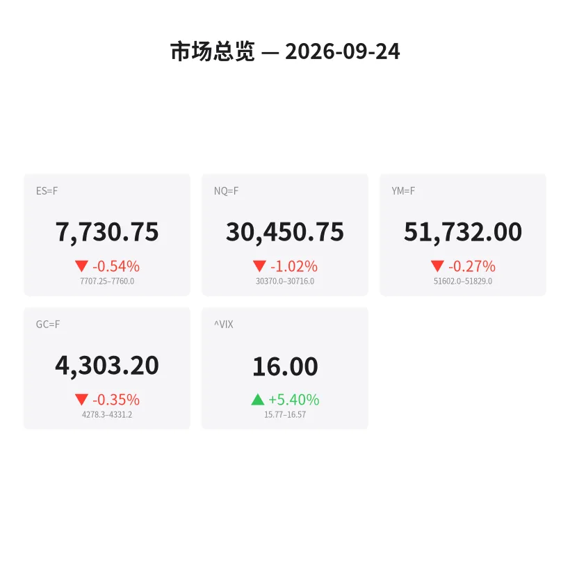
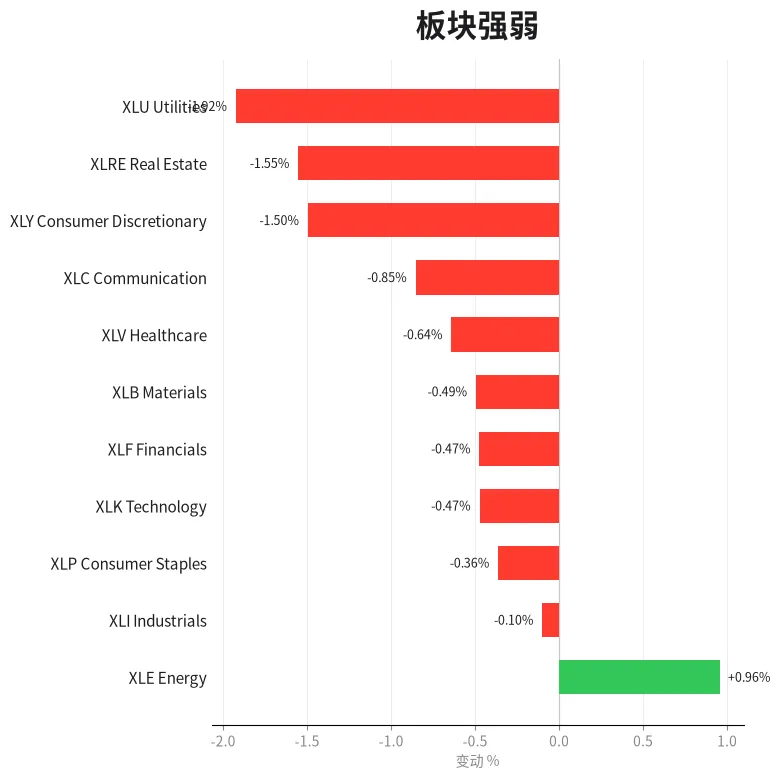
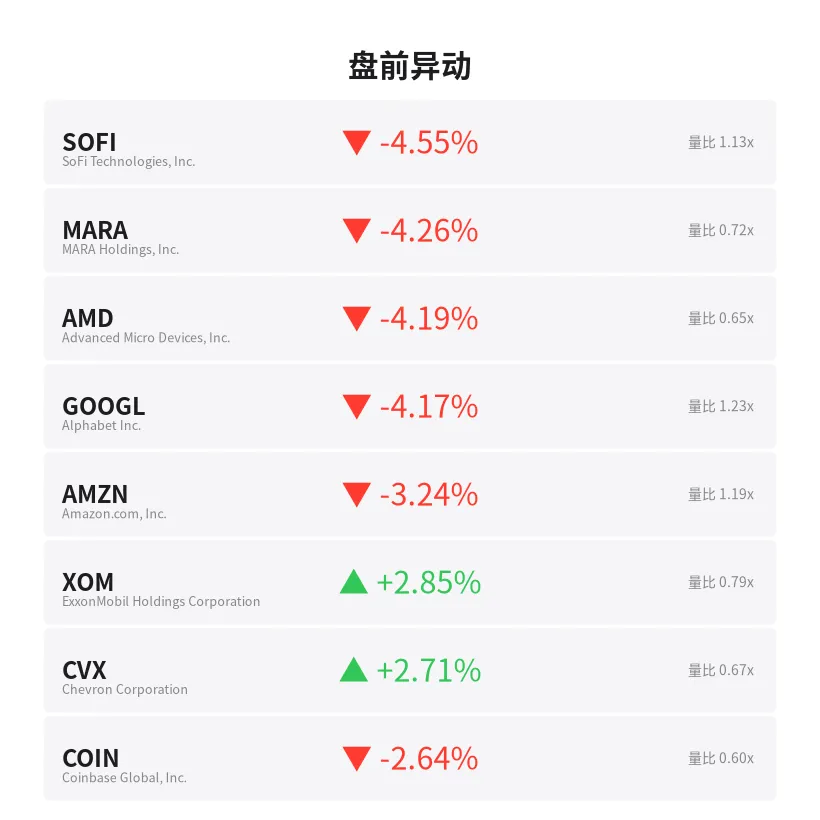
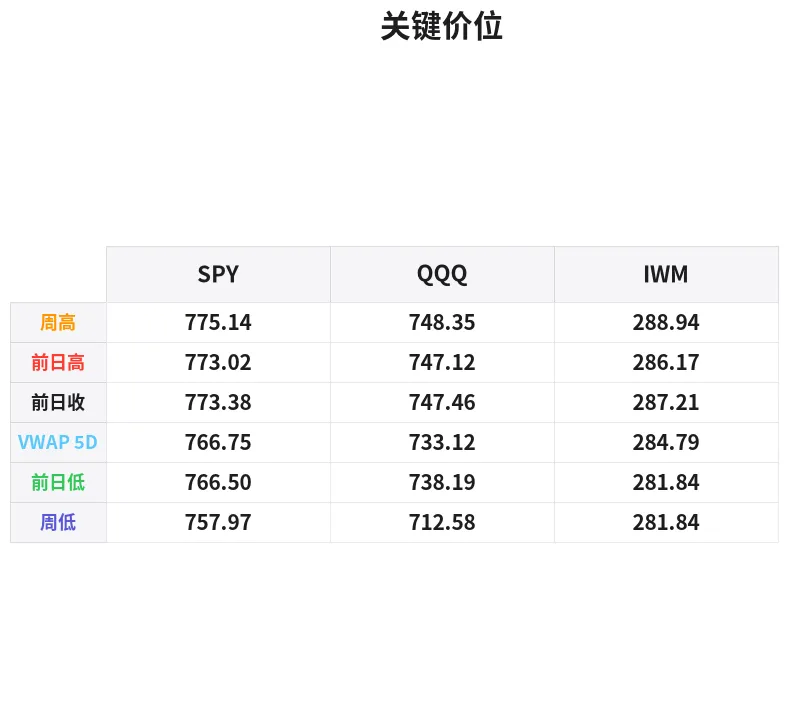

# 盘前分析报告 — 2026-09-24
*生成时间: 12:43:43 UTC*

---
## 数据速览

---
## 一、宏观环境

> [!info]- 详细数据：指数期货 & VIX
> ### 1.1 指数期货 & VIX
> | 品种 | 现价 | 涨跌幅 | 前收 | 日高 | 日低 |
> |------|------|--------|------|------|------|
> | ES=F | 7730.75 | -0.54% | 7772.5 | 7779.25 | 7711.5 |
> | NQ=F | 30450.75 | -1.02% | 30764.75 | 30813.0 | 30370.0 |
> | YM=F | 51732.0 | -0.27% | 51873.0 | 51905.0 | 51607.0 |
> | GC=F | 4303.2 | -0.35% | 4318.4 | 4338.0 | 4278.3 |
> | ^VIX | 16.0 | +5.40% | 15.18 | 16.57 | 15.77 |

> [!info]- 详细数据：隔夜走势
> ### 1.2 隔夜走势（Globex）
> | 品种 | 隔夜高 | 隔夜低 | 区间 | 亚洲高 | 亚洲低 | 欧洲高 | 欧洲低 |
> |------|--------|--------|------|--------|--------|--------|--------|
> | ES=F | 7760.0 | 7707.25 | 52.75 | 7760.0 | 7742.0 | 7748.0 | 7707.25 |
> | NQ=F | 30716.0 | 30370.0 | 346.0 | 30716.0 | 30607.0 | 30632.5 | 30370.0 |
> | YM=F | 51829.0 | 51602.0 | 227.0 | 51829.0 | 51726.0 | 51796.0 | 51602.0 |
> | GC=F | 4331.2 | 4278.3 | 52.9 | 4331.2 | 4312.0 | 4323.0 | 4278.3 |
> | ^VIX | 16.57 | 15.77 | 0.8 | — | — | 16.57 | 15.77 |

> [!info]- 详细数据：板块强弱
> ### 1.3 板块强弱
> | ETF | 板块 | 涨跌幅 |
> |-----|------|--------|
> | XLE | Energy | +0.96% |
> | XLI | Industrials | -0.10% |
> | XLP | Consumer Staples | -0.36% |
> | XLK | Technology | -0.47% |
> | XLF | Financials | -0.47% |
> | XLB | Materials | -0.49% |
> | XLV | Healthcare | -0.64% |
> | XLC | Communication | -0.85% |
> | XLY | Consumer Discretionary | -1.50% |
> | XLRE | Real Estate | -1.55% |
> | XLU | Utilities | -1.92% |

---
## 二、消息面

- **从游戏芯片到AI霸主：英伟达1000美元投资回报超标普500指数54倍** — *24/7 Wall St.*
  > From Gaming Chips to AI Dominance: $1,000 in Nvidia Outpaced the S&P 500 by 54x
- **纳指、标普500期货下滑，美债收益率攀升及特朗普-习近平峰会令交易员紧张** — *Stocktwits*
  > Nasdaq, S&P 500 Futures Slide As Treasury Yields, Trump-Xi Summit Keep Traders On Edge: META, GOOGL, SPCX, VKTX, SNAP, MCD, BB Stocks In Focus
- **股市：标普500今日将高开还是低开？** — *Benzinga Prediction Markets*
  > Stock Market: Will S&P 500 Open Up or Down Today?
- **Netflix一年暴跌42%，6月离场的投资者刚刚重新买入** — *24/7 Wall St.*
  > Netflix Is Down 42% in a Year and the Investor Who Exited in June Just Bought Back In
- **Steve Weiss抛售了一只十年涨幅三倍于标普500的能源股** — *24/7 Wall St.*
  > Steve Weiss Dumped an Energy Stock That Tripled the S&P 500 Over a Decade
- **今日股市：道指因美债收益率攀升而下跌；英伟达延续跌势** — *Investor’s Business Daily*
  > Stock Market Today: Dow Falls On Rising Treasury Yields; Nvidia Extends Losses (Live Coverage)
- **历史表明这一项投资可能让你终身受益——数据为证** — *Motley Fool*
  > History Says This 1 Investment Could Set You Up for Life. Here’s the Math.
- **Zacks投资精选推荐：GLD、QQQ、USO、MU和TWLO** — *Zacks*
  > Zacks Investment Ideas feature highlights: GLD, QQQ, USO, MU and TWLO
- **QYLD月度分红看似诱人，直到4月1099表将其重新归类为普通收入** — *24/7 Wall St.*
  > QYLD’s Monthly Check Looks Great Until April’s 1099 Reclassifies It as Ordinary Income
- **债市收益率创数十年新高，"这已经到了撞墙的地步"** — *Barrons.com*
  > With Bond Market Yields at Multi-Decade Highs, ‘This Is Hit the Wall Stuff’
- **9月23日股市新闻** — *Zacks*
  > Stock Market News for Sep 23, 2026
- **尽管特朗普强硬表态，恐慌指数仍显示市场平静** — *Barrons.com*
  > Stock Market Fear Index Signals Calm Despite Trump's Tough Talk
- **9月22日股市新闻** — *Zacks*
  > Stock Market News for Sep 22, 2026
- **美债收益率持续攀升——美元或许能解释原因** — *Barrons.com*
  > Treasury Yields Keep Climbing. The Dollar Might Tell Us Why.
- **Valeura Energy (TSX:VLE)为何重获市场关注？** — *Simply Wall St.*
  > Valeura Energy (TSX:VLE), Why Is Fresh Attention Building Around It?
- **OceanaGold公布新西兰Wharekirauponga项目钻探结果** — *MT Newswires*
  > OceanaGold Provides Drill Results from Wharekirauponga Project in New Zealand
- **9月24日黄金价格：通胀担忧持续升温，金价走低** — *Yahoo Personal Finance*
  > Gold price today, Thursday, September 24, 2026: Gold prices fall as inflation concerns steadily mount
- **AEM vs. NEM：现在应投资哪家黄金矿业巨头？** — *Zacks*
  > AEM vs. NEM: Which Gold Mining Giant Should You Invest in Now?
- **钾肥股为何与一种被忽视的关键矿物密切相关** — *Simply Wall St.*
  > Why potash stocks are tied to an overlooked critical mineral
- **今日股市：道指首次收于52,000点上方，标普和纳指受科技股提振上涨** — *Yahoo Finance*
  > Stock market today: Dow closes above 52,000 for first time, S&P 500 and Nasdaq rally as tech gains

---
## 三、盘前异动

> [!info]- 详细数据：盘前异动
> | 代码 | 名称 | 现价 | 缺口 | 量比 |
> |------|------|------|------|------|
> | SOFI | SoFi Technologies, Inc. | 16.38 | -4.55% | 1.13x |
> | MARA | MARA Holdings, Inc. | 13.05 | -4.26% | 0.72x |
> | AMD | Advanced Micro Devices, Inc. | 597.63 | -4.19% | 0.65x |
> | GOOGL | Alphabet Inc. | 336.5 | -4.17% | 1.23x |
> | AMZN | Amazon.com, Inc. | 246.71 | -3.24% | 1.19x |
> | XOM | ExxonMobil Holdings Corporation | 163.24 | +2.85% | 0.79x |
> | CVX | Chevron Corporation | 207.9 | +2.71% | 0.67x |
> | COIN | Coinbase Global, Inc. | 195.77 | -2.64% | 0.6x |
> | NVDA | NVIDIA Corporation | 223.15 | -2.50% | 0.8x |
> | GS | Goldman Sachs Group, Inc. (The) | 932.0 | -1.84% | 0.85x |

---
## 四、关键价位

> [!info]- 详细数据：SPY 关键价位
> ### SPY
> | 价位类型 | 价格 |
> |----------|------|
> | Prior Day High | 773.02 |
> | Prior Day Low | 766.5 |
> | Prior Day Close | 773.38 |
> | Premarket Price | 763.98 |
> | Approx Vwap 5D | 766.75 |
> | Weekly High | 775.14 |
> | Weekly Low | 757.97 |

> [!info]- 详细数据：QQQ 关键价位
> ### QQQ
> | 价位类型 | 价格 |
> |----------|------|
> | Prior Day High | 747.12 |
> | Prior Day Low | 738.191 |
> | Prior Day Close | 747.46 |
> | Premarket Price | 734.0908 |
> | Approx Vwap 5D | 733.12 |
> | Weekly High | 748.35 |
> | Weekly Low | 712.58 |

> [!info]- 详细数据：IWM 关键价位
> ### IWM
> | 价位类型 | 价格 |
> |----------|------|
> | Prior Day High | 286.17 |
> | Prior Day Low | 281.84 |
> | Prior Day Close | 287.21 |
> | Premarket Price | 280.9177 |
> | Approx Vwap 5D | 284.79 |
> | Weekly High | 288.94 |
> | Weekly Low | 281.84 |

---
## 五、AI 技术分析 & 操盘建议

## 第一部分：隔夜市场回顾

### 亚洲时段（北京时间 8:00–15:00）
- ES在亚洲时段窄幅震荡，区间7742–7760，整体偏弱运行。NQ同步走软，高点30716后承压回落。
- 亚洲时段卖压温和，主要受美债收益率隔夜跳升影响。市场消化特朗普-习近平峰会前的不确定性，风险偏好收敛。
- 黄金GC亚洲时段高点4331后开始回落，美元走强压制贵金属需求。

### 欧洲时段（北京时间 15:00–21:30）
- 欧洲开盘后抛压明显加重。ES跌破亚洲低点7742，一路下探至7707.25，跌幅扩大。NQ更为疲软，从30632.5直线下杀至30370.0，跌幅超300点。
- 美债收益率持续攀升是核心驱动。Barron's报道债市收益率创数十年新高，"已经到了撞墙的地步"——长端利率飙升直接压制成长股估值。
- GC在欧洲时段同步走弱，低点4278.3，通胀担忧升温但美元走强令金价承压。
- VIX从15.18升至16.57（+5.4%），虽然绝对水平不高，但升速偏快，表明期权市场对尾部风险定价在上升。

### 隔夜走势对美盘的含义
- **明确的Risk-Off格局**：欧洲时段加速抛售表明机构资金主动减仓，而非仅仅是亚洲时段的被动调整。
- **利率敏感性极高**：今日市场的核心矛盾是美债收益率 vs 权益估值。任何关于财政、通胀预期或美联储态度的消息都将放大波动。
- **板块分化极端**：能源（XLE +0.96%）是唯一绿色板块，公用事业（XLU -1.92%）和地产（XLRE -1.55%）跌幅最大——典型的利率上行压制利率敏感板块的格局。
- **预期美盘开盘偏弱**：SPY盘前763.98，较前收773.38跳空低开约1.2%。QQQ盘前734.09，较前收747.46跳空低开约1.8%。NQ领跌意味着科技权重股承压最大。

## 第二部分：期货品种分析

### ES（E-mini S&P 500 期货）
**当前价格**：7730.75（-0.54%）| **前收**：7772.5

**多时间框架分析**：
- **日线**：昨日道指首次收于52,000上方显示大盘趋势仍在，但今日跳空低开打破了连续上涨的节奏。7772.5前收位成为短期阻力。
- **4H**：欧洲时段跌破亚洲区间低点7742后加速下行，形成了明确的下降结构。7707.25（隔夜低点/Globex低点）是近期关键支撑。
- **1H/15M**：盘前围绕7730附近整理，等待美盘流动性注入。

**关键价位**：
| 类型 | 价位 | 说明 |
|------|------|------|
| R3 | 7779.25 | 隔夜高点/日线高点 |
| R2 | 7772.5 | 前收盘价 |
| R1 | 7760.0 | 亚洲时段高点 |
| S1 | 7711.5 | 日线低点 |
| S2 | 7707.25 | Globex低点（关键支撑） |
| S3 | 7680–7690 | 下方潜在支撑区 |

**方向偏向**：偏空 | **置信度**：70%
- **做空入场区**：7755–7765（回测前收/亚洲低点失守区域）
- **止损**：7780（隔夜高点上方）
- **T1**：7711（日线低点）
- **T2**：7690（下方延伸目标）
- **失效条件**：若ES在开盘30分钟内强势收复7760并站稳，则空头逻辑失效，转为观望或反手做多。

### NQ（E-mini Nasdaq 100 期货）
**当前价格**：30450.75（-1.02%）| **前收**：30764.75

**多时间框架分析**：
- **日线**：NQ跌幅领先于ES，反映科技权重股（NVDA -2.5%、AMD -4.19%、GOOGL -4.17%）集体承压。美债收益率飙升对高估值成长股杀伤力最大。
- **4H**：欧洲时段从30632.5直线下杀至30370.0，跌幅超300点，动能极强。30370是短期关键支撑。
- **1H/15M**：盘前在30450附近企稳，但反弹乏力，卖盘主导。

**关键价位**：
| 类型 | 价位 | 说明 |
|------|------|------|
| R3 | 30813.0 | 日线高点 |
| R2 | 30764.75 | 前收盘价 |
| R1 | 30632.5 | 欧洲时段高点 |
| S1 | 30370.0 | Globex低点（关键支撑） |
| S2 | 30200–30250 | 下方潜在支撑区 |
| S3 | 30000 | 心理整数关口 |

**方向偏向**：偏空 | **置信度**：75%
- **做空入场区**：30580–30640（回测欧洲时段高点/VWAP区域）
- **止损**：30720（前收下方保护）
- **T1**：30370（Globex低点）
- **T2**：30200（扩展目标）
- **失效条件**：若NQ在开盘后强势突破30650并伴随放量，则空头逻辑失效。注意GOOGL、NVDA等权重股开盘反应是关键信号。

### GC（COMEX黄金期货）
**当前价格**：4303.2（-0.35%）| **前收**：4318.4

**多时间框架分析**：
- **日线**：黄金连日回调，通胀担忧升温本应利好黄金，但美元走强和实际利率上行形成压制。金价在4300关口附近拉锯。
- **4H**：亚洲高点4331.2未能突破，欧洲时段直接跌至4278.3，跌幅超50美元。4280是短期关键支撑。
- **1H/15M**：盘前从4278低点反弹至4303，显示4280附近有买盘介入，但反弹力度有限。

**关键价位**：
| 类型 | 价位 | 说明 |
|------|------|------|
| R3 | 4338.0 | 日线高点 |
| R2 | 4331.2 | 亚洲时段高点 |
| R1 | 4318.4 | 前收盘价 |
| S1 | 4278.3 | Globex低点（关键支撑） |
| S2 | 4260–4265 | 下方支撑区 |
| S3 | 4240 | 扩展支撑 |

**方向偏向**：中性偏空 | **置信度**：60%
- **做空入场区**：4318–4325（回测前收/亚洲高点下方）
- **止损**：4340（日线高点上方）
- **T1**：4280（Globex低点）
- **T2**：4260（扩展目标）
- **做多条件**：若GC回踩4278–4280不破并出现明确的买盘吸收信号（如delta翻正+大单买入），可轻仓做多至4310–4318。黄金在Risk-Off环境中有避险属性，但当前美元走强是主要矛盾。
- **失效条件**：跌破4275则4280支撑失效，看向4260。

## 第三部分：ETF品种分析

### SPY（SPDR S&P 500 ETF）
**盘前价格**：763.98 | **前收**：773.38 | **跳空幅度**：-1.22%

**关键价位**：
| 类型 | 价位 | 说明 |
|------|------|------|
| R3 | 775.14 | 周高点 |
| R2 | 773.38 | 前收盘价 |
| R1 | 773.02 | 前日高点 |
| 5D VWAP | 766.75 | 五日成交量加权均价 |
| S1 | 766.50 | 前日低点 |
| S2 | 763.98 | 盘前价格 |
| S3 | 757.97 | 周低点 |

**交易计划**：
- **主策略（偏空）**：SPY跳空低开1.2%，盘前已跌破前日低点766.5和5D VWAP 766.75，结构偏弱。
  - **入场**：若开盘后反弹至766–767区域受阻（5D VWAP/前日低点），做空。
  - **止损**：769.0（前日低点上方充分保护）
  - **T1**：762.0
  - **T2**：758.0（周低点附近）
- **备选策略（做多）**：若SPY在开盘30分钟内快速回补缺口至766.5以上并站稳，说明跳空低开是washout，可轻仓做多。
  - **入场**：回补至767.0上方确认
  - **止损**：764.5
  - **目标**：770–773（缺口填补）
- **注意事项**：今日跳空幅度较大，前30分钟波动率会极高。建议等待9:45后再入场，避免开盘冲击。关注768–770区域（缺口的50%回补位），这里可能成为日内关键分水岭。

### QQQ（Invesco QQQ Trust）
**盘前价格**：734.09 | **前收**：747.46 | **跳空幅度**：-1.79%

**关键价位**：
| 类型 | 价位 | 说明 |
|------|------|------|
| R3 | 748.35 | 周高点 |
| R2 | 747.46 | 前收盘价 |
| R1 | 747.12 | 前日高点 |
| S1 | 738.19 | 前日低点 |
| 5D VWAP | 733.12 | 五日成交量加权均价 |
| S2 | 734.09 | 盘前价格 |
| S3 | 712.58 | 周低点 |

**交易计划**：
- **主策略（偏空）**：QQQ跳空低开近1.8%，幅度大于SPY，反映科技股抛压更重。盘前已跌破前日低点738.19并接近5D VWAP 733.12。
  - **入场**：若开盘后反弹至737–739区域（前日低点）受阻，做空。
  - **止损**：741.0
  - **T1**：730.0
  - **T2**：725.0
- **备选策略（做多反弹）**：若QQQ在5D VWAP 733附近获得支撑并出现明确的buying pressure（如大单吸筹、delta翻正），可轻仓做多博反弹。
  - **入场**：733–734确认企稳
  - **止损**：731.0
  - **目标**：738–740（前日低点/缺口部分回补）
- **注意事项**：NVDA（-2.5%）、GOOGL（-4.17%）、AMD（-4.19%）等权重股盘前大幅下跌，QQQ承压最重。如果这些权重股开盘后加速下跌，QQQ可能测试730甚至更低。反之若权重股企稳反弹，QQQ反弹空间也最大。密切关注NVDA和GOOGL开盘后的order flow。

## 第四部分：今日市场总览

### 整体情绪判断
**偏空/防御性**。隔夜三个时段（亚洲→欧洲→盘前）持续走弱，卖压从温和逐步加速，特别是欧洲时段NQ下杀超300点显示机构主动减仓。这不是随机噪音，而是有方向性的资金流出。

### VIX分析
VIX从15.18升至16.0（+5.4%），绝对水平仍在"低恐慌"区间（<20），但升速偏快。需关注：
- 若VIX开盘后突破17.0，表明期权市场对下行尾部风险定价急升，权益端可能加速调整。
- 若VIX在16.0附近企稳甚至回落，则今日下跌更可能是技术性回调而非趋势反转。

### 核心矛盾
**美债收益率 vs 权益估值**。今日市场的一切围绕长端利率展开：
- 收益率创数十年新高 → 折现率上升 → 高估值成长股首当其冲（NQ领跌）
- 美元走强 → 黄金承压、新兴市场资金外流
- 特朗普-习近平峰会是叠加的不确定性因子，但利率才是主线

### 需回避的时间窗口
| 时间（ET） | 事件 | 建议 |
|------------|------|------|
| 9:30–9:45 | 开盘冲击波 | 等待初始波动消化，不追涨杀跌 |
| 10:00 | 可能的经济数据发布 | 留意突发数据影响 |
| 13:00–14:00 | 午后低流动性窗口 | 减小仓位或观望 |
| 若有峰会相关突发消息 | 特朗普-习近平峰会进展 | 立即减仓，等待消化 |

### 板块轮动观察
- **做多方向**：能源（XLE +0.96%）是今日唯一的亮点。油价走强+防御属性使能源板块在Risk-Off中逆势上涨。XOM +2.85%、CVX +2.71%盘前领涨。
- **做空方向**：公用事业（XLU -1.92%）和地产（XLRE -1.55%）对利率最敏感，跌幅领先。可选消费（XLY -1.50%）也显著走弱。
- **观望**：科技（XLK -0.47%）表面跌幅不大，但内部分化严重（NVDA、AMD、GOOGL盘前大跌），实际冲击远超指数显示。

### 🎯 今日核心操盘论点

**美债收益率创数十年新高驱动Risk-Off，NQ领跌，以做空反弹为主策略，在关键支撑位（ES 7707、NQ 30370）观察买盘吸收信号决定是否反手——管理好仓位，今天是波动放大的日子，不追涨杀跌，等反弹做空是更优选择。**
