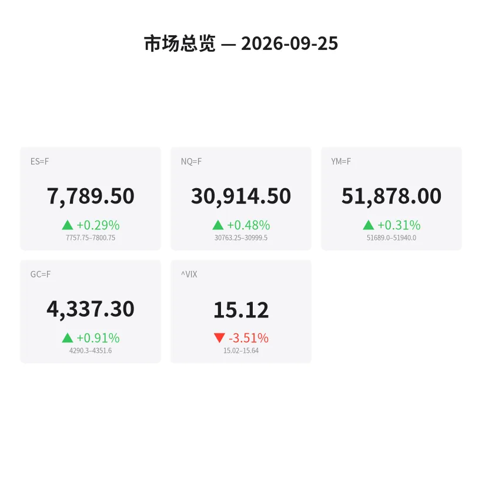
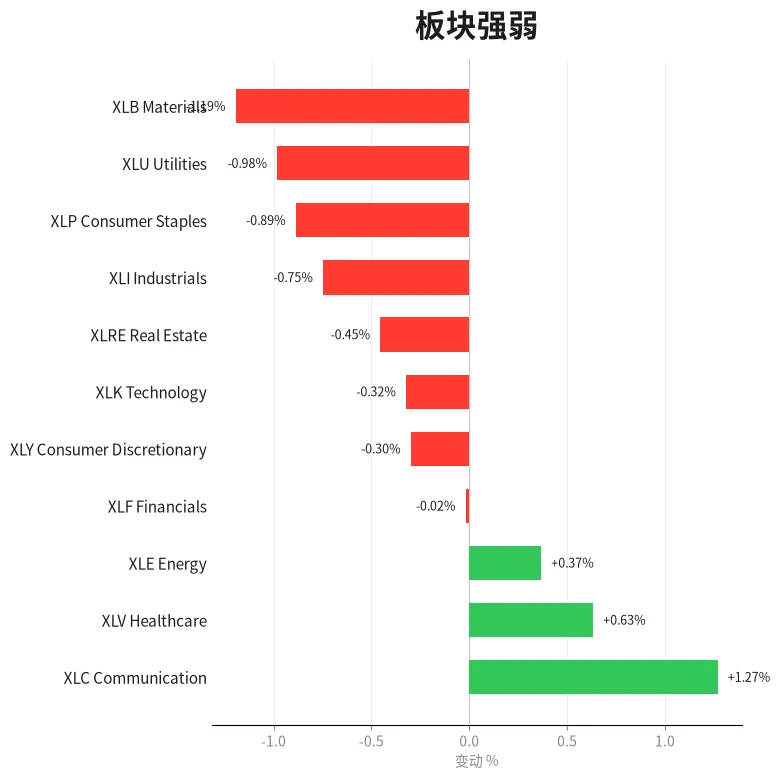
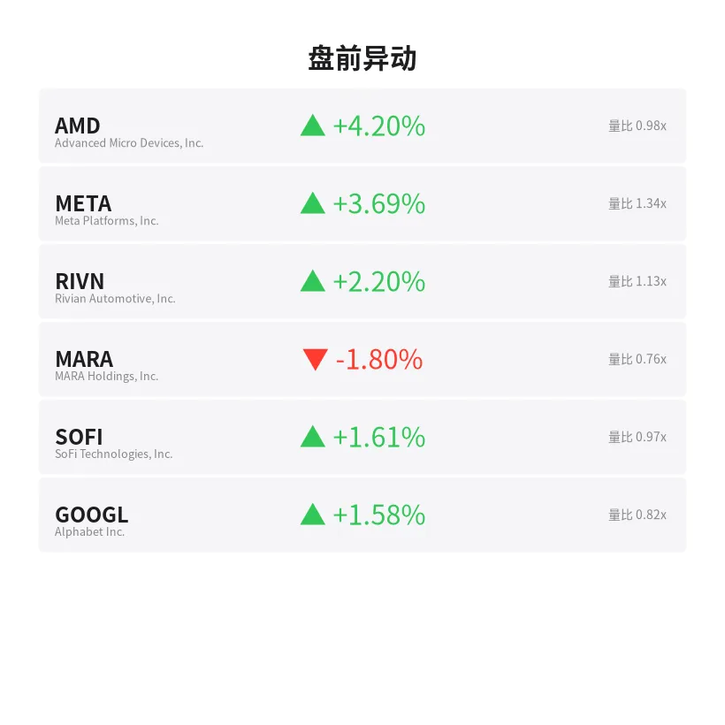
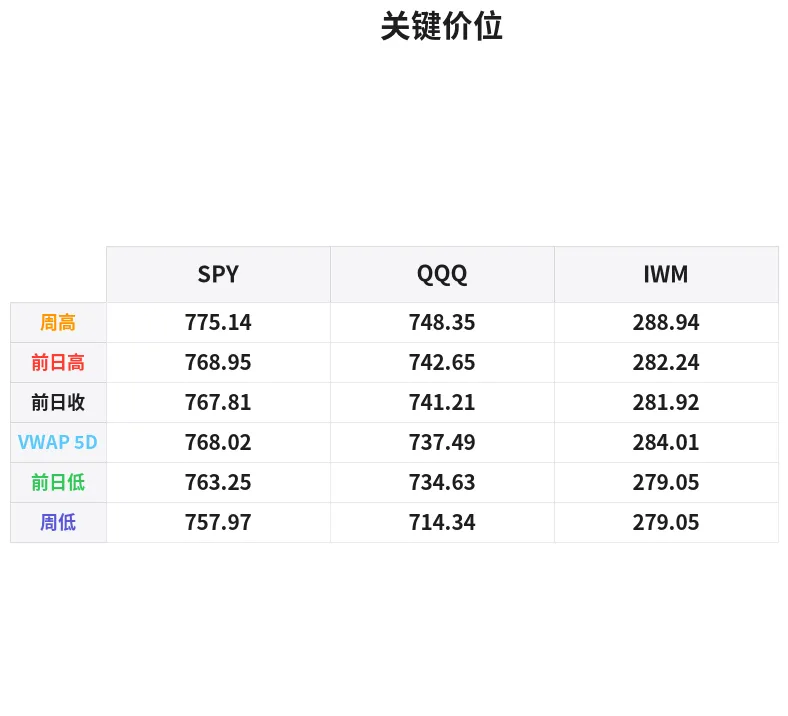

# 盘前分析报告 — 2026-09-25
*生成时间: 12:45:57 UTC*

---
## 数据速览

---
## 一、宏观环境

> [!info]- 详细数据：指数期货 & VIX
> ### 1.1 指数期货 & VIX
> | 品种 | 现价 | 涨跌幅 | 前收 | 日高 | 日低 |
> |------|------|--------|------|------|------|
> | ES=F | 7789.5 | +0.29% | 7767.0 | 7800.75 | 7748.5 |
> | NQ=F | 30914.5 | +0.48% | 30766.75 | 30997.25 | 30679.0 |
> | YM=F | 51878.0 | +0.31% | 51717.0 | 51934.0 | 51610.0 |
> | GC=F | 4337.3 | +0.91% | 4298.0 | 4351.6 | 4290.3 |
> | ^VIX | 15.12 | -3.51% | 15.67 | 15.64 | 15.02 |

> [!info]- 详细数据：隔夜走势
> ### 1.2 隔夜走势（Globex）
> | 品种 | 隔夜高 | 隔夜低 | 区间 | 亚洲高 | 亚洲低 | 欧洲高 | 欧洲低 |
> |------|--------|--------|------|--------|--------|--------|--------|
> | ES=F | 7800.75 | 7757.75 | 43.0 | 7774.0 | 7757.75 | 7800.75 | 7769.75 |
> | NQ=F | 30999.5 | 30763.25 | 236.25 | 30868.75 | 30763.25 | 30999.5 | 30838.0 |
> | YM=F | 51940.0 | 51689.0 | 251.0 | 51775.0 | 51689.0 | 51940.0 | 51748.0 |
> | GC=F | 4351.6 | 4290.3 | 61.3 | 4311.9 | 4290.3 | 4351.6 | 4300.8 |
> | ^VIX | 15.64 | 15.02 | 0.62 | — | — | 15.64 | 15.02 |

> [!info]- 详细数据：板块强弱
> ### 1.3 板块强弱
> | ETF | 板块 | 涨跌幅 |
> |-----|------|--------|
> | XLC | Communication | +1.27% |
> | XLV | Healthcare | +0.63% |
> | XLE | Energy | +0.37% |
> | XLF | Financials | -0.02% |
> | XLY | Consumer Discretionary | -0.30% |
> | XLK | Technology | -0.32% |
> | XLRE | Real Estate | -0.45% |
> | XLI | Industrials | -0.75% |
> | XLP | Consumer Staples | -0.89% |
> | XLU | Utilities | -0.98% |
> | XLB | Materials | -1.19% |

---
## 二、消息面

- **65岁退休者需要投资多少才能终身每月领取6,250美元？** — *24/7 Wall St.*
  > How Much Does a 65-Year-Old Need Invested to Collect $6,250 a Month for Life?
- **道富SPDR标普500 ETF信托(SPY)是否值得关注？** — *Zacks*
  > Should State Street SPDR S&P 500 ETF Trust (SPY) Be on Your Investing Radar?
- **标普500、道指、纳指期货走软，国债收益率持续飙升——ORCL、META、AKAM、GOOGL、MGM成焦点** — *Stocktwits*
  > S&P 500, Dow, Nasdaq Futures Ease As Treasury Yields Continue To Spike — ORCL, META, AKAM, GOOGL, MGM In Focus
- **SPY 9.45个基点的费率差异在10万美元投资中十年多花6,450美元** — *24/7 Wall St.*
  > SPY’s 9.45 Basis Points Hides $6,450 a Decade on $100,000 Versus Cheaper Peers
- **Coherent今年已飙涨59%：现在买入COHR股票还来得及吗？** — *24/7 Wall St.*
  > Coherent Has Ripped 59% in 2026: Is It Too Late to Buy COHR Stock Now?
- **美股今日行情：道指因美伊和平希望上涨；美光、Sandisk大涨（实时报道）** — *Investor’s Business Daily*
  > Stock Market Today: Dow Rises On U.S.-Iran Peace Hopes; Micron, Sandisk Rally (Live Coverage)
- **AI投资是"死钱"：富达策略师警告3.3万亿美元AI建设将推高通胀且"回报未知"** — *Benzinga*
  > AI Trade Is ‘Dead Money’: Fidelity Strategist Warns $3.3 Trillion Buildout Is Inflationary With ‘Unknown Returns’
- **景顺(IVZ)的看涨逻辑可能因新推出的全球QQQ创新ETF而改变** — *Simply Wall St.*
  > The Bull Case For Invesco (IVZ) Could Change Following New Global QQQ Innovation ETF Launch – Learn Why
- **ETF涨跌互现，美股午后转跌** — *MT Newswires*
  > Exchange-Traded Funds Mixed, US Equities Decline After Midday
- **恐慌指数回落，债市担忧有所缓解** — *Barrons.com*
  > Stock Market Fear Index Slides as Bond Worries Ease
- **⚡ 快讯：债市波动率飙升，投资者面临新风险** — *The Wall Street Journal*
  > ⚡ Flash Heard: Surge in Bond-Market Volatility Signals New Risks for Investors
- **原油、通胀与利率：推动债券收益率创多年新高的三重威胁** — *Barrons.com*
  > Oil, Inflation, and Rates: The Triple Threat Driving Bond Yields to Multi-Year Highs
- **2026年9月24日股市新闻** — *Zacks*
  > Stock Market News for Sep 24, 2026
- **2026年9月23日股市新闻** — *Zacks*
  > Stock Market News for Sep 23, 2026
- **今日金价（2026年9月25日周五）：投资者权衡多重因素，金价持稳** — *Yahoo Personal Finance*
  > Gold price today, Friday, September 25, 2026: Gold prices hold as investors have a lot to consider
- **国债收益率飙升拖累科技股，英伟达领跌** — *Yahoo Finance*
  > Nvidia leads tech stocks lower as Treasury yields surge: AlphaCheck
- **波音(BA)赢得150架飞机订单意味着什么？** — *Simply Wall St.*
  > What Does Boeing (BA) Winning A 150 Jet Order Mean Now?
- **清崎：美国人正遭受一场"隐形洗劫"——他们却浑然不知** — *Moneywise*
  > Robert Kiyosaki says Americans are victims of an ‘invisible heist’ — and they don’t even know it. Protect yourself now
- **周五开盘前需要知道的5件事** — *Investopedia*
  > 5 Things to Know Before the Stock Market Opens on Friday
- **美股今日收盘：道指首次收于52,000点上方，标普500和纳指在科技股提振下齐涨** — *Yahoo Finance*
  > Stock market today: Dow closes above 52,000 for first time, S&P 500 and Nasdaq rally as tech gains

---
## 三、盘前异动

> [!info]- 详细数据：盘前异动
> | 代码 | 名称 | 现价 | 缺口 | 量比 |
> |------|------|------|------|------|
> | AMD | Advanced Micro Devices, Inc. | 640.42 | +4.20% | 0.98x |
> | META | Meta Platforms, Inc. | 771.55 | +3.69% | 1.34x |
> | RIVN | Rivian Automotive, Inc. | 15.35 | +2.20% | 1.13x |
> | MARA | MARA Holdings, Inc. | 13.11 | -1.80% | 0.76x |
> | SOFI | SoFi Technologies, Inc. | 16.82 | +1.61% | 0.97x |
> | GOOGL | Alphabet Inc. | 343.18 | +1.58% | 0.82x |

---
## 四、关键价位

> [!info]- 详细数据：SPY 关键价位
> ### SPY
> | 价位类型 | 价格 |
> |----------|------|
> | Prior Day High | 768.95 |
> | Prior Day Low | 763.245 |
> | Prior Day Close | 767.81 |
> | Premarket Price | 769.64 |
> | Approx Vwap 5D | 768.02 |
> | Weekly High | 775.14 |
> | Weekly Low | 757.97 |

> [!info]- 详细数据：QQQ 关键价位
> ### QQQ
> | 价位类型 | 价格 |
> |----------|------|
> | Prior Day High | 742.65 |
> | Prior Day Low | 734.6301 |
> | Prior Day Close | 741.21 |
> | Premarket Price | 744.5695 |
> | Approx Vwap 5D | 737.49 |
> | Weekly High | 748.35 |
> | Weekly Low | 714.34 |

> [!info]- 详细数据：IWM 关键价位
> ### IWM
> | 价位类型 | 价格 |
> |----------|------|
> | Prior Day High | 282.24 |
> | Prior Day Low | 279.045 |
> | Prior Day Close | 281.92 |
> | Premarket Price | 282.41 |
> | Approx Vwap 5D | 284.01 |
> | Weekly High | 288.94 |
> | Weekly Low | 279.05 |

---
## 五、AI 技术分析 & 操盘建议

## 第一部分：隔夜市场回顾

### 亚洲时段（18:00-02:00 ET）
亚洲时段整体偏弱震荡。ES在7758-7774窄幅运行，基本在昨日收盘价7767附近徘徊，显示亚洲交易者对美股方向持观望态度。NQ表现稍弱，探至30763低点后企稳于30869。GC黄金在亚洲时段继续承压，从4312跌至4290低点，延续了本周从4413的持续回调。

**关键观察**：亚洲时段VIX数据缺失，但从期货价格走势看，市场情绪偏谨慎。国债收益率持续攀升是压制亚洲时段风险偏好的主因——华尔街日报和Barron's均发文警示债市波动率飙升带来的新风险。

### 欧洲时段（02:00-08:30 ET）
欧洲交易者进场后明显提振了风险偏好。ES从7770区域推升至7801的隔夜高点（+31点），NQ更为强势，突破31000大关达到30999.5（接近但未破31000整数关口），区间振幅达161.5点。YM道指期货跟随走强至51940。

**特别注意**：GC黄金在欧洲时段出现强劲反弹，从4301跳升至4352高点（+51点），收复了亚洲时段失地并创出新的日内高点。这暗示避险需求并未消退——交易者一边买入股指期货，一边也在加仓黄金，这种"双多"格局值得警惕。

### 对美盘的启示
1. **多头结构确认**：欧洲时段的强力推升表明机构在积极做多，ES隔夜高点7801将成为开盘后第一个阻力测试位
2. **国债收益率是核心变量**：多条新闻聚焦于收益率飙升（"Triple Threat"、"Bond Volatility Surge"），若美盘开盘后10Y收益率继续走高，可能逆转欧洲时段的乐观情绪
3. **科技股分化**：AMD盘前+4.2%、META+3.7%领涨，但整体XLK板块-0.32%，说明资金集中在AI硬件和大型社交媒体，非普涨
4. **美伊和平消息提振**：道指首次收于52,000上方+美伊和平希望=宏观面偏多，但持续性待验证

## 第二部分：期货品种分析

### ES（E-mini S&P 500）— 现价 7789

**多时间框架分析**：
- **周线**：本周从7847回调至7707后反弹，形成长下影线雏形，显示7700整数关口有强支撑。周线仍处于上升趋势中。
- **日线**：连续3日收出阴线（7834→7832→7773→7767），今日盘前反弹至7789。日线级别在7770-7800区间形成窄幅震荡，等待方向选择。VWAP 5日均值768（对应SPY）在当前价格附近提供动态支撑。
- **4H/1H**：隔夜从7758低点走出V型反转至7801，短线结构偏多。但7800-7801区域为隔夜高点+心理关口双重阻力。

**关键价位**：
| 类型 | 价格 | 说明 |
|------|------|------|
| R3 | 7848 | 周初高点/前高 |
| R2 | 7801 | 隔夜高点 |
| R1 | 7784 | 昨日高点 |
| Pivot | 7767 | 昨日收盘 |
| S1 | 7749 | 今日低点 |
| S2 | 7707 | 周低点 |
| S3 | 7700 | 整数关口 |

**方向偏向**：偏多 | **置信度**：65%
- 欧洲时段突破7800显示买盘力度，但收益率飙升可能随时逆转
- 偏多前提：开盘后守住7770上方

**交易计划**：
- **做多入场区**：7758-7770（回踩隔夜低点区域+昨日收盘支撑）
- **止损**：7745（隔夜低点下方）
- **T1**：7801（隔夜高点测试）
- **T2**：7830（前两日收盘密集区）
- **失效条件**：跌破7745且伴随放量，则转为观望或反手做空至7707

---

### NQ（E-mini Nasdaq 100）— 现价 30911

**多时间框架分析**：
- **周线**：本周从31095回调至30370后强力反弹，周振幅725点。NQ波动率显著大于ES，反映科技股的高beta特性。
- **日线**：9/22收31029后连跌两日至30767，今日盘前反弹至30911（+0.48%）。日线级别处于30370-31095的宽幅震荡中，无明确方向。
- **4H/1H**：隔夜形成清晰的V型反转，从30763推升至30999.5（差0.5点未破31000），短线多头动能强劲。但31000整数关口未能突破是一个隐忧。

**关键价位**：
| 类型 | 价格 | 说明 |
|------|------|------|
| R3 | 31095 | 周高点 |
| R2 | 31000 | 整数关口+隔夜高点 |
| R1 | 30827 | 昨日高点 |
| Pivot | 30767 | 昨日收盘 |
| S1 | 30679 | 今日低点 |
| S2 | 30370 | 周低点 |
| S3 | 30000 | 心理大关 |

**方向偏向**：偏多 | **置信度**：60%
- AMD+4.2%和META+3.7%盘前强势提振NQ，但富达"AI是死钱"的警告+英伟达领跌科技股的消息形成对冲
- 31000是多空分水岭——突破确认则加速上行，受阻则可能形成双顶

**交易计划**：
- **做多入场区**：30750-30830（昨日收盘-昨日高点回踩区域）
- **止损**：30670（今日低点下方）
- **T1**：31000（整数关口测试）
- **T2**：31095（周高点）
- **失效条件**：跌破30670，目标看30370周低

---

### GC（黄金期货）— 现价 4335

**多时间框架分析**：
- **周线**：本周从4413持续回调至4278低点，跌幅135点（-3.1%），为近期最大单周回调。但今日盘前反弹至4335，收回部分失地。周线级别可能在构筑中继平台。
- **日线**：4日连跌后今日首次收阳（截至盘前），从4298反弹+37点。日线RSI可能处于超卖区域附近。
- **4H/1H**：隔夜先跌至4290后在欧洲时段强力拉升至4352（+62点），短线V型反弹力度强劲。4350-4352区域形成短期阻力。

**关键价位**：
| 类型 | 价格 | 说明 |
|------|------|------|
| R3 | 4413 | 周初高点 |
| R2 | 4376 | 9/22收盘 |
| R1 | 4352 | 隔夜高点/今日阻力 |
| Pivot | 4298 | 昨日收盘 |
| S1 | 4290 | 今日低点 |
| S2 | 4278 | 周低点 |
| S3 | 4250 | 下一整数支撑 |

**方向偏向**：偏多（超跌反弹）| **置信度**：55%
- 连跌4日后反弹具有技术合理性，欧洲时段买盘凶猛
- 但整体趋势仍是从4413高点回调中，反弹可能仅是回抽
- 美伊和平消息若确认将削弱避险需求，对黄金不利

**交易计划**：
- **做多入场区**：4300-4315（昨日收盘附近+前期支撑）
- **止损**：4285（周低点下方）
- **T1**：4352（隔夜高点）
- **T2**：4376（9/22收盘阻力）
- **失效条件**：跌破4278周低点，则回调可能加速至4250甚至4200

## 第三部分：ETF品种分析

### SPY（SPDR S&P 500 ETF）— 昨收 767.18 | 盘前 769.64

**本周走势回顾**：
周一跳空高开766→冲高775（周高），周二窄幅震荡收773，周三开始回调至768，昨日继续下行至767。本周形成"冲高回落"格局，从775高点回调至763低点（-12点/-1.6%）。

**关键价位**：
| 类型 | 价格 | 说明 |
|------|------|------|
| 周高/R2 | 775.14 | 本周最高点 |
| R1 | 769.0 | 昨日高点/盘前价位 |
| 5日VWAP | 768.02 | 动态均衡价位 |
| Pivot | 767.81 | 昨日收盘（前收） |
| S1 | 763.25 | 昨日低点 |
| S2 | 757.97 | 周低点（上周五） |

**交易计划**：
- **看多场景**：开盘站稳769（盘前价位）上方，量能配合→做多，T1=772，T2=775。止损767.5
- **看空场景**：开盘跌破767（5日VWAP+昨收集中区域）且放量→做空，T1=763.5，T2=760。止损769
- **核心逻辑**：SPY处于768上下的多空分界线上。盘前涨至769.64，若开盘能消化获利盘并守住769，则日内偏多；若开盘高开低走破767则短线转弱

---

### QQQ（Invesco QQQ Trust）— 昨收 741.10 | 盘前 744.57

**本周走势回顾**：
QQQ本周波动剧烈。周一从728跳空至743，周二续涨至748（周高），周三回落至741，昨日继续走软至734低点后反弹收741。周振幅=748-714=34点，远大于SPY的相对波动。

**关键价位**：
| 类型 | 价格 | 说明 |
|------|------|------|
| 周高/R2 | 748.35 | 本周最高 |
| R1 | 744.57 | 盘前价位 |
| 昨日高 | 742.65 | 昨日高点 |
| Pivot/昨收 | 741.21 | 多空分界 |
| 5日VWAP | 737.49 | 动态支撑 |
| S1 | 734.63 | 昨日低点 |
| S2/周低 | 714.34 | 本周极端低位 |

**交易计划**：
- **看多场景**：开盘守住742.65（昨日高点突破回踩确认）→做多，T1=746，T2=748.35。止损740
- **看空场景**：开盘跌破741后无法在15min内收回→做空，T1=737.5（5日VWAP），T2=735。止损743
- **核心逻辑**：QQQ盘前+0.47%，AMD和META强势是主要驱动。但富达"AI是死钱"的言论和英伟达领跌的叙事可能在开盘后发酵。关注开盘前30min科技股的order flow——如果AMD和META的盘前涨幅在开盘后快速缩窄，则QQQ可能回吐全部缺口

## 第四部分：今日市场总览

### 整体情绪判断：**谨慎偏多** ⚖️

市场正处于"多空因素交织"的典型周五格局：

**多头因素**：
- 道指首次收于52,000上方，创历史新高——牛市结构未被打破
- 美伊和平希望提振市场情绪
- AMD(+4.2%)和META(+3.7%)盘前强劲，AI叙事虽有质疑但资金仍在流入
- VIX从15.67降至15.15，恐慌情绪回落
- XLC通信板块+1.27%领涨（META驱动），XLV医疗+0.63%跟涨

**空头因素**：
- 国债收益率持续飙升——三大媒体（WSJ、Barron's）同日发出债市警告罕见
- 富达策略师直言AI投资是"死钱"，3.3万亿美元建设"回报未知"
- XLB材料(-1.19%)、XLU公用事业(-0.98%)、XLP必需消费(-0.89%)等防御性板块下跌
- 英伟达领跌科技股，与AMD/META的分化可能意味着资金在AI赛道内部轮动而非增量流入
- 周五效应——部分交易者倾向于周五减仓锁利

### VIX分析
VIX现报15.15，较昨日15.67回落3.5%。本周VIX走势：14.87→14.21→15.18→15.67→15.15，呈现"先降后升再降"的W型。15.15处于近期中枢偏低位置，暗示市场并不担心大幅下行，但也没有进入极度自满区域（<13）。VIX若跌破15将进一步确认多头主导。

### 需要回避的时间窗口
1. **09:30-10:00 ET（开盘前30分钟）**：周五开盘通常波动剧烈，等待方向确认后再入场
2. **10:00 ET**：关注是否有重要经济数据发布（如消费者信心指数），可能引发短期波动
3. **14:00-15:00 ET**：周五下午机构往往开始平仓调仓，流动性下降后价格波动可能失真
4. **15:45-16:00 ET**：收盘前15分钟的MOC（Market on Close）订单可能导致单边快速移动

### 板块轮动观察
今日板块分化明显，呈现"科技强+周期弱"格局：
- **强势**：XLC(+1.27%) > XLV(+0.63%) > XLE(+0.37%)
- **弱势**：XLB(-1.19%) < XLU(-0.98%) < XLP(-0.89%)
- 通信（META驱动）和医疗走强，材料和公用事业走弱——这是典型的"成长风格占优"信号
- 但能源板块+0.37%走强值得注意——原油上涨+美伊局势的博弈可能使能源成为避风港

### 🎯 核心交易论点

**今日一句话**：做多需要国债收益率不再恶化+AMD/META开盘后维持强势；若两个条件之一破裂，则转为日内做空或观望。

**最佳策略**：以ES 7770和NQ 30770为多空分界线，等待09:45-10:00开盘震荡结束后确认方向。偏多格局下优先选择NQ做多（beta更大、科技股驱动力更强），偏空格局下优先选择ES做空（更稳定、下行空间可控）。周五不宜重仓过夜。

---
*以上分析基于盘前数据，仅供参考，不构成投资建议。实盘操作请结合实时order flow和Level 2数据。*
