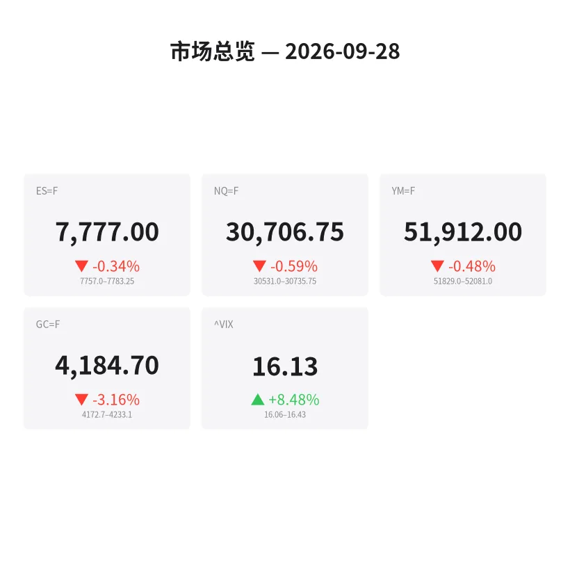
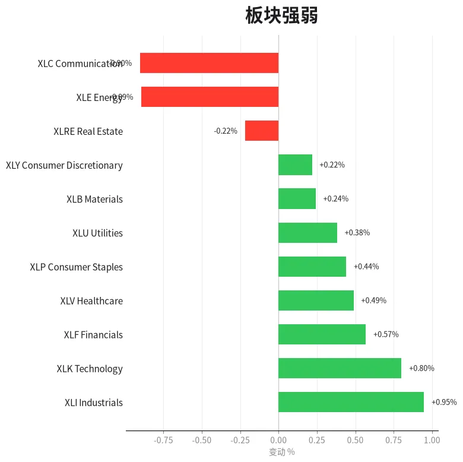
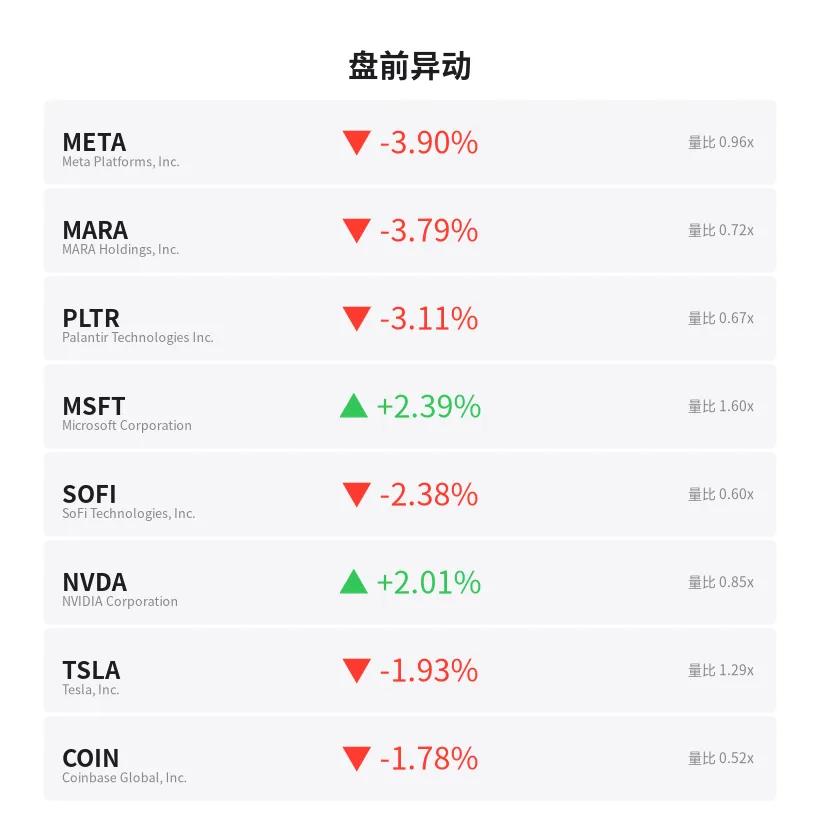
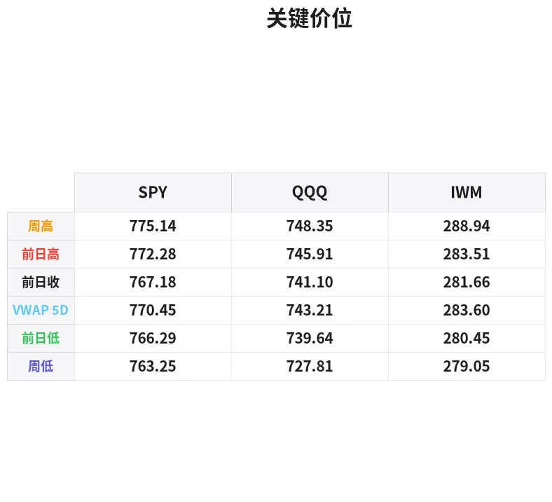

# 盘前分析报告 — 2026-09-28
*生成时间: 12:45:32 UTC*

---
## 数据速览

---
## 一、宏观环境

> [!info]- 详细数据：指数期货 & VIX
> ### 1.1 指数期货 & VIX
> | 品种 | 现价 | 涨跌幅 | 前收 | 日高 | 日低 |
> |------|------|--------|------|------|------|
> | ES=F | 7777.0 | -0.34% | 7803.75 | 7803.0 | 7757.0 |
> | NQ=F | 30706.75 | -0.59% | 30889.25 | 30920.75 | 30531.0 |
> | YM=F | 51912.0 | -0.48% | 52163.0 | 52153.0 | 51829.0 |
> | GC=F | 4184.7 | -3.16% | 4321.2 | 4315.6 | 4172.8 |
> | ^VIX | 16.13 | +8.48% | 14.87 | 16.43 | 16.06 |

> [!info]- 详细数据：隔夜走势
> ### 1.2 隔夜走势（Globex）
> | 品种 | 隔夜高 | 隔夜低 | 区间 | 亚洲高 | 亚洲低 | 欧洲高 | 欧洲低 |
> |------|--------|--------|------|--------|--------|--------|--------|
> | ES=F | 7783.25 | 7757.0 | 26.25 | 7779.0 | 7770.5 | 7783.25 | 7757.0 |
> | NQ=F | 30735.75 | 30531.0 | 204.75 | 30705.5 | 30628.0 | 30679.0 | 30531.0 |
> | YM=F | 52081.0 | 51829.0 | 252.0 | 51993.0 | 51925.0 | 52081.0 | 51849.0 |
> | GC=F | 4233.1 | 4172.7 | 60.4 | 4233.1 | 4211.4 | 4213.8 | 4172.7 |
> | ^VIX | 16.43 | 16.06 | 0.37 | — | — | 16.43 | 16.06 |

> [!info]- 详细数据：板块强弱
> ### 1.3 板块强弱
> | ETF | 板块 | 涨跌幅 |
> |-----|------|--------|
> | XLI | Industrials | +0.95% |
> | XLK | Technology | +0.80% |
> | XLF | Financials | +0.57% |
> | XLV | Healthcare | +0.49% |
> | XLP | Consumer Staples | +0.44% |
> | XLU | Utilities | +0.38% |
> | XLB | Materials | +0.24% |
> | XLY | Consumer Discretionary | +0.22% |
> | XLRE | Real Estate | -0.22% |
> | XLE | Energy | -0.89% |
> | XLC | Communication | -0.90% |

---
## 二、消息面

- **Adobe股价过山车行情延续：谁在买入？** — *24/7 Wall St.*
  > Adobe’s Rollercoaster Ride Continues: Who’s Buying?
- **IREN持续下跌趋势不止：知名华尔街机构称其股价将翻倍有余** — *24/7 Wall St.*
  > IREN’s Yearlong Downward Trend Continues: A Prominent Wall Street Firm Says It Will Double and Then Some
- **纳指、标普期货下挫：特朗普拒绝伊朗提议致油价飙升，MU、NVDA、NIO等受关注** — *Stocktwits*
  > Nasdaq, S&P 500 Futures Fall As Oil Spikes On Trump’s Snub To Iran: MU, NVDA, SKHY, SPCX, NIO Stocks In Focus
- **标普500今日将高开还是低开？** — *Benzinga Prediction Markets*
  > Stock Market: Will S&P 500 Open Up or Down Today?
- **Stocktwits医药脉搏：礼来、诺和诺德领衔繁忙一周——值得关注的个股与数据** — *Stocktwits*
  > Stocktwits Pharma Pulse: Lilly, Novo Lead A Busy Week — Here Are The Stocks And Readouts To Watch
- **现在该买QQQ还是VUG？历史数据给出的答案** — *Motley Fool*
  > Should You Buy QQQ or VUG Right Now? Here’s What History Suggests.
- **今日股市：特朗普拒绝伊朗提议致道指下跌，油价与国债收益率跳涨** — *Investor’s Business Daily*
  > Stock Market Today: Dow Falls As Trump Rejects Iran’s Proposal; Oil Prices, Treasury Yields Jump (Live Coverage)
- **Invesco QQQ (QQQ) 是否值得关注？** — *Zacks*
  > Should Invesco QQQ (QQQ) Be on Your Investing Radar?
- **杠铃策略完全跳过中间地带：25万美元在两端如何配置** — *24/7 Wall St.*
  > A Barbell Portfolio Skips the Middle Entirely. Here’s What $250,000 Looks Like at Both Ends
- **FedWatch分析师预计10年期国债收益率将于2027年1月触及6%——警告房市将"承压"并拖累经济** — *Stocktwits*
  > FedWatch’s Ben Emons Sees 10-Year Treasury Yield Hitting 6% By January 2027 — Warns It Could Put Housing ‘In A Crunch’ And Slow The Economy
- **股票与债券"怪异"背离的背后原因及可能的转折点** — *Barrons.com*
  > What’s Behind the ‘Weird’ Divergence in Stocks and Bonds and What Could Change It
- **债券担忧缓解，恐慌指数回落** — *Barrons.com*
  > Stock Market Fear Index Slides as Bond Worries Ease
- **⚡ 快讯：债券市场波动率飙升，释放投资者新风险信号** — *The Wall Street Journal*
  > Flash Heard: Surge in Bond-Market Volatility Signals New Risks for Investors
- **油价、通胀与利率：推动国债收益率创多年新高的三重威胁** — *Barrons.com*
  > Oil, Inflation, and Rates: The Triple Threat Driving Bond Yields to Multi-Year Highs
- **9月28日金价：伊朗局势紧张与油价上涨双重打压，金价大幅下挫** — *Yahoo Personal Finance*
  > Gold prices today, Monday, September 28, 2026: Gold prices slump as Iran tensions and oil prices rise
- **AngloGold Ashanti股价跌7.3%：受油价与国债收益率上涨拖累** — *InvestorsHub*
  > AngloGold Ashanti Shares Fall 7.3% as Oil Prices and Treasury Yields Rise
- **全球货币供应量创103万亿美元历史新高，比特币为何未能跟涨？** — *BeInCrypto*
  > Global Money Supply Hits $103 Trillion Record, So Why Isn’t Bitcoin Following?
- **国债收益率与加息预期双双走高，黄金跌至七周低位——分析师警告黄金"韧性"面临最严峻考验** — *Stocktwits*
  > Gold Sinks To 7-Week Low As Treasury Yields, Fed Hike Bets Rise — Hansen Warns Bullion’s ‘Resilience’ Faces Its ‘Toughest Test Yet’
- **加息预期升温，黄金跌至七周低点** — *The Wall Street Journal*
  > Gold Falls to Seven-Week Low as Rate-Hike Bets Rise
- **上周五收盘回顾：道指首次收于52000点上方，标普与纳指在科技股带动下齐涨** — *Yahoo Finance*
  > Stock market today: Dow closes above 52,000 for first time, S&P 500 and Nasdaq rally as tech gains

---
## 三、盘前异动

> [!info]- 详细数据：盘前异动
> | 代码 | 名称 | 现价 | 缺口 | 量比 |
> |------|------|------|------|------|
> | META | Meta Platforms, Inc. | 747.25 | -3.90% | 0.96x |
> | MARA | MARA Holdings, Inc. | 12.43 | -3.79% | 0.72x |
> | PLTR | Palantir Technologies Inc. | 186.61 | -3.11% | 0.67x |
> | MSFT | Microsoft Corporation | 509.84 | +2.39% | 1.6x |
> | SOFI | SoFi Technologies, Inc. | 16.4 | -2.38% | 0.6x |
> | NVDA | NVIDIA Corporation | 229.09 | +2.01% | 0.85x |
> | TSLA | Tesla, Inc. | 370.65 | -1.93% | 1.29x |
> | COIN | Coinbase Global, Inc. | 195.67 | -1.78% | 0.52x |

---
## 四、关键价位

> [!info]- 详细数据：SPY 关键价位
> ### SPY
> | 价位类型 | 价格 |
> |----------|------|
> | Prior Day High | 772.28 |
> | Prior Day Low | 766.29 |
> | Prior Day Close | 767.18 |
> | Premarket Price | 768.96 |
> | Approx Vwap 5D | 770.45 |
> | Weekly High | 775.14 |
> | Weekly Low | 763.25 |

> [!info]- 详细数据：QQQ 关键价位
> ### QQQ
> | 价位类型 | 价格 |
> |----------|------|
> | Prior Day High | 745.915 |
> | Prior Day Low | 739.64 |
> | Prior Day Close | 741.1 |
> | Premarket Price | 740.74 |
> | Approx Vwap 5D | 743.21 |
> | Weekly High | 748.35 |
> | Weekly Low | 727.81 |

---
## 五、AI 技术分析 & 操盘建议

## 第一部分：隔夜市场回顾

**亚洲时段（18:00-02:00 ET）：** 亚洲市场整体承压，ES在7770-7779窄幅震荡，NQ区间30628-30705，波动极低。GC在亚洲时段初期触及隔夜高点4233后即转跌，表明亚洲资金率先抛售黄金。整体风格偏防守，缺乏方向性推动。

**欧洲时段（02:00-09:30 ET）：** 欧盘成为今日主战场。特朗普周末拒绝伊朗提议的消息在欧洲开盘后发酵，地缘风险推升原油价格，带动国债收益率跳涨。ES从7780区域快速下探至7757隔夜低点，NQ更是跌至30531——欧洲时段下沿即隔夜低点。GC遭到双重打击：美元走强+实际利率飙升使得黄金大跌至4172附近，跌幅超3%。VIX跳升至16.13（+8.48%），显示市场避险情绪显著升温。

**对美盘的启示：**
- 隔夜低点（ES 7757、NQ 30531）是关键支撑，若美盘早盘直接跌破，大概率触发止损连锁，加速下行
- 欧盘在尾盘并未反弹修复，而是维持在低位区域收盘，说明空头主导格局未改
- 黄金-3.16%的暴跌异常——通常地缘风险利多黄金，但此次收益率飙升的力量完全压制了避险买盘，说明市场定价重心在"更高更久的利率"
- VIX从14.87跳至16.13，突破15心理关口，期权市场已开始为更大波动定价

## 第二部分：期货品种分析

### ES（E-mini S&P 500）— 现价 7777.0 | 跌幅 -0.34%

**多时间框架分析：**
- **日线：** 上周五道指首次收于52000上方，市场处于历史高位区域。但周末地缘消息冲击使得今日期货跳空低开。日线级别7750-7760为前期盘整区域上沿，有支撑意义
- **4H：** 欧盘跌破7770后未能收复，空头趋势延续。VWAP在7780附近形成动态阻力
- **1H：** 隔夜区间7757-7783，当前价格7777位于区间上半部，但欧盘收盘前卖压未退

**关键价位：**
| 级别 | 价格 | 说明 |
|------|------|------|
| 强阻力 | 7803.75 | 前收盘价，缺口上沿 |
| 阻力 | 7783.25 | 隔夜高点 |
| 枢轴 | 7770 | 亚洲时段中枢，多空分界 |
| 支撑 | 7757.0 | 隔夜低点 |
| 强支撑 | 7740-7745 | 上周低位支撑带 |

**方向偏空 | 置信度 70%**

**交易计划：**
- **空头首选（顺势）：** 反弹至7780-7785区域（隔夜高+VWAP汇合）做空，止损7790上方，T1: 7757（隔夜低），T2: 7740
- **多头备选（逆势）：** 若价格触及7757且出现明确order flow反转（delta翻正+大买单吸收），轻仓试多，止损7750下方，T1: 7770，T2: 7783
- **失效条件：** 若开盘后30分钟内直接收复7790并站稳，则隔夜空头被挤，转为观望或跟多

### NQ（E-mini Nasdaq 100）— 现价 30706.75 | 跌幅 -0.59%

**多时间框架分析：**
- **日线：** NQ跌幅大于ES，科技股对利率敏感度更高。META盘前-3.9%、PLTR -3.1%拖累纳指
- **4H：** 30700为前期高点回踩位，若跌破则看向30500整数关口
- **1H：** 隔夜区间30531-30735，范围204点，波动较大。欧盘低点30531是关键

**关键价位：**
| 级别 | 价格 | 说明 |
|------|------|------|
| 强阻力 | 30889 | 前收盘价 |
| 阻力 | 30735 | 隔夜高点 |
| 枢轴 | 30650 | 隔夜区间中位 |
| 支撑 | 30531 | 隔夜低点/欧盘低点 |
| 强支撑 | 30400-30450 | 上周二低位支撑 |

**方向偏空 | 置信度 75%**

**交易计划：**
- **空头首选：** 反弹至30730-30750（隔夜高附近）做空，止损30780，T1: 30531，T2: 30400
- **多头备选：** 30531附近若出现强势吸收+VIX见顶回落信号，轻仓试多，止损30490，T1: 30650，T2: 30735
- **失效条件：** 若NVDA（+2.01%）和MSFT（+2.39%）盘中持续走强拉升NQ，空头逻辑减弱

### GC（黄金期货）— 现价 4184.7 | 跌幅 -3.16%

**多时间框架分析：**
- **日线：** 暴跌至七周低点，跌破4200整数关口。日线级别连续阴线，短期趋势明确偏空。4150为前期反弹起点
- **4H：** 价格跌破所有短期均线，4200-4210成为翻转阻力
- **1H：** 隔夜持续阴跌，亚洲时段4233→欧洲时段4172，几乎无反弹

**关键价位：**
| 级别 | 价格 | 说明 |
|------|------|------|
| 强阻力 | 4233 | 隔夜高点/亚洲高 |
| 阻力 | 4210-4215 | 欧洲时段开盘价/翻转区 |
| 枢轴 | 4200 | 整数关口/心理位 |
| 支撑 | 4172.7 | 隔夜低点 |
| 强支撑 | 4150 | 前期反弹起点 |

**方向强烈偏空 | 置信度 80%**

**交易计划：**
- **空头首选：** 反弹至4200-4210区域做空，止损4220上方，T1: 4172（隔夜低），T2: 4150
- **多头备选：** 不建议今日做多黄金——收益率飙升+美元走强的宏观背景短期无法逆转，即使出现技术反弹也极易被二次打压
- **失效条件：** 若美盘前出现突发地缘升级（中东冲突扩大化），黄金避险逻辑可能暂时回归，但需配合美元走弱确认

## 第三部分：ETF品种分析

### SPY — 盘前 768.96 | 前收 767.18

**关键价位：**
| 级别 | 价格 | 说明 |
|------|------|------|
| 强阻力 | 775.14 | 周高 |
| 阻力 | 772.28 | 前日高 |
| 5日VWAP | 770.45 | 动态阻力 |
| 枢轴 | 768.96 | 盘前价格 |
| 支撑 | 766.29 | 前日低 |
| 强支撑 | 763.25 | 周低 |

**交易计划：**
- SPY盘前微涨至768.96，略高于前收767.18。但期货端ES偏弱（-0.34%），SPY开盘后大概率回吐盘前涨幅
- **空头场景：** 开盘若无法站稳770（5日VWAP），回落跌破767前收位置做空，目标766.29→763.25
- **多头场景：** 若开盘放量突破770.50并站稳，可能测试772区域（前日高），但需配合VIX回落至15.5以下
- 板块分化明显：XLI（+0.95%）和XLK（+0.80%）相对强势，XLC（-0.90%）和XLE（-0.89%）拖累。META -3.9%是XLC最大拖累项
- 周一通常流动性偏低，警惕假突破

### QQQ — 盘前 740.74 | 前收 741.10

**关键价位：**
| 级别 | 价格 | 说明 |
|------|------|------|
| 强阻力 | 748.35 | 周高 |
| 阻力 | 745.92 | 前日高 |
| 5日VWAP | 743.21 | 动态阻力 |
| 枢轴 | 740.74 | 盘前价格 |
| 支撑 | 739.64 | 前日低 |
| 强支撑 | 727.81 | 周低 |

**交易计划：**
- QQQ盘前740.74已低于前收741.10，弱于SPY。NQ期货-0.59%的跌幅正在向QQQ传导
- **空头首选：** 开盘若跌破739.64（前日低），确认后做空，目标735→730。逻辑：NQ期货空头趋势+META/PLTR等权重股暴跌+利率压力
- **多头备选：** 仅在NVDA（+2.01%）和MSFT（+2.39%）在前30分钟拉升QQQ重新站上743（5日VWAP）时考虑，目标745.92
- QQQ今日的核心矛盾：NVDA/MSFT上涨 vs META/PLTR下跌。关注开盘后哪方力量占主导
- 若VIX继续走高突破17，QQQ大概率将测试735甚至更低

## 第四部分：今日市场总览

### 整体情绪：偏空（Risk-Off）

上周五道指首次收于52000上方，标普纳指齐创新高，市场本处于亢奋状态。但周末特朗普拒绝伊朗核谈判提议一事彻底改变了盘前格局：油价跳涨推升通胀预期，10年期国债收益率飙升（FedWatch分析师甚至预测2027年1月触及6%），加息预期回升——这条逻辑链直接打压了所有风险资产和黄金。

### VIX分析

VIX从14.87跳升至16.13（+8.48%），突破了15这一"舒适区"上沿。隔夜区间16.06-16.43，波动不大但持续维持高位。今日若VIX:
- 回落至15.5以下 → 风险偏好修复，SPY/QQQ可能回补缺口
- 维持16-17区间 → 震荡磨底格局，日内波幅有限
- 突破17 → 恐慌加剧，可能触发系统性抛售，ES看向7740，NQ看向30400

### 重要时间窗口

| 时间（ET） | 事件 | 影响 |
|------------|------|------|
| 09:30-10:00 | 开盘前30分钟 | 高波动定方向期，不宜追单 |
| 10:00 | 等待经济数据发布窗口 | 若有数据公布可能放大波动 |
| 11:30-13:30 | 午盘低流动性期 | 假突破高发区 |
| 14:00-15:00 | MOC（收盘前成交量集中）预热 | 趋势确认期 |
| 15:45-16:00 | MOC最终轮 | 尾盘方向性波动 |

### 板块轮动观察

- **强势板块：** 工业（XLI +0.95%）、科技（XLK +0.80%）、金融（XLF +0.57%）——工业领涨说明资金偏好实体经济而非纯成长
- **弱势板块：** 通信（XLC -0.90%，META -3.9%拖累）、能源（XLE -0.89%，虽然油价涨但能源股已在高位获利了结）、房地产（XLRE -0.22%，利率上行直接利空）
- **分化信号：** 科技内部高度分化——NVDA +2.01%、MSFT +2.39% vs META -3.9%、PLTR -3.1%。非同涨同跌，选股重于选方向

### 盘前异动解读

- **MSFT +2.39%（量比1.6x）：** 放量上涨，可能有利好催化（关注是否有AI/云相关消息），是QQQ的潜在支撑
- **META -3.90%：** 大幅下跌但量比仅0.96x，未放量，或为获利了结而非恐慌抛售
- **TSLA -1.93%（量比1.29x）：** 放量下跌值得警惕，可能跟随大盘risk-off趋势

---

### 🎯 今日核心操盘论点

**"收益率飙升主导的Risk-Off交易日——顺势做空反弹，不追跌，等隔夜低点给信号。"**

特朗普-伊朗消息→油价涨→收益率涨→加息预期升→全面利空。空头逻辑清晰但市场已在盘前price in了部分利空，不宜追空。等待美盘开盘后价格反弹至阻力位（ES 7780-7785、NQ 30730-30750）再顺势做空，以隔夜低点（ES 7757、NQ 30531）为第一目标。黄金今日回避做多，收益率环境下黄金空头占绝对优势。如VIX突破17，全面防守，缩小仓位。

> [!info]- 详细数据：IWM 关键价位
> ### IWM
> | 价位类型 | 价格 |
> |----------|------|
> | Prior Day High | 283.51 |
> | Prior Day Low | 280.455 |
> | Prior Day Close | 281.66 |
> | Premarket Price | 280.62 |
> | Approx Vwap 5D | 283.6 |
> | Weekly High | 288.94 |
> | Weekly Low | 279.05 |
