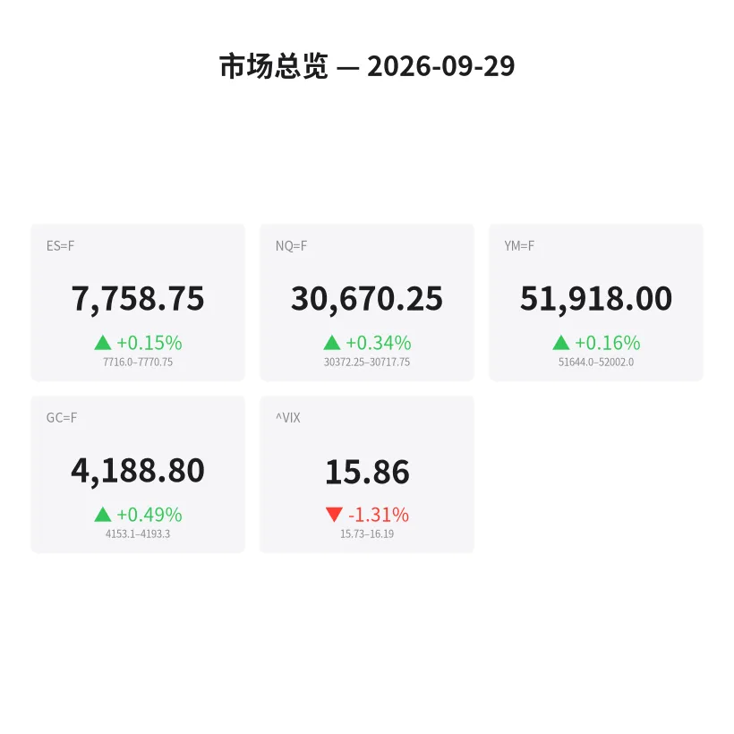
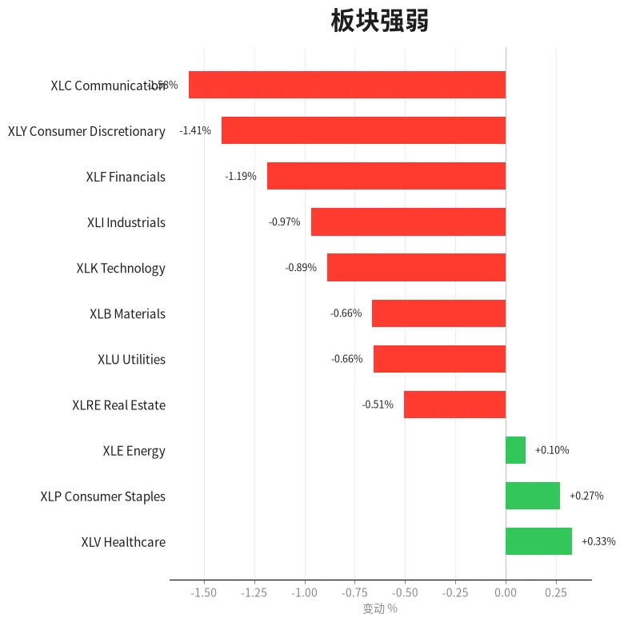
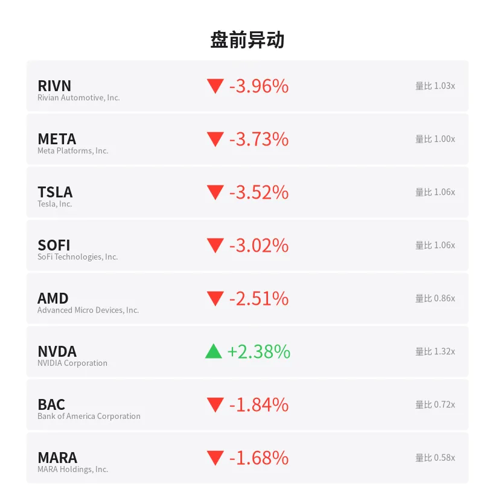
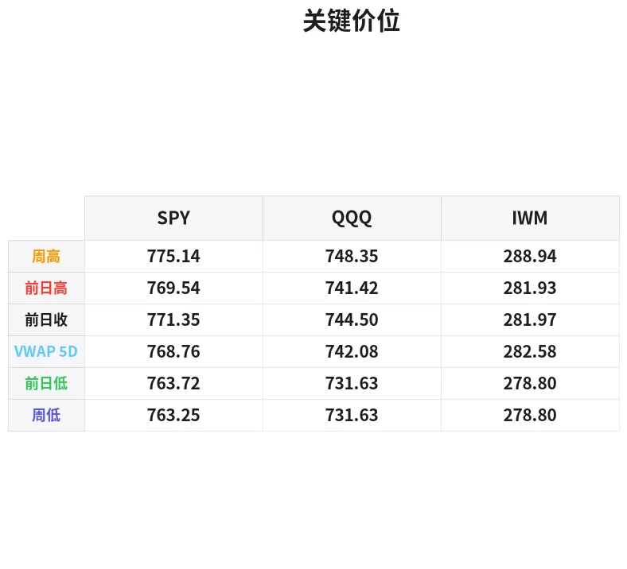

# 盘前分析报告 — 2026-09-29
*生成时间: 12:44:01 UTC*

---
## 数据速览

---
## 一、宏观环境

> [!info]- 详细数据：指数期货 & VIX
> ### 1.1 指数期货 & VIX
> | 品种 | 现价 | 涨跌幅 | 前收 | 日高 | 日低 |
> |------|------|--------|------|------|------|
> | ES=F | 7758.75 | +0.15% | 7746.75 | 7769.5 | 7716.0 |
> | NQ=F | 30670.25 | +0.34% | 30566.25 | 30717.75 | 30372.25 |
> | YM=F | 51918.0 | +0.16% | 51837.0 | 52002.0 | 51644.0 |
> | GC=F | 4188.8 | +0.49% | 4168.4 | 4193.3 | 4145.2 |
> | ^VIX | 15.86 | -1.31% | 16.07 | 16.19 | 15.73 |

> [!info]- 详细数据：隔夜走势
> ### 1.2 隔夜走势（Globex）
> | 品种 | 隔夜高 | 隔夜低 | 区间 | 亚洲高 | 亚洲低 | 欧洲高 | 欧洲低 |
> |------|--------|--------|------|--------|--------|--------|--------|
> | ES=F | 7770.75 | 7716.0 | 54.75 | 7729.75 | 7716.0 | 7770.75 | 7727.75 |
> | NQ=F | 30717.75 | 30372.25 | 345.5 | 30457.75 | 30372.25 | 30707.0 | 30425.5 |
> | YM=F | 52002.0 | 51644.0 | 358.0 | 51752.0 | 51644.0 | 51991.0 | 51728.0 |
> | GC=F | 4193.3 | 4153.1 | 40.2 | 4176.2 | 4153.1 | 4193.3 | 4167.4 |
> | ^VIX | 16.19 | 15.73 | 0.46 | — | — | 16.19 | 15.73 |

> [!info]- 详细数据：板块强弱
> ### 1.3 板块强弱
> | ETF | 板块 | 涨跌幅 |
> |-----|------|--------|
> | XLV | Healthcare | +0.33% |
> | XLP | Consumer Staples | +0.27% |
> | XLE | Energy | +0.10% |
> | XLRE | Real Estate | -0.51% |
> | XLU | Utilities | -0.66% |
> | XLB | Materials | -0.66% |
> | XLK | Technology | -0.89% |
> | XLI | Industrials | -0.97% |
> | XLF | Financials | -1.19% |
> | XLY | Consumer Discretionary | -1.41% |
> | XLC | Communication | -1.58% |

---
## 三、盘前异动

> [!info]- 详细数据：盘前异动
> | 代码 | 名称 | 现价 | 缺口 | 量比 |
> |------|------|------|------|------|
> | RIVN | Rivian Automotive, Inc. | 14.86 | -3.96% | 1.03x |
> | META | Meta Platforms, Inc. | 723.64 | -3.73% | 1.0x |
> | TSLA | Tesla, Inc. | 359.0 | -3.52% | 1.06x |
> | SOFI | SoFi Technologies, Inc. | 16.08 | -3.02% | 1.06x |
> | AMD | Advanced Micro Devices, Inc. | 614.82 | -2.51% | 0.86x |
> | NVDA | NVIDIA Corporation | 230.43 | +2.38% | 1.32x |
> | BAC | Bank of America Corporation | 55.66 | -1.84% | 0.72x |
> | MARA | MARA Holdings, Inc. | 12.34 | -1.68% | 0.58x |
> | JPM | JP Morgan Chase & Co. | 337.37 | -1.66% | 0.97x |
> | GS | Goldman Sachs Group, Inc. (The) | 920.5 | -1.60% | 0.71x |

---
## 四、关键价位

> [!info]- 详细数据：SPY 关键价位
> ### SPY
> | 价位类型 | 价格 |
> |----------|------|
> | Prior Day High | 769.54 |
> | Prior Day Low | 763.715 |
> | Prior Day Close | 771.35 |
> | Premarket Price | 766.7599 |
> | Approx Vwap 5D | 768.76 |
> | Weekly High | 775.14 |
> | Weekly Low | 763.25 |

> [!info]- 详细数据：QQQ 关键价位
> ### QQQ
> | 价位类型 | 价格 |
> |----------|------|
> | Prior Day High | 741.42 |
> | Prior Day Low | 731.63 |
> | Prior Day Close | 744.5 |
> | Premarket Price | 738.81 |
> | Approx Vwap 5D | 742.08 |
> | Weekly High | 748.35 |
> | Weekly Low | 731.63 |

> [!info]- 详细数据：IWM 关键价位
> ### IWM
> | 价位类型 | 价格 |
> |----------|------|
> | Prior Day High | 281.93 |
> | Prior Day Low | 278.8 |
> | Prior Day Close | 281.97 |
> | Premarket Price | 280.62 |
> | Approx Vwap 5D | 282.58 |
> | Weekly High | 288.94 |
> | Weekly Low | 278.8 |

---
## 五、AI 技术分析 & 操盘建议

## 第一部分：隔夜市场回顾

### 亚洲时段（周日晚间 — 周一凌晨）

亚洲时段呈现典型的"周末缺口探底"格局。ES 在亚洲时段仅维持 7716.0–7729.75 的窄幅震荡（约14点区间），整个时段价格贴近隔夜低点运行，显示周日开盘后空头主导定价，多头完全缺乏反击意愿。NQ 同步走弱，亚洲低点 30372.25 即为整个隔夜最低点，区间也仅85点，流动性极度稀薄。

**关键信号**：亚洲时段的低点（ES 7716、NQ 30372.25）构成了今日的"隔夜锚定低点"。如果美盘回测此区域不破，则属于"double tap + hold"的多头结构；若跌破，则意味着周末利空尚未完全定价。

### 欧洲时段（周一早盘）

欧洲开盘后出现强力反弹。ES 从亚洲低点区域 7727.75 一路拉升至隔夜高点 7770.75（约43点），占隔夜全部区间（54.75点）的78%。NQ 更为激进，从 30425.5 拉至 30707.0（约282点），几乎回补了整个周末缺口。黄金（GC）同步走强至 4193.3 的隔夜高点，表明欧洲机构资金在风险资产和避险资产上同步做多。

**关键信号**：欧洲时段的强势反弹说明周末的抛压更多是"情绪驱动"而非"基本面恶化"。但当前价格已经逼近隔夜高点，美盘开盘面临的问题是：多头能否突破隔夜高点继续上行，还是在此形成"欧洲时段陷阱顶部"。

### 对美盘开盘的含义

1. **价格位置偏高**：ES 7758.75 距离隔夜高点 7770.75 仅12点，意味着美盘开盘在隔夜区间的上方四分之一。对于scalper而言，这不是一个理想的追多位置。
2. **缺口效应**：SPY 盘前 766.76 vs 上周五收盘 771.35（缺口约-0.6%），QQQ 738.81 vs 744.50（缺口约-0.76%）。周一缺口回补率统计上约65%，但在Q3最后一个交易周的背景下，季末rebalancing资金流可能压制缺口回补。
3. **VIX 矛盾信号**：VIX 下跌至 15.86（-1.31%），在板块明显risk-off轮动的背景下VIX走低，说明期权市场并不认为这是系统性下跌的开端，更可能是板块轮动+仓位调整。

---
## 第二部分：期货品种分析

### ES（E-mini S&P 500）— 现价 7758.75

**多时间框架分析：**
- **日线**：周五收于 7746.75，今日盘前微涨至 7758.75。整体仍在上周区间内运行，无明显突破。周线级别处于上升趋势中的回调修整阶段。
- **4H**：欧洲时段形成一根强势多头K线，从 7727 附近拉至 7770 区域。但RSI在4H级别已进入短期超买区域（从亚洲低点的反弹幅度较大）。
- **1H/15min**：价格在隔夜高点 7770.75 下方约12点盘整，形成高位旗形。关注是否能突破 7770.75 或者回落至 7746（前收盘）。

**关键价位：**
| 类型 | 价位 | 说明 |
|------|------|------|
| 阻力3 | 7785–7790 | 隔夜高点上方延伸目标（如突破后的测量移动） |
| 阻力2 | 7770.75 | 隔夜高点 / 日内高点（核心阻力） |
| 阻力1 | 7769.5 | 日高（与ON高几乎重合） |
| 当前价 | 7758.75 | — |
| 支撑1 | 7746.75 | 前日收盘 / 心理关口 |
| 支撑2 | 7727.75 | 欧洲时段低点 |
| 支撑3 | 7716.0 | 隔夜低点 / 亚洲低点（关键防守位） |

**方向偏向**：中性偏多（信心度 55/100）

欧洲时段的强势反弹建立了多头结构，但接近隔夜高点的位置不适合追多。最优策略是等待回调至支撑位后的反弹确认。

**交易计划：**
- **多头场景A（回调买入）**：等待ES回测 7746–7750 区域（前收盘+VPOC区域），观察是否出现 delta flip、累积成交量抬升、或 bid stack 增强。入场区 7746–7750，止损 7738（低于欧洲低点下方），T1 7765，T2 7770.75。风报比约 1:2。
- **多头场景B（突破追踪）**：如果 7770.75 被有效突破（需要放量+delta持续为正），则可在突破回踩 7770 时入场，止损 7762，T1 7785，T2 7800。
- **空头场景（隔夜高点失败）**：如果 ES 冲击 7770.75 失败并出现明显的 absorption（大单吸收+delta翻负），可在 7768–7770 做空，止损 7778，T1 7750，T2 7730。
- **失效条件**：若 ES 跌破 7716（隔夜低点），多头观点完全失效，转为空头思维。

---

### NQ（E-mini Nasdaq 100）— 现价 30670.25

**多时间框架分析：**
- **日线**：NQ +0.34%，表现略优于 ES。但盘前异动显示 META -3.73%、TSLA -3.52%、AMD -2.51% 大跌，唯 NVDA +2.38% 独撑。NQ的上涨高度依赖 NVDA 能否维持强势。
- **4H**：与ES类似，欧洲时段完成V型反转。但NQ的隔夜区间（345.5点）远大于近期日均ATR比例，说明波动性放大。
- **1H/15min**：高位盘整于 30650–30720 区间，等待方向选择。

**关键价位：**
| 类型 | 价位 | 说明 |
|------|------|------|
| 阻力2 | 30750–30800 | 隔夜高点上方延伸 |
| 阻力1 | 30717.75 | 隔夜高点 |
| 当前价 | 30670.25 | — |
| 支撑1 | 30566.25 | 前日收盘 |
| 支撑2 | 30425.5 | 欧洲时段低点 |
| 支撑3 | 30372.25 | 隔夜低点 / 亚洲低点 |

**方向偏向**：中性偏多（信心度 50/100）

NQ 的问题在于多头结构由 NVDA 独力支撑。如果 NVDA 盘中出现获利回吐，NQ 可能快速补跌。需要密切关注 NVDA 的 order flow。

**交易计划：**
- **多头场景**：回测 30560–30580（前收盘区域）如出现买盘承接，入场做多。止损 30480，T1 30700，T2 30720。
- **空头场景**：如果 30717.75 形成明确的假突破（冲高后放量回落+NVDA同步走弱），在 30700–30720 做空，止损 30760，T1 30580，T2 30425。
- **失效条件**：跌破 30372.25（隔夜低点）则全面转空。

---

### GC（黄金期货）— 现价 4188.8

**多时间框架分析：**
- **日线**：黄金连续走强，+0.49%。在risk-off环境下表现突出，接近隔夜高点 4193.3。日线级别维持上升趋势。
- **4H**：从亚洲低点 4153.1 稳步攀升至 4193.3 附近，走势几乎没有回调，属于"阶梯式上涨"。
- **1H/15min**：价格在 4185–4193 的窄幅区间内运行，等待美盘方向。

**关键价位：**
| 类型 | 价位 | 说明 |
|------|------|------|
| 阻力2 | 4210–4220 | 突破后的测量目标 |
| 阻力1 | 4193.3 | 隔夜高点 / 日高 |
| 当前价 | 4188.8 | — |
| 支撑1 | 4168.4 | 前日收盘 |
| 支撑2 | 4167.4 | 欧洲时段低点 |
| 支撑3 | 4153.1 | 隔夜低点 / 亚洲低点 |

**方向偏向**：偏多（信心度 65/100）

黄金在risk-off环境中是天然受益者。板块数据显示防御型板块跑赢成长板块，叠加Q3末的避险需求，GC 有继续走高的动力。但 4193.3 是短期关键阻力。

**交易计划：**
- **多头场景（首选）**：等待回测 4168–4175 区域（前收盘+欧洲低点集中区），入场做多。止损 4158，T1 4190，T2 4210。风报比优秀。
- **突破场景**：如果美盘开盘后放量突破 4193.3 并站稳，可在回踩 4190–4193 时入场，止损 4182，T1 4210，T2 4225。
- **空头场景（次选）**：仅在 4193.3 形成明确的 double top 且美元指数同步走强时考虑做空。入场 4190–4193，止损 4200，T1 4170。
- **失效条件**：跌破 4153.1 则趋势反转。

---
## 第三部分：ETF品种分析

### SPY（SPDR S&P 500 ETF）— 盘前 766.76

**缺口分析：**
SPY 上周五收于 771.35，盘前报 766.76，形成约 -0.6% 的跳空缺口。缺口上沿 771.35，缺口下沿即为今日开盘价附近。

**关键价位：**
| 类型 | 价位 | 说明 |
|------|------|------|
| 阻力3 | 775.14 | 周高点 |
| 阻力2 | 771.35 | 上周五收盘（缺口上沿） |
| 阻力1 | 769.54 | 前日高点 |
| VWAP 5D | 768.76 | 5日VWAP（短期多空分水岭） |
| 当前价 | 766.76 | 盘前价 |
| 支撑1 | 763.72 | 前日低点 |
| 支撑2 | 763.25 | 周低点 |
| 支撑3 | 760.00 | 心理整数关口 |

**交易计划：**
- **缺口回补多头**：如果开盘后价格在 766–767 区域企稳（关注 1min/5min 是否形成higher low），可在 766.50–767.00 入场做多，目标 768.76（5D VWAP），进阶目标 769.54（PDH）。止损 764.80（PDL下方）。
- **缺口扩大空头**：如果开盘直接跌破 763.72（PDL）且放量，说明缺口不会回补，可在 763.50 以下做空，目标 761–760。止损 765.00。
- **注意事项**：SPY 开盘前30分钟波动剧烈，建议等待 9:45–10:00 EST 的方向确认后再入场。5D VWAP 768.76 是今日最关键的多空分界线——站上则多头占优，压制则空头格局延续。

---

### QQQ（Invesco QQQ Trust）— 盘前 738.81

**缺口分析：**
QQQ 上周五收于 744.50，盘前报 738.81，形成约 -0.76% 的跳空缺口，幅度大于 SPY。考虑到板块数据中 XLK（科技）-0.89%、XLC（通信）-1.58%，QQQ 的弱势完全由板块轮动驱动。

**关键价位：**
| 类型 | 价位 | 说明 |
|------|------|------|
| 阻力3 | 748.35 | 周高点 |
| 阻力2 | 744.50 | 上周五收盘（缺口上沿） |
| VWAP 5D | 742.08 | 5日VWAP |
| 阻力1 | 741.42 | 前日高点 |
| 当前价 | 738.81 | 盘前价 |
| 支撑1 | 735.00 | 心理关口 |
| 支撑2 | 731.63 | 前日低点 = 周低点（关键支撑） |

**交易计划：**
- **反弹多头**：QQQ 回测 738–739 如出现买盘（尤其是 NVDA 维持强势的前提下），可短线做多至 741.42（PDH）。止损 736.50。这是一个快进快出的scalp，不宜恋战。
- **破位空头（首选）**：如果 QQQ 跌破 735 且 META/TSLA 继续走弱，可在 734.50 以下做空，目标 731.63（PDL/周低点）。止损 737.00。该位置是本周关键支撑，一旦跌破可能引发更大抛压。
- **注意事项**：QQQ 今日表现高度依赖 NVDA 和 META 两只权重股的方向。NVDA 盘前 +2.38% 对冲了部分下行压力。如果 NVDA 在开盘后获利回吐，QQQ 可能加速下跌。建议将 NVDA 的实时走势作为 QQQ 交易的领先指标。

---
## 第四部分：今日市场总览

### 整体情绪判断

**市场情绪：谨慎偏空（Risk-Off 轮动，但非恐慌性抛售）**

今日的市场结构呈现"温和避险"特征：
1. **板块轮动极度分化**：Healthcare（+0.33%）和 Staples（+0.27%）领涨，Communication（-1.58%）和 Discretionary（-1.41%）领跌。11个板块中仅3个为正，8个为负，且正收益集中在防御型板块。这是典型的"机构减仓成长、加仓防御"的rebalancing信号。
2. **Q3季末效应**：今天是Q3最后一个完整交易周的周一（9/30为Q3最后一天）。基金季末窗口粉饰（window dressing）通常在最后2–3个交易日达到高峰。获利盘（如今年大涨的科技股）面临减仓压力，而表现落后的板块可能获得"追赶买盘"。
3. **个股分化验证板块判断**：META -3.73%、TSLA -3.52%、AMD -2.51% 均为今年涨幅较大的科技/成长股，遭到集中减持。NVDA +2.38% 可能是因为其在 AI 领域的不可替代性，机构不愿在季末完全撤出。金融板块（BAC -1.84%、JPM -1.66%、GS -1.60%）也在走弱，暗示市场对经济周期的担忧在上升。

### VIX 解读

VIX 15.86（-1.31%）在risk-off环境下的下跌看似矛盾，但有合理解释：
- 这更像是**板块轮动**而非**系统性风险**。板块轮动不会大幅推升VIX，因为指数层面的波动被对冲掉了（一些板块涨、一些跌）。
- VIX 15.86 处于历史偏低区域，意味着市场并未定价尾部风险。如果今日出现意外催化剂（如突发宏观数据或地缘事件），VIX 可能快速飙升，需警惕 vol expansion。
- **Gamma 环境**：VIX 在16以下通常对应正gamma环境（做市商持有正gamma），意味着日内波动可能受到自然抑制，大幅单边行情的概率较低。

### 需要回避的时间窗口

| 时间 (ET) | 事件/原因 | 建议 |
|-----------|-----------|------|
| 9:30–9:45 | 开盘初始波动，缺口定价 | 观望，不操作 |
| 10:00 | 如有重要经济数据发布 | 平仓观望 |
| 11:30–13:00 | 午间低波动、假突破陷阱 | 减少交易频率 |
| 15:00–15:30 | 季末 MOC（Market-on-Close）订单流涌入 | 谨慎操作，关注 MOC imbalance |
| 15:45–16:00 | 收盘竞价，波动放大 | 提前平仓或缩小仓位 |

### 板块轮动机会

- **做多防御 vs 做空成长（pair trade）**：XLV/XLP 做多 + XLK/XLC 做空，利用板块轮动的均值回归或趋势延续。
- **NVDA 独立走势**：NVDA 在整体科技板块走弱中逆势走强，可关注其是否能带动 SMH 或 SOXX 独立于 QQQ 走出强势。若 NVDA 开盘后30分钟维持 +2% 以上涨幅，可视为AI板块的独立alpha。
- **IWM 相对强弱**：IWM 盘前 280.62 vs 收盘 281.97（-0.48%），跌幅小于 SPY 和 QQQ。小盘股的相对抗跌可能反映国内经济韧性预期，若 IWM 守住 278.80（PDL/周低点），可关注多头机会。

### 🎯 核心操盘主线

**今日是"板块轮动+季末调仓"主导的弱势震荡格局。期货微涨但权益缺口下跌，欧洲时段反弹已消化大部分多头动能。操作上以"隔夜高点做阻力、前日收盘做锚点"为框架，优先在ES/GC寻找回调买入机会；QQQ/SPY空头占优，缺口回补失败即可顺势做空。NVDA是今日的关键变量——它的方向决定NQ和QQQ的命运。耐心等待9:45后的方向确认，不抢开盘。**

---
*以上分析基于盘前数据，仅供参考，不构成投资建议。实际操作需结合实时order flow和价格行为确认。*
