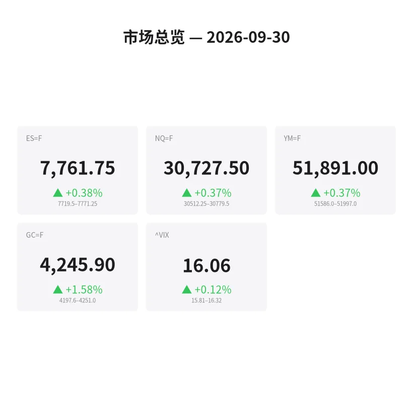
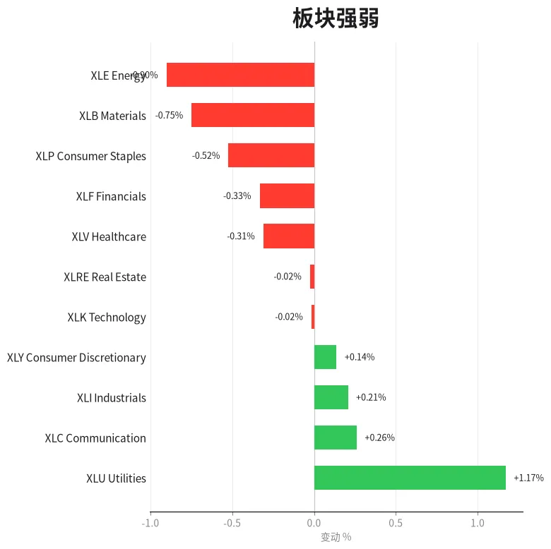
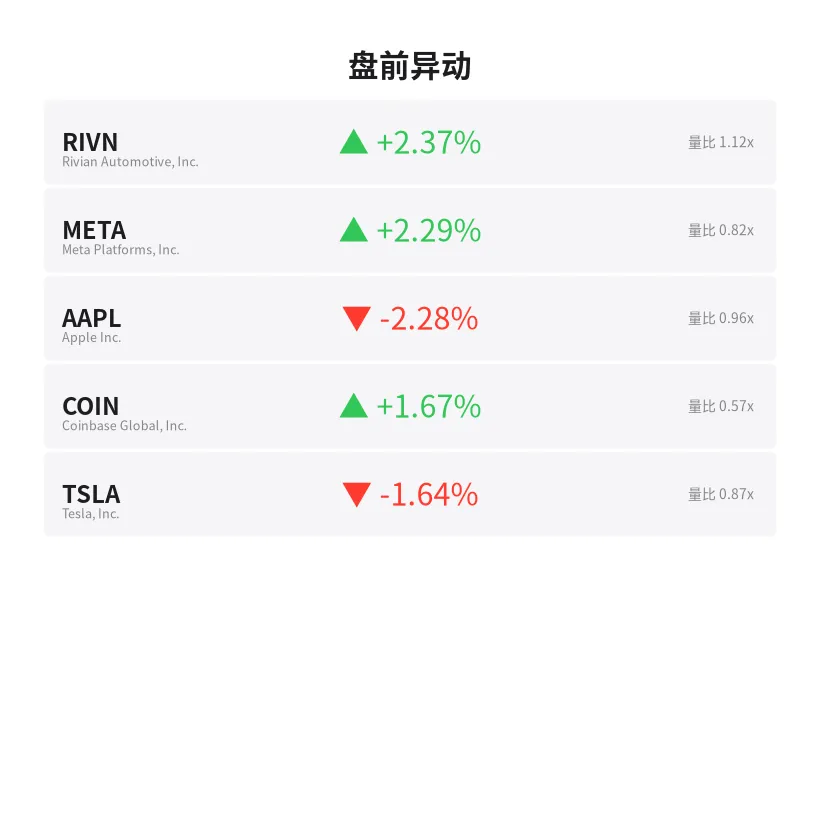
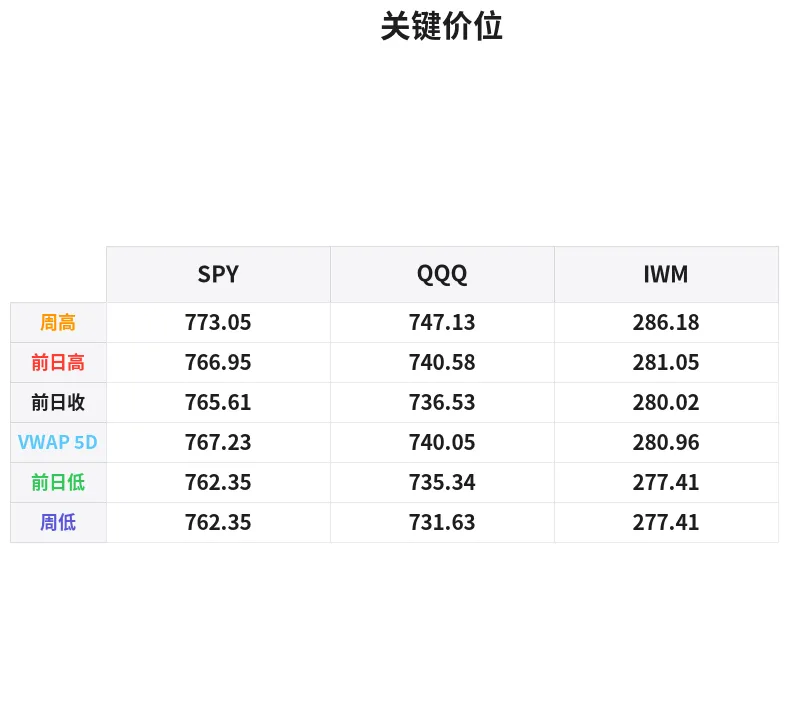

# 盘前分析报告 — 2026-09-30
*生成时间: 12:43:50 UTC*

---
## 数据速览

---
## 一、宏观环境

> [!info]- 详细数据：指数期货 & VIX
> ### 1.1 指数期货 & VIX
> | 品种 | 现价 | 涨跌幅 | 前收 | 日高 | 日低 |
> |------|------|--------|------|------|------|
> | ES=F | 7761.75 | +0.38% | 7732.0 | 7771.25 | 7719.5 |
> | NQ=F | 30727.5 | +0.37% | 30613.25 | 30779.5 | 30512.25 |
> | YM=F | 51891.0 | +0.37% | 51702.0 | 51997.0 | 51586.0 |
> | GC=F | 4245.9 | +1.58% | 4179.7 | 4250.4 | 4197.6 |
> | ^VIX | 16.06 | +0.12% | 16.04 | 16.32 | 15.81 |

> [!info]- 详细数据：隔夜走势
> ### 1.2 隔夜走势（Globex）
> | 品种 | 隔夜高 | 隔夜低 | 区间 | 亚洲高 | 亚洲低 | 欧洲高 | 欧洲低 |
> |------|--------|--------|------|--------|--------|--------|--------|
> | ES=F | 7771.25 | 7719.5 | 51.75 | 7753.25 | 7741.25 | 7756.5 | 7719.5 |
> | NQ=F | 30779.5 | 30512.25 | 267.25 | 30676.5 | 30580.0 | 30707.25 | 30512.25 |
> | YM=F | 51997.0 | 51586.0 | 411.0 | 51925.0 | 51866.0 | 51997.0 | 51586.0 |
> | GC=F | 4251.0 | 4197.6 | 53.4 | 4217.4 | 4197.6 | 4234.0 | 4207.8 |
> | ^VIX | 16.32 | 15.81 | 0.51 | — | — | 16.32 | 15.81 |

> [!info]- 详细数据：板块强弱
> ### 1.3 板块强弱
> | ETF | 板块 | 涨跌幅 |
> |-----|------|--------|
> | XLU | Utilities | +1.17% |
> | XLC | Communication | +0.26% |
> | XLI | Industrials | +0.21% |
> | XLY | Consumer Discretionary | +0.14% |
> | XLK | Technology | -0.02% |
> | XLRE | Real Estate | -0.02% |
> | XLV | Healthcare | -0.31% |
> | XLF | Financials | -0.33% |
> | XLP | Consumer Staples | -0.52% |
> | XLB | Materials | -0.75% |
> | XLE | Energy | -0.90% |

---
## 二、消息面

- **5只国际ETF在2026年涨幅至少20%，跑赢标普500** — *Zacks*
  > 5 International ETFs Up at Least 20% in 2026 & Beating the S&P 500
- **9只股票在9个月内将10万美元变成1880万美元** — *Investor’s Business Daily*
  > 9 Stocks Turn $100,000 to $18.8 Million In 9 Months
- **Netflix持续下跌：一位华尔街分析师为何坚信90%的上涨空间等待今日买家** — *24/7 Wall St.*
  > Netflix Just Keeps Falling: Here’s Why One Wall Street Pro Remains Resolute That 90% Await Today’s Buyers
- **特斯拉在Roadster上重演其「先宣布再延期」的老套路** — *24/7 Wall St.*
  > Tesla Is Running Their Old Announce And Delay Playbook With The Roadster
- **纳斯达克期货为何盘前上涨？MU、TSLA、CAPR、VNDA、ASTS、HOOD、BA受关注** — *Stocktwits*
  > Why Are Nasdaq Futures Rising Premarket? MU, TSLA, CAPR, VNDA, ASTS, HOOD, BA Stocks In Focus
- **富国银行警告利率可能持续高企至2027年** — *GuruFocus.com*
  > Wells Fargo Warns Rates Could Stay Higher Through 2027
- **OpenAI估值瞄准1.4万亿，Anthropic冲刺2万亿美元IPO** — *GuruFocus.com*
  > OpenAI Eyes $1.4 Trillion as Anthropic Heads for $2 Trillion IPO
- **今日股市：道指在关键通胀数据前波动；美光业绩待公布** — *Investor’s Business Daily*
  > Stock Market Today: Dow Wavers Ahead Of Key Inflation Data; Micron Report Due (Live Coverage)
- **9月消费者信心指数下滑：值得关注的ETF** — *Zacks*
  > Consumer Sentiment Drops in September: ETFs to Consider
- **FedWatch的Ben Emons预计10年期美债收益率将在2027年1月触及6%——警告可能令房市「陷入困境」并拖累经济** — *Stocktwits*
  > FedWatch’s Ben Emons Sees 10-Year Treasury Yield Hitting 6% By January 2027 — Warns It Could Put Housing ‘In A Crunch’ And Slow The Economy
- **股债「诡异」背离的背后原因及可能的转折点** — *Barrons.com*
  > What’s Behind the ‘Weird’ Divergence in Stocks and Bonds and What Could Change It
- **债市担忧缓解，恐慌指数回落** — *Barrons.com*
  > Stock Market Fear Index Slides as Bond Worries Ease
- **⚡ 快讯：债市波动率飙升，向投资者发出新风险信号** — *The Wall Street Journal*
  > ⚡ Flash Heard: Surge in Bond-Market Volatility Signals New Risks for Investors
- **Arizona Gold & Silver在费城项目报告大范围金矿截获及高品位矿化带** — *Proactive*
  > Arizona Gold & Silver reports broad gold intercepts with higher-grade zones at Philadelphia
- **泛美白银瞄准La Colorada增长，同时提升股东回报** — *MarketBeat*
  > Pan American Silver Targets La Colorada Growth While Boosting Shareholder Returns
- **白银已跌去近半市值——是什么打破了贵金属交易格局** — *24/7 Wall St.*
  > Silver Has Now Lost Nearly Half Its Value. Here’s What Broke the Metals Trade
- **黄金刚经历两个多月来最差单日表现，GLD较高点回落26%** — *24/7 Wall St.*
  > Gold Just Had Its Worst Day in Over Two Months. GLD Is Now 26% Off Its High
- **今日白银价格（9月30日周三）：白银今晨上涨空间有限** — *Yahoo Personal Finance*
  > Silver price today, Wednesday, September 30, 2026: Silver prices find little room to rise this morning
- **今日股市：道指首次收于52000点上方，标普500和纳斯达克受科技股提振齐涨** — *Yahoo Finance*
  > Stock market today: Dow closes above 52,000 for first time, S&P 500 and Nasdaq rally as tech gains
- **今日股市：AI恐慌施压科技股，标普500和纳斯达克终结两周连涨** — *Yahoo Finance*
  > Stock market today: S&P 500, Nasdaq snap 2-week win streak as AI jitters pressure tech

---
## 三、盘前异动

> [!info]- 详细数据：盘前异动
> | 代码 | 名称 | 现价 | 缺口 | 量比 |
> |------|------|------|------|------|
> | RIVN | Rivian Automotive, Inc. | 15.14 | +2.37% | 1.12x |
> | META | Meta Platforms, Inc. | 732.0 | +2.29% | 0.82x |
> | AAPL | Apple Inc. | 330.68 | -2.28% | 0.96x |
> | COIN | Coinbase Global, Inc. | 195.0 | +1.67% | 0.57x |
> | TSLA | Tesla, Inc. | 351.58 | -1.64% | 0.87x |

---
## 四、关键价位

> [!info]- 详细数据：SPY 关键价位
> ### SPY
> | 价位类型 | 价格 |
> |----------|------|
> | Prior Day High | 766.95 |
> | Prior Day Low | 762.35 |
> | Prior Day Close | 765.61 |
> | Premarket Price | 767.451 |
> | Approx Vwap 5D | 767.23 |
> | Weekly High | 773.05 |
> | Weekly Low | 762.35 |

> [!info]- 详细数据：QQQ 关键价位
> ### QQQ
> | 价位类型 | 价格 |
> |----------|------|
> | Prior Day High | 740.5799 |
> | Prior Day Low | 735.34 |
> | Prior Day Close | 736.53 |
> | Premarket Price | 740.9108 |
> | Approx Vwap 5D | 740.05 |
> | Weekly High | 747.13 |
> | Weekly Low | 731.63 |

> [!info]- 详细数据：IWM 关键价位
> ### IWM
> | 价位类型 | 价格 |
> |----------|------|
> | Prior Day High | 281.05 |
> | Prior Day Low | 277.41 |
> | Prior Day Close | 280.02 |
> | Premarket Price | 280.64 |
> | Approx Vwap 5D | 280.96 |
> | Weekly High | 286.18 |
> | Weekly Low | 277.41 |

---
## 五、AI 技术分析 & 操盘建议

## 第一部分：隔夜市场回顾

### 亚洲时段
- ES在亚洲时段交投区间为7741.25–7753.25，仅12点窄幅震荡，表现出明显的观望情绪。NQ区间96.5点（30580–30676.5），同样窄幅。GC在4197.6–4217.4之间运行，亚洲时段金价尚未启动。
- 亚洲时段整体偏安静，交易员在等待欧洲开盘方向。

### 欧洲时段
- 欧洲开盘后ES一度扩展至7756.5高点，但随后回踩至7719.5（隔夜低点），形成51.75点的完整Globex区间。NQ欧洲时段下探至30512.25（隔夜低点）后反弹至30707.25，波幅接近200点，说明欧盘流动性注入后引发一波多空争夺。
- GC在欧洲时段明显走强，从4207.8拉升至4234.0，随后美盘前继续加速至4250.4附近，日内涨幅+1.58%。黄金的强势与债市波动率飙升（WSJ快讯）以及10Y收益率可能触及6%的预警相呼应——资金正涌入黄金避险。
- YM欧洲时段波幅最大，低点51586到高点51997，411点区间，道指首次收于52000上方的历史新高效应尚在延续。

### 对美盘的含义
- 隔夜走势呈现「先跌后涨」的V型结构，欧盘低点已被买盘吸收。盘前ES报7761.75（+0.38%），NQ报30727.5（+0.37%），均在Globex高点附近，多头掌握短期主动权。
- VIX 16.06基本持平，恐慌指数回落（Barron's报道），但债市波动率飙升是潜在隐患。今日关键通胀数据将决定方向——数据若超预期，10Y收益率上行恐惧可能打压科技股；数据若温和，多头将继续推升至历史新高。
- 板块分化明显：公用事业（XLU +1.17%）领涨，能源（XLE -0.90%）和材料（XLB -0.75%）垫底，呈现典型的防御型轮动格局。

---
## 第二部分：期货品种分析

### ES（E-mini S&P 500） — 现价 7761.75

**多时间框架分析：**
- **日线**：道指首次收于52000上方，ES处于历史高位区域运行。趋势明确偏多，但连续上行后需警惕获利回吐。
- **4H**：自Globex低点7719.5反弹至7771.25高点后盘前回踩，目前在7760附近。4H结构偏多，高点低点逐步抬升。
- **1H/15min**：盘前价格运行在Globex区间上半部分，7750为短期多空分水岭。

**关键价位：**
| 类型 | 价格 | 说明 |
|------|------|------|
| Globex高点 | 7771.25 | 首个上方阻力 |
| Globex低点 | 7719.5 | 关键支撑（欧盘低点） |
| 亚洲高点 | 7753.25 | 盘中支撑参考 |
| 亚洲低点 | 7741.25 | 多头最后防线之一 |
| 心理整数关 | 7800 | 突破目标 |
| 前收 | 7732.0 | 日内回踩极限 |

**方向偏见：** 偏多 | **置信度：** 65%（受通胀数据不确定性压制）

**交易计划：**
- **做多方案A（回踩做多）**：等待回踩7745–7750区域（亚洲高点附近），确认买盘承接后入场做多。止损7735（亚洲低点下方）。T1: 7771（Globex高点），T2: 7790–7800。
- **做多方案B（突破做多）**：突破7771.25并回踩确认，入场做多。止损7758。T1: 7790，T2: 7810。
- **做空方案（防守型）**：若跌破7719.5（Globex低点）并回抽不过，入场做空。止损7730。T1: 7700，T2: 7680。
- **失效条件**：若数据公布后ES在7740–7770之间来回扫荡无方向，暂停交易等待方向明确。

---
### NQ（E-mini Nasdaq 100） — 现价 30727.5

**多时间框架分析：**
- **日线**：NQ处于历史高位区域，但AI恐慌（Yahoo Finance报道）对科技股形成压制。相比ES，NQ上行动能略弱。
- **4H**：Globex区间267.25点，波幅大于ES（按比例），说明科技股分歧更大。
- **1H/15min**：盘前价格在30700附近，接近Globex上半段，但距离高点30779.5仍有距离。

**关键价位：**
| 类型 | 价格 | 说明 |
|------|------|------|
| Globex高点 | 30779.5 | 关键阻力 |
| Globex低点 | 30512.25 | 强支撑 |
| 亚洲高点 | 30676.5 | 盘中参考 |
| 欧洲高点 | 30707.25 | 当前争夺区 |
| 整数关口 | 31000 | 心理阻力 |
| 前收 | 30613.25 | 日内回踩关键 |

**方向偏见：** 偏多但谨慎 | **置信度：** 55%（AI板块和通胀数据双重不确定性）

**交易计划：**
- **做多方案**：回踩30620–30660区域（前收至亚洲高点），确认支撑后做多。止损30570（亚洲低点下方）。T1: 30780（Globex高点），T2: 30900。
- **做空方案**：若开盘跌破30600（前收下方），回抽不过30620，做空。止损30670。T1: 30512（Globex低点），T2: 30400。
- **失效条件**：通胀数据超预期导致NQ快速跌穿30500，此时不抄底，等待企稳信号。

---
### GC（黄金期货） — 现价 4245.9

**多时间框架分析：**
- **日线**：GC今日+1.58%，是三大品种中最强的。新闻面上黄金「最差单日后反弹」+债市波动飙升+10Y收益率恐慌=强烈的避险买盘。GLD虽较高点回落26%，但当前正在修复。
- **4H**：从4197.6低点一路上行至4250.4，日内完整的单边多头走势，4H趋势极度偏多。
- **1H/15min**：价格在4245附近高位盘整，距离日高4250.4仅5点，随时可能突破。

**关键价位：**
| 类型 | 价格 | 说明 |
|------|------|------|
| 日高/Globex高点 | 4250.4–4251.0 | 当前阻力 |
| 欧洲高点 | 4234.0 | 回踩支撑 |
| 亚洲高点 | 4217.4 | 强支撑 |
| Globex低点 | 4197.6 | 日内极限支撑 |
| 前收 | 4179.7 | 趋势翻转位 |
| 整数关口 | 4300 | 突破目标 |

**方向偏见：** 强烈偏多 | **置信度：** 75%（避险需求+技术面共振）

**交易计划：**
- **做多方案A（突破做多）**：突破4251并站稳，入场做多。止损4238（欧洲高点上方）。T1: 4270，T2: 4290–4300。
- **做多方案B（回踩做多）**：回踩4230–4235区域（欧洲高点附近），确认买盘后做多。止损4220。T1: 4250，T2: 4275。
- **做空方案（逆势）**：仅在跌破4217（亚洲高点）且回抽不过时考虑做空。止损4228。T1: 4200，T2: 4180。
- **失效条件**：通胀数据大幅低于预期（利率下行预期增强），GC可能出现「利好出尽」的获利回吐，但预计跌幅有限。

---
## 第三部分：ETF品种分析

### SPY — 盘前价 767.45

**关键价位：**
| 类型 | 价格 | 说明 |
|------|------|------|
| 周高 | 773.05 | 上方第一目标/阻力 |
| 盘前价 | 767.45 | 开盘参考 |
| 5日VWAP | 767.23 | 多空分水岭 |
| 前日高 | 766.95 | 盘中支撑 |
| 前日收 | 765.61 | 回踩关键 |
| 前日低 | 762.35 / 周低 | 强支撑 |

**分析：**
- SPY盘前报767.45，略高于5日VWAP（767.23）和前日高（766.95），多头占据微弱优势。
- 道指首次收于52000上方对SPY形成正面带动，但涨幅有限（+0.38%），说明市场在通胀数据前保持谨慎。
- 板块层面：XLU领涨（+1.17%）而XLE垫底（-0.90%），防御板块轮动不利于SPY大幅突破。AAPL盘前-2.28%是主要拖累。

**交易计划：**
- **做多方案**：开盘站稳767（5日VWAP上方），回踩766.50–767.00区域不破即做多。止损765.50（前日收下方）。T1: 770，T2: 773（周高）。
- **做空方案**：若开盘跌破766（前日高下方）并回抽不过767，做空。止损768。T1: 764，T2: 762.35（前日低/周低）。
- **注意**：AAPL（-2.28%）和META（+2.29%）盘前分化严重，SPY内部可能出现拉锯，注意成交量确认方向。

---
### QQQ — 盘前价 740.91

**关键价位：**
| 类型 | 价格 | 说明 |
|------|------|------|
| 周高 | 747.13 | 上方强阻力 |
| 盘前价 | 740.91 | 开盘参考 |
| 前日高 | 740.58 | 当前争夺区 |
| 5日VWAP | 740.05 | 多空分水岭 |
| 前日收 | 736.53 | 日内关键支撑 |
| 前日低 | 735.34 | 强支撑 |
| 周低 | 731.63 | 极限支撑 |

**分析：**
- QQQ盘前740.91，刚好在前日高（740.58）上方，试探性反弹。5日VWAP在740.05，价格紧贴VWAP运行。
- AI恐慌（纳斯达克终结两周连涨的报道）和AAPL盘前-2.28%对QQQ构成压力，但META +2.29%、TSLA盘前虽-1.64%但消息面活跃（Roadster/机器人概念），科技股分化明显。
- 相比SPY，QQQ对通胀数据更敏感——若10Y收益率因通胀数据上行，成长股估值压力首当其冲。

**交易计划：**
- **做多方案**：站稳741（前日高上方），回踩740–740.50区域（VWAP附近）做多。止损739。T1: 743，T2: 747（周高）。
- **做空方案**：若开盘跌破740（VWAP下方），回抽不过740.50做空。止损741.50。T1: 737，T2: 735（前日低）。
- **注意**：QQQ波动率高于SPY，建议仓位缩小10–15%。通胀数据公布时段（通常8:30 ET）避免持仓。

---
## 第四部分：今日市场总览

### 整体情绪评估
**偏多但谨慎** — 道指历史新高+ES/NQ盘前小涨提供多头基础，但通胀数据+债市波动+AI恐慌三重不确定性压制上行空间。今日是典型的「数据驱动日」，开盘前半小时的方向可能在数据公布时被逆转。

### VIX 分析
- VIX 16.06（+0.12%），几乎未动。隔夜区间15.81–16.32，属于低波动环境。
- Barron's报道恐慌指数回落，但WSJ报道债市波动率飙升——这种「股市VIX平静+债市MOVE飙升」的背离值得高度警惕。历史上这种背离往往以股市VIX补涨告终。
- 若VIX日内突破17，意味着市场开始定价新的风险，此时应缩减仓位。

### 需要回避的时间窗口
1. **8:30 ET（通胀数据公布）**：关键风险时刻，数据公布前后15分钟建议空仓。
2. **9:30–10:00 ET（开盘前30分钟）**：流动性注入期，价格波动剧烈，等待方向确认。
3. **14:00–15:00 ET（尾盘机构调仓）**：月末+季末再平衡窗口（9月30日为Q3最后一个交易日），可能出现异常大单和方向逆转。

### 板块轮动解读
- **领涨**：XLU（公用事业 +1.17%）—— 典型的防御性配置，说明大资金在为可能的波动做准备。
- **跟涨**：XLC（通信 +0.26%）、XLI（工业 +0.21%）、XLY（可选消费 +0.14%）—— 涨幅有限，观望为主。
- **持平/微弱**：XLK（科技 -0.02%）、XLRE（房地产 -0.02%）—— 科技板块被AAPL拖累，房地产受利率预期压制。
- **落后**：XLV（医疗 -0.31%）、XLF（金融 -0.33%）、XLP（消费必需 -0.52%）、XLB（材料 -0.75%）、XLE（能源 -0.90%）。
- **结论**：防御型轮动+能源材料走弱=机构在降低风险敞口。如果通胀数据打消加息恐惧，可能触发「风险回归」反弹；反之则强化防御趋势。

### 特别关注
- **季末再平衡**：今日是Q3最后一个交易日，养老金和共同基金的季末再平衡可能在尾盘带来异常流量。历史上Q3末的再平衡倾向于卖出涨幅最大的板块（科技）买入落后板块。
- **AAPL -2.28%**：作为SPY/QQQ最大权重之一，苹果的下跌将持续拖累指数。关注是否有具体利空催化。
- **GC强势**：黄金+1.58%的强势与指数微涨并存，暗示避险资金正在悄悄建仓，这种格局不支持指数大幅上行。

---
### 🎯 核心操盘论点

> **今日是Q3最后一个交易日，通胀数据决定方向。多头基础尚在（道指新高+盘前微涨），但债市波动飙升+防御板块领涨+黄金强势=机构正在对冲下行风险。策略：数据前轻仓或空仓，数据后顺势操作，首选ES回踩做多（7745–7750），GC突破4251做多为当日最高置信度交易。严格回避8:30 ET数据窗口和尾盘再平衡时段。**
