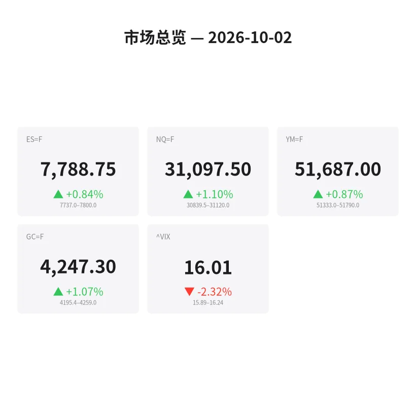
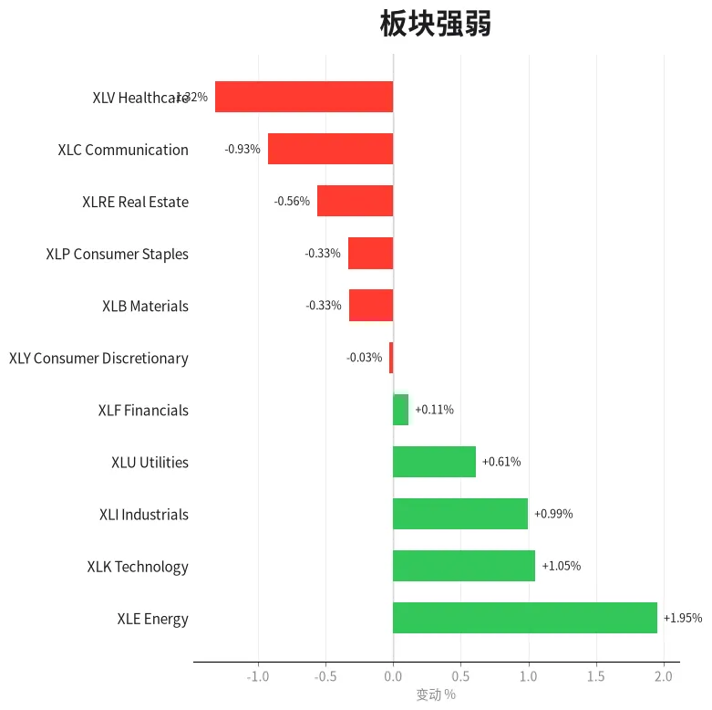
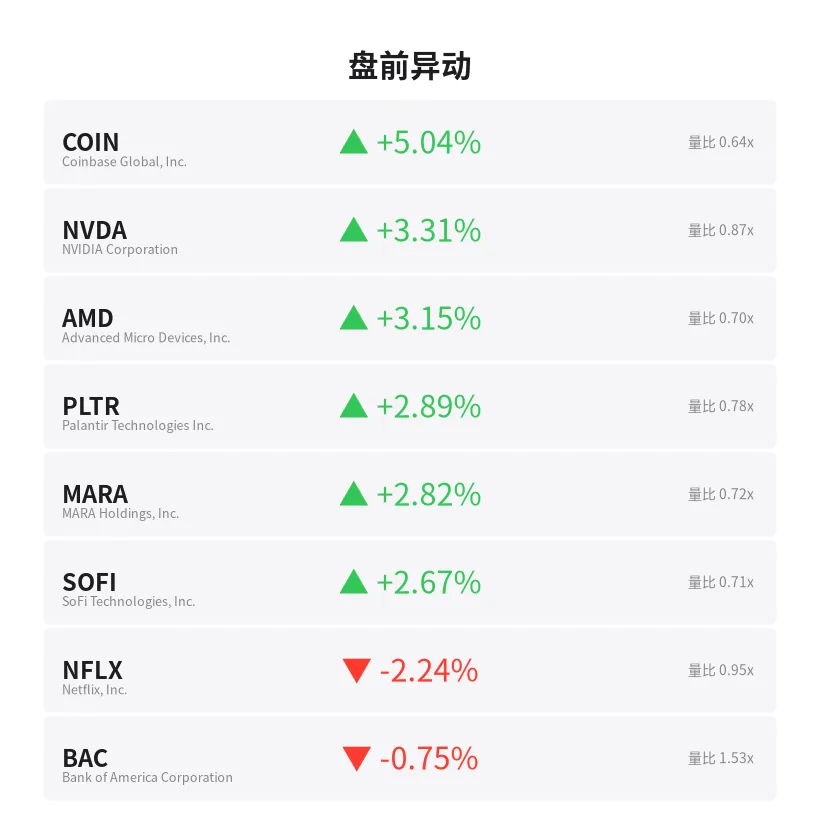
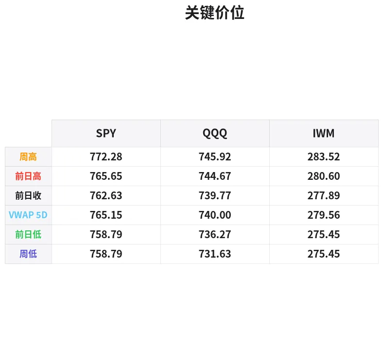

# 盘前分析报告 — 2026-10-02
*生成时间: 12:44:45 UTC*

---
## 数据速览

---
## 一、宏观环境

> [!info]- 详细数据：指数期货 & VIX
> ### 1.1 指数期货 & VIX
> | 品种 | 现价 | 涨跌幅 | 前收 | 日高 | 日低 |
> |------|------|--------|------|------|------|
> | ES=F | 7788.75 | +0.84% | 7724.0 | 7800.0 | 7723.25 |
> | NQ=F | 31097.5 | +1.10% | 30760.5 | 31105.5 | 30760.25 |
> | YM=F | 51687.0 | +0.87% | 51241.0 | 51777.0 | 51208.0 |
> | GC=F | 4247.3 | +1.07% | 4202.3 | 4255.9 | 4162.9 |
> | ^VIX | 16.01 | -2.32% | 16.39 | 16.24 | 15.89 |

> [!info]- 详细数据：隔夜走势
> ### 1.2 隔夜走势（Globex）
> | 品种 | 隔夜高 | 隔夜低 | 区间 | 亚洲高 | 亚洲低 | 欧洲高 | 欧洲低 |
> |------|--------|--------|------|--------|--------|--------|--------|
> | ES=F | 7800.0 | 7737.0 | 63.0 | 7754.25 | 7743.0 | 7765.75 | 7737.0 |
> | NQ=F | 31120.0 | 30839.5 | 280.5 | 30935.75 | 30864.25 | 31035.5 | 30839.5 |
> | YM=F | 51790.0 | 51333.0 | 457.0 | 51422.0 | 51352.0 | 51561.0 | 51333.0 |
> | GC=F | 4259.0 | 4195.4 | 63.6 | 4222.3 | 4207.2 | 4226.8 | 4195.4 |
> | ^VIX | 16.24 | 15.89 | 0.35 | — | — | 16.24 | 15.89 |

> [!info]- 详细数据：板块强弱
> ### 1.3 板块强弱
> | ETF | 板块 | 涨跌幅 |
> |-----|------|--------|
> | XLE | Energy | +1.95% |
> | XLK | Technology | +1.05% |
> | XLI | Industrials | +0.99% |
> | XLU | Utilities | +0.61% |
> | XLF | Financials | +0.11% |
> | XLY | Consumer Discretionary | -0.03% |
> | XLB | Materials | -0.33% |
> | XLP | Consumer Staples | -0.33% |
> | XLRE | Real Estate | -0.56% |
> | XLC | Communication | -0.93% |
> | XLV | Healthcare | -1.32% |

---
## 三、盘前异动

> [!info]- 详细数据：盘前异动
> | 代码 | 名称 | 现价 | 缺口 | 量比 |
> |------|------|------|------|------|
> | COIN | Coinbase Global, Inc. | 195.8 | +5.04% | 0.64x |
> | NVDA | NVIDIA Corporation | 235.95 | +3.31% | 0.87x |
> | AMD | Advanced Micro Devices, Inc. | 631.06 | +3.15% | 0.7x |
> | PLTR | Palantir Technologies Inc. | 192.46 | +2.89% | 0.78x |
> | MARA | MARA Holdings, Inc. | 11.65 | +2.82% | 0.72x |
> | SOFI | SoFi Technologies, Inc. | 16.14 | +2.67% | 0.71x |
> | NFLX | Netflix, Inc. | 68.02 | -2.24% | 0.95x |
> | BAC | Bank of America Corporation | 54.02 | -0.75% | 1.53x |

---
## 四、关键价位

> [!info]- 详细数据：SPY 关键价位
> ### SPY
> | 价位类型 | 价格 |
> |----------|------|
> | Prior Day High | 765.65 |
> | Prior Day Low | 758.7901 |
> | Prior Day Close | 762.63 |
> | Premarket Price | 770.59 |
> | Approx Vwap 5D | 765.15 |
> | Weekly High | 772.28 |
> | Weekly Low | 758.79 |

> [!info]- 详细数据：QQQ 关键价位
> ### QQQ
> | 价位类型 | 价格 |
> |----------|------|
> | Prior Day High | 744.67 |
> | Prior Day Low | 736.27 |
> | Prior Day Close | 739.77 |
> | Premarket Price | 750.615 |
> | Approx Vwap 5D | 740.0 |
> | Weekly High | 745.92 |
> | Weekly Low | 731.63 |

> [!info]- 详细数据：IWM 关键价位
> ### IWM
> | 价位类型 | 价格 |
> |----------|------|
> | Prior Day High | 280.6 |
> | Prior Day Low | 275.45 |
> | Prior Day Close | 277.89 |
> | Premarket Price | 283.15 |
> | Approx Vwap 5D | 279.56 |
> | Weekly High | 283.52 |
> | Weekly Low | 275.45 |

---
## 五、AI 技术分析 & 操盘建议

## 第一部分：隔夜市场回顾

### 亚洲时段（约 18:00–02:00 ET）

亚洲时段整体窄幅震荡偏弱。ES 在 7743–7754 区间内横盘，NQ 在 30864–30936 之间徘徊，显示亚洲资金入场意愿不强，以观望为主。黄金（GC）在 4207–4222 区间小幅震荡，延续近期的高位盘整。亚洲时段的成交量偏低，未形成有效突破方向。

**关键信号**：亚洲时段低波动率通常预示欧洲时段可能出现方向性选择。GC 在亚洲时段守住 4200 整数关口表明多头底部支撑仍然稳固。

### 欧洲时段（约 02:00–09:30 ET）

欧洲开盘后市场出现明显下探后反弹格局。ES 先测试 7737 低点（欧洲时段低点），随后买盘介入强力拉升至 7788+。NQ 出现类似走势——下探 30840 后反弹超 250 点至 31100 上方，展现出科技板块的强势领涨特征。

**值得关注的是**：VIX 从 16.24 回落至 15.89（-2.32%），显示市场恐慌情绪显著降温。隔夜波动区间（ES 63 点，NQ 280 点）在合理范围内，说明市场虽有波动但并未出现恐慌性抛售。

### 对美盘的影响

1. **多头占优**：欧洲时段低点被快速收复并创出隔夜新高，V 型反转结构完整
2. **板块轮动健康**：科技（XLK +1.05%）和能源（XLE +1.95%）同步走强，非单一板块驱动
3. **风险偏好回升**：VIX 跌破 16 关口，COIN/NVDA/AMD 等高贝塔标的大幅跳空高开
4. **潜在风险**：ES/NQ 已接近隔夜高点附近（7800/31120），开盘后需关注这些位置是否构成短期阻力

## 第二部分：期货品种分析

### ES（E-mini S&P 500 期货）— 现价 7788.75

**多周期分析**：
- **日线**：昨日收盘 7724，今日隔夜跳空高开并维持在前高上方。日线级别处于上升趋势中继，前日高低区间 7723–7800 已被完全覆盖。
- **4H**：隔夜 V 型反转形成看涨吞没形态，7737（欧洲低点）构成强支撑位。
- **1H/15m**：价格运行在隔夜区间上沿（7788–7800），短线动能偏强但接近阻力区。

**关键价位**：
| 类型 | 价位 | 说明 |
|------|------|------|
| 强阻力 | 7800–7810 | 隔夜高点 + 整数关口 |
| 弱阻力 | 7790 | 盘前整理高点 |
| 枢轴点 | 7766 | 隔夜中值 (VPOC 区域) |
| 支撑一 | 7754 | 亚洲时段高点 |
| 强支撑 | 7737–7743 | 欧洲低点 + 亚洲低点密集区 |
| 极端支撑 | 7723–7724 | 日低 + 前收盘 |

**方向偏多** | 置信度：⭐⭐⭐⭐ (75%)

**交易计划**：
- **场景 A（优选）回踩做多**：开盘后回踩 7766–7754 区域企稳后做多，止损 7737 下方（约 7732），目标 T1: 7800，T2: 7825（日内新高延伸）
- **场景 B（突破追多）**：放量突破 7800 并站稳 5 分钟以上，追多至 T1: 7825，T2: 7850，止损 7785
- **失效条件**：若跌破 7737 并放量下行，则隔夜反转失败，需反手做空看 7724–7700

---

### NQ（E-mini Nasdaq 100 期货）— 现价 31097.5

**多周期分析**：
- **日线**：强势突破前高 30760 后加速上行，科技股领涨（XLK +1.05%，NVDA +3.3%，AMD +3.2%）。
- **4H**：隔夜 280 点大区间，V 型反转结构明确，买盘控制力强。
- **1H/15m**：接近隔夜高点 31120，短线可能出现小幅回调整理。

**关键价位**：
| 类型 | 价位 | 说明 |
|------|------|------|
| 强阻力 | 31100–31120 | 隔夜高点 |
| 弱阻力 | 31050 | 盘前整理区域 |
| 枢轴点 | 30980 | 隔夜中值 |
| 支撑一 | 30935 | 亚洲时段高点 |
| 强支撑 | 30839–30864 | 欧洲低点 + 亚洲低点 |
| 极端支撑 | 30760 | 前收盘 + 日低 |

**方向偏多** | 置信度：⭐⭐⭐⭐ (78%)

**交易计划**：
- **场景 A（优选）回踩做多**：回踩 30980–30935 区域企稳做多，止损 30830 下方，T1: 31120，T2: 31250
- **场景 B（突破追多）**：突破 31120 并站稳，追多至 T1: 31250，T2: 31400，止损 31050
- **失效条件**：跌破 30839 则隔夜 V 型结构破坏，需观望或反手做空看 30760

---

### GC（黄金期货）— 现价 4247.3

**多周期分析**：
- **日线**：延续多头趋势，从 4162 低点大幅反弹至 4255 区域。日线级别维持上升通道。
- **4H**：隔夜区间 4195–4259，波幅 63 点。欧洲时段触及低点 4195 后强力反弹，V 型结构。
- **1H/15m**：接近隔夜高点 4255–4259 区域，短线动能强劲但进入阻力密集区。

**关键价位**：
| 类型 | 价位 | 说明 |
|------|------|------|
| 强阻力 | 4255–4259 | 隔夜高点 |
| 心理关口 | 4250 | 整数关口 |
| 枢轴点 | 4227 | 隔夜中值 |
| 支撑一 | 4222 | 亚洲高点 |
| 强支撑 | 4195–4207 | 欧洲低点 + 亚洲低点 |
| 极端支撑 | 4162–4163 | 日低 |

**方向偏多** | 置信度：⭐⭐⭐⭐ (72%)

**交易计划**：
- **场景 A（优选）回踩做多**：回踩 4227–4222 区域企稳做多，止损 4195 下方（约 4190），T1: 4255，T2: 4280
- **场景 B（突破追多）**：突破 4259 站稳，追多至 T1: 4280，T2: 4300，止损 4240
- **失效条件**：跌破 4195 则日内转弱，可能重新测试 4162 日低

## 第三部分：ETF品种分析

### SPY（SPDR S&P 500 ETF）— 盘前 770.59

**关键价位**：
| 类型 | 价位 | 说明 |
|------|------|------|
| 周高 / 强阻力 | 772.28 | 本周高点，突破则打开上行空间 |
| 盘前价 | 770.59 | 当前盘前交易价 |
| 前日高 | 765.65 | 昨日高点（今日支撑） |
| 5日 VWAP | 765.15 | 五日成交量加权均价 |
| 前收盘 | 762.63 | 昨日收盘 |
| 前日低 / 周低 | 758.79 | 昨日低点 = 本周低点 |

**分析**：
SPY 盘前跳空高开至 770.59，已突破前日高点（765.65）和 5 日 VWAP（765.15），显示强势买盘。跳空缺口（762.63→770.59）约 +1.04%，属于中等力度跳空。

**交易计划**：
- **做多优选**：回踩 766–765 区域（前日高 + 5D VWAP 汇合点）企稳做多，止损 763 下方，T1: 770，T2: 772.30（周高）
- **突破追多**：突破 772.30 站稳做多，T1: 775，T2: 778
- **做空条件**：开盘后 15 分钟内快速回补缺口跌破 765，可短线做空至 762.63，但日内偏多不宜恋战

---

### QQQ（Invesco QQQ Trust ETF）— 盘前 750.62

**关键价位**：
| 类型 | 价位 | 说明 |
|------|------|------|
| 盘前价 | 750.62 | 当前盘前交易价（远超周高） |
| 周高 | 745.92 | 本周高点（已被突破） |
| 前日高 | 744.67 | 昨日高点 |
| 5日 VWAP | 740.00 | 五日成交量加权均价 |
| 前收盘 | 739.77 | 昨日收盘 |
| 前日低 | 736.27 | 昨日低点 |
| 周低 | 731.63 | 本周低点 |

**分析**：
QQQ 盘前跳空至 750.62，大幅突破周高 745.92，跳空幅度约 +1.47%（较 SPY 更强）。科技板块领涨（NVDA +3.3%，AMD +3.2%）推动 QQQ 走势明显强于 SPY。当前已进入无明显阻力区域（价格高于所有近期参考点），需关注整数关口 750 的支撑/阻力转换。

**交易计划**：
- **做多优选**：回踩 746–745 区域（周高变支撑）企稳做多，止损 743 下方，T1: 750，T2: 755
- **突破追多**：在 750 上方整理后放量突破，追多至 T1: 755，T2: 760
- **做空条件**：快速跌破 745 并放量，短线空至 740（5D VWAP），但日内趋势极强不建议逆势做空

## 第四部分：今日市场总览

### 综合市场情绪：偏多（Bullish Bias）

**VIX 分析**：VIX 现报 16.01（-2.32%），跌破 16 整数关口。恐慌指数回落至 16 以下通常意味着市场处于"舒适区"，有利于多头持仓。但需警惕：VIX 处于低位时，任何突发利空可能导致波动率跳升，做好风控。

**市场结构**：
- ES/NQ/YM 三大指数期货同步上涨（+0.84%/+1.10%/+0.87%），走势一致性强
- QQQ 领涨（盘前 +1.47%），NQ 涨幅最大（+1.10%），科技板块主导
- 黄金同步走强（+1.07%），说明资金并非纯风险偏好模式，可能有避险/通胀交易叠加
- IWM 盘前 283.15（较前收 277.89 +1.89%），小盘股参与度高，说明市场广度健康

### 板块轮动解读
- **领涨**：能源（XLE +1.95%）> 科技（XLK +1.05%）> 工业（XLI +0.99%）
- **落后**：医疗（XLV -1.32%）< 通信（XLC -0.93%）< 房地产（XLRE -0.56%）
- **解读**：经典的 "risk-on" 轮动格局。能源领涨可能受原油价格或地缘因素驱动，科技紧随显示成长股偏好回归。防御性板块（医疗、消费必需品）走弱印证风险偏好。

### 需要规避的时间窗口
1. **09:30–09:45 ET（开盘前 15 分钟）**：跳空开盘后的初始定价混乱，等待前 15 分钟 K 线形成后再决策
2. **10:00 ET**：关注是否有重要经济数据发布（ISM 制造业等），可能引发波动
3. **11:30–13:00 ET**：午间低流动性区间，价格易被假突破，建议缩减仓位或观望
4. **15:00–15:15 ET**：尾盘 MOC（Market On Close）订单流可能引发剧烈波动

### ⚡ 核心操盘论点

**今日做多为主，逢低买入。** 隔夜 V 型反转结构完整、VIX 跌破 16、三大指数同步走强、板块轮动健康——共同指向日内偏多格局。重点关注 NQ/QQQ（科技领涨标的），回踩关键支撑位企稳后做多胜率最高。风控重点：守好隔夜低点（ES 7737 / NQ 30839），破位则全面止损观望。
