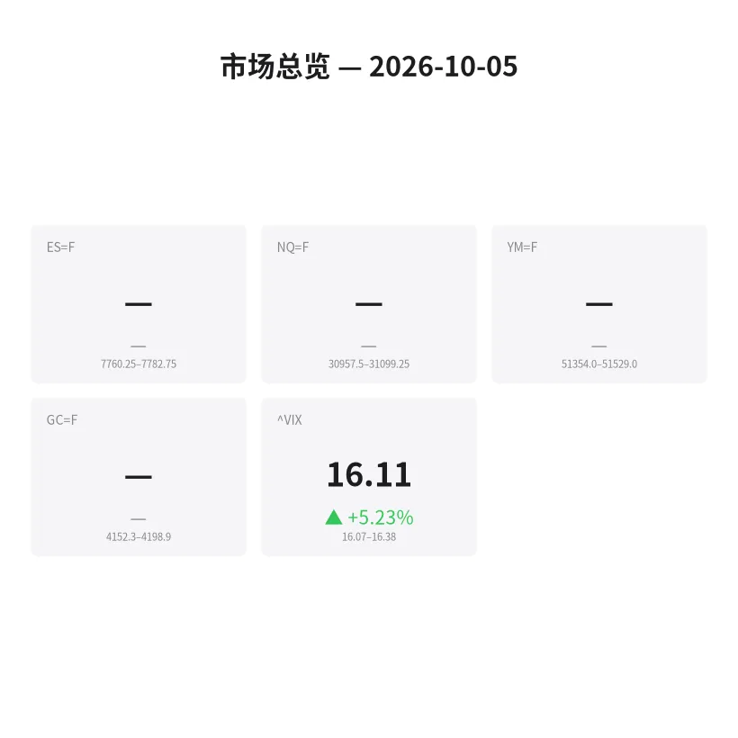
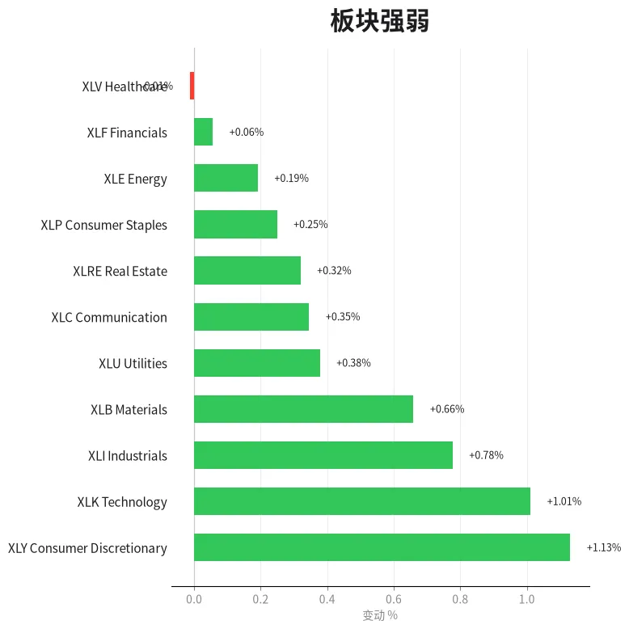
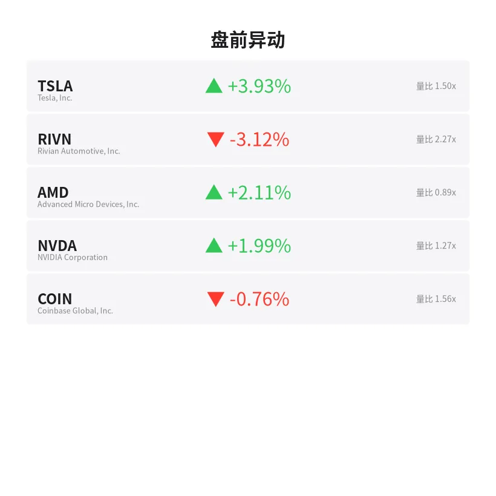
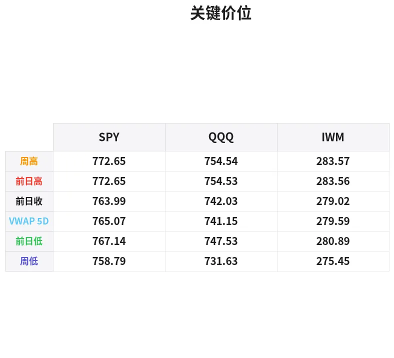

# 盘前分析报告 — 2026-10-05
*生成时间: 12:46:39 UTC*

---
## 数据速览

---
## 一、宏观环境

> [!info]- 详细数据：指数期货 & VIX
> ### 1.1 指数期货 & VIX
> | 品种 | 现价 | 涨跌幅 | 前收 | 日高 | 日低 |
> |------|------|--------|------|------|------|
> | ES=F | None | — | None | None | None |
> | NQ=F | None | — | None | None | None |
> | YM=F | None | — | None | None | None |
> | GC=F | None | — | None | None | None |
> | ^VIX | 16.11 | +5.23% | 15.31 | 16.38 | 16.07 |

> [!info]- 详细数据：隔夜走势
> ### 1.2 隔夜走势（Globex）
> | 品种 | 隔夜高 | 隔夜低 | 区间 | 亚洲高 | 亚洲低 | 欧洲高 | 欧洲低 |
> |------|--------|--------|------|--------|--------|--------|--------|
> | ES=F | 7782.75 | 7760.25 | 22.5 | 7772.25 | 7764.25 | 7782.75 | 7760.25 |
> | NQ=F | 31099.25 | 30957.5 | 141.75 | 31090.5 | 31021.0 | 31099.25 | 30957.5 |
> | YM=F | 51529.0 | 51354.0 | 175.0 | 51430.0 | 51377.0 | 51529.0 | 51354.0 |
> | GC=F | 4198.9 | 4152.3 | 46.6 | 4171.3 | 4152.3 | 4198.9 | 4161.7 |
> | ^VIX | 16.38 | 16.07 | 0.31 | — | — | 16.38 | 16.07 |

> [!info]- 详细数据：板块强弱
> ### 1.3 板块强弱
> | ETF | 板块 | 涨跌幅 |
> |-----|------|--------|
> | XLY | Consumer Discretionary | +1.13% |
> | XLK | Technology | +1.01% |
> | XLI | Industrials | +0.78% |
> | XLB | Materials | +0.66% |
> | XLU | Utilities | +0.38% |
> | XLC | Communication | +0.35% |
> | XLRE | Real Estate | +0.32% |
> | XLP | Consumer Staples | +0.25% |
> | XLE | Energy | +0.19% |
> | XLF | Financials | +0.06% |
> | XLV | Healthcare | -0.01% |

---
## 三、盘前异动

> [!info]- 详细数据：盘前异动
> | 代码 | 名称 | 现价 | 缺口 | 量比 |
> |------|------|------|------|------|
> | TSLA | Tesla, Inc. | 368.02 | +3.93% | 1.5x |
> | RIVN | Rivian Automotive, Inc. | 14.3 | -3.12% | 2.27x |
> | AMD | Advanced Micro Devices, Inc. | 628.69 | +2.11% | 0.89x |
> | NVDA | NVIDIA Corporation | 235.45 | +1.99% | 1.27x |
> | COIN | Coinbase Global, Inc. | 187.85 | -0.76% | 1.56x |

---
## 四、关键价位

> [!info]- 详细数据：SPY 关键价位
> ### SPY
> | 价位类型 | 价格 |
> |----------|------|
> | Prior Day High | 772.65 |
> | Prior Day Low | 767.145 |
> | Prior Day Close | 763.99 |
> | Premarket Price | 768.93 |
> | Approx Vwap 5D | 765.07 |
> | Weekly High | 772.65 |
> | Weekly Low | 758.79 |

> [!info]- 详细数据：QQQ 关键价位
> ### QQQ
> | 价位类型 | 价格 |
> |----------|------|
> | Prior Day High | 754.53 |
> | Prior Day Low | 747.535 |
> | Prior Day Close | 742.03 |
> | Premarket Price | 747.8104 |
> | Approx Vwap 5D | 741.15 |
> | Weekly High | 754.54 |
> | Weekly Low | 731.63 |

> [!info]- 详细数据：IWM 关键价位
> ### IWM
> | 价位类型 | 价格 |
> |----------|------|
> | Prior Day High | 283.565 |
> | Prior Day Low | 280.89 |
> | Prior Day Close | 279.02 |
> | Premarket Price | 281.83 |
> | Approx Vwap 5D | 279.59 |
> | Weekly High | 283.57 |
> | Weekly Low | 275.45 |

---
## 五、AI 技术分析 & 操盘建议

## 第一部分：隔夜市场回顾

### 亚洲时段分析
ES 在亚洲时段窄幅震荡（7764.25–7772.25，仅 8 点区间），显示亚洲资金参与度低，无明显方向选择。NQ 亚洲时段同样维持窄幅整理（31021–31090.5），但相对 ES 区间略宽，暗示科技板块存在一定分歧。黄金在亚洲时段走弱探底至 4152.3（隔夜最低点），显示避险需求暂时降温。

### 欧洲时段分析
欧洲时段波动明显放大：ES 向上突破亚洲区间高点至 7782.75（隔夜新高），同时也下探至 7760.25（隔夜新低），呈现先抑后扬走势，区间扩大至 22.5 点。NQ 欧洲时段同步放量，高点触及 31099.25，低点 30957.5，区间 141.75 点——NQ 波动幅度相对 ES 更大，显示科技板块领涨但也伴随更大回调风险。黄金欧洲时段大幅反弹至 4198.9，从亚洲低点反弹近 47 点，避险情绪明显升温。

### 对美盘的启示
1. **VIX 跳升 5.23% 至 16.11** — 隐含波动率抬升但仍处于中性区域（未破 20），市场预期短期波动加大但未进入恐慌模式
2. 欧洲时段的区间扩大为美盘奠定了较宽的交易区间，关注隔夜高低点是否被突破
3. 黄金的强势反弹暗示部分资金在 risk-off 配置，需警惕美盘开盘后的获利了结压力
4. 板块轮动来看 XLY（+1.13%）和 XLK（+1.01%）领涨，XLV（-0.01%）垫底，风格偏向成长/消费，周期品强于防御品

## 第二部分：期货品种分析

### ES（E-mini S&P 500）
**多时间框架分析：**
- **日线级别：** 上周收于 7760 区域附近，处于近期上升趋势中。VIX 从 15.31 跳升至 16.11，隐含波动率温和抬升
- **4H 级别：** 隔夜在 7760–7783 区间内整理，区间偏窄（22.5 点），等待方向选择
- **1H 级别：** 欧洲时段先下探 7760.25 后反弹至 7782.75，短线偏多

**关键价位：**
| 级别 | 价位 | 备注 |
|------|------|------|
| 隔夜高点（R1） | 7782.75 | 欧洲时段高点，突破看多 |
| 亚洲高点 | 7772.25 | 盘中支撑参考 |
| 亚洲低点 | 7764.25 | 回调第一支撑 |
| 隔夜低点（S1） | 7760.25 | 关键支撑，破位看空 |

**方向偏向：** 震荡偏多 | **置信度：** 60%
- 理由：欧洲时段高点在后半段创出，买方力量占优；但 VIX 跳升和区间偏窄暗示多方底气不足

**交易计划：**
- **做多方案：** 回调至 7764–7768 区域（亚洲区间中下沿）企稳后做多
  - 止损：7758（隔夜低点下方 2 点）
  - T1：7783（隔夜高点）| T2：7795（隔夜高点上方延伸）
  - 失效条件：跌破 7758 并持续运行在 7755 下方
- **做空方案：** 若开盘后冲高 7783–7790 未能突破、出现明显反转 K 线，可短线做空
  - 止损：7798
  - T1：7768 | T2：7760

---

### NQ（E-mini Nasdaq 100）
**多时间框架分析：**
- **日线级别：** NQ 处于强势上升趋势中，科技板块 XLK +1.01% 确认领涨
- **4H 级别：** 隔夜区间 30957.5–31099.25（141.75 点），波动幅度显著大于 ES，Beta 效应明显
- **1H 级别：** 欧洲时段创隔夜新高后回落，短线动能偏多但有分歧

**关键价位：**
| 级别 | 价位 | 备注 |
|------|------|------|
| 隔夜高点（R1） | 31099.25 | 突破看 31200+ |
| 亚洲高点 | 31090.5 | 盘中阻力参考 |
| 心理整数位 | 31000 | 重要心理关口 |
| 亚洲低点 | 31021.0 | 回调第一支撑 |
| 隔夜低点（S1） | 30957.5 | 关键支撑 |

**方向偏向：** 震荡偏多 | **置信度：** 55%
- 理由：NVDA +1.99%、AMD +2.11% 盘前走强支撑科技股，但 NQ 波动幅度大，回调风险高于 ES

**交易计划：**
- **做多方案：** 回调至 31000–31030 区域（心理关口+亚洲低点上方）企稳做多
  - 止损：30940（隔夜低点下方 17 点）
  - T1：31100（隔夜高点）| T2：31200
  - 失效条件：跌破 30940 并在 30900 下方运行
- **做空方案：** 冲高 31100–31130 受阻反转可短空
  - 止损：31160
  - T1：31020 | T2：30960

---

### GC（COMEX 黄金）
**多时间框架分析：**
- **日线级别：** 黄金近期处于高位整理阶段，4150–4200 区间反复震荡
- **4H 级别：** 隔夜波动显著（46.6 点区间），亚洲探底 4152.3 后欧洲大幅反弹至 4198.9
- **1H 级别：** 从亚洲低点 4152 反弹近 47 点，短线多头动能极强，但接近前高阻力

**关键价位：**
| 级别 | 价位 | 备注 |
|------|------|------|
| 隔夜高点（R1） | 4198.9 | 接近 4200 整数关口，强阻力 |
| 心理关口 | 4200.0 | 突破看 4220–4240 |
| 欧洲低点 | 4161.7 | 盘中支撑 |
| 亚洲低点 / 隔夜低点 | 4152.3 | 关键支撑，破位看 4130 |

**方向偏向：** 震荡偏多 | **置信度：** 65%
- 理由：欧洲时段强势反弹+VIX 上升利好避险资产；但 4200 整数关口阻力较大

**交易计划：**
- **做多方案：** 回调至 4170–4180 区域企稳做多（欧洲低点上方）
  - 止损：4158（亚洲低点上方 6 点缓冲）
  - T1：4199（隔夜高点）| T2：4215（4200 上方延伸）
  - 失效条件：跌破 4150 并在 4145 下方运行
- **做空方案：** 若冲击 4200–4210 多次受阻且出现放量长上影，可短空
  - 止损：4218
  - T1：4175 | T2：4160

## 第三部分：ETF 品种分析

### SPY（SPDR S&P 500 ETF）
**盘前现价：** 768.93 | **前收：** 763.99 | **缺口：** +0.65%（小幅跳空高开）

**关键价位：**
| 级别 | 价位 | 备注 |
|------|------|------|
| 前日高点 | 772.65 | 首要阻力，突破看 775+ |
| 盘前价 | 768.93 | 开盘参考 |
| 5日 VWAP | 765.07 | 重要均值回归参考 |
| 前日低点 | 767.15 | 盘中支撑 |
| 前日收盘 | 763.99 | 回补缺口目标 |
| 周低 | 758.79 | 本周关键支撑 |

**交易计划：**
- **多头方案：** 开盘后若回踩 766–767.5 区域（前日低点附近）不破并企稳，做多目标 772.65（前日高点），突破后看 775
- **空头方案：** 若开盘冲高至 772–773 受阻（前日高点区域），可逆势短空至 768–769
- **注意事项：** 跳空高开 +0.65%，需观察前 15 分钟价格行为确认是否有效突破还是诱多。5日 VWAP 在 765.07，若回补缺口至 764–765 区域可作为强支撑做多

---

### QQQ（Invesco QQQ Trust）
**盘前现价：** 747.81 | **前收：** 742.03 | **缺口：** +0.78%（跳空高开，略大于 SPY）

**关键价位：**
| 级别 | 价位 | 备注 |
|------|------|------|
| 前日高点 | 754.53 | 首要阻力 |
| 盘前价 | 747.81 | 开盘参考 |
| 前日低点 | 747.54 | 盘中支撑（与盘前价接近） |
| 5日 VWAP | 741.15 | 均值回归支撑 |
| 前日收盘 | 742.03 | 回补缺口目标 |
| 周低 | 731.63 | 本周关键支撑 |

**交易计划：**
- **多头方案：** QQQ 盘前价 747.81 恰好位于前日低点 747.54 附近，若开盘后确认 747–748 为支撑，做多目标 754.53（前日高点）
- **空头方案：** 跌破 747 且无法快速收回，可短空至 742–743（缺口回补）
- **注意事项：** QQQ 缺口 +0.78% 大于 SPY 的 +0.65%，科技领涨格局明显。NVDA +1.99%、AMD +2.11%、TSLA +3.93% 的盘前强势为 QQQ 提供支撑。但需注意 RIVN -3.12% 和 COIN -0.76% 的分化信号
- **QQQ vs SPY 价差交易：** QQQ 相对强势，若看好科技继续领涨，可考虑 long QQQ / short SPY 配对交易

## 第四部分：今日市场总览

### 整体情绪评估
**市场情绪：** 谨慎乐观（Cautiously Bullish）

今日为周一（10/5），上周五收盘后市场延续上涨动能。盘前数据显示：
- 三大指数期货均呈跳空高开态势（SPY +0.65%，QQQ +0.78%，IWM +1.01%）
- 板块轮动健康：成长消费（XLY）和科技（XLK）领涨，防御板块居中，仅医疗保健（XLV）微跌
- 个股层面 TSLA +3.93%、NVDA +1.99%、AMD +2.11% 提供做多信心
- **但** VIX 跳升 5.23% 至 16.11 是唯一的谨慎信号——多方在推高价格的同时，市场也在为更大波动定价

### VIX 解读
VIX 16.11（+5.23%）处于"中性偏高"区域：
- < 14：低波动，适合顺趋势持仓
- **14–18（当前）：正常波动，日内交易机会多但需控制仓位**
- 18–22：波动抬升，缩小止损、降低仓位
- \> 22：高波动，仅做超短线

VIX 从 15.31 升至 16.11，上升幅度 +5.23% 但绝对值仍温和。解读：市场参与者在买入看涨的同时也在买保护（put），暗示多头仓位在增加但并非毫无戒备。

### 需要回避的时间窗口
| 时间（ET） | 事件 | 影响 |
|-----------|------|------|
| 9:30–9:45 | 开盘前 15 分钟 | 跳空消化阶段，假突破频繁，建议观望 |
| 10:00 | 可能有经济数据发布 | 注意查看今日经济日历 |
| 11:30–12:30 | 午间交投清淡 | 流动性下降，容易被扫损 |
| 15:00–15:15 | MOC（收盘竞价）订单流入 | 尾盘方向可能急变 |

### 板块轮动信号
- **领涨：** XLY（可选消费 +1.13%）、XLK（科技 +1.01%）、XLI（工业 +0.78%）
- **居中：** XLB（原材料 +0.66%）、XLU（公用事业 +0.38%）、XLC（通信 +0.35%）
- **落后：** XLF（金融 +0.06%）、XLV（医疗 -0.01%）
- **解读：** 消费+科技领涨是典型的 risk-on 格局。工业板块跟涨确认经济乐观预期。金融和医疗落后可能反映利率预期变化和行业特定因素

### IWM（小盘股）观察
IWM 盘前 +1.01%（281.83 vs 前收 279.02），涨幅领先 SPY 和 QQQ，小盘股的相对强势是 risk-on 情绪的进一步确认。关注 283.57（前日/周高点）是否被突破——若突破则确认全面上涨格局。

---

### 🎯 核心交易论点（One-Line Thesis）

**今日策略：逢低做多为主，跳空高开后等待回踩确认再入场。VIX 温和抬升提示控制仓位，优先做多 NQ/QQQ（科技领涨），ES/SPY 做辅助参考。关键观察：隔夜高点（ES 7783 / NQ 31099）能否被有效突破——若突破则趋势延续，若受阻则回落至亚洲区间整理。**

---
*报告由 DayTrader AI 系统自动生成，仅供参考，不构成投资建议。*
