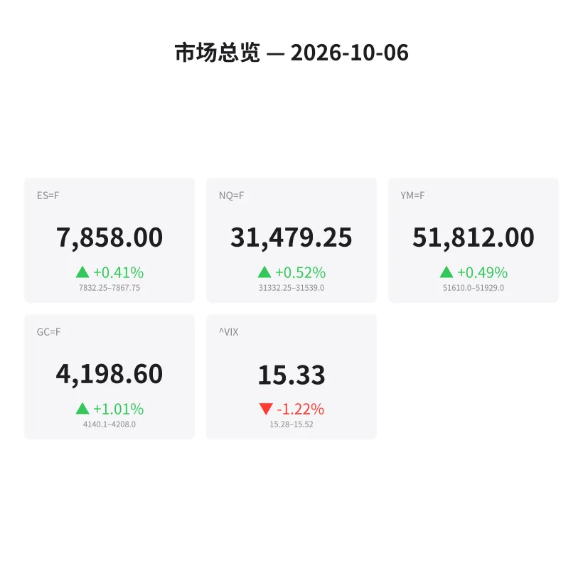
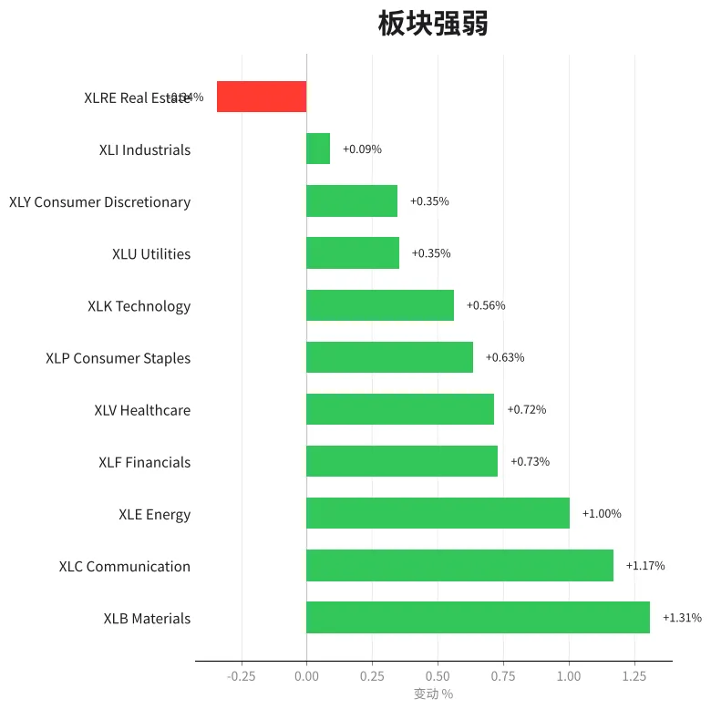
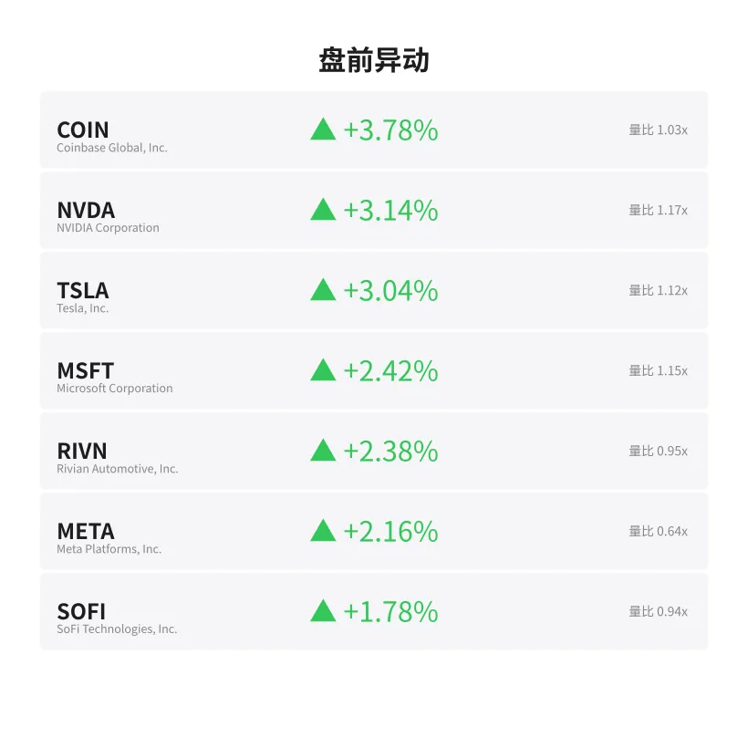
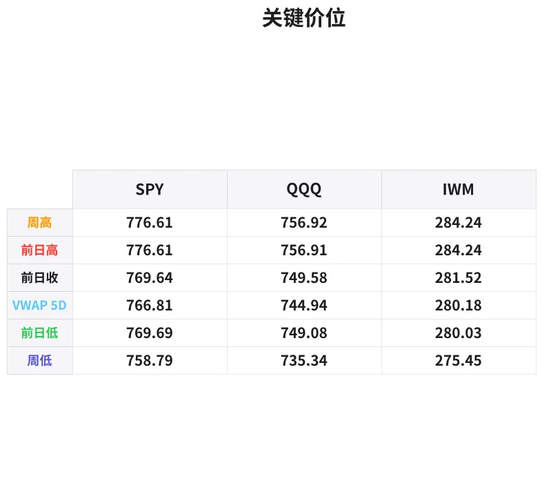

# 盘前分析报告 — 2026-10-06
*生成时间: 12:46:34 UTC*

---
## 数据速览

---
## 一、宏观环境

> [!info]- 详细数据：指数期货 & VIX
> ### 1.1 指数期货 & VIX
> | 品种 | 现价 | 涨跌幅 | 前收 | 日高 | 日低 |
> |------|------|--------|------|------|------|
> | ES=F | 7858.0 | +0.41% | 7826.25 | 7867.75 | 7829.0 |
> | NQ=F | 31479.25 | +0.52% | 31317.75 | 31537.0 | 31309.25 |
> | YM=F | 51812.0 | +0.49% | 51558.0 | 51929.0 | 51594.0 |
> | GC=F | 4198.6 | +1.01% | 4156.8 | 4207.5 | 4130.7 |
> | ^VIX | 15.33 | -1.22% | 15.52 | 15.52 | 15.28 |

> [!info]- 详细数据：隔夜走势
> ### 1.2 隔夜走势（Globex）
> | 品种 | 隔夜高 | 隔夜低 | 区间 | 亚洲高 | 亚洲低 | 欧洲高 | 欧洲低 |
> |------|--------|--------|------|--------|--------|--------|--------|
> | ES=F | 7867.75 | 7832.25 | 35.5 | 7836.75 | 7832.25 | 7866.0 | 7834.25 |
> | NQ=F | 31539.0 | 31332.25 | 206.75 | 31380.25 | 31332.25 | 31535.75 | 31340.0 |
> | YM=F | 51929.0 | 51610.0 | 319.0 | 51649.0 | 51610.0 | 51929.0 | 51625.0 |
> | GC=F | 4208.0 | 4140.1 | 67.9 | 4158.0 | 4143.3 | 4202.8 | 4140.1 |
> | ^VIX | 15.52 | 15.28 | 0.24 | — | — | 15.52 | 15.28 |

> [!info]- 详细数据：板块强弱
> ### 1.3 板块强弱
> | ETF | 板块 | 涨跌幅 |
> |-----|------|--------|
> | XLB | Materials | +1.31% |
> | XLC | Communication | +1.17% |
> | XLE | Energy | +1.00% |
> | XLF | Financials | +0.73% |
> | XLV | Healthcare | +0.72% |
> | XLP | Consumer Staples | +0.63% |
> | XLK | Technology | +0.56% |
> | XLU | Utilities | +0.35% |
> | XLY | Consumer Discretionary | +0.35% |
> | XLI | Industrials | +0.09% |
> | XLRE | Real Estate | -0.34% |

---
## 二、消息面

> 今日新闻数据源暂不可用（yfinance news API 返回空数据）。请关注以下盘前关键动态：
> - **COIN +3.78%** — 加密相关资产大幅走强，比特币周末可能出现重大突破
> - **NVDA +3.14%** — AI/半导体板块继续领涨，科技股多头情绪高涨
> - **TSLA +3.04%** — 特斯拉盘前放量上涨，可能与周末消息面催化有关
> - **黄金 GC +1.01%** — 贵金属与股指同涨，暗示美元走弱或避险需求并存
> - **VIX 15.33 (-1.22%)** — 波动率持续压缩，市场风险偏好明显回暖
> - **板块轮动**：材料(XLB +1.31%)与通信(XLC +1.17%)领涨，仅地产(XLRE -0.34%)飘绿

---
## 三、盘前异动

> [!info]- 详细数据：盘前异动
> | 代码 | 名称 | 现价 | 缺口 | 量比 |
> |------|------|------|------|------|
> | COIN | Coinbase Global, Inc. | 189.91 | +3.78% | 1.03x |
> | NVDA | NVIDIA Corporation | 241.29 | +3.14% | 1.17x |
> | TSLA | Tesla, Inc. | 381.86 | +3.04% | 1.12x |
> | MSFT | Microsoft Corporation | 530.06 | +2.42% | 1.15x |
> | RIVN | Rivian Automotive, Inc. | 14.64 | +2.38% | 0.95x |
> | META | Meta Platforms, Inc. | 743.79 | +2.16% | 0.64x |
> | SOFI | SoFi Technologies, Inc. | 16.05 | +1.78% | 0.94x |

---
## 四、关键价位

> [!info]- 详细数据：SPY 关键价位
> ### SPY
> | 价位类型 | 价格 |
> |----------|------|
> | Prior Day High | 776.605 |
> | Prior Day Low | 769.69 |
> | Prior Day Close | 769.64 |
> | Premarket Price | 777.56 |
> | Approx Vwap 5D | 766.81 |
> | Weekly High | 776.61 |
> | Weekly Low | 758.79 |

> [!info]- 详细数据：QQQ 关键价位
> ### QQQ
> | 价位类型 | 价格 |
> |----------|------|
> | Prior Day High | 756.915 |
> | Prior Day Low | 749.08 |
> | Prior Day Close | 749.58 |
> | Premarket Price | 759.5 |
> | Approx Vwap 5D | 744.94 |
> | Weekly High | 756.92 |
> | Weekly Low | 735.34 |

> [!info]- 详细数据：IWM 关键价位
> ### IWM
> | 价位类型 | 价格 |
> |----------|------|
> | Prior Day High | 284.24 |
> | Prior Day Low | 280.03 |
> | Prior Day Close | 281.52 |
> | Premarket Price | 284.36 |
> | Approx Vwap 5D | 280.18 |
> | Weekly High | 284.24 |
> | Weekly Low | 275.45 |

---
## 五、AI 技术分析 & 操盘建议

## 第一部分：隔夜市场回顾

### 亚洲时段（18:00–02:00 ET）
- **ES** 亚洲时段窄幅震荡，区间仅 4.5 点（7832.25–7836.75），成交清淡，表明亚洲机构未主动参与。价格在前收 7826.25 上方企稳，空头未能发力。
- **NQ** 亚洲时段同样缩量窄幅运行（31332.25–31380.25），48 点区间，延续上周五收盘后的盘整态势。
- **GC** 黄金亚洲时段区间 4143.3–4158.0，开盘后缓慢上行，未出现大幅波动。买盘有序进场。

### 欧洲时段（02:00–09:30 ET）
- **ES** 欧洲时段显著放量拉升，从 7834.25 推至 7866.0，日内高点 7867.75 在欧洲盘尾出现。伦敦资金主导向上突破，突破了上周五日高 7826.25 的压制。**这是今日最重要的信号**——伦敦机构在周一亚洲盘整后选择做多，表明大资金对本周看多。
- **NQ** 欧洲时段走势更为强劲，从 31340.0 拉升至 31535.75，接近 200 点涨幅。科技股在欧洲盘获得更大的多头驱动。
- **GC** 黄金欧洲时段大幅走强，从 4140.1 拉至 4202.8，区间 62.7 点。贵金属与风险资产同步上涨，暗示美元指数可能走弱。

### 对美盘的启示
1. **伦敦时段的方向性**：欧洲盘在亚洲盘整后选择向上突破是经典的"伦敦定调"模式。统计上，伦敦时段确立的方向在美盘延续的概率约 65%。
2. **多头主导但需警惕回踩**：所有主要指数盘前都在前日高点上方，gap up 开盘几乎确定。关键问题是 gap and go 还是 gap and fade。
3. **VIX 压缩**：VIX 15.33 且在下行，low vol 环境有利于趋势延续，不利于反转。
4. **板块广度极佳**：11 个板块中 10 个上涨，仅 XLRE 微跌。这种广度支撑通常意味着 rally 可持续性较强。

## 第二部分：期货品种分析

### ES (E-mini S&P 500)
**现价**: 7857 | **前收**: 7826.25 | **涨幅**: +0.41% | **50MA**: 7697 | **200MA**: 7272

**多时间框架分析**：
- **日线**：上周五收出阳线突破前高后小幅回落，周一盘前再度拉升。价格远在 50MA (7697) 和 200MA (7272) 上方，日线级别趋势强势多头。
- **4H**：欧洲时段完成突破，4H K线实体饱满。隔夜区间 7829–7868，价格在区间上半部分运行。
- **1H/15M**：亚洲时段筑底 7832，欧洲时段阶梯上行。价格结构为 higher highs + higher lows。

**关键价位**：
| 类型 | 价格 | 备注 |
|------|------|------|
| 隔夜高 (ONH) | 7867.75 | 首要阻力，突破则 gap and go |
| 欧洲高 (EU High) | 7866.0 | 与 ONH 高度重合，形成强阻力集群 |
| 前收/VPOC 区域 | 7826–7830 | 极端回踩支撑 |
| 隔夜低 (ONL) | 7832.25 | 日内强支撑，跌破则转空 |
| 亚洲低 (Asia Low) | 7832.25 | 与 ONL 重合 |
| 上方目标 | 7880–7900 | 整数关口+心理阻力 |

**方向偏多** | 置信度：**75%**

**交易计划**：
- **首选入场（突破做多）**：等待 ES 突破并站稳 7868（ONH），回踩 7860–7865 区间做多
  - 止损：7852（ONL 上方保护）
  - T1：7880（+15pt）
  - T2：7900（+35pt）
  - 失效条件：跌破 7850 则放弃
- **备选入场（回踩做多）**：若开盘走 gap fade，等待回踩 7835–7840 区域（ONL 附近）出现反转信号做多
  - 止损：7825（前收下方）
  - T1：7860
  - T2：7875
  - 失效条件：跌破 7825 则观望

---

### NQ (E-mini Nasdaq 100)
**现价**: 31472 | **前收**: 31318 | **涨幅**: +0.52% | **50MA**: 29666 | **200MA**: 27715

**多时间框架分析**：
- **日线**：NQ 涨幅领先于 ES，科技股引领。价格远超 50MA 近 1800 点，momentum 极强但需警惕极端超买。
- **4H**：欧洲时段从 31340 拉至 31536，接近 200 点大阳线。动能集中且买盘强势。
- **1H/15M**：亚洲时段底部 31332 作为日内关键支撑。欧洲拉升过程中无显著回撤，说明卖压极轻。

**关键价位**：
| 类型 | 价格 | 备注 |
|------|------|------|
| 隔夜高 (ONH) | 31539 | 首要阻力 |
| 欧洲高 | 31536 | 与 ONH 几乎重合 |
| 前收 | 31318 | 极端回踩支撑 |
| 隔夜低 (ONL) | 31332 | 日内强支撑 |
| 上方目标 | 31600–31700 | 整数关口 |

**方向偏多** | 置信度：**72%**

**交易计划**：
- **首选入场（突破做多）**：NQ 突破 31540 后回踩 31500–31520 做多
  - 止损：31440（60pt）
  - T1：31620（+100pt）
  - T2：31700（+180pt）
  - 失效条件：跌破 31430
- **备选入场（回踩做多）**：回踩 31350–31380（亚洲时段区域）做多
  - 止损：31300
  - T1：31480
  - T2：31540
  - 失效条件：跌破 31300

---

### GC (黄金期货)
**现价**: 4201 | **前收**: 4157 | **涨幅**: +1.01% | **50MA**: 4375 | **200MA**: 4555

**多时间框架分析**：
- **日线**：黄金处于 50MA (4375) 和 200MA (4555) 下方，大周期仍在回调修正中。但短期从低点反弹，日线连续收阳。
- **4H**：欧洲时段强势拉升 62.7 点，形成标准的 V 型反转。从 4130 低点到 4207 高点，反弹幅度可观。
- **1H/15M**：价格突破 4200 整数关口，但距离 ONH 4208 仅一步之遥。需观察是否能站稳 4200。

**关键价位**：
| 类型 | 价格 | 备注 |
|------|------|------|
| 隔夜高 (ONH) | 4208.0 | 首要阻力 |
| 4200 整数关口 | 4200 | 心理+技术关口 |
| 欧洲低/隔夜低 | 4130–4140 | 极端支撑 |
| 亚洲高 | 4158 | 中间支撑 |
| 上方目标 | 4220–4240 | 前期结构阻力 |

**方向偏多** | 置信度：**68%**（大周期空头背景下逆势做多，降低置信度）

**交易计划**：
- **首选入场（突破做多）**：GC 突破 4208 后回踩 4200–4205 做多
  - 止损：4188（$12）
  - T1：4225（+$20）
  - T2：4245（+$40）
  - 失效条件：跌破 4190 后不再追多
- **备选入场（回踩做多）**：回踩 4170–4180 支撑区做多
  - 止损：4155
  - T1：4200
  - T2：4215
  - 失效条件：跌破 4150
- **注意**：黄金大周期仍在均线下方运行，日内做多保持轻仓，不宜隔夜持有多单

## 第三部分：ETF品种分析

### SPY (SPDR S&P 500 ETF)
**上一交易日收盘**: 774.83 | **前收**: 769.64 | **盘前**: 777.56 | **50MA**: 764.42

**关键价位**：
| 类型 | 价格 | 备注 |
|------|------|------|
| 盘前价 | 777.56 | Gap up 突破前日高 |
| 前日高 (PDH) | 776.61 | 突破后应转支撑 |
| 前日收 | 769.64 | Gap 底部 |
| 前日低 | 769.69 | Gap 底部 |
| 5日 VWAP | 766.81 | 中期均衡价 |
| 周低 | 758.79 | 极端支撑 |
| 上方目标 | 780–782 | 整数关口区域 |

**交易计划**：
- SPY 盘前在 777.56 运行，gap up 高出 PDH (776.61) 约 $1。Gap 不大，属于 "小 gap 突破" 模式。
- **Gap and Go 场景（60% 概率）**：开盘后在 PDH (776.61) 附近找到支撑，继续上行。入场：776.5–777 回踩做多，止损 775.5，目标 780 / 782。
- **Gap Fade 场景（40% 概率）**：开盘后回踩 gap，测试 774–775 区域（前日收盘价区域上方）。入场：等待 773–775 出现 order flow 反转做多，止损 771，目标 777 / 779。
- **关键观察**：开盘前 5 分钟的成交量。若放量突破 778 则确认 gap and go；若缩量回落至 776 以下则准备 fade play。

---

### QQQ (Invesco Nasdaq 100 ETF)
**上一交易日收盘**: 756.20 | **前收**: 749.58 | **盘前**: 759.50 | **50MA**: 718.26

**关键价位**：
| 类型 | 价格 | 备注 |
|------|------|------|
| 盘前价 | 759.50 | Gap up 显著高于 PDH |
| 前日高 (PDH) | 756.92 | 突破后应转支撑 |
| 前日收 | 749.58 | Gap 底部 |
| 前日低 | 749.08 | Gap 底部 |
| 5日 VWAP | 744.94 | 中期均衡价 |
| 周低 | 735.34 | 极端支撑 |
| 上方目标 | 762–765 | 前期结构区域 |

**交易计划**：
- QQQ 盘前 759.50，gap up 高出 PDH 约 $2.6。Gap 大于 SPY，科技股领涨。
- **Gap and Go 场景（55% 概率）**：开盘后回踩 757–758 做多，止损 755，目标 762 / 765。NQ 强势驱动下 QQQ 上行动力更足。
- **Gap Fade 场景（45% 概率）**：若开盘走弱回踩 PDH 756 区域，等待确认后做多。止损 754，目标 760 / 762。
- **跟踪 NVDA**：QQQ 权重第一大成分股 NVDA 盘前 +3.14%，若 NVDA 开盘后保持强势，QQQ 大概率 gap and go。反之若 NVDA 冲高回落，QQQ 也会跟随回撤。

## 第四部分：今日市场总览

### 整体市场情绪
**偏多（Risk-On）**

周一开盘迎来全面 gap up。核心逻辑：
1. **广度确认**：11 个板块 10 个上涨，材料、通信、能源领涨 —— 这不是个股驱动的窄幅 rally，而是资金全面流入的宽幅上涨。
2. **VIX 持续压缩**：15.33 且日内继续下行，low vol 环境对多头友好。卖 vol 的交易者没有慌张，隐含波动率定价偏低。
3. **欧洲时段定调向上**：伦敦资金选择做多是本日最强信号。周一伦敦定调后美盘跟随的概率高于平常。
4. **黄金与股指同涨**：这种组合最常见的驱动因素是美元走弱。若 DXY 确认下行，则双多逻辑更加稳固。

### VIX 分析
- **VIX 15.33**（-1.22%），处于近期低位。
- 隔夜区间仅 0.24 (15.28–15.52)，极度压缩。
- **含义**：市场预期未来 30 天 SPX 日均波动约 ±0.96%。当前定价偏低，但在趋势行情中 VIX 可以在低位维持较长时间。
- **风险**：VIX 低位盘整后的突然跳升往往更为剧烈。保持止损纪律。

### 需要回避的时间窗口
| 时间 (ET) | 事件/风险 | 建议 |
|-----------|-----------|------|
| 09:30–09:45 | 开盘前15分钟，观察 order flow 方向 | 不做单，只观察 |
| 10:00 | 可能有 ISM/PMI 等经济数据发布 | 数据前平仓或减仓 |
| 11:30–13:00 | 午盘死水区，流动性下降 | 减少交易频率 |
| 15:45–16:00 | MOC（Market On Close）imbalance | 尾盘波动加大，谨慎持仓 |

### 板块轮动观察
- **领涨**：XLB (材料 +1.31%)、XLC (通信 +1.17%)、XLE (能源 +1.00%) —— 周期性板块领涨是"经济乐观"信号
- **跟涨**：XLF (金融 +0.73%)、XLV (医疗 +0.72%) —— 防御+价值也在上涨，广度极佳
- **科技**：XLK (+0.56%) 涨幅不是最高，但 NVDA +3.14%、MSFT +2.42%、META +2.16% 个股强劲 —— 权重股拉动
- **落后**：XLRE (-0.34%) 唯一飘绿 —— 利率敏感板块，可能反映市场对降息预期的修正
- **策略**：日内优先跟随科技（NQ/QQQ）做多，材料和能源板块的强势可关注 XLB/XLE 正股做辅助对冲

### 核心交易论点

> **今日是"伦敦定调做多"的 gap up 周一。在 VIX 压缩、板块广度极佳、欧洲资金已经确认方向的背景下，默认偏多操作。优先做 gap and go，回踩 ONL/PDH 附近是日内最佳做多位。唯一翻空条件：ES 跌破 7825（前收）且 VIX 突破 16.0。保持纪律，控制仓位。**

---
*⚠️ 免责声明：以上分析仅供参考，不构成投资建议。期货交易风险巨大，可能导致超额亏损。请根据自身风险承受能力审慎决策。*
