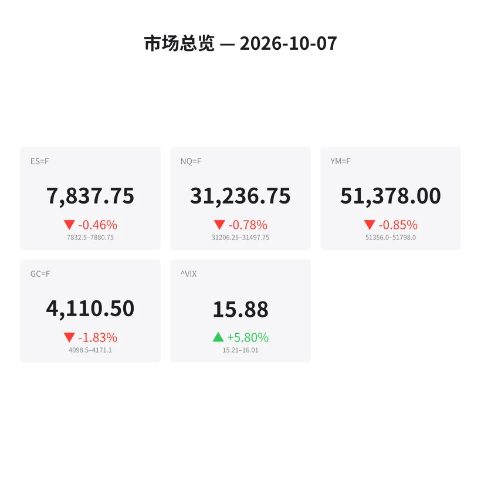
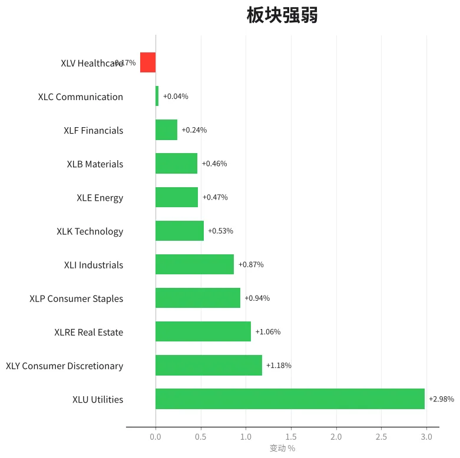
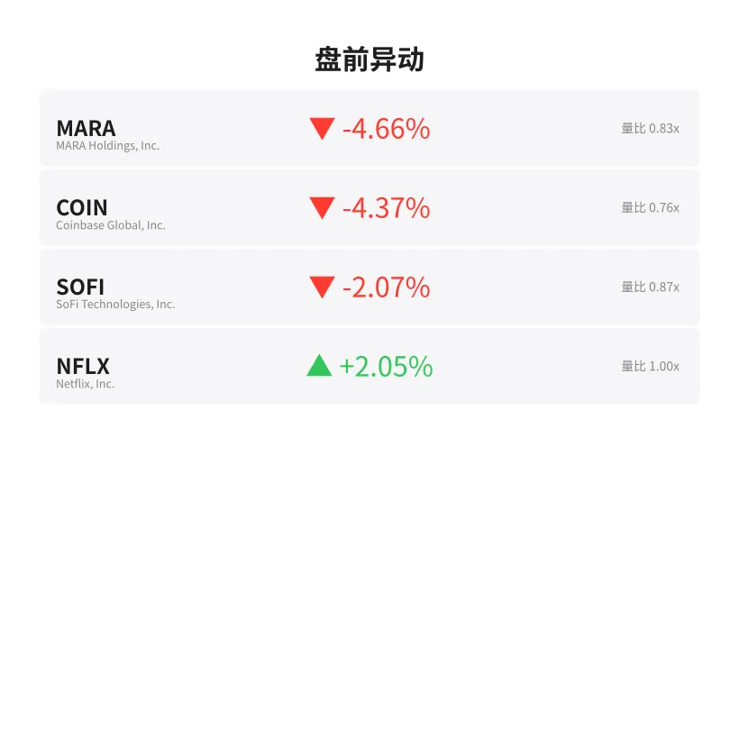
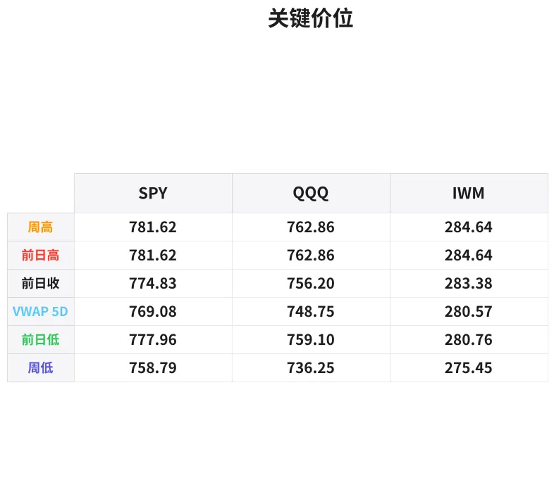

# 盘前分析报告 — 2026-10-07
*生成时间: 12:43:58 UTC*

---
## 数据速览

---
## 一、宏观环境

> [!info]- 详细数据：指数期货 & VIX
> ### 1.1 指数期货 & VIX
> | 品种 | 现价 | 涨跌幅 | 前收 | 日高 | 日低 |
> |------|------|--------|------|------|------|
> | ES=F | 7837.75 | -0.46% | 7874.0 | 7884.5 | 7832.5 |
> | NQ=F | 31236.75 | -0.78% | 31483.25 | 31521.0 | 31209.75 |
> | YM=F | 51378.0 | -0.85% | 51816.0 | 51860.0 | 51356.0 |
> | GC=F | 4110.5 | -1.83% | 4187.1 | 4197.8 | 4098.5 |
> | ^VIX | 15.88 | +5.80% | 15.01 | 16.01 | 15.21 |

> [!info]- 详细数据：隔夜走势
> ### 1.2 隔夜走势（Globex）
> | 品种 | 隔夜高 | 隔夜低 | 区间 | 亚洲高 | 亚洲低 | 欧洲高 | 欧洲低 |
> |------|--------|--------|------|--------|--------|--------|--------|
> | ES=F | 7880.75 | 7832.5 | 48.25 | 7880.75 | 7875.75 | 7877.25 | 7835.5 |
> | NQ=F | 31497.75 | 31206.25 | 291.5 | 31497.75 | 31451.0 | 31482.0 | 31217.25 |
> | YM=F | 51798.0 | 51356.0 | 442.0 | 51784.0 | 51752.0 | 51798.0 | 51404.0 |
> | GC=F | 4171.1 | 4098.5 | 72.6 | 4171.1 | 4154.7 | 4165.8 | 4135.0 |
> | ^VIX | 16.01 | 15.21 | 0.8 | — | — | 16.01 | 15.21 |

> [!info]- 详细数据：板块强弱
> ### 1.3 板块强弱
> | ETF | 板块 | 涨跌幅 |
> |-----|------|--------|
> | XLU | Utilities | +2.98% |
> | XLY | Consumer Discretionary | +1.18% |
> | XLRE | Real Estate | +1.06% |
> | XLP | Consumer Staples | +0.94% |
> | XLI | Industrials | +0.87% |
> | XLK | Technology | +0.53% |
> | XLE | Energy | +0.47% |
> | XLB | Materials | +0.46% |
> | XLF | Financials | +0.24% |
> | XLC | Communication | +0.04% |
> | XLV | Healthcare | -0.17% |

---
## 三、盘前异动

> [!info]- 详细数据：盘前异动
> | 代码 | 名称 | 现价 | 缺口 | 量比 |
> |------|------|------|------|------|
> | MARA | MARA Holdings, Inc. | 10.65 | -4.66% | 0.83x |
> | COIN | Coinbase Global, Inc. | 180.0 | -4.37% | 0.76x |
> | SOFI | SoFi Technologies, Inc. | 15.59 | -2.07% | 0.87x |
> | NFLX | Netflix, Inc. | 68.88 | +2.05% | 1.0x |

---
## 四、关键价位

> [!info]- 详细数据：SPY 关键价位
> ### SPY
> | 价位类型 | 价格 |
> |----------|------|
> | Prior Day High | 781.62 |
> | Prior Day Low | 777.96 |
> | Prior Day Close | 774.83 |
> | Premarket Price | 776.15 |
> | Approx Vwap 5D | 769.08 |
> | Weekly High | 781.62 |
> | Weekly Low | 758.79 |

> [!info]- 详细数据：QQQ 关键价位
> ### QQQ
> | 价位类型 | 价格 |
> |----------|------|
> | Prior Day High | 762.86 |
> | Prior Day Low | 759.1 |
> | Prior Day Close | 756.2 |
> | Premarket Price | 754.41 |
> | Approx Vwap 5D | 748.75 |
> | Weekly High | 762.86 |
> | Weekly Low | 736.25 |

> [!info]- 详细数据：IWM 关键价位
> ### IWM
> | 价位类型 | 价格 |
> |----------|------|
> | Prior Day High | 284.64 |
> | Prior Day Low | 280.76 |
> | Prior Day Close | 283.38 |
> | Premarket Price | 278.84 |
> | Approx Vwap 5D | 280.57 |
> | Weekly High | 284.64 |
> | Weekly Low | 275.45 |

---
## 五、AI 技术分析 & 操盘建议

## 第一部分：隔夜市场回顾

### 亚洲时段（18:00–02:00 ET）
亚洲时段整体走势极为平淡。ES在5个点的窄幅区间内波动（7875.75–7880.75），NQ同样窄幅整理（31451–31497.75）。亚洲时段成交量稀薄，未形成明确方向。GC黄金在亚洲时段已经开始承压，从4171.1高位回落至4154.7。

**关键信号：** 亚洲时段缺乏买盘承接，隔夜高点未能突破前日收盘水平，显示多头信心不足。

### 欧洲时段（02:00–09:30 ET）
欧洲时段是今日卖压的主要来源。ES从7877.25大幅下跌至7835.5，跌幅超过40点，打破了亚洲时段的平衡。NQ同步下行近265点（31482→31217.25），跌幅更为显著。YM道指期货从51798跌至51404，下跌近400点。

**黄金同步暴跌：** GC从欧洲时段高点4165.8一路杀到4135.0，跌幅约31美元，日内最低触及4098.5（-1.83%）。黄金与股指同时下跌，显示这并非传统避险驱动的下跌，更可能是：
1. 美元走强压制全品种
2. 流动性收缩导致去杠杆
3. 机构在新季度初调仓

### 对美盘的影响
- 欧洲时段卖压建立了明确的空头结构，美盘开盘需要关注是否延续
- VIX跳升5.8%至15.88，隐含波动率上升但绝对值仍偏低——市场尚未恐慌但已警觉
- 板块轮动显示资金流入防御板块（XLU +2.98%领涨），Risk-Off信号明确
- 加密相关标的（MARA -4.66%, COIN -4.37%）大幅下跌，印证风险偏好收缩
- IWM盘前278.84远低于前日低点280.76，小盘股领跌，市场广度恶化

---
## 第二部分：期货品种分析

### ES（E-mini S&P 500） — 现价 7837.75

**多时间框架分析：**
- **日线：** 前日收于7874.0，今日gap down约36点开于7837.75。上方7874–7884区域形成供给区。日线结构仍在上升趋势中，但今日gap down若无法回补则可能形成空头吞没信号。
- **4H：** 欧洲时段打出lower low（7832.5），破坏了近期的higher low结构。当前价格在隔夜低点7832.5上方窄幅整理。
- **1H/15min：** 短线处于下降通道，7835.5（欧洲低点）为短期支撑参考。

**关键价位：**
| 类型 | 价位 | 说明 |
|------|------|------|
| 强阻力 | 7880–7885 | 隔夜高点 + 前日高点密集区 |
| 阻力1 | 7874.0 | 前日收盘（gap回补目标） |
| 阻力2 | 7855–7860 | VWAP预估区域 |
| 当前价 | 7837.75 | — |
| 支撑1 | 7832.5 | 隔夜低点/欧洲低点 |
| 支撑2 | 7815–7820 | 上周balance area低端 |
| 强支撑 | 7800 | 整数关口 + 心理支撑 |

**方向偏空 | 置信度：65%**

**做空计划：**
- 入场区间：7855–7870（gap回补至50%–75%后的反转信号）
- 止损：7886（隔夜高点上方）
- T1：7835（隔夜低点测试）| T2：7815
- 失效条件：价格强势突破7885并站稳，则翻多看7900+

**做多计划（反弹交易）：**
- 入场区间：7830–7835（隔夜低点支撑确认后）
- 止损：7825
- T1：7855 | T2：7870
- 失效条件：跌破7825伴随放量

---

### NQ（E-mini Nasdaq-100） — 现价 31236.75

**多时间框架分析：**
- **日线：** 前收31483.25，今日大幅gap down约247点，跌幅-0.78%领跌三大指数。NQ的弱势与科技板块（XLK仅+0.53%低于多数防御板块）一致。
- **4H：** 隔夜区间291.5点（31497.75–31206.25），属于较大波动区间。欧洲时段打出明确的下降趋势线。
- **1H：** 当前在31200–31250区域寻找支撑，31200为心理整数关口。

**关键价位：**
| 类型 | 价位 | 说明 |
|------|------|------|
| 强阻力 | 31480–31520 | 隔夜高点 + 前日高点 |
| 阻力1 | 31483.25 | 前日收盘 |
| 阻力2 | 31350–31380 | VWAP预估 |
| 当前价 | 31236.75 | — |
| 支撑1 | 31206.25 | 隔夜低点 |
| 支撑2 | 31100–31120 | 延伸支撑 |
| 强支撑 | 31000 | 整数关口 |

**方向偏空 | 置信度：70%**

NQ弱于ES（跌幅更大、gap更深），在Risk-Off环境下科技通常承压更重。

**做空计划：**
- 入场区间：31350–31450（gap半回补后的反转）
- 止损：31530（隔夜高点上方）
- T1：31210（隔夜低点）| T2：31100
- 失效条件：强势收复31500

**做多计划（超跌反弹）：**
- 入场区间：31200–31220（隔夜低点支撑区确认）
- 止损：31180
- T1：31350 | T2：31450
- 失效条件：跌穿31180放量下行

---

### GC（黄金期货） — 现价 4110.5

**多时间框架分析：**
- **日线：** 今日是近期最大单日跌幅之一（-1.83%，约77美元），前收4187.1。日线可能形成大阴线，需关注是否打破上升趋势支撑。
- **4H：** 从4197.8高点一路下行至4098.5低点，跌幅近100美元。抛售结构完整，目前在4098.5–4120区域震荡。
- **1H：** 超卖特征明显，短线可能出现技术性反弹，但4150上方压力沉重。

**关键价位：**
| 类型 | 价位 | 说明 |
|------|------|------|
| 强阻力 | 4170–4198 | 隔夜高点 + 前日高点 |
| 阻力1 | 4150–4155 | 亚洲低点/欧洲高点 |
| 阻力2 | 4135 | 欧洲时段低点（突破后回踩） |
| 当前价 | 4110.5 | — |
| 支撑1 | 4098.5 | 日内低点 |
| 支撑2 | 4080–4085 | 延伸目标 |
| 强支撑 | 4050 | 前期重要支撑位 |

**方向偏空 | 置信度：72%**

黄金与股指共同下跌通常意味着美元走强或流动性收缩，这种环境下黄金的反弹往往受限。

**做空计划：**
- 入场区间：4130–4145（反弹至欧洲低点/阻力区后做空）
- 止损：4158
- T1：4100（日内低点测试）| T2：4080
- 失效条件：强势突破4155并站稳

**做多计划（超跌反弹）：**
- 入场区间：4095–4100（日内低点二次测试不破）
- 止损：4088
- T1：4130 | T2：4150
- 失效条件：跌破4088加速下行

---
## 第三部分：ETF品种分析

### SPY — 盘前 776.15

**关键价位：**
| 类型 | 价位 | 说明 |
|------|------|------|
| 周高/前日高 | 781.62 | 本周高点 = 前日高点 |
| 前日低 | 777.96 | — |
| 前日收盘 | 774.83 | — |
| 盘前价 | 776.15 | 位于PDC上方、PDL下方 |
| 5日VWAP | 769.08 | 中期均值回归目标 |
| 周低 | 758.79 | 极端支撑 |

**技术解读：**
SPY盘前776.15开在前日收盘774.83上方但低于前日低点777.96，处于前日下半区间。这一开盘位置显示买方试图在前日收盘位守住，但力度不足以突破前日低点。

**交易计划：**

**空头场景（主要）：**
- 观察778–780区域（前日低点上方）的假突破做空
- 止损：781.80（前日高点上方）
- T1：774.80（前日收盘）| T2：772
- 若开盘直接破774.80并回测不上，可追空看769（5日VWAP）

**多头场景（次要）：**
- 774.50–775.00获得支撑确认后轻仓做多
- 止损：773.80
- T1：778 | T2：780
- 需要VIX同步回落配合

---

### QQQ — 盘前 754.41

**关键价位：**
| 类型 | 价位 | 说明 |
|------|------|------|
| 周高/前日高 | 762.86 | — |
| 前日低 | 759.10 | — |
| 前日收盘 | 756.20 | — |
| 盘前价 | 754.41 | 低于前日收盘-1.79点 |
| 5日VWAP | 748.75 | — |
| 周低 | 736.25 | — |

**技术解读：**
QQQ盘前754.41低于前日收盘756.20，gap down约1.8点。QQQ弱于SPY（SPY至少还在PDC上方），反映科技板块承受更大抛压。盘前已跌破PDC，若美盘无法收复756.20，日内偏空格局确立。

**交易计划：**

**空头场景（主要）：**
- 反弹至755.50–756.20（PDC附近）做空
- 止损：757.50
- T1：752 | T2：749（接近5日VWAP 748.75）
- 关注NQ期货31200关口，若破则QQQ可能加速下行

**多头场景（次要）：**
- 752–753获得order flow支撑信号后轻仓做多
- 止损：751
- T1：756 | T2：759
- 需要NQ期货同步企稳配合

---
## 第四部分：今日市场总览

### 整体情绪：偏空 (Bearish Lean)

今日市场呈现典型的Risk-Off格局：
- **股指期货全线下跌**：ES -0.46%, NQ -0.78%, YM -0.85%，小盘股IWM盘前跌幅更大
- **黄金同步大跌**（-1.83%）：排除传统避险买盘，指向美元走强或流动性收缩
- **防御板块领涨**：XLU +2.98%大幅领先，XLRE、XLP紧随，典型的机构避险配置
- **加密相关标的重挫**：MARA -4.66%, COIN -4.37%，风险偏好极度收缩
- **VIX跳升**：+5.80%至15.88，波动率上行但绝对值仍偏低（未进入恐慌区间）

### VIX分析
VIX 15.88处于相对低位但方向向上。今日若VIX突破16.50，可能触发更多对冲买盘，加速指数下行。反之若VIX回落至15以下，则指数可能企稳反弹。**关注16.0整数关口作为多空分水岭。**

### 需要回避的时间窗口
- **09:30–10:00 ET（开盘前30分钟）：** 开盘定价混乱，gap down后双向扫止损概率高，等待初始平衡区（IB）形成
- **10:00 ET：** 可能有经济数据公布，注意突发波动
- **12:00–13:00 ET：** 午间流动性低谷，假突破多
- **15:45–16:00 ET：** 收盘前MOC（Market On Close）单集中，方向性强但难以提前判断

### 板块轮动信号
资金明确从进攻板块（XLC仅+0.04%, XLV -0.17%）流向防御板块（XLU +2.98%）。这一轮动通常预示：
1. 机构在降低Beta暴露
2. 可能持续1-3个交易日
3. 反转信号：看XLK/XLC重新领涨且VIX回落

### 🎯 今日核心交易论点

**"欧洲时段已定调，美盘关注gap回补深度——回补50%以上做空，不回补直接跟空。"**

具体操作：
1. 若ES在开盘后30分钟内反弹至7855–7870区域且NQ同步反弹至31350附近，这是最佳做空入场点位（gap半回补后反转）
2. 若开盘直接下杀破7832.5（隔夜低点），等待第一次反弹至7835–7840区域的回踩做空
3. 只有在VIX回落至15以下 + ES强势收复7874（前日收盘）的情况下，才考虑转为做多

**风控提示：** 今日黄金与股指同步下跌的异常格局下，波动可能比VIX暗示的更大。建议缩小仓位至正常的70%，止损严格执行。

---
*分析基于盘前数据，仅供参考，不构成投资建议。实盘操作请结合order flow和Level 2数据实时调整。*
