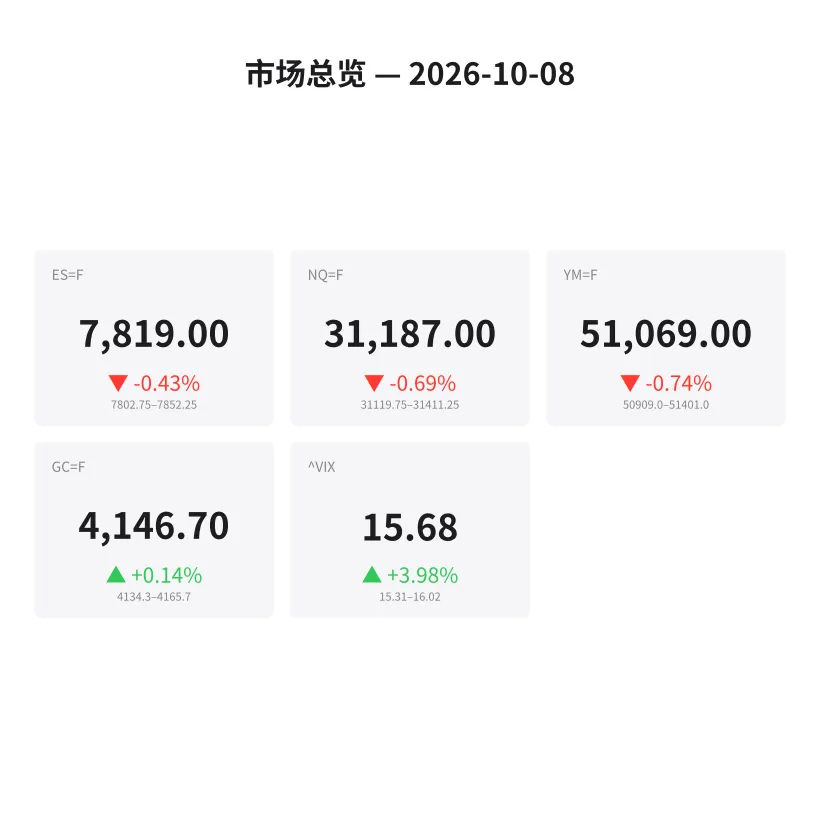
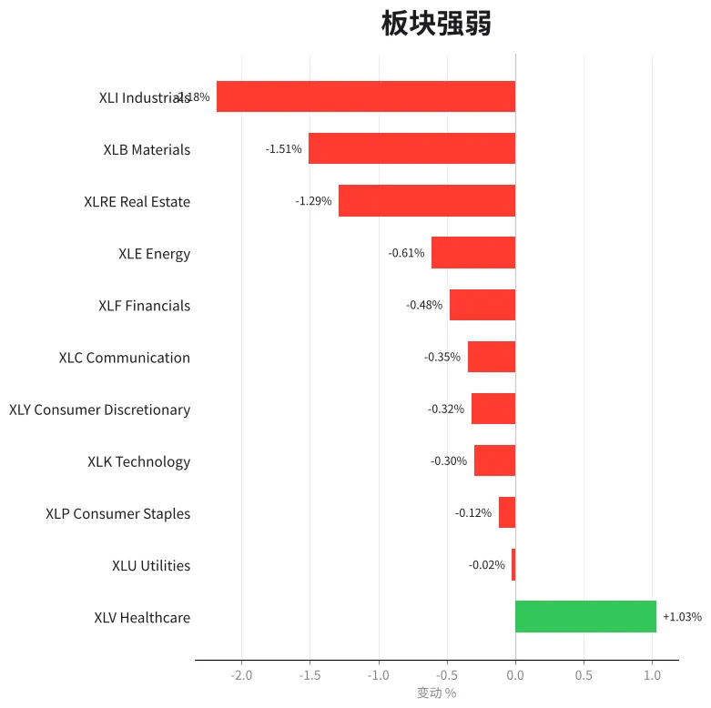
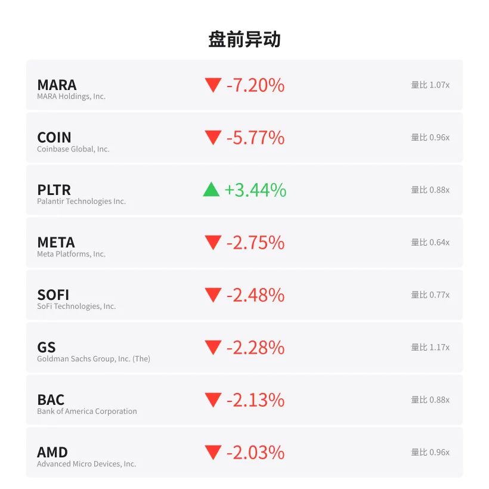
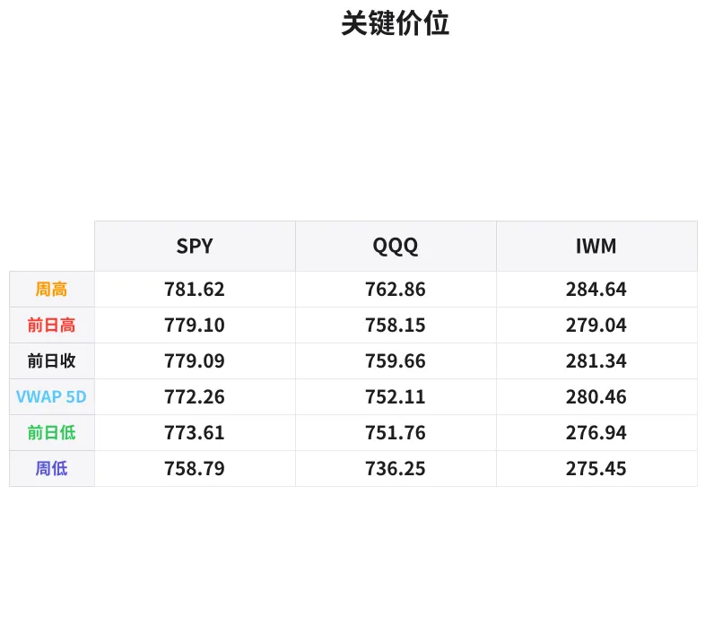

# 盘前分析报告 — 2026-10-08
*生成时间: 12:45:10 UTC*

---
## 数据速览

---
## 一、宏观环境

> [!info]- 详细数据：指数期货 & VIX
> ### 1.1 指数期货 & VIX
> | 品种 | 现价 | 涨跌幅 | 前收 | 日高 | 日低 |
> |------|------|--------|------|------|------|
> | ES=F | 7819.0 | -0.43% | 7852.75 | 7858.25 | 7802.75 |
> | NQ=F | 31187.0 | -0.69% | 31402.25 | 31466.0 | 31120.0 |
> | YM=F | 51069.0 | -0.74% | 51449.0 | 51470.0 | 50909.0 |
> | GC=F | 4146.7 | +0.14% | 4140.7 | 4166.8 | 4128.1 |
> | ^VIX | 15.68 | +3.98% | 15.08 | 16.02 | 15.31 |

> [!info]- 详细数据：隔夜走势
> ### 1.2 隔夜走势（Globex）
> | 品种 | 隔夜高 | 隔夜低 | 区间 | 亚洲高 | 亚洲低 | 欧洲高 | 欧洲低 |
> |------|--------|--------|------|--------|--------|--------|--------|
> | ES=F | 7852.25 | 7802.75 | 49.5 | 7852.25 | 7839.5 | 7845.0 | 7802.75 |
> | NQ=F | 31411.25 | 31119.75 | 291.5 | 31411.25 | 31321.0 | 31350.0 | 31119.75 |
> | YM=F | 51401.0 | 50909.0 | 492.0 | 51401.0 | 51299.0 | 51347.0 | 50909.0 |
> | GC=F | 4165.7 | 4134.3 | 31.4 | 4165.7 | 4140.2 | 4157.7 | 4134.3 |
> | ^VIX | 16.02 | 15.31 | 0.71 | — | — | 16.02 | 15.31 |

> [!info]- 详细数据：板块强弱
> ### 1.3 板块强弱
> | ETF | 板块 | 涨跌幅 |
> |-----|------|--------|
> | XLV | Healthcare | +1.03% |
> | XLU | Utilities | -0.02% |
> | XLP | Consumer Staples | -0.12% |
> | XLK | Technology | -0.30% |
> | XLY | Consumer Discretionary | -0.32% |
> | XLC | Communication | -0.35% |
> | XLF | Financials | -0.48% |
> | XLE | Energy | -0.61% |
> | XLRE | Real Estate | -1.29% |
> | XLB | Materials | -1.51% |
> | XLI | Industrials | -2.18% |

---
## 二、消息面

> 今日盘前暂无重大新闻头条（数据源未返回）。关注今日经济日历：美联储会议纪要（FOMC Minutes）将于美东时间14:00公布，可能影响尾盘波动率。

---
## 三、盘前异动

> [!info]- 详细数据：盘前异动
> | 代码 | 名称 | 现价 | 缺口 | 量比 |
> |------|------|------|------|------|
> | MARA | MARA Holdings, Inc. | 10.18 | -7.20% | 1.07x |
> | COIN | Coinbase Global, Inc. | 175.03 | -5.77% | 0.96x |
> | PLTR | Palantir Technologies Inc. | 198.67 | +3.44% | 0.88x |
> | META | Meta Platforms, Inc. | 718.55 | -2.75% | 0.64x |
> | SOFI | SoFi Technologies, Inc. | 15.37 | -2.48% | 0.77x |
> | GS | Goldman Sachs Group, Inc. (The) | 876.72 | -2.28% | 1.17x |
> | BAC | Bank of America Corporation | 52.94 | -2.13% | 0.88x |
> | AMD | Advanced Micro Devices, Inc. | 636.26 | -2.03% | 0.96x |
> | RIVN | Rivian Automotive, Inc. | 14.23 | -1.93% | 0.8x |
> | XOM | ExxonMobil Holdings Corporation | 167.55 | +1.87% | 0.84x |

---
## 四、关键价位

> [!info]- 详细数据：SPY 关键价位
> ### SPY
> | 价位类型 | 价格 |
> |----------|------|
> | Prior Day High | 779.1021 |
> | Prior Day Low | 773.61 |
> | Prior Day Close | 779.09 |
> | Premarket Price | 774.1344 |
> | Approx Vwap 5D | 772.26 |
> | Weekly High | 781.62 |
> | Weekly Low | 758.79 |

> [!info]- 详细数据：QQQ 关键价位
> ### QQQ
> | 价位类型 | 价格 |
> |----------|------|
> | Prior Day High | 758.15 |
> | Prior Day Low | 751.76 |
> | Prior Day Close | 759.66 |
> | Premarket Price | 752.85 |
> | Approx Vwap 5D | 752.11 |
> | Weekly High | 762.86 |
> | Weekly Low | 736.25 |

> [!info]- 详细数据：IWM 关键价位
> ### IWM
> | 价位类型 | 价格 |
> |----------|------|
> | Prior Day High | 279.04 |
> | Prior Day Low | 276.945 |
> | Prior Day Close | 281.34 |
> | Premarket Price | 275.44 |
> | Approx Vwap 5D | 280.46 |
> | Weekly High | 284.64 |
> | Weekly Low | 275.45 |

---
## 五、AI 技术分析 & 操盘建议

## 第一部分：隔夜市场回顾

### 亚洲时段（Asia Session）
- ES 在亚洲时段窄幅震荡于 7839.5–7852.25，紧贴前收 7852.75 下方运行，卖压温和。NQ 同步在 31321–31411 区间内交投，未能突破前收。
- 亚洲时段整体呈"等待模式"，成交量偏低，方向性不明显。GC 黄金在亚洲走出日内高点 4165.7，暗示避险需求略有升温。

### 欧洲时段（Europe Session）
- 进入欧洲时段后空头加速：ES 从 7845 一路下探至日低 7802.75（约42点跌幅），NQ 更为剧烈，从 31350 跌至 31119.75（约230点）。
- 欧洲时段的抛售伴随 VIX 上行至 16.02，显示市场焦虑情绪升温。板块层面，工业 XLI（-2.18%）、材料 XLB（-1.51%）领跌，属典型"Risk-Off"特征。
- 黄金在欧洲时段回落至 4134.3 后反弹，说明避险资金有进有出，尚未形成单边避险潮。

### 对美盘的影响
- 隔夜走势偏弱，欧洲时段主导了抛售节奏。ES 目前交投于隔夜区间中下部（7819），距离隔夜低点 7802.75 不远。
- VIX +3.98% 至 15.68，仍属温和区间但方向向上，提示日内波动率可能放大。
- **关键判断**：如果美盘开盘守住 7800 整数关口 / 隔夜低点 7802.75，有望展开修复反弹至 7840–7850 区域；若失守 7800，下方关注 7775–7780 支撑带。

## 第二部分：期货品种分析

### ES（E-mini S&P 500）— 现价 7819.0
**多时间框架分析：**
- **日线**：前一日收于 7852.75，今日盘前跳空低开约33点（-0.43%），构成小级别跳空缺口。5日VWAP约在 7730–7740 区域（按SPY 772.26 等比折算），当前仍在VWAP上方运行。
- **4H/1H**：隔夜区间 7802.75–7852.25（49.5点），目前运行于区间中部偏下。欧洲时段形成的低点 7802.75 是日内最关键支撑。
- **15分钟**：盘前在 7810–7825 之间窄幅盘整，等待美盘方向选择。

**关键价位：**
| 类型 | 价格 | 备注 |
|------|------|------|
| 隔夜高 / 前收 | 7852.25 / 7852.75 | 强阻力区，多头回补目标 |
| 亚洲时段低 | 7839.5 | 回升第一关卡 |
| 当前价 | 7819.0 | — |
| 隔夜低 / 日低 | 7802.75 | 日内关键支撑 |
| 整数关口 | 7800.0 | 心理支撑，失守加速 |
| 延伸目标（下） | 7775–7780 | 周初低点区域 |

**方向偏好：** 偏空 → 中性 | 置信度：60%
- 隔夜走势弱，欧洲时段有效下破亚洲低点，空头目前占优。
- 但VIX仅15.68、跌幅尚温和，不排除开盘后空头回补反弹。

**交易计划（空头优先）：**
- **空单入场区**：7838–7845（亚洲低点+隔夜区间50%位置），如果反弹至此区域遇阻。
- **止损**：7855（前收上方）
- **T1**：7810（今日盘前盘整低端）
- **T2**：7803–7800（隔夜低点+整数关口）
- **失效条件**：美盘开盘直接站上7850并持续放量突破，转为多头格局。

**多头反转场景：**
- 若开盘测试 7802–7800 后放量反转（配合 delta 翻正），可尝试多单入场 7805–7810，止损 7795，目标 7835–7850。

---

### NQ（E-mini Nasdaq 100）— 现价 31187.0
**多时间框架分析：**
- **日线**：前收 31402.25，盘前跌215点（-0.69%），跌幅大于ES，科技板块（XLK -0.30%）承压但非最弱。
- **4H/1H**：隔夜区间 31119.75–31411.25（291.5点），波幅较大。欧洲时段低点 31119.75 是日内关键支撑。
- **15分钟**：盘前在 31150–31220 区间盘整。

**关键价位：**
| 类型 | 价格 | 备注 |
|------|------|------|
| 隔夜高 / 前收 | 31411 / 31402 | 强阻力 |
| 亚洲低 | 31321 | 回升阻力 |
| 当前价 | 31187 | — |
| 隔夜低 | 31120 | 关键支撑 |
| 整数关口 | 31000 | 心理关口 |

**方向偏好：** 偏空 | 置信度：65%
- NQ 跌幅领先，MARA -7.2%、COIN -5.77% 拖累风险偏好，加密关联板块暴跌暗示投机情绪降温。
- META -2.75%、AMD -2.03% 等大型科技权重股走弱，NQ 弱于 ES 的格局可能延续。

**交易计划（空头优先）：**
- **空单入场区**：31280–31320（亚洲低点区域）
- **止损**：31420（前收上方）
- **T1**：31150
- **T2**：31120–31100（隔夜低点）
- **失效条件**：美盘开盘放量突破31350，空头回补驱动快速拉升。

---

### GC（COMEX 黄金）— 现价 4146.7
**多时间框架分析：**
- **日线**：前收 4140.7，盘前小幅高开 +0.14%，逆势微涨，反映温和避险需求。
- **4H/1H**：隔夜区间 4128.1–4166.8（38.7美元），区间适中。亚洲时段走出日高 4165.7，欧洲回落至 4134.3 后反弹。
- **15分钟**：当前在前收 4140 上方震荡。

**关键价位：**
| 类型 | 价格 | 备注 |
|------|------|------|
| 日高 / 亚洲高 | 4166.8 / 4165.7 | 日内强阻力 |
| 当前价 | 4146.7 | — |
| 前收 | 4140.7 | 多空分界 |
| 欧洲低 | 4134.3 | 支撑 |
| 日低 | 4128.1 | 关键支撑 |

**方向偏好：** 中性偏多 | 置信度：55%
- 股指走弱+VIX上行环境下黄金微涨，避险逻辑成立但力度不大。
- 若美盘股指继续走弱，GC有望测试 4165–4170；若股指反弹，GC 可能回落至 4135–4130。

**交易计划（观望为主，低吸为辅）：**
- **多单入场区**：4132–4136（欧洲低点区域），配合股指共振下跌后企稳信号。
- **止损**：4125
- **T1**：4150
- **T2**：4165–4170
- **失效条件**：跌破 4125 则中期支撑破位，止损离场。

## 第三部分：ETF品种分析

### SPY — 盘前 774.13
**关键价位：**
| 类型 | 价格 | 备注 |
|------|------|------|
| 周高 | 781.62 | 周线阻力 |
| 前日高 (PDH) | 779.10 | 上方第一阻力 |
| 前日收 (PDC) | 779.09 | 与PDH重合，强阻力带 |
| 盘前价 | 774.13 | — |
| 前日低 (PDL) | 773.61 | 日内关键支撑 |
| 5日 VWAP | 772.26 | 多头防线 |
| 周低 | 758.79 | 极端支撑 |

**交易计划：**
- **空头场景**（主要）：盘前在PDL 773.61附近，开盘若跌破并站稳773下方，可做空目标772.26（5日VWAP），进一步目标770。止损774.50。
- **多头场景**（次要）：若开盘测试773.61/772.26后放量反转，做多入场772.50–773.00，止损771.50，目标776–778。
- **注意**：PDH 779.10 与 PDC 779.09 几乎重合，构成上方极强阻力，短线多单不宜追高至此区域上方。

---

### QQQ — 盘前 752.85
**关键价位：**
| 类型 | 价格 | 备注 |
|------|------|------|
| 周高 | 762.86 | 周线阻力 |
| 前日收 (PDC) | 759.66 | 缺口上沿 |
| 前日高 (PDH) | 758.15 | 上方阻力 |
| 盘前价 | 752.85 | — |
| 5日 VWAP | 752.11 | 关键支撑，多空分界 |
| 前日低 (PDL) | 751.76 | 与5日VWAP形成支撑带 |
| 周低 | 736.25 | 极端支撑 |

**交易计划：**
- **空头场景**（主要）：QQQ弱于SPY（科技+加密关联股拖累），盘前已逼近5日VWAP和PDL。若跌破751.50并放量，做空目标748–749。止损753.50。
- **多头场景**（次要）：5日VWAP 752.11 + PDL 751.76 构成密集支撑带（仅0.35间距），若此区域多次测试后企稳反弹，可做多入场752.00，止损750.50，目标755–757。
- **注意**：QQQ盘前跳空近7点（PDC 759.66 → 752.85），日内若不回补缺口，说明空头强势延续。关注开盘30分钟是否有回补意愿。

## 第四部分：今日市场总览

### 整体情绪判断
**偏空，但非恐慌。** 隔夜三大股指期货全线下跌，欧洲时段主导抛售。但跌幅集中在0.4%–0.7%范围内，VIX仅升至15.68（仍属低波区间），说明市场情绪趋于谨慎而非恐慌性抛售。

### VIX 解读
- VIX 15.68（+3.98%），日内高点触及 16.02。
- 15–16 区间仍属于"偏安逸"水平，但方向向上值得警惕。
- 若美盘VIX突破16.5，说明期权市场定价波动率进一步放大，日内单边走势概率增加。
- 若VIX回落至15以下，则指数可能企稳反弹。

### 板块轮动信号
- **防御板块领涨**：医疗 XLV（+1.03%）独秀，公用事业 XLU（-0.02%）和消费必需 XLP（-0.12%）跌幅极小 → 典型"Risk-Off"轮动。
- **周期板块最弱**：工业 XLI（-2.18%）、材料 XLB（-1.51%）、地产 XLRE（-1.29%）→ 市场对经济增长前景投下"谨慎票"。
- **科技分化**：XLK -0.30% 跌幅温和，但个股分化严重（PLTR +3.44% vs META -2.75%、AMD -2.03%），非系统性科技抛售。
- **加密关联暴跌**：MARA -7.2%、COIN -5.77% → 投机情绪急速降温，或与加密市场隔夜走势相关。

### 需要回避的时间窗口
| 时间（美东） | 事件 | 影响 |
|--------------|------|------|
| 09:30–10:00 | 开盘前30分钟 | 缺口处理期，波动极大，观望为主 |
| 14:00 | FOMC会议纪要公布 | 可能引发方向性大波动，建议提前平仓或缩小仓位 |
| 14:00–14:30 | 纪要消化期 | 价格快速双向扫动，不适合进场 |

### 核心交易主线

> **今日核心逻辑：欧洲时段建立的空头格局主导，隔夜低点（ES 7802.75 / NQ 31120）为日内多空分水岭。守住做修复反弹，失守则加速下探。FOMC纪要14:00是最大不确定因素，纪要前缩仓、纪要后跟随。**
