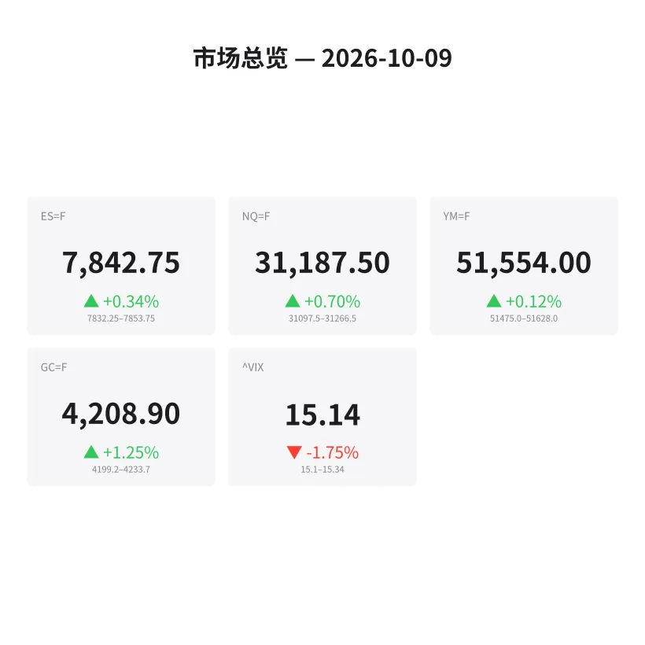
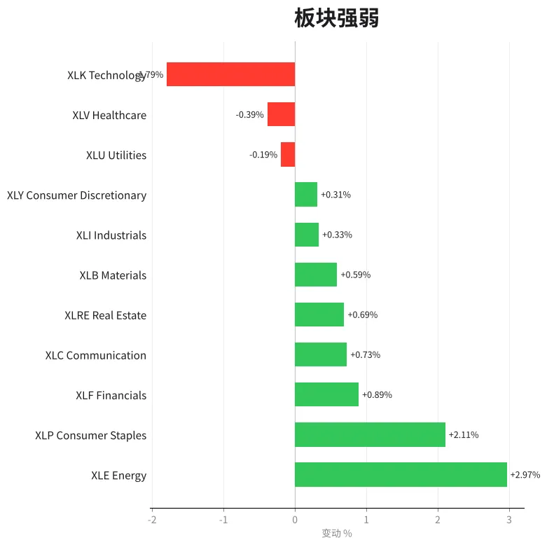
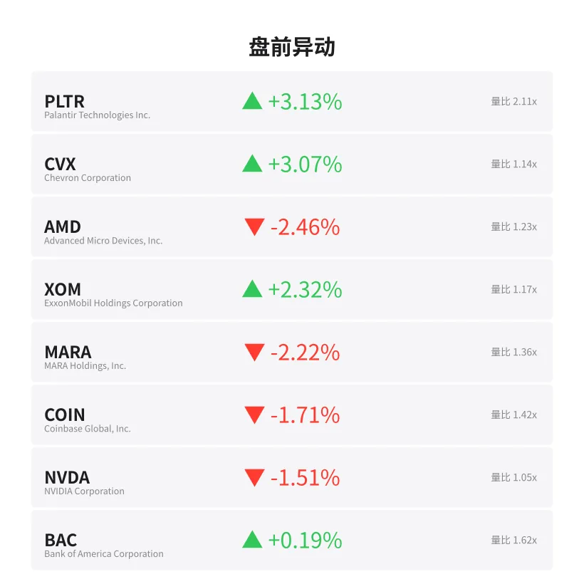
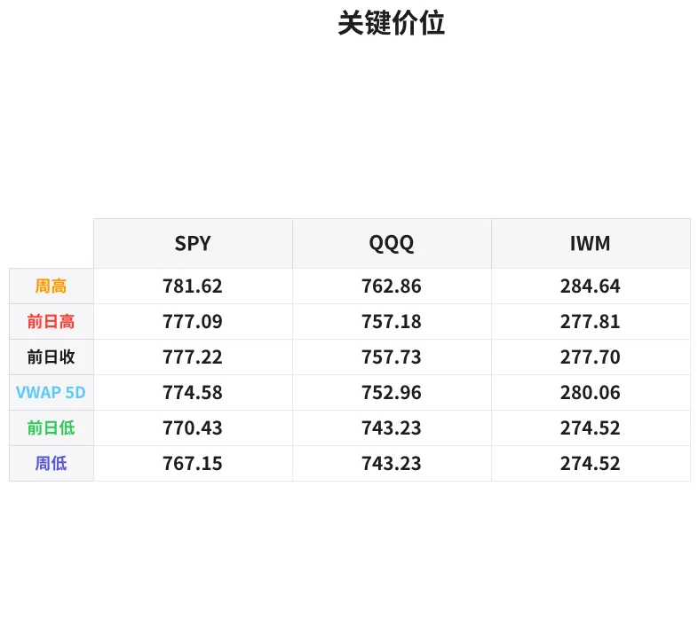

# 盘前分析报告 — 2026-10-09
*生成时间: 12:46:29 UTC*

---
## 数据速览

---
## 一、宏观环境

> [!info]- 详细数据：指数期货 & VIX
> ### 1.1 指数期货 & VIX
> | 品种 | 现价 | 涨跌幅 | 前收 | 日高 | 日低 |
> |------|------|--------|------|------|------|
> | ES=F | 7842.75 | +0.34% | 7816.25 | 7853.75 | 7817.0 |
> | NQ=F | 31187.5 | +0.70% | 30969.5 | 31266.5 | 30953.0 |
> | YM=F | 51554.0 | +0.12% | 51493.0 | 51628.0 | 51476.0 |
> | GC=F | 4208.9 | +1.25% | 4157.0 | 4232.7 | 4156.1 |
> | ^VIX | 15.14 | -1.75% | 15.41 | 15.34 | 15.1 |

> [!info]- 详细数据：隔夜走势
> ### 1.2 隔夜走势（Globex）
> | 品种 | 隔夜高 | 隔夜低 | 区间 | 亚洲高 | 亚洲低 | 欧洲高 | 欧洲低 |
> |------|--------|--------|------|--------|--------|--------|--------|
> | ES=F | 7853.75 | 7832.25 | 21.5 | 7843.0 | 7835.5 | 7853.5 | 7832.25 |
> | NQ=F | 31266.5 | 31097.5 | 169.0 | 31177.0 | 31097.5 | 31266.5 | 31133.25 |
> | YM=F | 51628.0 | 51475.0 | 153.0 | 51612.0 | 51569.0 | 51628.0 | 51475.0 |
> | GC=F | 4233.7 | 4199.2 | 34.5 | 4233.7 | 4201.3 | 4226.4 | 4199.2 |
> | ^VIX | 15.34 | 15.1 | 0.24 | — | — | 15.34 | 15.1 |

> [!info]- 详细数据：板块强弱
> ### 1.3 板块强弱
> | ETF | 板块 | 涨跌幅 |
> |-----|------|--------|
> | XLE | Energy | +2.97% |
> | XLP | Consumer Staples | +2.11% |
> | XLF | Financials | +0.89% |
> | XLC | Communication | +0.73% |
> | XLRE | Real Estate | +0.69% |
> | XLB | Materials | +0.59% |
> | XLI | Industrials | +0.33% |
> | XLY | Consumer Discretionary | +0.31% |
> | XLU | Utilities | -0.19% |
> | XLV | Healthcare | -0.39% |
> | XLK | Technology | -1.79% |

---
## 二、消息面

- **纳斯达克100指数暴跌1.4%创七周最大单日跌幅，芯片股重挫3.4%** — *Bloomberg*
  > Nasdaq 100 sank 1.4%, worst day in seven weeks; chipmaker gauge slumped 3.4%
- **OpenAI营收低于此前预期，引发AI板块抛售** — *Yahoo Finance*
  > OpenAI revenue came in lower than previously estimated, triggering AI sector selloff
- **SpaceX盘前大涨4.12%，与无线频谱达成约80亿美元交易** — *TheStreet*
  > SpaceX shares rising 4.12% premarket after wireless spectrum deal valued around $8 billion
- **电信股暴跌：AT&T、Verizon、T-Mobile因SpaceX交易大幅下挫** — *Reuters*
  > AT&T, Verizon and T-Mobile sharply lower following SpaceX spectrum deal
- **达美航空两年来首次财报不及预期，下调2026年利润指引，盘前跌近4%** — *CNBC*
  > Delta Air Lines missed earnings for the first time in two years, slashed 2026 profit outlook, fell ~4% premarket
- **苹果据报要求供应商削减iPhone 18 Pro系列零部件产量，股价盘前跌约2%** — *Bloomberg*
  > Apple told suppliers to cut production of iPhone 18 Pro and Pro Max components, shares down ~2% premarket
- **Humana盘前飙涨14%** — *CNBC*
  > Humana up 14% in premarket trading
- **美国10年期国债收益率触及5.35%，S&P 500跌回7800下方** — *Investing.com*
  > 10-Year Treasury Yield hits 5.35%, S&P 500 falls back below 7,800
- **AI概念股盘前反弹，CoreWeave涨2.5%** — *CNBC*
  > AI-linked stocks higher in premarket, CoreWeave up 2.5%
- **密歇根大学消费者信心指数初值将于今日公布，预期47.6（前值48.1）** — *Investing.com*
  > University of Michigan preliminary consumer sentiment due Friday, forecast 47.6 vs prior 48.1

---
## 三、盘前异动

> [!info]- 详细数据：盘前异动
> | 代码 | 名称 | 现价 | 缺口 | 量比 |
> |------|------|------|------|------|
> | PLTR | Palantir Technologies Inc. | 200.2 | +3.13% | 2.11x |
> | CVX | Chevron Corporation | 211.45 | +3.07% | 1.14x |
> | AMD | Advanced Micro Devices, Inc. | 629.95 | -2.46% | 1.23x |
> | XOM | ExxonMobil Holdings Corporation | 167.86 | +2.32% | 1.17x |
> | MARA | MARA Holdings, Inc. | 10.13 | -2.22% | 1.36x |
> | COIN | Coinbase Global, Inc. | 175.4 | -1.71% | 1.42x |
> | NVDA | NVIDIA Corporation | 233.88 | -1.51% | 1.05x |
> | BAC | Bank of America Corporation | 53.62 | +0.19% | 1.62x |

---
## 四、关键价位

> [!info]- 详细数据：SPY 关键价位
> ### SPY
> | 价位类型 | 价格 |
> |----------|------|
> | Prior Day High | 777.09 |
> | Prior Day Low | 770.435 |
> | Prior Day Close | 777.22 |
> | Premarket Price | 776.3181 |
> | Approx Vwap 5D | 774.58 |
> | Weekly High | 781.62 |
> | Weekly Low | 767.15 |

> [!info]- 详细数据：QQQ 关键价位
> ### QQQ
> | 价位类型 | 价格 |
> |----------|------|
> | Prior Day High | 757.1799 |
> | Prior Day Low | 743.23 |
> | Prior Day Close | 757.73 |
> | Premarket Price | 752.4 |
> | Approx Vwap 5D | 752.96 |
> | Weekly High | 762.86 |
> | Weekly Low | 743.23 |

> [!info]- 详细数据：IWM 关键价位
> ### IWM
> | 价位类型 | 价格 |
> |----------|------|
> | Prior Day High | 277.81 |
> | Prior Day Low | 274.52 |
> | Prior Day Close | 277.7 |
> | Premarket Price | 278.28 |
> | Approx Vwap 5D | 280.06 |
> | Weekly High | 284.64 |
> | Weekly Low | 274.52 |

---
## 五、AI 技术分析 & 操盘建议

### 第一部分：隔夜市场回顾

**亚洲时段（18:00–02:00 ET）：**
ES在亚洲时段表现极其窄幅，仅在7835.5–7843.0之间波动（区间7.5点），说明亚洲资金对昨日美股科技股暴跌（NQ -1.4%，芯片股-3.4%）反应克制，未出现恐慌性抛售。NQ在亚洲时段低点31097.5已经触及隔夜最低点，随后逐步回升。GC（黄金）在亚洲时段异常强势，触及隔夜最高点4233.7，体现避险资金和通胀对冲需求旺盛。

**欧洲时段（02:00–09:30 ET）：**
欧盘接力推动ES突破亚洲区间上沿，直接测试隔夜高点7853.5（与隔夜高7853.75仅差0.25点），但未能有效突破，形成双顶压力。NQ欧盘表现更强，创出隔夜新高31266.5，从亚洲低点反弹169点。然而值得警惕的是，GC在欧盘反而回落（高4226.4 vs 亚盘高4233.7），暗示部分避险资金开始回流风险资产。VIX隔夜区间仅0.24（15.10–15.34），波动率极度压缩。

**隔夜总结：**
隔夜走势呈现"V型修复"格局。昨日科技股暴跌的负面影响在亚洲时段已被消化，欧洲时段进一步反弹。但反弹力度有限——ES仍在昨收7816上方运行但未突破前日高点7853.75所在区域的阻力。10年期国债收益率触及5.35%是悬在市场头上的达摩克利斯之剑，今日密歇根消费者信心数据（10:00 ET）将决定市场对通胀预期的重新定价。

### 第二部分：期货品种分析

#### ES（E-mini S&P 500）— 现价 7842.75

**多时间框架分析：**
- **周线：** 本周区间 7767.15（周低映射）至 7853.75（隔夜高），价格处于周线区间上半部，但周内从高位回撤后正在修复。上方阻力关注前周高点及7850–7855区域。
- **日线：** 昨日收7816.25后隔夜反弹至7842.75，涨幅+0.34%。昨日形成上影线较长的阴线（高7853.75，低7817.0），说明上方卖压明确。日线VWAP向下倾斜。
- **小时级别：** 隔夜在7832–7854区间震荡，欧盘双顶7853.5/7853.75形成明确短期阻力。

**关键价位：**
| 类型 | 价位 | 说明 |
|------|------|------|
| 强阻力 | 7853–7855 | 隔夜双顶 + 昨日高点 |
| 弱阻力 | 7843–7845 | 亚盘高点/当前价位 |
| 轴心 | 7832–7835 | 隔夜低点/欧盘低点 |
| 支撑1 | 7816–7817 | 昨收/昨日低点 |
| 强支撑 | 7800 | 整数关口心理位 |

**方向偏向：** 中性偏多（置信度55%）
- 隔夜修复形态良好，但7853双顶阻力明确
- VIX走低支持多头，但10Y收益率5.35%压制估值

**交易计划：**
- **多头入场区：** 7832–7835回踩不破，配合delta转正 → 做多
- **止损：** 7825以下（隔夜低点下方7点）
- **T1：** 7850（隔夜双顶下方3点）
- **T2：** 7865（新高突破目标）
- **空头机会：** 7853–7855遇阻 + 量能萎缩 → 短空至7835
- **失效条件：** 跌破7816（昨日低点）转为看空

---

#### NQ（E-mini Nasdaq 100）— 现价 31187.5

**多时间框架分析：**
- **周线：** 本周波幅剧烈，反映科技板块的高beta特性。NQ周内经历了从31266高点到30953低点再反弹的过山车。
- **日线：** 昨日NQ暴跌至30953（低点），今日恢复至31187（+0.70%），但仍远低于本周高点31266.5。日线留下一根长下影阳线，短期有止跌迹象。
- **小时级别：** 隔夜走出典型的"V底"形态——亚盘低点31097.5是关键支撑，欧盘反弹至31266.5创出隔夜新高。

**关键价位：**
| 类型 | 价位 | 说明 |
|------|------|------|
| 强阻力 | 31250–31270 | 隔夜高点/欧盘高点 |
| 弱阻力 | 31200 | 当前盘整区域 |
| 轴心 | 31100–31135 | 亚盘低点附近 |
| 支撑1 | 30970 | 昨收盘价 |
| 强支撑 | 30950–30955 | 昨日/隔夜绝对低点 |

**方向偏向：** 中性偏多（置信度60%）
- 理由：隔夜V底修复强势，AI概念股盘前反弹（CoreWeave +2.5%），但Apple砍单消息和OpenAI营收不及预期仍是压力
- NQ的beta较高，一旦突破31270则空间打开至31400+

**交易计划：**
- **多头入场区：** 31100–31135回踩（亚盘低点区域），看order flow确认买盘进场
- **止损：** 31050以下
- **T1：** 31250（隔夜高点）
- **T2：** 31400（突破后目标）
- **空头机会：** 31250–31270区域遇阻 → 短空至31135
- **失效条件：** 跌破30950转看空，下看30800

---

#### GC（黄金期货）— 现价 4208.9

**多时间框架分析：**
- **周线：** 黄金持续走强，本周延续上涨趋势。+1.25%的日涨幅说明避险和通胀对冲需求旺盛。
- **日线：** 从前收4157.0大幅跳涨至4208.9，日内区间4156.1–4232.7，振幅76.6点。日线呈现强势突破形态。
- **小时级别：** 亚盘最强（高达4233.7），欧盘有所回落（高4226.4，低4199.2），盘前价格在4208附近整理。

**关键价位：**
| 类型 | 价位 | 说明 |
|------|------|------|
| 强阻力 | 4230–4234 | 隔夜/亚盘绝对高点 |
| 弱阻力 | 4215–4220 | 日内波动上沿 |
| 轴心 | 4200–4210 | 当前盘整中枢 |
| 支撑1 | 4195–4199 | 欧盘低点 |
| 强支撑 | 4157–4160 | 昨收/昨低区域 |

**方向偏向：** 看多（置信度70%）
- 理由：10Y收益率5.35%本应压制金价，但黄金无视利率上行继续走强，说明通胀预期和地缘避险需求占主导。今日密歇根通胀预期数据若高于预期，黄金有望再创新高。
- 能源板块（XLE +2.97%）的强势也呼应通胀交易叙事

**交易计划：**
- **多头入场区：** 4195–4200回踩（欧盘低点附近），配合买盘涌入信号
- **止损：** 4185以下
- **T1：** 4225（接近隔夜高点区域）
- **T2：** 4240（突破隔夜高创新高）
- **空头机会：** 4230–4234强阻力位做空，仅限快进快出
- **失效条件：** 跌破4157（昨收）意味着今日涨幅全吐，转为观望

### 第三部分：ETF品种分析

#### SPY — 盘前价 776.32

**关键价位地图：**
| 类型 | 价位 | 说明 |
|------|------|------|
| 周高 | 781.62 | 本周最高点 |
| PDH | 777.09 | 昨日高点 |
| PDC | 777.22 | 昨日收盘 |
| 盘前 | 776.32 | 当前盘前价 |
| 5D VWAP | 774.58 | 5日成交量加权均价 |
| PDL | 770.44 | 昨日低点 |
| 周低 | 767.15 | 本周最低点 |

**分析：**
SPY盘前交易在776.32，略低于昨收777.22（-0.12%），处于PDC下方。这与ES期货+0.34%形成微妙分歧——ES反弹但SPY盘前略偏弱，说明现货端卖压可能在开盘时释放。5D VWAP 774.58是多空分水岭：价格仍在VWAP上方，但距离仅1.7点，失守则转为短期空头占优。

**交易计划：**
- **看多场景：** 开盘站稳777（PDC上方）→ 目标781（周高），止损774
- **看空场景：** 跌破774.50（5D VWAP）→ 目标770（PDL），止损776.50
- **区间博弈：** 774.50–777之间做区间交易，观察order flow决定方向突破

---

#### QQQ — 盘前价 752.40

**关键价位地图：**
| 类型 | 价位 | 说明 |
|------|------|------|
| 周高 | 762.86 | 本周最高点 |
| PDH | 757.18 | 昨日高点 |
| PDC | 757.73 | 昨日收盘 |
| 5D VWAP | 752.96 | 5日成交量加权均价 |
| 盘前 | 752.40 | 当前盘前价 |
| PDL | 743.23 | 昨日低点（=周低） |

**分析：**
QQQ盘前752.40显著低于昨收757.73（-0.70%），已跌破5D VWAP 752.96。这是一个关键信号：**QQQ盘前已经跌到VWAP以下**，而NQ期货+0.70%看似反弹——这种期现分歧在开盘后通常会通过下行来收敛。Apple砍单消息（-2%）、OpenAI营收不及预期对科技权重股的拖累是核心原因。

昨日PDL 743.23与周低重合，形成双底支撑。若QQQ开盘后下探至746–748区间能获得买盘支撑，则形成更高的低点，有望反弹。

**交易计划：**
- **看多场景：** 回踩746–748获支撑 + NQ同步企稳31100上方 → 做多，目标753–755，止损744
- **看空场景：** 开盘跌破752且无法快速收回 → 空至748，进一步看746，止损754
- **关键观察：** QQQ/SPY相对强弱比——若QQQ持续跑输SPY，说明科技板块抛压未完，不宜抄底

### 第四部分：今日市场总览

**整体情绪：谨慎偏多，分化加剧**

市场处于"科技退潮、价值接棒"的轮动阶段。昨日NQ暴跌1.4%是七周以来最大单日跌幅，直接导火索是OpenAI营收不及预期动摇了AI叙事。但今日盘前AI概念股已开始反弹（CoreWeave +2.5%），市场并未陷入恐慌——VIX仅15.14（-1.75%），波动率仍处于历史低位区间，说明机构层面并未大规模买入保护性看跌期权。

**板块轮动信号极其清晰：**
- **做多端：** 能源（XLE +2.97%）、必需消费（XLP +2.11%）→ 通胀交易 + 防御配置
- **做空端：** 科技（XLK -1.79%）→ AI叙事受挫 + Apple砍单
- 金融（XLF +0.89%）受益于高利率环境
- 房地产（XLRE +0.69%）和公用事业（XLU -0.19%）分化，非典型利率敏感反应

**VIX分析：**
VIX 15.14处于低波动区间，隔夜仅波动0.24（15.10–15.34）。这种低波动下的板块剧烈轮动通常意味着：大资金在换仓而非撤离。对scalper而言，低VIX+高板块分化=方向性机会>区间交易机会。但需警惕——VIX在15以下意味着任何突发事件都可能引发波动率跳升。

**今日关键时间窗口：**
| 时间 (ET) | 事件 | 影响 |
|-----------|------|------|
| 09:30 | 开盘 | 科技股开盘抛压 vs 能源股追涨是焦点 |
| 10:00 | 密歇根消费者信心（初值） | **今日最重要数据**。预期47.6 vs 前值48.1。重点看5-10年通胀预期分项。高于预期→收益率飙升→科技承压+黄金走强；低于预期→收益率回落→科技反弹 |
| 11:30–13:30 | 午盘 | 流动性下降，避免重仓 |
| 15:00–16:00 | 收盘前 | 周五收盘效应——关注是否有仓位调整 |

**⚠️ 需回避的时间：** 09:50–10:05（密歇根数据公布前后波动剧烈，建议flat进数据），12:00–13:00（午盘流动性陷阱）

**核心交易主线（一句话）：**
> 今日是"通胀交易日"——做多黄金（GC）、做多能源（XLE），谨慎对待科技股（NQ/QQQ）直到密歇根数据落地。数据前保持轻仓，数据后跟随order flow顺势加仓。
